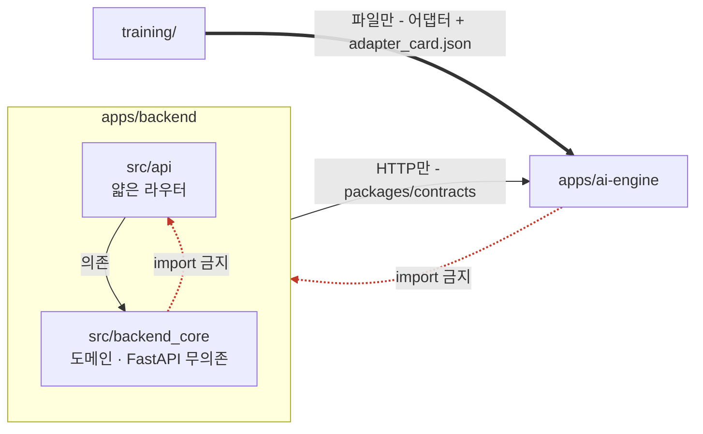

# AGENTS.md

모든 코딩 에이전트(Claude Code, Codex, Antigravity …)와 사람이 공유하는 **프로젝트 브리프**입니다.
프로젝트 맥락의 단일 원천이며, 도구별 작업 노트는 각 도구 파일(`CLAUDE.md` 등)에 두고 여기 내용을
복제하지 않습니다.

> ⚠️ **아직 확정되지 않은 항목은 `TBD`로 표시되어 있습니다.** 세부 과제 범위가 정해지는 대로
> 채우세요. `TBD`가 남아 있는 항목에 대해 에이전트는 추측으로 코드를 씁니다.
> **"아키텍처 규칙"·"함정"·"빌드/실행/테스트" 절은 이미 코드가 강제하고 있는 사실**이므로
> 구조를 바꾸지 않는 한 그대로 두세요.

## 프로젝트 개요

- **무엇을 만드는가**: 글(제품·브랜드 정보)과 이미지(레퍼런스·제품컷)를 입력하면 **브랜드 스타일의
  광고 소재(이미지 + 카피)를 생성**하는 서비스. 이미지 생성 모델을 브랜드 데이터로 파인튜닝(LoRA)해
  "그 브랜드처럼 보이는" 결과를 만들고, GCP VM에 배포해 실제 사용자가 쓸 수 있는 상태로 운영합니다.
- **누구의 어떤 문제를 푸는가**: 디자이너를 상시 두기 어려운 소상공인·소규모 마케팅 팀은 광고 소재
  한 벌을 만드는 데 외주 비용과 며칠의 리드타임을 씁니다. 범용 이미지 생성 도구를 써도 결과물이
  매번 다른 톤으로 나와 브랜드 일관성이 무너집니다. **일관된 브랜드 톤**을 유지하면서 소재를
  분 단위로 뽑는 것이 이 프로젝트가 푸는 문제입니다.
- **핵심 마일스톤** (2026, 절대 날짜):
  | 마일스톤 | 날짜 | 정의 |
  |---|---|---|
  | 착수 | 2026-08-04 | 전원 `run-tests.sh` 통과, 역할·범위 확정 |
  | 계약 동결 | 2026-08-08 | `packages/contracts/openapi.yaml`이 광고 생성 계약으로 교체됨 |
  | 중간 점검 | 2026-08-17 | 파인튜닝 1회전 완료, GPU 추론이 VM에서 관통 |
  | 배포 | 2026-08-24 | GCP VM 상시 기동 + 외부 접근 가능 |
  | 제출 | 2026-08-31 | 실측 지표 반영본 |
  - 실작업일 **22일** (일요일 4일 + 광복절 8/15(토) + 대체공휴일 8/17(월) 제외 / 대체공휴일 적용은 `높은 신뢰`)
- **저장소 공개 여부**: **public**. 커밋되는 모든 것이 공개된다고 전제하세요 — 키·브랜드 원본
  이미지·고객 데이터는 어떤 경우에도 커밋 대상이 아닙니다.
- **팀 규모**: 5명. 배포 대상은 **GCP VM 1대**(GPU 포함)이며 모노레포입니다.

## 아직 확정되지 않은 것 (TBD)

세부 범위가 정해지는 대로 이 절을 지우고 각 항목을 본문에 반영하세요. 확정 전까지 관련 코드를
쓰지 말고 **계약과 문서를 먼저** 정하는 것이 이 프로젝트의 순서입니다.

- **base 이미지 생성 모델** (SDXL / FLUX / 기타) — VRAM 예산과 라이선스가 함께 걸리므로 ADR로 남길 것
- **카피 생성 경로** (외부 LLM API / 로컬 모델) — 비용·지연·키 관리가 갈립니다
- **GCP VM 스펙**(GPU 종류·VRAM) — 학습 가능 여부와 동시 처리 수를 결정합니다
- **브랜드 데이터셋 출처와 권리 범위** — `training/data/README.md`의 대장이 채워져야 학습 시작 가능
- **지표 목표치** — 아래 "품질 기준"의 숫자는 전부 가설입니다

## 현재 상태: 워킹 스켈레톤

코드에 있는 것은 **동작하는 서비스가 아니라 워킹 스켈레톤**입니다. 요청 하나가
`요청 → 도메인 처리 → 근거 검색 → 가드레일 생성 → 응답(또는 폴백)` 전 구간을 관통하지만,
외부 의존은 전부 **이름이 붙은 이음매 뒤의 오프라인 스텁**입니다.

⚠️ **스텁을 측정값으로 읽지 마세요.** 번들 코퍼스는 `[더미]` 표시가 붙은 자리표시자이고,
생성기는 근거 텍스트를 되돌려주는 스텁입니다. 이 상태에서 나온 품질 숫자는 자기 자신과의
일치율입니다. `apps/frontend/`는 아직 문서만 있는 자리입니다.

⚠️ **스켈레톤의 도메인은 아직 광고 생성이 아닙니다.** 현재 관통하는 경로는 템플릿이 갖고 온
질의응답(`/v1/ask` → `/v1/generate`)입니다. 이것은 "폴백·가드레일·계약·CI가 실제로 동작한다"는
사실을 증명하는 **P0 기준선**이므로, 광고 생성으로 교체할 때도 **경로를 지우고 옆에 새로 만드는
것이 아니라 같은 이음매에서 갈아끼웁니다**. 교체 순서는 계약(`packages/contracts/openapi.yaml`) →
스키마 → 구현 → 테스트이며, 계약 없이 먼저 짜인 구현은 리뷰 대상이 아닙니다.

**교체는 이음매에서.** 스텁을 우회해 옆에 새 경로를 만들면, 스켈레톤이 검증하던 성질(폴백·
가드레일·계약)이 조용히 사라집니다. 이음매 목록: [docs/공통_가이드/아키텍처.md](docs/공통_가이드/아키텍처.md) 5절.

## 설계 제약 (편의상 "단순화"하면 안 되는 것)

**왜**가 없는 규칙은 사람도 에이전트도 무시하므로 이유를 함께 적습니다.
앞의 둘은 템플릿이 이미 코드로 강제하고 있고, 나머지는 이 프로젝트의 하드 제약입니다.

- **근거 기반 생성.** 생성 계층은 주어진 원문에만 근거해 만듭니다. 광고 카피에서 이것은 취향이
  아니라 **법적 제약**입니다 — 입력된 제품 정보에 없는 효능·수치·수상 이력을 모델이 지어내면
  표시광고법상 허위·과장 광고가 됩니다. 가드레일의 on/off 델타 자체가 측정 지표이므로,
  우회하면 문제가 해결되는 게 아니라 지표가 무효가 됩니다.
- **열화 폴백 필수.** 외부 의존이 죽으면 조용히 실패하는 대신 사전 승인된 응답으로 전환되고,
  그 사실이 응답(`messageMode`)에 드러나야 합니다. 이미지 쪽에서는 "파인튜닝 어댑터 사용 불가 →
  base 모델 결과 + 그 사실 표기"가 같은 성질의 열화 경로입니다.
- **학습과 서빙은 파일로만 만납니다.** `training/`은 `apps/`를 import하지 않고, `apps/`도
  `training/`을 import하지 않습니다. 넘기는 것은 어댑터 가중치 + `adapter_card.json`뿐입니다.
  이 선이 있어야 **학습 코드가 깨져도 서비스는 뜨고**, 서비스 리팩터링이 학습 재현성을 건드리지
  않습니다. 자세히: [training/README.md](training/README.md).
- **GPU는 한 대뿐입니다.** 학습과 추론이 동시에 VRAM을 요구하면 둘 다 OOM으로 죽습니다.
  학습은 배포된 서비스와 **시간을 나눠 쓰거나**(운영 시간 외) VRAM 예산을 명시적으로 분할해야
  하며, "일단 돌려보자"는 서비스 다운으로 직결됩니다.
- **이미지 생성은 동기 HTTP로 처리하지 않습니다.** 한 장에 수십 초가 걸리므로 요청을 붙들면
  프록시·브라우저 타임아웃에 먼저 걸립니다. 생성은 **잡 접수 → 폴링/스트리밍 조회** 형태여야
  하고, 이 결정은 계약(`openapi.yaml`)에 먼저 반영됩니다.
- **입력 이미지와 생성 결과는 개인정보·저작물일 수 있습니다.** 보관 기간과 접근 범위를 정하지
  않은 채 디스크에 쌓지 마세요. 학습 데이터의 권리 근거는 `training/data/README.md`의 대장에
  기록되며, 기록되지 않은 데이터로 학습한 모델은 배포 판단을 내릴 수 없습니다.

## 품질 기준 (코드로 재현 가능해야 함)

품질은 사람 리뷰가 아니라 **재현 가능한 스크립트**로 증명합니다. 지표 함수는
[`apps/ai-engine/eval/`](apps/ai-engine/eval/)에 순수 함수로 있습니다.

- 지표 함수는 `(예측, 정답) → 점수`. I/O·모델 호출 금지.
- **채점 모델 ≠ 생성 모델** (자기채점 편향 배제).
- 목표치는 실측 전까지 **가설**입니다. 실측이 쌓이면 문서 숫자가 아니라 하네스 출력이 근거입니다.

| 지표 | 정의 | 목표(가설) | 측정 위치 |
|---|---|---|---|
| 생성 지연 | 잡 접수 → 결과 이미지 완료 (p50 / p95) | TBD | 서비스 로그 |
| 브랜드 스타일 일치도 | 브랜드 레퍼런스셋과 생성물의 스타일 임베딩 유사도 | TBD | `eval/` 하네스 |
| 카피 사실 일치율 | 카피의 주장 중 입력 제품 정보로 뒷받침되는 비율 | TBD | `eval/` 하네스 |
| 환각 억제율 | 가드레일 on/off 대조군의 사실 일치율 차이 | TBD | `eval/` 하네스 |
| 폴백 발생률 | 전체 요청 중 `official_fallback` 비율 | TBD | 서비스 로그 |
| VRAM 피크 | 추론 1건 기준 최대 점유 | TBD | VM 모니터링 |

- **스타일 일치도는 자동 지표만으로 판정하지 마세요.** 임베딩 유사도는 "비슷한 색감"에 반응할 뿐
  브랜드 정체성을 보지 않습니다. 소수의 사람 평가(블라인드 A/B)를 함께 남기고, 자동 지표는
  그 사람 평가와의 상관이 확인된 뒤에야 대리 지표로 씁니다.
- 목표치(TBD)는 **첫 실측 이후에** 채우세요. 실측 전에 적은 숫자는 근거가 아니라 희망입니다.

## 팀 / 소유

> ⚠️ **아직 배정 전입니다.** 팀원의 GitHub ID가 정해지면 이 표와 `CODEOWNERS`,
> `docs/역할_가이드/`를 **같은 PR에서** 함께 채우세요. 셋이 어긋나면 리뷰 자동 배정이
> 조용히 동작하지 않습니다(존재하지 않는 계정은 오류 없이 무시됩니다).

| # | 역할 | 이름 | GitHub ID | 소유 경로 |
|---|---|---|---|---|
| 01 | PM / 기획 | TBD | TBD | `docs/` |
| 02 | 테크리드 | TBD | TBD | `packages/contracts/`, `docs/adr/`, `.github/`, `scripts/` |
| 03 | AI 엔지니어 (생성·서빙) | TBD | TBD | `apps/ai-engine/` |
| 04 | AI 엔지니어 (학습·데이터) | TBD | TBD | `training/`, `apps/ai-engine/eval/` |
| 05 | 백엔드 / 인프라 | TBD | TBD | `apps/backend/`, `infra/` |
| 06 | 프론트엔드 | TBD | TBD | `apps/frontend/` |
| 07 | QA / 보안 | TBD | TBD | `e2e/`, `apps/ai-engine/eval/` |

**5명이 7역할을 맡습니다** — 겸임 조합은 [docs/역할_가이드/README.md](docs/역할_가이드/README.md)를
보세요. 겸임은 정상이지만, **한 사람이 자기 산출물의 유일한 리뷰어가 되는 조합은 금지**입니다
(예: 04와 07을 한 사람이 맡으면 학습 결과를 스스로 채점하게 됩니다).

## 명명 규약 (문서 vs 그 외)

무엇을 담느냐로 갈립니다 — 어디에 있느냐가 아닙니다.

- **문서 → 한글.** 기획·설계 문서와 그것을 묶는 폴더는 한글 이름(`아키텍처.md`, `docs/역할_가이드/`),
  다단어는 `A_B` 밑줄 패턴.
- **그 외 전부 → 영어, 예외 없음.** 코드·설정·에셋·툴링·데이터·픽스처·CI 등 문서 폴더가 아닌 모든
  경로는 **반드시** 영어입니다. 취향이 아니라 제약입니다: 이 경로들은 빌드 도구·import 문·
  Docker/CI 설정·셸 스크립트가 소비하며, 비ASCII 경로 세그먼트는 인코딩·이식성 사고를 냅니다.
  `apps/`·`packages/`·`infra/`·`.github/` 아래의 한글 폴더명은 판단 대상이 아니라 **고쳐야 할 결함**입니다.

한글 쪽의 합의된 영어 예외: `CLAUDE.md`, `AGENTS.md`, `README`, `docs/adr/`(ADR 파일명),
`docs/pr-checklist.md`.

**다이어그램은 mermaid로.** ASCII 아트나 이미지 파일이 아니라 ` ```mermaid ` 코드 블록을 씁니다
(GitHub이 네이티브 렌더). 이유는 **diff에 보이기 때문**입니다 — 이미지는 구조가 바뀌어도
리뷰에서 변경을 확인할 수 없고, ASCII 아트는 노드가 하나 늘 때마다 전체를 다시 그려야 해서
결국 갱신되지 않은 채 남습니다. 디렉토리 트리처럼 mermaid가 더 나쁜 경우는 코드 블록 유지.

| 폴더 | 담는 것 |
|---|---|
| `docs/공통_가이드/` | 전원이 읽는 설계 문서 — `개발자_가이드.md`, `환경_세팅_가이드.md`, `저장소_운영.md`, `아키텍처.md`, `리스크.md`, `구현_범위.md`, `착수_체크리스트.md`, `코드_리뷰_가이드.md` |
| `docs/역할_가이드/` | 역할별 플레이북 — 누가 무엇을 |
| `docs/역할_일정/` | 역할별 타임라인 — 언제까지. `역할_가이드/`와 번호 1:1 |
| `docs/adr/` | 결정 기록 (영어 파일명) |
| `docs/pr-checklist.md` | PR 절차 |

## 저장소 구조 (모노레포)

레포 구조 조사의 **실질**은 "레포를 쪼개라"(형식)가 아니라 **"AI를 인라인 호출이 아니라 독립 배포
가능한 엔진/모듈로 두고 배포·운영을 README에 문서화하라"**(실질)입니다. 소규모·단기 팀에서
멀티레포의 조율 비용은 이득보다 크므로, **단일 모노레포**를 쓰되 AI를 그 안의 독립 배포 단위로
유지합니다 ([ADR-0001](docs/adr/0001-monorepo.md)).

```
AI10-Part4-3Team-Advanced-Project/
  apps/
    backend/               # FastAPI: 요청 수신, 도메인 처리, ai-engine 호출 오케스트레이션
      pyproject.toml       #   src/api (thin routers) + src/backend_core (domain)
    ai-engine/             # 독립 배포: 자체 pyproject + Dockerfile + README
      pyproject.toml       #   src/ai_engine (검색 + 가드레일 생성)
      eval/                #   재현 가능한 품질 하네스 (골든셋 + 지표 함수)
    frontend/              # 미스캐폴딩
  training/                # ⚠️ apps/ 가 아님 — 상시 기동 배포 단위가 아니라 오프라인 학습
    configs/               #   학습 설정 (커밋 대상 = 재현의 단일 원천)
    data/                  #   브랜드 데이터셋 (커밋 금지, README만 추적)
    runs/                  #   학습 산출물·로그 (커밋 금지)
  packages/
    contracts/             # OpenAPI 스펙 (단일 원천)
  infra/                   # docker-compose, .env.example, 프로비저닝
  e2e/                     # 앱 가로지르는 관통 테스트 (QA 소유) — HTTP 전용, non-required CI
  notebooks/               # 실험. 검증된 로직은 apps/<app>/src 로 이전
  scripts/                 # setup-dev.sh/.ps1 + dev_env.py, run-tests.sh (= 로컬 CI),
                           #   setup-github.sh, apply-labels.sh, init_template.py
  docs/                    # 설계 문서, ADR, 역할 가이드/일정
  pyproject.toml           # ⚠️ 툴링 전용 (ruff 설정) — 설치 가능한 패키지가 아님
  CODEOWNERS               # 폴더별 소유자 — 레포 루트 (사본 금지)
  .github/                 # CI, 이슈/PR 템플릿, 라벨
```

두 배치는 의도입니다: `eval/`은 채점 대상과 함께 버전이 움직여야 하므로 **ai-engine 안**에 있고,
`CODEOWNERS`는 GitHub이 루트/`.github`/`docs` 중 **한 곳만** 읽으므로 루트에 있습니다.

최상위 디렉토리를 옮기면 [ADR-0001](docs/adr/0001-monorepo.md)·
[개발자_가이드.md](docs/공통_가이드/개발자_가이드.md) 6절·[아키텍처.md](docs/공통_가이드/아키텍처.md)를
**같은 PR에서** 함께 고치세요.

## 빌드 / 실행 / 테스트

모든 앱은 **레포 루트에서 editable로** 설치합니다. 루트 패키지는 없습니다 — 루트에서
`pip install .`은 실수입니다.

```bash
# 원샷 세팅 = 아래 세 줄을 실행하되, 각 설정이 실제로 등록됐는지(pre-push 훅, nbstripout 필터)
# 확인까지 합니다. --check 는 진단만.
bash scripts/setup-dev.sh          # Windows: powershell -ExecutionPolicy Bypass -File scripts\setup-dev.ps1

python3 -m venv .venv && source .venv/bin/activate
pip install -e "./apps/backend[dev]" -e "./apps/ai-engine[dev]"
pip install pre-commit && pre-commit install && pre-commit install --hook-type pre-push

uvicorn api.main:app --reload --port 8000              # backend    → :8000/docs
uvicorn ai_engine.service:app --reload --port 8100     # ai-engine  → :8100/docs

# 워킹 스켈레톤 관통 확인. ai-engine을 꺼도 200 + messageMode: official_fallback 이 돌아옵니다 —
# 그 열화는 설계된 동작이지 버그가 아닙니다.
curl -X POST localhost:8000/v1/ask -H 'content-type: application/json' \
     -d '{"question":"환불은 어떻게 하나요?"}'

bash scripts/run-tests.sh          # 품질 게이트: ruff + mypy + pytest 전 앱 (= CI)
bash scripts/run-tests.sh --tests  # pytest만 (pre-push 훅이 쓰는 모드)
```

- import는 **`from api import ...` / `import backend_core` / `from ai_engine import ...`** —
  ⚠️ `src.` 접두어 금지. src 레이아웃에서 `from src.x`는 런타임에 깨지는데 린트가 못 잡습니다.
- **무거운 의존성(LangChain·벡터 DB·지오 라이브러리)은 앱의 optional extra로.** core에 넣으면
  CI가 매번 RAG 스택을 끌고 옵니다 (CI는 core + `dev`만 설치).
- **툴링 설정은 2단**: 루트 `pyproject.toml`이 레포 전체 `[tool.ruff]`를 공급하고(ruff가 상위 탐색),
  앱별 `pyproject.toml`이 자기 `[project]`·`[tool.mypy]`·`[tool.pytest.ini_options]`를 가집니다.
  ⚠️ mypy·pytest는 **앱 디렉토리를 cwd로** 실행해야 설정을 집습니다 — `run-tests.sh`와 CI가 그렇게 합니다.

## 아키텍처 규칙 (위반은 스타일이 아니라 설계 결함)



- **`training/`과 `apps/`는 서로를 import하지 않습니다(양방향 금지).** 학습은 배포 단위가 아니고
  서빙은 학습 없이도 base 모델로 떠야 합니다. 이 선을 넘으면 두 성질이 동시에 사라집니다.
- **`backend_core`는 `api`를 절대 import하지 않습니다.** 도메인 로직은 FastAPI 없이 실행·테스트
  가능해야 합니다.
- **`apps/ai-engine`은 `apps/backend`를 절대 import하지 않습니다(역도 동일).** 별개 배포 단위이며
  허용된 결합은 HTTP 계약뿐입니다. 이 선을 넘는 import 한 줄이 "독립 배포 가능한 AI 모듈"이라는
  성질 — 이 레포 구조가 존재하는 이유 — 을 조용히 없앱니다.
- **라우터는 얇게**: 요청 검증 → 도메인 호출 → 응답 매핑. 라우터의 비즈니스 로직은 결함입니다.
- **구현보다 계약이 먼저**: 모듈 간 인터페이스는 `packages/contracts`에 먼저 존재합니다.
  구두 합의는 계약이 아닙니다.
- AI 엔진 내부 파이프라인은 단방향: 파싱 → 청킹 → 임베딩 → 검색 → 생성. 역방향 의존 금지.

## 새 코드는 어디에

- HTTP/라우팅/인증 → `apps/<app>/src/api/` (backend) 또는 서비스 모듈 (ai-engine)
- 도메인 로직 → `apps/backend/src/backend_core/` 또는 `apps/ai-engine/src/ai_engine/`
- 프론트엔드 → `apps/frontend/` (영어 경로만. 스캐폴딩 전 README를 읽을 것 — 루트 `.gitignore`에 함정)
- 학습 코드·설정 → `training/` (ruff는 적용되지만 CI 매트릭스에는 없음 —
  [training/README.md](training/README.md)의 "린트 계약" 참고)
- 실험 → `notebooks/` (import 금지. 검증된 로직은 `apps/<app>/src/` 또는 `training/src/`로 승격)
- 평가 자산 → `apps/ai-engine/eval/` (지표 함수는 순수 함수 유지)
- 테스트 → `apps/<app>/tests/`, `src/` 구조를 `test_<module>.py`로 미러링
- 앱 가로지르는 E2E → `e2e/` (QA 소유). **절대** `apps/*/tests/`에 두지 마세요: 그 경로는
  *required* pytest 매트릭스로 들어가는데, E2E는 스택 기동과 외부 키가 필요하므로 required가 되면
  모든 PR이 인프라 사정으로 막힙니다. `e2e/`는 HTTP로만 접근하며, 여기서 앱 패키지를 import하면
  앱과 동일한 경계 규칙을 어기는 것입니다.

## 프로젝트 함정 (이유 없는 규칙은 무시당하므로 이유를 함께)

- **시크릿은 일방통행 문.** 커밋된 키는 푸시되는 순간 공개된 것이며, 해결은 revert가 아니라
  폐기·재발급입니다. 키는 `infra/.env`(ignored)에, 커밋되는 것은 `infra/.env.example`(키 이름만).
  방어선 셋이 모두 필요한 이유는 각각 구멍이 있기 때문입니다: GitHub Push protection은
  **제휴 발급사 패턴만** 잡고, pre-commit `detect-private-key`는 **PEM 개인키만** 잡습니다.
  그 사이를 **gitleaks**가 덮습니다 — staged 변경용 pre-commit 훅 + required CI 잡의 전체 트리 스캔.
  ⚠️ 이 둘은 한 쌍입니다. 훅의 entry가 `--staged` 고정이라 `pre-commit run --all-files`는 아무것도
  검사하지 않으며, CI 스텝을 지우면 훅을 설치하지 않은 사람의 키를 아무도 막지 못합니다.
- **`.gitignore`는 이 모노레포에 맞춰 조정돼 있습니다.** 디렉토리 무시(`/data/`, `/outputs/`)는
  의도적으로 루트 앵커이고, `lib/` 계열 패턴도 프론트엔드 `src/lib/`를 삼키지 않게 앵커돼 있습니다.
  git은 무시된 디렉토리 **안의** 파일을 되살리지 못하므로, 커밋해야 하는 자산은 **파일 패턴**으로
  화이트리스트합니다(`!apps/ai-engine/eval/**/*.jsonl`, `!apps/**/fixtures/*.csv`).
  새 커밋 대상 데이터 파일을 도입하면 화이트리스트 줄도 함께 추가하세요 — 아니면 조용히 사라집니다.
- **테스트를 통과시키려고 가드레일을 목으로 대체하지 마세요.** on/off 델타는 보고 지표이며,
  우회한 가드레일은 테스트를 고치는 게 아니라 측정을 무효로 만듭니다.
- **테스트의 외부 API 호출은 반드시 목으로.** 실제 호출은 비용이 들고 CI를 비결정적으로 만듭니다.
- **required status check는 매트릭스 잡입니다.** 이름(`Lint & Type Check (backend)`,
  `Unit tests (ai-engine)` …)이 `scripts/setup-github.sh`와 정확히 일치해야 합니다. 잡 이름만 바꾸면
  모든 PR이 영원히 생성되지 않는 체크를 기다립니다.
- **required 워크플로에 `paths:` 필터를 절대 넣지 마세요.** 그 경로를 건드리지 않은 PR에서는
  체크가 생성되지 않아 "Expected"로 영구 대기합니다. 프론트엔드 CI가 별도·non-required인 이유입니다.
- **노트북은 nbstripout이 출력을 제거합니다**(`.gitattributes` 필터 + pre-commit). 출력이 담긴 채
  커밋된 노트북은 필터와 어긋나 영구히 `modified`로 보입니다 — 발견 즉시 stripped로 재커밋하세요.
- **staged 변경이 있는 채로 `git pull` 하면 작업을 잃을 수 있습니다**(autostash 복원 실패).
  clean한 트리에서 통합하고, 유실된 작업은 `git fsck --lost-found`로 찾으세요.

## 협업 / Git

- `main`은 보호 대상: 피처 브랜치 → PR → **squash merge** → 브랜치 자동 삭제.
  절차: [docs/pr-checklist.md](docs/pr-checklist.md).
- **리뷰 코멘트는 서식이 정해져 있습니다**: 결론이 담긴 제목 + 처리 등급(`머지 전 필수` /
  `이 PR에서 권장` / `후속 과제` / `참고, 조치 불필요`) + 코드를 열지 않고 읽히는 첫 문단.
  사람과 AI 리뷰가 같은 규약을 씁니다: [docs/공통_가이드/코드_리뷰_가이드.md](docs/공통_가이드/코드_리뷰_가이드.md).
  스타일·포맷·타입은 지적 대상이 아닙니다 — ruff·mypy·reviewdog가 이미 결정론적으로 판정하므로,
  같은 주제에 사람이 겹쳐 말하면 조언이 충돌하고 팀이 리뷰 코멘트 전체를 무시하기 시작합니다.
- CI(ruff·mypy·pytest)와 pre-commit이 **의도적으로 같은 규칙**을 강제합니다. 어긋나기 시작하면
  사람들이 훅을 무시하기 시작합니다 — 우회하지 말고 드리프트를 고치세요.
- 레포 설정(브랜치 보호·머지 전략·라벨)은 GitHub 쪽에만 존재해 diff에 보이지 않습니다.
  `scripts/setup-github.sh`가 재적용합니다. 상세: [docs/공통_가이드/저장소_운영.md](docs/공통_가이드/저장소_운영.md).
- 아키텍처 결정은 내려지는 즉시 `docs/adr/`에. 문서화되지 않은 결정은 팀이 잃어버린 결정입니다.
