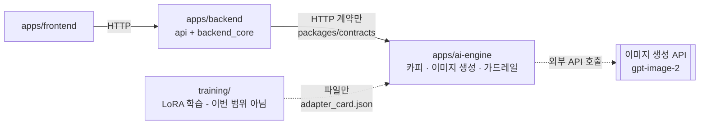

# AI10-Part4-3Team-Advanced-Project

[](https://github.com/Codeit-AI10-Part4-3Team/AI10-Part4-3Team-Advanced-Project/actions/workflows/ci.yml)
[](apps/backend/pyproject.toml)
[](LICENSE)

**HAPPY 3팀** — 제품 사진과 제품명, 소구점을 입력받아 인스타그램용 광고 콘텐츠(만화형 · 단일
광고 이미지형)를 만들어 주는 서비스입니다. 텍스트 시안을 먼저 확인하고 고친 뒤 이미지를
생성하며, 이미지 생성은 외부 API로 처리합니다. GCP GPU VM에 배포해 실제로 운영하는 것까지가
범위입니다.

(코드잇 AI10 Part4 3팀 고급 프로젝트 / 2026-08-04 ~ 2026-08-30)

## 제출물

| 항목 | 링크 |
|---|---|
| **최종 보고서 (PDF)** | [docs/보고서/최종_보고서.pdf](docs/보고서/최종_보고서.pdf) |
| **최종 보고서 (원문 md)** | [docs/보고서/최종_보고서.md](docs/보고서/최종_보고서.md) |
| **발표자료 (pptx)** | [docs/기획서/HAPPY3팀_광고만들기_발표자료_v5_최종_영상삽입.pptx](docs/기획서/HAPPY3팀_광고만들기_발표자료_v5_최종_영상삽입.pptx) |
| 발표자료 구성안 (초안 md) | [docs/기획서/발표자료_초안.md](docs/기획서/발표자료_초안.md) |

**팀원 협업일지**

| 이름 | 역할 | 협업일지 |
|---|---|---|
| 정승호 | PM/기획 · AI 학습/데이터 · QA/보안 | [보러 가기](https://github.com/Codeit-AI10-Part4-3Team/AI10-Part4-3Team-Advanced-Project/discussions?discussions_q=category%3ACollaborationLog+author%3Awjdtmdgh87-lgtm) |
| 신호정 | 테크리드 · AI 생성/서빙 | [보러 가기](https://github.com/Codeit-AI10-Part4-3Team/AI10-Part4-3Team-Advanced-Project/discussions?discussions_q=category%3ACollaborationLog+author%3AYopkigom) |
| 임동규 | 백엔드/인프라 | [보러 가기](https://github.com/Codeit-AI10-Part4-3Team/AI10-Part4-3Team-Advanced-Project/discussions?discussions_q=category%3ACollaborationLog+author%3AEastar0102) |
| 송기하 | 프론트엔드 | [보러 가기](https://github.com/Codeit-AI10-Part4-3Team/AI10-Part4-3Team-Advanced-Project/discussions?discussions_q=category%3ACollaborationLog+author%3Awenttoofar) |

[빠른 시작](#빠른-시작) ·
[실행](#실행) ·
[품질 게이트](#품질-게이트-커밋pr-전-필수--ci와-동일) ·
[구조](#구조) ·
[문서](#문서) ·
[라이선스](#라이선스)

## 빠른 시작

```bash
bash scripts/setup-dev.sh          # Windows: powershell -File scripts\setup-dev.ps1
python3 -m venv .venv && source .venv/bin/activate
pip install -e "./apps/backend[dev]" -e "./apps/ai-engine[dev]"
pip install pre-commit && pre-commit install && pre-commit install --hook-type pre-push
```

## 실행

```bash
uvicorn ai_engine.service:app --reload --port 8100   # AI 엔진 → :8100/docs
uvicorn api.main:app --reload --port 8000            # 백엔드   → :8000/docs

curl -X POST localhost:8000/v1/auth/login -H 'content-type: application/json' \
     -d '{"loginId":"demo1","password":"..."}' -c cookies.txt
curl -b cookies.txt localhost:8000/v1/art-styles
```

전체 스택:

```bash
cp infra/.env.example infra/.env
docker compose -f infra/docker-compose.yml up --build
```

기본 실행 모드는 이미지·카피 생성을 스텁으로 처리합니다(`ADGEN_GENERATION_MODE=stub`).
외부 API를 실제로 호출하는 실물 모드로 돌리려면 환경변수를 바꿔야 하며, 비용이 발생합니다 —
자세한 내용은 [docs/보고서/최종_보고서.md](docs/보고서/최종_보고서.md)의 D절을 참고하세요.

## 품질 게이트 (커밋/PR 전 필수 — CI와 동일)

```bash
bash scripts/run-tests.sh          # ruff + mypy + pytest, 전 앱
bash scripts/run-tests.sh --tests  # pytest만
```

## 구조

```
apps/backend/      # FastAPI — src/api(얇은 라우터) + src/backend_core(도메인)
apps/ai-engine/    # 독립 배포 AI 엔진 — 카피·이미지 생성 + 가드레일, eval/ 하네스 포함
apps/frontend/     # React 19 + Vite + TS (pnpm)
training/          # 브랜드 스타일 파인튜닝 (이번 범위 아님 — 비어 있는 것이 의도된 상태)
packages/contracts # OpenAPI 계약 (단일 원천)
infra/             # docker-compose, .env.example
e2e/               # 앱 가로지르는 관통 테스트 (HTTP 전용)
docs/              # 기획서·기술문서·ADR·회의록·보고서
```



두 앱을 잇는 결합은 `packages/contracts`의 HTTP 계약뿐이고, 파이썬 import로 경계를 넘는 것은
금지입니다. 상세는 [docs/공통_가이드/아키텍처.md](docs/공통_가이드/아키텍처.md)를 참고하세요.

## 문서

| 목적 | 문서 |
|---|---|
| **최종 보고서** | [docs/보고서/최종_보고서.md](docs/보고서/최종_보고서.md) |
| 기획서 | [docs/기획서/기획서.md](docs/기획서/기획서.md) |
| 스키마·API·파이프라인 | [docs/기술문서/README.md](docs/기술문서/README.md) |
| 모듈 경계·의존 방향·이음매 | [docs/공통_가이드/아키텍처.md](docs/공통_가이드/아키텍처.md) |
| HTTP 계약 | [packages/contracts/openapi.yaml](packages/contracts/openapi.yaml) |
| 결정 기록 (ADR) | [docs/adr/](docs/adr/) |
| 회의록 | [docs/회의록/](docs/회의록/) |
| 실측 보고서 | [docs/보고서/](docs/보고서/) |

## 팀

| 이름 | 역할 |
|---|---|
| 정승호 | PM/기획, AI 학습/데이터, QA/보안 |
| 신호정 | 테크리드, AI 생성/서빙 |
| 임동규 | 백엔드/인프라 |
| 송기하 | 프론트엔드 |

## 라이선스

MIT
