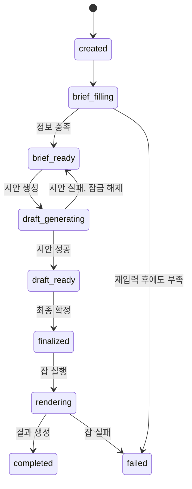

# apps/frontend — 행복한 3팀 프론트엔드

제품 이미지와 정보를 입력하면 브랜드 스타일의 광고 이미지 또는 6컷 광고 만화를 만드는 서비스의
프론트엔드 스캐폴딩입니다. 현재 목표는 완성형 화면이 아니라, Figma 참고 시안의 기능을 실제 백엔드
계약에 맞춰 안전하게 확장할 수 있는 뼈대를 만드는 것입니다.

> API의 단일 원천은 [`packages/contracts/openapi.yaml`](../../packages/contracts/openapi.yaml)입니다.
> 이 문서와 코드가 계약과 다르면 OpenAPI가 맞습니다.

## 현재 범위

현재 포함된 것은 다음과 같습니다.

- Vite + React + TypeScript 실행 환경
- 서비스명 **행복한 3팀**과 기본 디자인 토큰
- 채팅형 세션 이력 사이드바
- `comic` / `single_ad` 출력 유형 선택
- 제품 이미지, 제품명, 소구점, 메모, 화풍 입력 폼
- 브리프 확인, 시안, 렌더 결과가 들어갈 패널
- 계약과 동일한 세션·잡 상태 타입
- 백엔드 요청을 한곳으로 모으는 API 클라이언트 경계
- 데스크톱/태블릿/모바일 반응형 레이아웃

현재 동작은 **UI 스캐폴딩 데모**입니다. 제출 버튼은 입력 내용을 오른쪽 확인 패널에 표시하지만
백엔드 API를 호출하지 않습니다. 인증, 업로드, 실제 생성, 폴링, 다운로드는 아래 순서에 따라 연결합니다.

## 기술 선택

| 영역 | 선택 | 이유 |
| --- | --- | --- |
| UI | React 19 | 화면을 기능 단위 컴포넌트로 분리하기 쉽고 팀 채용/학습 자료가 많음 |
| 빌드 | Vite 8 | 별도 SSR 요구가 확정되지 않은 생성 도구형 SPA에 필요한 구성이 단순함 |
| 언어 | TypeScript | OpenAPI의 camelCase 계약과 상태 유니언을 컴파일 단계에서 검증 |
| 패키지 매니저 | pnpm | 모노레포 확장 시 저장 공간과 설치 속도에 유리하고 lockfile 재현 가능 |
| 스타일 | CSS 변수 + 일반 CSS | 초기 스캐폴딩에서 디자인 시스템 의존성을 먼저 고정하지 않음 |

라우팅, 서버 상태, 폼 라이브러리는 기능 구현 시점에 추가합니다.

- 라우팅: React Router
- 서버 상태: TanStack Query
- 폼 검증: React Hook Form + Zod
- OpenAPI 타입: 계약 동결 후 codegen
- 컴포넌트 테스트: Vitest + Testing Library
- E2E: 저장소 루트 `e2e/`의 Playwright 또는 기존 QA 합의 도구

## 실행

Node.js 22와 pnpm이 필요합니다.

```bash
cd apps/frontend
pnpm install
cp .env.example .env.local
pnpm dev
```

기본 주소는 `http://localhost:5173`입니다.

```bash
pnpm lint
pnpm typecheck
pnpm build
```

## Figma 기능을 서비스에 연결하는 방법

참고 시안의 정보 구조는 유지하되, 화면 문구와 데이터는 광고 생성 계약에 맞게 바꿉니다.

| Figma 영역 | 행복한 3팀 기능 | 구현 위치/계획 |
| --- | --- | --- |
| 시작·로그인 | 아이디/비밀번호 로그인 | `/login`, `POST /v1/auth/login` |
| 회원가입 | 가입 안내 | 계약상 현재 `501`; UI보다 계약 구현 여부를 먼저 확정 |
| 비밀번호 찾기 | 재설정 안내 | 공개 계약에 없음; 화면을 만들기 전에 OpenAPI 변경 필요 |
| 채팅 사이드바 | 새 세션, 세션 검색, 최근 세션 | `AppSidebar`, `GET /v1/sessions` |
| 입력 패널 | 사진, 제품명, 소구점, 메모, 화풍 | `BriefForm`, `POST /v1/sessions` |
| 기획안 패널 | 자동 채운 브리프 확인 | `Session.brief`, `Session.briefMeta` |
| 수정 버튼 | 브리프/시안 부분 교체 | `PATCH .../brief`, `PATCH .../draft` |
| 생성 버튼 | 텍스트 시안 생성 | `POST .../draft` |
| 대기 화면 | 최종 이미지 렌더 잡 | `POST .../finalize`, `GET /v1/jobs/{jobId}` |
| 성공·실패 | 결과/재시도 안내 | `Job.status`, `Job.result`, `Job.error` |
| 저장 | 만료 전 결과 이미지 다운로드 | `JobResult.imageUrl`, `expiresAt` 표시 |
| 설정·프로필 | 로그인 아이디, 로컬 환경설정 | `/settings`, `/profile`, `GET/PATCH /v1/me` |

## 화면과 라우트 계획

> **배포에서는 nginx가 vite 개발 서버의 두 가지 일을 이어받습니다** (`Dockerfile`, `nginx.conf`).
>
> | 개발 (vite) | 배포 (nginx) | 없으면 |
> | --- | --- | --- |
> | `/v1` 프록시 | `/v1` -> `backend:8000` | 다른 출처가 되어 `Secure` + `SameSite=Lax` 쿠키가 실리지 않고 **모든 요청이 401** |
> | SPA 폴백 | `try_files ... /index.html` | 라우팅이 붙은 뒤 하위 경로를 주소창에 직접 치면 **404** |
>
> ⚠️ **HTTPS 종단이 아직 없습니다** (API_계약.md 8.3절). 세션 쿠키가 `Secure`라 브라우저는
> 평문 HTTP 응답에서 그 쿠키를 저장하지 않습니다. 즉 `http://<VM 주소>/`로는 **화면은 떠도
> 로그인이 성립하지 않습니다.** `http://localhost`는 예외라 로컬 스택에서는 됩니다.
> 종단 방식은 05 소관입니다.

| 경로 | 화면 | 보호 여부 |
| --- | --- | --- |
| `/login` | 로그인 | 공개 |
| `/` | 새 광고 세션 생성 | 로그인 필요 |
| `/sessions/:sessionId` | 브리프 확인 → 시안 수정 → 렌더 상태 → 결과 | 로그인 필요 |
| `/settings` | 알림·표시 방식 등 기기 로컬 설정 | 로그인 필요 |
| `/profile` | `loginId` 확인/수정, 비밀번호 변경 | 로그인 필요 |

회원가입, 비밀번호 찾기 화면은 Figma에 있지만 현재 공개 API 계약과 동작 범위가 다릅니다. 경로부터
만들지 말고 `openapi.yaml`에 요청·응답·오류가 먼저 합의된 뒤 추가합니다.

## 백엔드 계약 매핑

프론트엔드는 `apps/backend`만 호출합니다. `apps/ai-engine`을 브라우저에서 직접 호출하지 않습니다.

| 순서 | 요청 | 중요한 화면 규칙 |
| --- | --- | --- |
| 1 | `POST /v1/sessions` | 이미지와 제품 정보를 multipart 한 번에 전송 |
| 2 | `PATCH /v1/sessions/{id}/brief` | 바꾼 필드만 `patch`에 포함하고 `revision` 전송 |
| 3 | `POST /v1/sessions/{id}/draft` | 실행 직전 브리프가 잠긴다는 사실을 확인받음 |
| 4 | `PATCH /v1/sessions/{id}/draft` | 만화는 컷별 scene/dialogue, 단일 광고는 copy/visualPlan만 수정 |
| 5 | `POST /v1/sessions/{id}/finalize` | 렌더 잡 ID를 받고 비동기 화면으로 전환 |
| 6 | `GET /v1/jobs/{jobId}` | `Retry-After` 헤더를 따라 폴링; 간격 하드코딩 금지 |

### 계약에서 특히 놓치기 쉬운 규칙

- 출력 유형은 `comic` 또는 `single_ad`이며 세션 생성 후 바꿀 수 없습니다.
- 만화는 정확히 6컷입니다. 컷 수 선택 UI를 제공하지 않습니다.
- 만화에는 `aspectRatio`가 없고 단일 광고에는 `character`가 없습니다.
- `adPlan`과 만화 컷의 `role`은 읽기 전용입니다.
- `messageMode: degraded`는 정상적인 열화 상태이며 오류 화면으로 보내지 않습니다.
- `needsInput`이 있으면 서버가 요구한 필드를 사용자에게 다시 묻습니다.
- 세션 `failed`는 복구하지 않고 새 세션을 시작합니다.
- 잡 실패도 상태 조회 HTTP 응답은 200이며, `Job.error.code`로 분기합니다.
- 결과 이미지 URL은 7일 후 만료되므로 `expiresAt`을 화면에 표시합니다.
- 409 `REVISION_CONFLICT`가 오면 최신 세션을 다시 조회한 뒤 사용자의 변경을 재적용할지 묻습니다.

## 상태 흐름



세션 상태와 잡 상태를 한 enum으로 합치지 않습니다.

- 세션: `created | brief_filling | brief_ready | draft_generating | draft_ready | finalized | rendering | completed | failed`
- 잡: `queued | running | done | failed`

## 권장 폴더 구조

```text
apps/frontend/
  src/
    features/
      studio/
        components/       # 사이드바, 브리프 폼, 시안/결과 패널
        mock-data.ts       # API 연결 전 화면용 데이터
        types.ts           # 계약과 맞춘 화면 타입
    shared/
      api/
        client.ts         # backend 호출 공통 경계
    App.tsx
    main.tsx
    styles.css
  .env.example
  index.html
  package.json
  tsconfig.json
  vite.config.ts
```

기능이 커지면 `features/auth`, `features/session`, `features/render-job`으로 분리합니다. HTTP 요청은
컴포넌트 안에서 직접 호출하지 않고 `shared/api` 또는 각 feature의 API 모듈을 통과시킵니다.

## 구현 순서

### 1. 인증과 보호 라우트

- `/v1/auth/login`, `/v1/auth/logout`, `/v1/me` 연결
- 401을 전역 로그인 화면으로 연결
- 쿠키 기반 인증 여부와 CSRF 정책을 백엔드와 확인

### 2. 세션 생성과 목록

- 템플릿과 화풍 목록 조회
- 이미지 형식·10MB·짧은 변 512px 사전 검증
- multipart 세션 생성
- 최근 세션 목록과 선택 상태

### 3. 브리프 확인과 시안

- `briefMeta.visibility`로 표시 여부 결정
- `filledBy`를 이용해 자동 입력값 표시
- 정보 부족·열화 상태의 추가 입력 흐름
- 브리프 잠금 전 확인 모달
- 시안의 허용 필드만 인라인 수정

### 4. 렌더와 결과

- finalize 후 `jobId`를 세션 저장소에 보관
- 서버 `Retry-After`를 따르는 폴링
- queued/running/done/failed 화면
- 결과 만료 시각과 다운로드

### 5. 품질

- 키보드만으로 전체 흐름 사용 가능
- 생성 상태를 `aria-live`로 알림
- 모바일 사이드바를 드로어로 전환
- 입력, 상태 전환, 오류 매핑 단위 테스트
- 로그인 → 세션 생성 → 시안 → 렌더 → 저장 E2E

## 환경 변수

```dotenv
VITE_API_BASE_URL=
```

**비워 두는 것이 기본값입니다.** 빈 값은 "같은 출처"를 뜻하고, 개발 서버가 `/v1`을 백엔드로
프록시합니다(`vite.config.ts`). 브라우저는 `:5173` 하나만 상대하므로 CORS가 아예 생기지 않고,
세션 쿠키(`HttpOnly; Secure; SameSite=Lax`)가 그대로 실립니다.

절대 URL을 넣으면 프록시를 우회해 교차 출처 요청이 됩니다. 백엔드에는 CORS 미들웨어가 없고
`credentials: "include"`라 와일드카드 출처도 쓸 수 없어 브라우저가 막습니다. 프론트를 백엔드와
다른 출처에 배포하게 되면 CORS 설정과 쿠키의 `SameSite=None` 전환이 함께 필요합니다 —
[API_계약.md](../../docs/기술문서/API_계약.md) 8.3절.

브라우저에 포함되는 `VITE_` 변수에는 비밀 키를 넣지 않습니다. 모델 API 키와 저장소 자격증명은
백엔드 또는 인프라 환경에만 둡니다.

## 완료 기준

- OpenAPI에서 생성한 타입 또는 동일성을 검증하는 타입을 사용합니다.
- 새로고침 후에도 `sessionId`와 `jobId`로 진행 중 작업을 복구합니다.
- 빈 화면, 정보 부족, 열화, 생성 중, 부분 수정 실패, 최종 실패, 만료 결과를 각각 처리합니다.
- 409 충돌과 401 만료 세션에 사용자가 취할 다음 행동을 제공합니다.
- 모바일과 데스크톱에서 핵심 흐름이 동작합니다.
- `pnpm lint`, `pnpm typecheck`, `pnpm build`가 CI에서 필수로 통과합니다.
