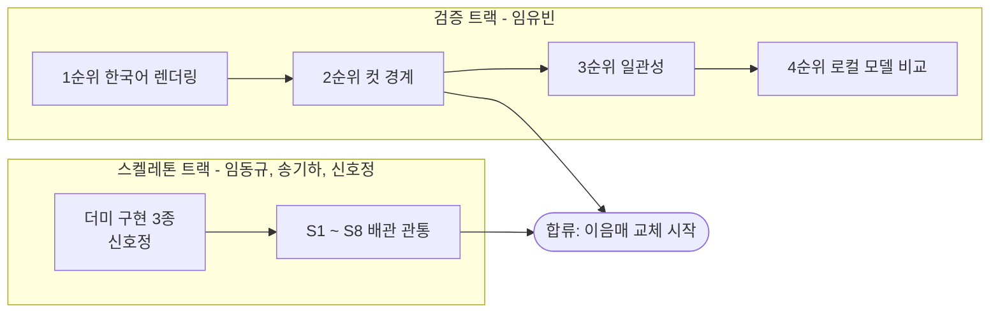

# 구현 범위

**무엇을 만들지**보다 **무엇을 만들지 않을지**가 더 중요한 문서입니다. 짧은 프로젝트에서
범위가 조용히 늘어나는 것이 가장 흔한 실패 원인입니다.

> **상태: TL 잠정안입니다.** 기획서 18.1 #6("워킹 스켈레톤 범위 정의 - 1차 범위의 경계")이
> 아직 열려 있습니다. 확정 권한은 PM(정승호)에게 있습니다. 확정되면 이 안내와
> [미결정_대장.md](../기술문서/미결정_대장.md)의 해당 항목을 함께 지웁니다.

## 0. 세 개의 축을 혼동하지 않기

문서 곳곳에 "1차", "단계", "개발 단계"라는 말이 나오는데 **서로 다른 세 개의 축**입니다.
섞어 쓰면 "1차에 배포가 들어가나요" 같은 질문에 아무도 답할 수 없게 됩니다.

| 축 | 값 | 정의 위치 |
|---|---|---|
| **진행 절차** | 1 기획 확정 -> 2 기술문서 -> **3 워킹 스켈레톤** | 기획서 14.2 |
| **기능 차수** | 1차 (기능 완성) / 2차 (고도화) | 이 문서 |
| **운영 성숙도** | 개발 단계 / 배포 단계 | 기획서 12.5, 17.2 |

- **워킹 스켈레톤은 기능 차수가 아니라 진행 절차의 한 단계**입니다. 기능을 담는 그릇이 아니라
  그릇이 새지 않는지 확인하는 일입니다.
- 운영 성숙도는 같은 기능의 다른 완성도입니다. 오류 표시는 1차에 들어가지만, 개발 단계에서는
  원인을 그대로 보여 주고 배포 단계에서 사용자용 문구로 바뀝니다.

### 0.1 기획서 해석 (PM 확인됨, 기획서 반영 대기)

기획서 14.4는 "워킹 스켈레톤에 포함된 것이 1차 범위"라고 적혀 있고, 7.1은 9개 기능을 "1차 필수"로
나열합니다. 두 문장이 같은 것을 가리키지 않습니다 -- 7.1의 9개를 전부 만들면 그것은 스켈레톤이
아니라 완성된 제품입니다.

**TL 해석: 둘을 분리합니다.**

| | 워킹 스켈레톤 (진행 절차 3단계) | 1차 (기능 차수) |
|---|---|---|
| 목적 | 전 구간이 연결되는지 확인 | 기능이 실제로 동작 |
| 품질 | 관통만 되면 됨. 결과물의 품질은 보지 않음 | 기획서 7.1, 7.2 충족 |
| 외부 의존 | 스텁 허용 | 실물 |
| 근거 | 기획서 14.2 단계 3 | 기획서 7.1, 7.2 |

**PM이 고치기로 했습니다** (PR #54 리뷰). 들어갈 문안도 함께 제시되었습니다.

> 진행 절차 3단계는 워킹 스켈레톤이며, 1차 기능 범위는 7.1을 따른다.

기획서를 실제로 고치는 것은 PM 소관이며, 반영되면 이 절의 "PM 확인 필요" 표시를 지웁니다.

## 1. 워킹 스켈레톤 (진행 절차 3단계)

**수직 관통 한 줄만 만듭니다.** 요청 하나가 화면부터 결과 파일까지 전 구간을 지나가고, 각 외부
의존이 **이름 붙은 이음매** 뒤에 스텁으로 들어가 있으면 끝입니다.

- 관통 경로는 **단일 광고형 하나**입니다. 만화형 가지는 분기 지점만 만들고 스텁으로 둡니다 --
  분기 자체가 구조이므로 없애지 않되(기획서 5.3), 6컷 격자와 캐릭터 일관성은 스켈레톤이 답할
  문제가 아닙니다.
- **결과물의 품질은 판정 대상이 아닙니다.** 자리표시자 이미지가 내려와도 통과입니다.
- **로그인은 플로우만 만듭니다.** 가입, 탈퇴, 비밀번호 변경은 계약만 잡고 501로 응답합니다
  ([ADR-0008](../adr/0008-로그인_수단과_스켈레톤_범위.md)). 스켈레톤이 답할 질문은 "인증이 관통
  경로에 실제로 걸리는가"이고, 계정을 만드는 일은 그 질문에 답하지 않습니다.

| # | 항목 | 완료 조건 (DoD) | 소관 |
|---|---|---|---|
| S0 | 로그인 | **고정 계정 둘**로 아이디 조회 + 비밀번호 대조 + 세션 쿠키 발급. 미인증 요청은 401, 남의 세션 조회는 404 (INV-9) | 임동규 |
| S1 | 계약 골격 | 세션, 시안, 확정, 잡 경로가 `openapi.yaml`에 존재하고 `contracts-check` 통과 | 신호정 |
| S2 | 세션 상태 전이 | `created`부터 `completed`까지 전이가 저장소에 남고, 프로세스 재시작 후 복원됨 | 임동규 |
| S3 | 브리프 채우기 이음매 | backend가 ai-engine을 호출하고, 더미 구현이 고정값을 반환함 | 임동규 (호출) + 신호정 (더미) |
| S4 | 시안 생성 이음매 | 유형 분기가 존재하고, 단일 광고형 더미 구현이 고정 시안을 반환함 | 임동규 + 신호정 (더미) |
| S5 | 부분 교체 | `revision` 기반 patch에서 지정한 필드만 바뀌고 나머지는 원문 유지 | 임동규 |
| S6 | 확정과 잡 | `finalize` -> `jobId` -> 폴링 -> 잡이 `done`. 렌더러 더미가 자리표시자 이미지를 반환 | 임동규 + 신호정 (더미) |
| S7 | 최소 화면 | 입력, 시안, 확정, 결과 다운로드가 브라우저에서 한 번에 통과 | 송기하 |
| S8 | 오류 경로 1종 | ai-engine을 꺼도 화면이 죽지 않고 우측 상단에 오류가 표시됨 | 임동규 + 송기하 |

**전체 DoD**: 브라우저에서 입력부터 파일 다운로드까지 한 번에 지나가고,
[아키텍처.md](아키텍처.md) 5절의 이음매 표에 **모든 스텁이 이름과 소관과 함께** 올라가 있을 것.

**S0의 "고정 계정 둘"은 최소값입니다** ([ADR-0008](../adr/0008-로그인_수단과_스켈레톤_범위.md)).
하나면 "남의 세션"이 존재하지 않아 404 경로를 한 번도 지나지 않기 때문에 둘이며, 셋 이상을
금지하는 규칙이 아닙니다. 개발 중에 각자 계정을 더 두어도 로그인은 아이디 조회와 비밀번호
대조뿐이라 **계약도 코드도 바뀌지 않습니다.** 다만 가입 경로가 501이므로 늘리는 방법은 시드
데이터 추가뿐이고, 자격 증명은 `infra/.env`에만 두므로 **팀원마다 계정 목록이 달라집니다.**
S0의 완료 판정은 공용 고정 계정 둘로 하고, 개인 계정은 각자 로컬에만 두십시오.

### 1.1 더미 구현은 실물과 같은 자리에서 갈립니다

2026-08-11 회의에서 **더미 구현 3곳(S3, S4, S6)을 신호정이 맡기로** 확정했습니다
([회의 결정](../회의록/2026-08-11_차단7건_회의결정.md)). AI 담당이 배관 작업에 묶이지 않게 하기
위해서입니다.

만드는 방식은 이렇습니다.

- **함수는 실물과 같은 것을 만듭니다.** 더미 전용 경로를 따로 파지 않고, 같은 함수 안에서
  더미 루틴과 실제 구현이 **분기**되도록 구현합니다.
- 그래서 임유빈이 실제 기능을 붙일 때 **호출부와 계약을 건드리지 않습니다.** 분기의 한쪽을
  채우는 일이 됩니다.
- 이것이 `AGENTS.md`가 말하는 "옆에 새로 만들지 말고 같은 이음매에서 갈아끼운다"를 코드 수준으로
  옮긴 것입니다. 우회 경로를 만들면 스켈레톤이 검증하던 성질(폴백, 가드레일, 계약)이 조용히
  사라집니다.
- 분기 조건은 **설정으로 드러냅니다.** 어느 쪽이 돌고 있는지 코드를 읽지 않고 알 수 있어야
  합니다. 스텁 응답을 실측값으로 착각하는 사고가 여기서 나옵니다.

### 1.2 스켈레톤에 붙는 사람은 셋입니다

| 사람 | 스켈레톤 기간에 하는 일 |
|---|---|
| 임동규 (BE) | S2 ~ S6. 배관의 본체 |
| 송기하 (FE) | S7, S8. 화면 한 벌 |
| 신호정 (TL) | S1. 계약과 조립. **더미 구현 3곳 (1.1절)** |
| 임유빈 (AI) | 배관에 붙지 않고 **기획서 15절 검증 실험을 바로 시작** |
| 정승호 (PM) | 미결정 대장 닫기, 화풍 후보와 고지 문구 준비 |

AI 담당을 배관에 묶어 두지 않는 것이 요점입니다. 검증 1순위와 2순위 결과가 나오지 않으면
스켈레톤을 실물로 바꿀 때 무엇을 만들어야 하는지 아무도 모릅니다
([미결정_대장.md](../기술문서/미결정_대장.md) A절).

### 1.3 스켈레톤에서 하지 않는 것

| 항목 | 스켈레톤에서의 처리 |
|---|---|
| 실제 모델 호출 (추론, 시안 생성) | 스텁 고정값 |
| 실제 이미지 생성 | 자리표시자 이미지 파일 |
| 화풍 후보와 예시 이미지 | 없음. 값 하나 고정 |
| 가드레일 판정 | 이음매만 두고 통과시킴 |
| 6컷 격자, 캐릭터 일관성 | 만화형 가지 전체가 스텁 |
| 정보 부족 재요구 | 없음. 항상 진행 |
| GCP VM 배포 | 로컬에서 관통하면 됨 |
| 보존 기간 정리 배치 | 없음 |

### 1.4 두 트랙은 동시에 굴러갑니다

스켈레톤과 검증 실험은 **서로를 기다리지 않습니다.** 이것이 성립하는 이유는 하나입니다:
스켈레톤에 필요한 것은 모델 호출이 아니라 **응답의 모양**뿐이고, 그 모양은
[도메인_모델.md](../기술문서/도메인_모델.md)가 이미 고정했기 때문입니다.

2026-08-11 회의로 **검증 트랙에 선행 조건이 없어졌습니다.** 더미 구현을 신호정이 맡으면서
(1.1절) AI 담당은 첫날부터 검증 실험을 시작합니다.



- **더미 응답 3종**은 `brief:fill` 고정 응답, `draft:generate` 단일 광고형 고정 시안,
  `image:render` 자리표시자 이미지입니다. 규격에 맞는 값이면 되고 품질은 보지 않습니다.
  실제 구현은 나중에 **같은 함수의 다른 분기로** 들어옵니다 (1.1절).
- **합류 지점은 검증 2순위까지**입니다. 1순위(대사 처리)와 2순위(컷 경계)가 닫혀야 `image:render`
  이음매를 무엇으로 채울지 정해집니다. 3순위와 4순위는 이음매 교체와 병행할 수 있습니다.
- 검증 트랙이 스켈레톤보다 먼저 끝나면 AI는 이음매 교체로 합류합니다. 반대로 검증이 늦어지면
  **밀리는 것은 스켈레톤이 아니라 F7과 F9**입니다. 스켈레톤은 스텁으로 완주합니다.

## 2. 1차 기능 범위 (스켈레톤 이후)

스켈레톤의 스텁을 **이음매에서** 실물로 바꾸는 일입니다. 스텁을 우회해 옆에 새 경로를 만들면
스켈레톤이 검증하던 성질(관통, 계약, 오류 경로)이 조용히 사라집니다.

소관은 기획서 14.1의 실명, 근거는 기획서 절 번호입니다.

### 2.1 사용자 흐름 (기획서 7.1, 7.2)

| # | 항목 | 완료 조건 (DoD) | 소관 | 근거 |
|---|---|---|---|---|
| F0 | 로그인 | 스켈레톤의 고정 계정을 실제 계정으로 교체. 로그인, 로그아웃, 내 세션 목록. 가입과 탈퇴와 비밀번호 변경은 계약만 (ADR-0008) | 임동규 + 송기하 | 17.1 |
| F1 | 출력 유형 선택 | 만화형과 단일 광고형을 예시 이미지가 붙은 카드로 고름 | 송기하 | 12.3 |
| F2 | 화풍 선택 | 후보를 그림 격자로 제시. 미선택 시 랜덤이 적용되고 그 사실이 보임 | 임유빈 (후보) + 송기하 (화면) | 12.4, 9.4 |
| F3 | 제품 정보 입력 | 사진 1장 + 제품명 + 소구점 + 자유 메모를 한 화면에서 입력 | 송기하 | 9.1, 12.2 |
| F4 | 브리프 자동 채움 | 사진 판독 1회로 카테고리와 타겟이 채워짐 | 임유빈 | 7.1, 9.2 |
| F5 | 자동 채운 값 표시와 수정 | `filledBy`가 응답에 실리고 `editable` 항목을 고칠 수 있음 | 송기하 | 5.4 |
| F6 | 정보 부족 시 재요구 | 추론이 불확실하면 진행하지 않고 자유 메모를 요구함 | 임동규 | 9.3 |
| F7 | 시안 생성 | 만화형은 6컷(`panels`) + 광고 기획안, 단일 광고형은 카피 + 비주얼 구성안. `adPlan`은 서술형 문단이며 읽기 전용 | 임유빈 | 7.1, 8 |
| F8 | 만화형 관통 | 스켈레톤에서 스텁이던 만화형 가지가 실제로 동작 | 임유빈 + 임동규 | 5.3, 6 |
| F9 | 최종 이미지 생성 | 만화형 3456 x 2304 (3x2 6컷), 단일 광고형 정사각. 세션당 1회 | 임유빈 | 6, 10 |
| F10 | 오류 표시 | 기획서 12.5의 실패 5종이 각각 구분되어 표시됨 | 송기하 + 임동규 | 12.5 |

### 2.2 안전과 품질

| # | 항목 | 완료 조건 (DoD) | 소관 | 근거 |
|---|---|---|---|---|
| F11 | 가드레일 | 소구점에 없는 수치, 효능, 성분, 수상 이력, 타사 비교가 결과물에 나오지 않음 | 임유빈 | 5.5, 9.4 |
| F12 | 가드레일 대조군 | on / off를 바꿔 실행할 수 있고 그 차이가 수치로 남음 | 임유빈 (판정은 타 담당) | 9.4 |
| F13 | 면책 고지 | 결과 화면에 고지 문구가 표시됨 | 정승호 (문구) + 송기하 | 9.4 |
| F14 | 품질 실측 | 대사 표기 정확도, 컷 분할 정확도, 화풍 반영 여부, 세션당 단가가 숫자로 남음 | 임유빈 + 타 담당 판정 | 15 |

### 2.3 운영

| # | 항목 | 완료 조건 (DoD) | 소관 | 근거 |
|---|---|---|---|---|
| F15 | 세션 보관 | 만료된 데이터를 지우는 코드가 실제로 돎 | 임동규 | 17.1 |
| F16 | GCP VM 배포 | 외부에서 접근 가능한 상태로 상시 기동. 재부팅 후 자동 복구 | 임동규 | 13.1 |
| F17 | 관통 테스트 | 입력부터 이미지 다운로드까지 자동 테스트로 통과 | 임동규 | 14.2 |

**F16(배포)은 1차에 포함합니다.** 기획서 14.4는 이번 범위를 워킹 스켈레톤까지로 정의하고 배포를
명시하지 않지만, 과제 요구사항과 기획서 13.1은 배포를 전제합니다. PM이 "서빙부터 배포 운영까지가
프로젝트 범위"라며 포함을 확인했습니다 (PR #54 리뷰).

**F17은 BE(임동규)가 맡습니다** (PR #54 리뷰). 테스트 작성과 통과 판정 모두입니다. 5명이 7역할을
맡는 구조에서 QA가 따로 배정되지 않아 비어 있던 자리입니다.

작성자와 판정자가 같아도 되는 이유는 **관통 테스트가 자동 테스트**이기 때문입니다. 통과 여부를
사람이 보는 것이 아니라 코드가 판정하므로, 기획서 15절이 막으려던 것("결과를 만든 사람이 눈으로
보고 좋다고 하는 것")이 성립하지 않습니다. 같은 이유로 **무엇을 통과로 보는지는 코드에 남아야
합니다** -- 판정 근거가 사람 머릿속에 있으면 그때부터는 자기 채점입니다.

## 3. 넣지 않는 것

명시적으로 적어 두지 않으면 "당연히 해야 하는 것"으로 되살아납니다.

| 항목 | 왜 제외했나 | 다시 검토할 시점 |
|---|---|---|
| 에피소드 연재 (시리즈, 콘텐츠 캘린더) | 세션 하나가 독립이라는 전제가 깨집니다 | 2차 (기획서 7.4) |
| 로그인 기반 캐릭터 재사용 | 로그인은 1차에 있지만, 캐릭터를 저장하고 되불러오는 것은 별개 기능입니다 | 2차 (7.4) |
| 확정 후 재생성 | 그림 생성 1회 고정이 비용 방어선입니다 | 2차 (7.4, 18.2 #13) |
| 플랫폼별 사이즈 리사이징 (릴스 등) | 인스타그램 피드 한 규격이 먼저 성립해야 합니다 | 2차 (7.4) |
| 톤 항목 (유머형, 감동형 등) | 입력을 늘리지 않는다는 원칙과 충돌합니다 | 18.2 #9 |
| 컷 수 가변 | 6컷 고정이 규격과 프롬프트 설계의 전제입니다 | 범위 밖 (6절) |
| 서비스 내 게시 기능 | 사용자가 Grid Post 등으로 직접 게시합니다 | 범위 밖 (6절) |
| 제품 사진 여러 장 업로드 | 입력 1장이 전제입니다 | 범위 밖 (9.1) |
| 사용량 상한, 접근 인증 | 개발과 검증 단계에서는 팀 내부만 사용합니다 | 배포 단계 (11.2, 17.2) |
| 사용자용 오류 문구 | 개발용 표시와 목적이 다릅니다 | 배포 단계 (17.2) |
| 결제 | 과제 목표와 무관한 CRUD입니다 | 범위 밖 |
| 비밀번호 재설정, 이메일 인증 | 메일 발송 경로가 없습니다. 잊으면 계정을 다시 만듭니다 | 배포 단계 (17.2) |
| 파인튜닝 (LoRA), 어댑터 배포 | 기획서에 없는 경로입니다. `training/`은 미채택 상태 | ADR로 관리 |
| 로컬 이미지 모델 채택 | **실험은 1차, 채택은 조건부**입니다 | 기획서 15절 4순위 결과 |

마지막 줄에 주의하세요. 로컬 모델을 GPT와 비교하는 **실험**은 1차 안에 있습니다 (F14).
비교 없이 채택하지 않을 뿐이며, 실험 자체를 빼면 기획서 13.2가 사라집니다.

## 4. 검증 트랙 (스켈레톤과 병행)

기획서 15절의 검증 과제 중 **구현 방식을 결정하는 것**들입니다. 결과가 나오기 전에 그 부분을
구현하면 버리는 코드가 됩니다. 스켈레톤은 이 결과를 기다리지 않아도 됩니다 -- 스텁이기 때문입니다
(1.4절).

### 4.1 과제와 합류 시점

| 순위 | 검증 | 뒤집히면 바뀌는 것 | 합류 |
|---|---|---|---|
| 1 | 6칸 조건 한국어 렌더링 | 대사 처리 방식 전체 (기획서 10.3). 합성 단계와 폰트 자산이 새로 필요 | 이음매 교체 전 |
| 2 | 컷 경계 제어 | 3x2 격자 생성 방식. 후처리 합성으로 전환 가능성 | 이음매 교체 전 |
| 3 | 캐릭터와 화풍 일관성 | 프롬프트 설계. IP-Adapter 도입 여부 | 교체와 병행 가능 |
| 4 | 로컬 모델과 GPT 비교 | 단일 광고형의 생성 경로 | 교체와 병행 가능 |

순위는 기획서 15절 그대로입니다. **1순위를 건너뛰고 2순위부터 하지 마세요** -- 대사를 함께
그리지 않기로 뒤집히면 2순위의 격자 조건 자체가 달라집니다.

2026-08-11 회의에서 확정된 검증 과제는 **모두 8건**이며 담당도 함께 정해졌습니다
([회의 결정](../회의록/2026-08-11_차단7건_회의결정.md)). 위 4건은 그중 **구현 방식을 바꾸는
것**만 추린 것입니다. 나머지 4건(비용 실측, 화풍 반영, 기획 근거 조사, VM 스펙 확인)은 결과가
어느 쪽이든 코드 구조를 바꾸지 않아 여기 합류표에 없습니다. 전체 표의 정본은 기획서 15절입니다.

### 4.2 시작하기 전에 있어야 하는 것

없으면 실험이 0일차에 멈춥니다. 스켈레톤 착수와 **같은 날** 확인하세요.

| 선행 조건 | 없으면 | 소관 |
|---|---|---|
| `gpt-image-2` 호출 가능한 API 키 | 1 ~ 3순위 전부 시작 불가 | 임동규 (발급) + 신호정 (보관 규약) |
| 실험 예산 상한 | 20회 x 여러 조건을 무제한으로 돌리게 됩니다 | 임유빈 (사용량 실측) -> 정승호 (상한 결정) |
| GCP VM 접근 | 4순위만 막힘 (로컬 모델 구동) | 임동규 |
| 판정자 지정 | **충족됨.** 2026-08-11 회의에서 확정 (4.4절) | 완료 |

**예산 상한은 실측 뒤에 정합니다** (PR #54 리뷰). 임유빈이 검증 6순위(비용 실측, 세션당 단가)로
사용량을 재고, 그 숫자를 보고 PM이 상한을 정합니다. 순서를 뒤집어 숫자 없이 상한부터 잡으면
근거 없는 값이 되고, 실험 중에 상한을 다시 올리게 됩니다. **다만 실측 자체가 요금을 쓰므로,
6순위를 먼저 소규모로 돌려 단가를 잡는 것이 사실상의 1차 방어선입니다.**

키는 `infra/.env`에 두고 **절대 커밋하지 않습니다.** 이 저장소는 public이라 푸시되는 순간
공개된 것이며, 해결은 revert가 아니라 폐기와 재발급입니다.

### 4.3 실험 코드와 결과를 두는 곳

| 무엇 | 어디 | 왜 |
|---|---|---|
| 실험 코드 | `notebooks/` | 스켈레톤 코드에 의존하지 않아야 병행이 성립합니다 |
| 확정된 로직 | `apps/ai-engine/src/ai_engine/` | 실험이 끝난 뒤 승격. 노트북을 import하지 않습니다 |
| 생성 이미지 원본 | 커밋하지 않음. 팀 공유 드라이브 | 저장소가 public이고 용량이 큽니다 |
| 판정 결과 수치 | 회의록 + [미결정_대장.md](../기술문서/미결정_대장.md) | 문서에 반영되지 않은 실험은 없었던 실험입니다 |

노트북은 nbstripout이 출력을 지웁니다. **판정 근거를 노트북 출력에만 남기지 마세요** -- 커밋하는
순간 사라집니다. 수치는 회의록에, 이미지는 드라이브에 남깁니다.

### 4.4 실험 하나가 끝났다는 것

아래 네 가지가 있어야 결과로 인정합니다. 기획서 15절의 "결과물을 만든 사람이 자기 결과물을
채점하지 않는다"를 절차로 옮긴 것입니다.

1. **조건**: 프롬프트, 해상도, 시도 횟수. 6칸 검증은 반드시 3456 x 2304로 합니다.
2. **수치**: 성공 비율. 판정 기준은 [미결정_대장.md](../기술문서/미결정_대장.md) A-1 참고.
3. **판정자**: 임유빈이 아닌 사람.
4. **결론**: 본안 유지인지 예비안으로 전환인지. "더 해봐야 안다"는 결론이 아닙니다.

**판정자와 방식은 2026-08-11 회의에서 확정되었습니다**
([회의 결정](../회의록/2026-08-11_차단7건_회의결정.md)).

- **판정은 AI 담당(임유빈)을 제외한 전원**이 합니다. 눈으로 세는 항목과 주관이 섞이는 항목을
  가르지 않고 하나로 통일했습니다.
- 방식은 **메신저에 결과 이미지를 올리고 팀원이 감상을 남기는 것**입니다. 결과가 나올 때마다
  올리므로 판정이 실험 끝에 몰리지 않습니다.
- 이 방식이 성립하려면 **이미지가 판정자에게 실제로 보여야 합니다.** 노트북 출력이나 개인
  드라이브에만 있는 결과는 판정되지 않은 것으로 취급합니다 (4.3절).

### 4.5 결과가 문서로 돌아오는 경로

기획서 14.3의 문서 관리 원칙을 이 트랙에 적용한 것입니다.

```
실험 -> 회의록 -> 미결정_대장 항목 닫기 -> 기술문서 잠정 표시 제거 -> (구조가 바뀌면) ADR
```

반영은 TL이 합니다. 대장만 닫고 기술문서를 고치지 않으면, 다음 사람이 잠정안을 확정으로 읽습니다.

## 5. 범위를 바꿀 때

- 범위 추가는 **무언가를 빼는 것과 함께** 제안하세요. 판단은 PM입니다.
- **일정이 밀리면 품질 게이트가 아니라 범위를 줄입니다.** CI, 가드레일, 테스트를 끄는 것은
  일정 대응이 아니라 측정 포기입니다.
- 무엇을 뺐는지 3절에 기록하세요. 기록되지 않은 축소는 다음 주에 "왜 없지"로 돌아옵니다.
- 아키텍처에 영향을 주는 범위 변경은 [docs/adr/](../adr/)에 ADR로 남깁니다.
