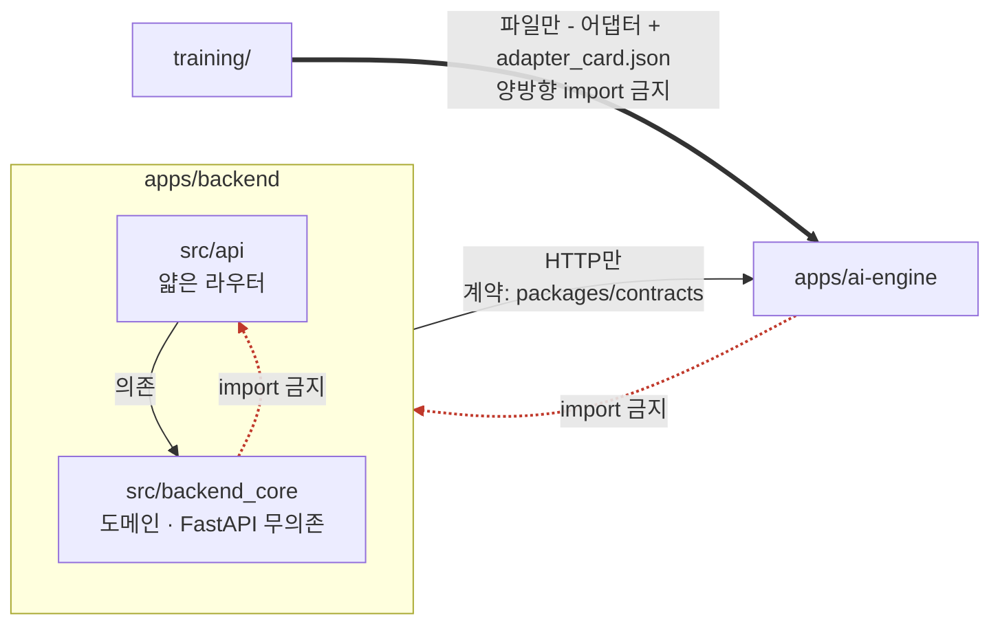
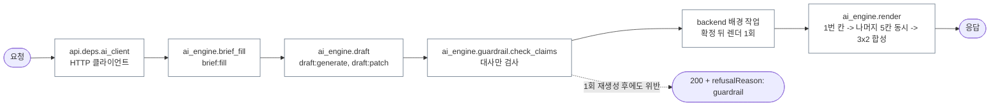

# 아키텍처

> 4절(의존 방향)과 5절(이음매)은 템플릿이 **코드로 이미 강제하고 있는** 부분입니다.
> 1~3절은 이 프로젝트의 목표 구조이며, 세부 범위 확정에 따라 `TBD`가 채워집니다.

## 1. 전체 그림

**GCP VM 1대**에 위 컨테이너가 함께 뜹니다. GPU도 1개이므로 **학습은 서비스와 시간을 나눠
씁니다** — 동시에 VRAM을 요구하면 둘 다 OOM으로 죽습니다. 안쪽 상자에 함께 들어간
`ai-engine`과 `training/`이 그 경합 관계이며, 둘을 같은 시간대에 돌리는 것은
"자원이 빠듯한 상태"가 아니라 **양쪽 모두 죽는 상태**입니다.

외부 의존 (스텁 → 실물 추적의 기준):

| 외부 의존 | 용도 | 현재 |
|---|---|---|
| 이미지 생성 | 이미지 생성 | **외부 API `gpt-image-2`** ([ADR-0003](../adr/0003-이미지_생성_경로.md)). 실물 분기는 배선됐고 기본값은 `ADGEN_GENERATION_MODE=stub` |
| 카피 생성 모델/API | 문안 생성 | **경로는 GPT API로 확인됨** (기획서 13.2 유지, 2026-08-19). 구현은 아직 스텁 (`StubGenerator`) |
| 파일 보관 | 입력 이미지, 결과 이미지 | **VM 로컬 디스크** ([ADR-0010](../adr/0010-상태_저장소와_파일_보관_위치.md)) |
| 상태 저장소 | 계정, 세션, 브리프, 시안, 잡 | **SQLite 파일 1개** (ADR-0010) |
| 잡 큐 | 비동기 렌더 잡 | **브로커 없음.** 같은 프로세스의 배경 작업이고 직렬은 저장소가 강제합니다 ([ADR-0015](../adr/0015-렌더_워커는_같은_프로세스의_배경_작업으로_돌린다.md)) |

**`training/`은 이번 범위가 아닙니다** ([ADR-0004](../adr/0004-파인튜닝_보류.md)). 위 다이어그램의
GPU 경합 상자는 학습이 있을 때의 구조이며, 지금은 학습이 없으므로 경합도 없습니다. 어댑터
가중치 보관도 마찬가지입니다.

**2026-08-20 에 되살아날 조건이 없어졌습니다.** 이 상자를 되살릴 유일한 신호가 "검증 4순위에서
로컬 모델을 채택하는 것" 이었는데 그 검증이 **미채택**으로 닫혔습니다
([회의록](../회의록/2026-08-20_검증4순위_로컬모델_미채택.md), 미결정_대장 A-5). 그래서 이번
범위에서 VM 의 GPU 를 이미지 생성 경로에 연결할 일도 함께 없어졌습니다. 되살리려면 그 확정을
뒤집는 새 회의록이 먼저입니다.

## 2. 모듈

| 모듈 | 책임 | 위치 | 하지 않는 것 |
|---|---|---|---|
| frontend | 입력 폼, 진행 표시, 결과 갤러리 | `apps/frontend/` | 모델 직접 호출 |
| backend | 인증·입력 검증·잡 수명주기·오케스트레이션·폴백 | `apps/backend/` | GPU 점유, 프롬프트 조립 |
| ai-engine | 카피/이미지 생성, 가드레일, 어댑터 로딩 | `apps/ai-engine/` | 사용자 인증, 잡 상태 관리 |
| training | 데이터 준비, LoRA 학습, 어댑터 카드 생성 | `training/` | 서비스 코드 import |
| contracts | 모듈 간 HTTP 계약 (단일 원천) | `packages/contracts/` | — |
| eval | 재현 가능한 품질 채점 | `apps/ai-engine/eval/` | 모델 호출 (순수 함수) |

**`ai-engine`이 잡 상태를 갖지 않는 것**이 중요합니다. 상태를 가지면 GPU 프로세스 재시작마다
진행 중이던 잡이 사라지고, 스케일아웃 경로도 막힙니다.

## 3. 기술 스택

> `TBD` 항목은 선택의 이유가 자명하지 않으므로 **결정 시 ADR로 남깁니다**.

| 계층 | 기술 | 비고 |
|---|---|---|
| API | FastAPI / Python 3.12 | 확정 |
| 프론트엔드 | **React 19 + Vite + TypeScript** (pnpm) | 2026-08-13 스캐폴딩. 배경과 함정: `apps/frontend/README.md` |
| 이미지 생성 | **외부 API (`gpt-image-2`)** | [ADR-0003](../adr/0003-이미지_생성_경로.md). 로컬 모델은 **미채택 확정** (2026-08-20 [회의록](../회의록/2026-08-20_검증4순위_로컬모델_미채택.md), 미결정_대장 A-5). 만화형 방식은 [ADR-0017](../adr/0017-만화형은_칸을_따로_생성해_합성한다.md) |
| 파인튜닝 | **하지 않습니다** | [ADR-0004](../adr/0004-파인튜닝_보류.md). 되살릴 조건이던 로컬 모델 채택이 2026-08-20 에 **소멸**했습니다 |
| 카피 생성 | **GPT API** | 기획서 13.2를 유지하기로 2026-08-19에 확인 ([회의록](../회의록/2026-08-19_소관배정_화풍확정_카피경로확인.md) 3번). 뒤집을 때 ADR |
| 상태 저장소 | **SQLite 파일** | [ADR-0010](../adr/0010-상태_저장소와_파일_보관_위치.md). 워커를 늘리면 쓰기 잠금이 걸리므로 그때 ADR을 먼저 고칠 것 |
| 파일 보관 | **VM 로컬 디스크** | ADR-0010. 이미지 바이트는 DB에 넣지 않고 경로만 둡니다 |
| 잡 큐 | **브로커 없음** | [ADR-0015](../adr/0015-렌더_워커는_같은_프로세스의_배경_작업으로_돌린다.md). 같은 프로세스의 배경 작업이고, 직렬 1건은 저장소가 강제합니다 |
| HTTPS 종단 | **앞단 프록시(caddy)** | [ADR-0016](../adr/0016-HTTPS_종단_지점과_인증서_발급_경로.md) |
| 인프라 | docker-compose on GCP VM (GPU) | `infra/` |

## 4. 의존 방향 (위반은 스타일이 아니라 설계 결함)

실선은 **허용된 결합**, 붉은 점선은 **금지된 결합**입니다. 금지선을 넘는 파이썬 import 한 줄이
이 구조가 존재하는 이유를 조용히 없앱니다.

- **`backend_core`는 `api`를 import하지 않습니다.** 도메인 로직이 FastAPI 없이 실행·테스트
  가능해야 평가 하네스와 오프라인 도구가 그 로직을 직접 부를 수 있습니다.
- **`ai-engine`은 `backend`를 import하지 않습니다(역도 마찬가지).** 두 앱은 별개 배포 단위이고,
  허용된 결합은 HTTP 계약뿐입니다. 이 선을 넘는 파이썬 import 한 줄이 "독립 배포 가능한 AI 모듈"
  이라는 성질을 조용히 없앱니다.
- **`training/`과 `apps/`는 양방향 import 금지.** 학습이 깨져도 서비스는 base 모델로 떠야 하고,
  서비스 리팩터링이 학습 재현성을 건드리면 안 됩니다 ([ADR-0002](../adr/0002-학습_파이프라인_배치.md)).
- **라우터는 얇게**: 요청 검증 → 도메인 호출 → 응답 매핑. 라우터 안의 비즈니스 로직은 결함입니다.
- **AI 엔진 내부 파이프라인은 단방향**: 입력 정규화 → 프롬프트 조립 → 생성 → 가드레일 검증 → 출력.
  역방향 의존 금지.

## 5. 이음매 (스텁 → 실물 교체 지점)

워킹 스켈레톤의 외부 의존은 전부 스텁이었고, 각 스텁에는 **이름이 붙은 이음매**가 있습니다.
교체는 그 이음매에서 하세요 — 우회해서 옆에 새 경로를 만들면 스켈레톤이 검증하던 성질이 사라집니다.

**2026-08-20 기준으로 이 표에 남은 스텁이 없습니다.** 광고 경로의 이음매 넷은 실물 분기가 채워졌고(5.1절),
템플릿 질의응답의 둘은 채우는 자리가 아니라 없애는 자리였으므로 `/v1/generate` 와 함께
삭제됐습니다.

주의: **실물 분기가 있다는 것과 그것이 돌고 있다는 것은 다릅니다.** 기본값은 여전히
`ADGEN_GENERATION_MODE=stub` 이라, 설정을 바꾸지 않고 얻은 숫자는 스텁이 자기 자신과 일치한
값입니다.

요청 하나가 지나가는 순서대로 놓았습니다. **붉은 노드는 없습니다** - 남아 있던 둘이 나가면서
비었고, 다시 생기면 그때 색을 되살립니다.

**이 그림에 질의응답 경로가 없는 것이 지금 상태입니다.** 예전 그림은 `retrieval -> generation ->
이미지 생성기 -> guardrail` 을 한 줄로 그렸는데, 광고 경로는 애초에 그 경로를 지나가지
않았습니다. 판정 함수부터 달랐고(`check_claims` 대 `verify`) 거절의 모양도 달랐으며, 한 파일에
판정 방식이 둘 있는 상태가 곧 실수의 원인이었습니다
([ADR-0019](../adr/0019-광고_카피_가드레일은_금지_표현을_검출한다.md)).

**어댑터 저장소 노드는 지웠습니다.** 파인튜닝을 하지 않기로 했으므로 로딩할 어댑터가 존재하지
않습니다 ([ADR-0004](../adr/0004-파인튜닝_보류.md)). 로컬 모델 채택 여부도 2026-08-20 에
**미채택**으로 닫혔으므로([회의록](../회의록/2026-08-20_검증4순위_로컬모델_미채택.md)),
이 노드가 되살아나려면 그 확정을 뒤집는 새 회의록이 필요합니다.

**가드레일이 거절했을 때 돌아가는 폴백 경로는 없습니다.** 같은 부분을 1회 재생성하고, 재차
위반하면 사용자에게 오류로 돌려줍니다 ([ADR-0005](../adr/0005-열화_폴백은_자동화_생략으로_한정.md)).
위반한 문구를 서버가 다듬어 내보내면 다듬은 결과가 근거 안에 있는지를 아무도 다시 검사하지
않습니다.

**거절은 200 입니다** - `draft` 키를 빼고 `refusalReason: guardrail` 을 싣습니다. 질의응답
경로에 있던 422 는 그 경로와 함께 사라졌습니다. 검사 대상은 대사(이미지에
그려질 글자)뿐입니다 - `adPlan` 과 `visualPlan` 은 소비자에게 하는 주장이 아니라 제작 지시문이라
넣으면 전량 위반으로 잡힙니다
([ADR-0019](../adr/0019-광고_카피_가드레일은_금지_표현을_검출한다.md)).

| 이음매 | 현재 | 교체 후 | 소관 |
|---|---|---|---|
| ~~`ai_engine.retrieval.Retriever`~~ | - | **삭제 완료** (2026-08-20). 브랜드 가이드 조회로 바꾸지 않았습니다 (아래) | 03 AI(생성) |
| ~~`ai_engine.generation.Generator`~~ | - | **삭제 완료** (2026-08-20). 카피 생성은 `ai_engine.draft` 가 합니다 | 03 AI(생성) |
| 이미지 생성기 | 5.1절로 옮겼습니다 (`ai_engine.render`) | - | 03 AI(생성) |
| `api.deps.ai_client` | HTTP 클라이언트 (실물) | ~~잡 워커 경유로 변경~~ **완료** - 렌더는 배경 작업이 부릅니다 ([ADR-0015](../adr/0015-렌더_워커는_같은_프로세스의_배경_작업으로_돌린다.md)) | 05 백엔드 |
| ~~`backend_core.pipeline.FALLBACK_TEXT`~~ | - | **삭제 완료** (2026-08-19). 모듈째 사라졌습니다 (아래) | 03 AI(생성) |
| ~~어댑터 저장소~~ | - | **소멸.** 파인튜닝을 하지 않습니다 ([ADR-0004](../adr/0004-파인튜닝_보류.md)) | - |

**두 앱의 질의응답이 이틀 차이로 나갔습니다.** backend 는 2026-08-19(`/v1/ask` 와
`backend_core.pipeline`), ai-engine 은 2026-08-20 입니다. ai-engine 쪽이 늦은 이유는 그
라우트가 `guardrail.verify` 와 `GuardrailContext` 의 **유일한 라우트 수준 사용처**였기
때문이고, 광고 경로 이식(PR #151, ADR-0019)이 끝나면서 조건이 풀렸습니다.

같은 PR 에서 `retrieval`, `generation`, `models.legacy_qa`, 번들 더미 코퍼스, 그리고 가드레일의
`verify` 계열이 함께 나갔습니다. **셋을 따로 지울 수 없었습니다** - 라우트만 지우면 아무도
부르지 않는 모듈이 남고, 모듈만 지우면 라우트가 깨집니다.

**이제 ai-engine 이 서빙하는 경로는 전부 계약에 있습니다**(`/health` 제외). 그 성질을
`tests/test_service.py` 가 정확한 집합으로 고정합니다 - 계약 밖 경로가 하나라도 늘면 실패합니다.

### 5.1 광고 생성 이음매 넷 (2026-08-13 추가, 2026-08-20 갱신)

위 표는 템플릿 질의응답 도메인의 이음매입니다. 광고 생성 경로의 이음매는 아래 넷이며,
**함수를 따로 두지 않고 같은 함수 안에서 분기**합니다 ([구현_범위.md](구현_범위.md) 1.1절).
실물을 붙이는 일은 분기의 한쪽을 채우는 일이고, 호출부와 계약은 그대로입니다.

셋이 아니라 넷인 것은 `draft:patch`(S5)가 2026-08-18 에 ai-engine 으로 넘어왔기 때문입니다
(PR #101). 2026-08-13 에 이 표를 쓸 때는 backend 안에 있었습니다.

| 이음매 | 스켈레톤 항목 | 현재 (`stub`) | 교체 후 (`model`) | 실물 분기 | 소관 |
|---|---|---|---|---|---|
| `ai_engine.brief_fill._infer_stub` | S3 | 고정 카테고리 / 타겟 | `_infer_with_model` | **배선됨** (2026-08-20, PR #145) | 03 AI(생성) |
| `ai_engine.draft._generate_stub` | S4 | 고정 시안. 만화형이면 표시 붙은 6컷 (2026-08-27, ADR-0020) | `_generate_with_model` | **배선됨** (2026-08-20, PR #145) | 03 AI(생성) |
| `ai_engine.draft._patch_stub` | S5 | 받은 텍스트를 그 자리에 넣음. 만화형은 지목된 칸만 (2026-08-27, ADR-0020) | `_patch_with_model` | **배선됨** (2026-08-20, PR #145) | 03 AI(생성) |
| `ai_engine.render._render_stub` | S6 | 자리표시자 무손실 WebP | `_render_with_model` | **배선됨** (2026-08-18, PR #103). 만화형은 칸별 생성으로 교체 (2026-08-20, PR #150). 업로드 사진이 1번 칸과 단일 광고형의 레퍼런스로 들어옴 (2026-08-29, PR #336) | 03 AI(생성) |

주의: **배선됐다고 완성된 것은 아닙니다.** 만화형 렌더는 2026-08-20 에 칸별 생성으로 갈아끼웠고
한 장 통째 요청은 남겨 두지 않았습니다 - `render_prompt.build` 에 만화형을 넘기면 `TypeError`
입니다 ([ADR-0017](../adr/0017-만화형은_칸을_따로_생성해_합성한다.md)이 폐기한 방식이라 조용히
되돌아갈 자리를 두지 않았습니다). 넷이 다 배선된 지금 남은 것은 이 넷이고, 넷 다 코드가 아니라
**회의를 기다립니다.**

- **대사 길이 상한이 프롬프트에도 검사 코드에도 없습니다** (미결정_대장 N18). 운영 조건 실측은
  25자까지 무오탈자였지만, 상한 수치와 초과 시 처리(재생성이냐 거절이냐)는 회의가 정합니다.
- **가드레일이 효능과 성분은 검출하지 않습니다.** 프롬프트로만 막습니다 - 사전이 없어서이며,
  놓치는 것이지 허용하는 것이 아닙니다 (ADR-0019).
- **렌더 타임아웃 두 값(칸당 120초, 총 240초)은 잠정안입니다.** 구현은 PR #153 으로 들어갔고
  회의록 확정이 남았습니다 ([세션_보관_정책.md](../기술문서/세션_보관_정책.md) 6.1절).
- **업로드한 제품 사진을 렌더 요청에 싣는 것도 잠정안입니다** (미결정_대장 N28, 2026-08-29).
  구현은 PR #336 으로 들어갔고 결정문은 [ADR-0022](../adr/0022-제품_사진을_1번_칸의_레퍼런스로_보낸다.md)
  (`Proposed`)입니다. 회의가 답할 것은 코드가 아니라 범위 둘입니다 - 사용자가 올린 사진을 외부
  이미지 API 로 보내는 것, 실존 브랜드의 라벨을 그리게 하는 것.

분기가 다 채워진 뒤에도 **분기 자체는 그대로 둡니다.** 스텁 쪽을 지우면 요금 없이 배관을 확인할
길이 사라지고, 어느 쪽이 돌았는지를 사후에 가릴 근거도 함께 사라집니다.

- **어느 쪽이 도는지는 설정 하나가 정합니다.** `ADGEN_GENERATION_MODE` 가 `stub` 또는
  `model` 이고, 기동 시 WARNING 로그로 한 줄 남깁니다. 스텁 응답을 실측값으로 착각하는 사고를
  막기 위한 장치이므로 조용히 만들지 마세요.
- **`model` 인데 아직 안 채운 분기는 예외로 죽습니다.** 폴백하지 않습니다 - 자리표시자가
  실물 분기에서 나오면 로그와 지표에서 성공한 렌더와 구분되지 않습니다.
- **~~만화형 시안은 스텁도 만들지 않습니다.~~ 2026-08-27 부터 스텁도 6컷을 채웁니다**
  ([ADR-0020](../adr/0020-스텁도_만화형_여섯_칸을_채운다.md), 미결정_대장 N22). 안 채우던
  이유는 "6컷을 가짜로 채우면 만화형 경로가 끝난 것처럼 보인다" 였는데, 실물 분기가 2026-08-20
  부터 실제로 6컷을 쓰므로 그 전제가 사라졌습니다. 스텁의 6컷은 표시가 붙고 근거 문구만 쓰며
  숫자를 쓰지 않습니다 - 채우는 것과 결과물처럼 보이는 것은 다릅니다.

**`FALLBACK_TEXT`만 성격이 달랐습니다.** 나머지 이음매는 스텁을 실물로 바꾸는 자리인데 이것은
**없애는 자리**입니다. 템플릿의 질의응답 도메인에서는 "지금은 답변드리기 어렵습니다" 같은 고정
문구가 유효한 답이지만, 광고 카피는 제품마다 달라 사전 승인 응답이 성립하지 않습니다
([ADR-0005](../adr/0005-열화_폴백은_자동화_생략으로_한정.md)). 승인 문안을 채워 넣으려는 시도가
곧 입력에 없는 주장을 내보내는 경로입니다.

이 프로젝트에서 열화가 허용된 자리는 `brief:fill` 하나뿐이며, 그것은 이음매가 아니라 **backend의
예외 처리**입니다. 자동 채움을 건너뛰고 `messageMode: degraded`로 진행합니다.

**이 표가 비워지는 것이 P1의 완료 조건**입니다. 소관 번호는 [역할_가이드/](../역할_가이드/README.md)와 같습니다.

**두 표 다 2026-08-20 에 비워졌습니다.** 5.1절은 실물 분기가 채워져서, 5절은 남아 있던 질의응답
둘이 `/v1/generate` 와 함께 삭제되어서입니다.

주의: **여기가 비었다는 것을 "실물로 돌았다"로 읽지 마세요.** 이 표는 분기가 채워졌는지만
말합니다. 어느 경로가 실제로 관측됐는지는 [docs/보고서/](../보고서/)의 회차 기록이고, 품질
수치는 검증 3순위와 5순위가 아직 열려 있습니다.

## 6. 결정 기록

구조에 관한 결정은 [docs/adr/](../adr/)에 ADR로 남깁니다. 문서화되지 않은 결정은 결정한 사람이
자리를 비우는 순간 사라집니다.

**3절에 있던 `TBD` 넷이 전부 닫혔습니다**: 프론트엔드(2026-08-13 스캐폴딩), 이미지 생성 경로
([ADR-0003](../adr/0003-이미지_생성_경로.md), 만화형 방식은
[ADR-0017](../adr/0017-만화형은_칸을_따로_생성해_합성한다.md)), 잡 큐
([ADR-0015](../adr/0015-렌더_워커는_같은_프로세스의_배경_작업으로_돌린다.md)), 카피 생성 경로
(기획서 13.2 유지, 2026-08-19 확인).

**그래서 지금 이 절에서 ADR을 기다리는 항목은 없습니다.** 2026-08-20 까지는 조건부로 되살아나는
것이 하나 있었습니다 - 로컬 모델을 채택하면 이미지 생성 경로와 파인튜닝 보류가 함께 뒤집히고
(ADR-0003, [ADR-0004](../adr/0004-파인튜닝_보류.md)) 어댑터 설계 ADR 이 새로 필요해지는 것이었는데,
**검증 4순위가 미채택으로 닫히면서 그 조건이 소멸했습니다**
([회의록](../회의록/2026-08-20_검증4순위_로컬모델_미채택.md), 미결정_대장 A-5).

조건이 사라졌다는 것과 결정이 영구히 닫혔다는 것은 다릅니다. **되살리려면 A-5 확정 자체를 뒤집는
새 회의록이 먼저**이고, 그때 어댑터 설계 ADR 이 [ADR README](../adr/README.md) 의 "아직 쓰이지
않은 ADR" 에 다시 오릅니다.

**카피 경로에 ADR을 쓰지 않는 이유**는 새 결정이 아니기 때문입니다. 기획서 13.2가 이미 근거
문서이고, 08-19 회의가 한 것은 그것을 바꾸지 않겠다는 확인입니다. 뒤집을 때 ADR이 필요합니다.

무엇이 열려 있고 무엇이 닫혔는지의 정본은 [미결정_대장.md](../기술문서/미결정_대장.md)입니다.
이 절은 그중 **구조에 걸리는 것**만 다시 짚는 자리이며, 값을 옮겨 적지 않습니다.
