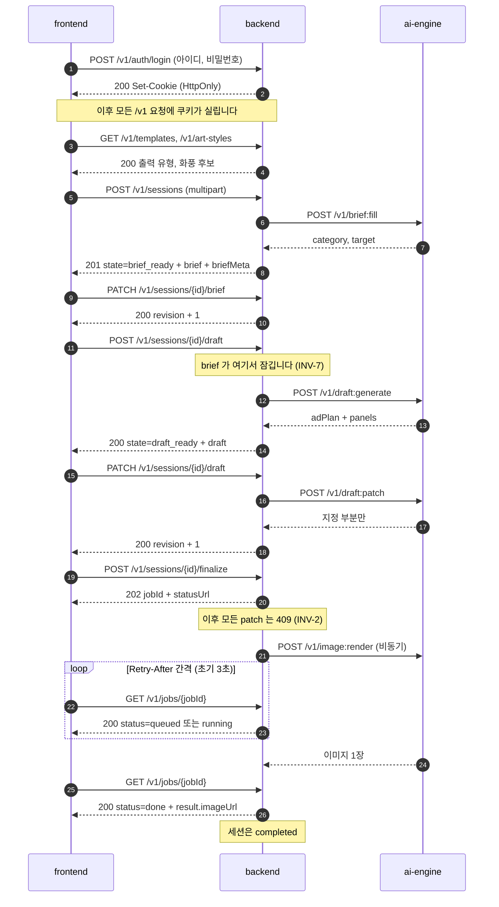

# API 계약

경로와 규약을 정하고 **왜 그 모양인지**를 남기는 문서입니다. 기계가 읽는 정본은
[packages/contracts/openapi.yaml](../../packages/contracts/openapi.yaml)이며, 이 문서는 그 스펙을
읽어도 알 수 없는 근거를 담습니다. 스펙과 이 문서가 어긋나면 스펙이 표현의 정본이고 이 문서가
의도의 정본입니다.

**스펙과 구현이 2026-08-19에 같아졌습니다.** 문서, `openapi.yaml`, 구현 셋이 같은 경로 집합을
가리킵니다 -- 경위는 7절.

스키마는 [도메인_모델.md](도메인_모델.md), 이름은 [용어_사전.md](용어_사전.md)를 따릅니다.

## 관통 경로 (한눈에)

성공만 하는 경우입니다. 아래 절들이 각 구간을 자세히 다루므로, 지금 어느 구간을 읽고 있는지
확인하는 지도로 쓰세요.



읽을 때 걸리기 쉬운 세 가지를 미리 적습니다.

- **동기와 비동기가 갈리는 지점은 `finalize` 하나입니다** (2절). 그 앞은 전부 응답을 기다리고,
  그 뒤만 잡과 폴링입니다.
- **잡의 `done`과 세션의 `completed`는 다른 층입니다** ([용어_사전.md](용어_사전.md) 1.4절).
  그림 마지막 두 줄이 같은 사건의 두 층입니다.
- **되돌릴 수 없는 문이 둘 있습니다.** 시안 생성 요청에서 브리프가 잠기고(INV-7), 확정에서
  시안이 잠깁니다(INV-2). 화면은 두 지점에서 그 사실을 알려야 합니다.
- **첫 줄의 로그인은 한 번만 나오지만 모든 요청에 걸립니다** (6절). 세션은 사용자에게 속하며,
  남의 `sessionId`로 조회하면 404입니다.

성공하지 않는 경우는 갈래가 셋입니다. 정보가 부족하면 오류가 아니라 세션 상태로 표현하고(4절),
요청 자체가 실패하면 `{code, message}`로(5절), 렌더가 실패하면 잡 조회 응답 안의 `error.code`로
(2.1절) 전달됩니다.

**실패는 오류 코드만 돌려주고 끝나지 않습니다. 세션이 어느 상태로 남는지까지 계약입니다.**
적어 두지 않으면 브리프는 잠겼는데 시안은 없는 세션이 빠져나갈 길 없이 남습니다.

| 실패 지점 | 응답 | 세션 상태 | 다시 할 수 있는가 |
|---|---|---|---|
| `POST /v1/sessions` 추론 불확실 (기획서 9.3) | **201** + `needsInput`. 오류가 아닙니다 | `brief_filling` | 예. `PATCH .../brief`로 자유 메모를 채우면 다시 추론합니다 |
| `PATCH .../brief` 재입력 후에도 불확실 | 422 `INSUFFICIENT_INPUT` | `failed` | 아니요. 새 세션입니다. **2026-08-22 확정, 구현됨** ([회의록](../회의록/2026-08-22_이월_6건_확정.md) 03절, B-11) - 아래 2.1절 |
| `PATCH .../brief` 재추론이 돌지 못함 | 200 + `messageMode: degraded` | `brief_filling` | 예. 사용자가 두 값을 직접 채우면 `brief_ready` (2026-08-20) |
| `brief:fill` 의존 장애 | 201 + `messageMode: degraded` | `brief_filling` | 예. 사용자가 `category`와 `target`을 직접 채우면 `brief_ready` (ADR-0005) |
| **`POST /v1/sessions/{id}/draft` (시안 생성)** | **503 `UPSTREAM_UNAVAILABLE` 등** | **`brief_ready` 로 되돌아감. 브리프 잠금도 함께 풀림** | **예. 브리프를 고쳐서 다시 요청 가능** ([ADR-0012](../adr/0012-시안_생성_실패_시_브리프_잠금_해제.md)) |
| `PATCH .../draft` (부분 교체) | 4xx / 5xx | `draft_ready` 유지 | 예. 기존 시안이 남아 있음 |
| 렌더 잡 | 잡의 `status: failed` + `error.code` | `failed` | **미정** (기획서 18.2 #13). ADR-0012는 다루지 않습니다 |

## 1. 경로 목록

### 1.1 공개 경로 (frontend -> backend)

| 메서드 | 경로 | 용도 | 성공 응답 |
|---|---|---|---|
| GET | `/health` | 헬스 체크 | 200 |
| POST | `/v1/auth/login` | 로그인 | 200 |
| POST | `/v1/auth/logout` | 로그아웃 | 204 |
| GET | `/v1/me` | 로그인한 사용자 확인 | 200 |
| GET | `/v1/templates` | 출력 유형 목록 + 예시 이미지 (기획서 12.3) | 200 |
| GET | `/v1/art-styles` | 화풍 후보 + 예시 이미지 (기획서 12.4) | 200 |
| GET | `/v1/sessions` | 내 세션 목록 | 200 |
| POST | `/v1/sessions` | 입력 접수 + 브리프 채우기 | 201 |
| GET | `/v1/sessions/{sessionId}` | 현재 상태 + 브리프 + 시안 | 200 |
| GET | `/v1/sessions/{sessionId}/image` | 업로드한 제품 사진 (이미지 바이트) | 200 |
| PATCH | `/v1/sessions/{sessionId}/brief` | 브리프 부분 교체 | 200 |
| POST | `/v1/sessions/{sessionId}/draft` | 시안 생성 | 200 |
| PATCH | `/v1/sessions/{sessionId}/draft` | 시안 부분 교체 | 200 |
| POST | `/v1/sessions/{sessionId}/finalize` | 확정 + 렌더 잡 접수 | 202 |
| GET | `/v1/jobs/{jobId}` | 렌더 진행 상태 조회 | 200 |
| GET | `/v1/jobs/{jobId}/image` | 렌더 결과 이미지 (이미지 바이트) | 200 |

**이미지 두 경로만 JSON 이 아닙니다.** 나머지가 전부 `application/json` 인데 이 둘은 파일
바이트를 돌려주며, 화면이 `` 로 직접 부릅니다. 오류 본문이 화면에 도달하지 않는다는
뜻이기도 해서 만료 처리가 다른 경로와 다릅니다 - 8.4절.

계약에는 있지만 **구현하지 않는** 경로가 셋 있습니다
([ADR-0008](../adr/0008-로그인_수단과_스켈레톤_범위.md)).

| 메서드 | 경로 | 용도 | 응답 |
|---|---|---|---|
| POST | `/v1/auth/signup` | 계정 생성 | 501 `NOT_IMPLEMENTED` |
| DELETE | `/v1/me` | 탈퇴 | 501 `NOT_IMPLEMENTED` |
| PATCH | `/v1/me/password` | 비밀번호 변경 | 501 `NOT_IMPLEMENTED` |

주의: **`GET /v1/me`는 구현합니다.** 같은 경로라도 메서드마다 다릅니다. 위 표는 `/v1/me`를
**지우거나 고치는** 메서드만 막은 것이고, 조회는 1.1절 표에 있습니다.

계약을 먼저 잡는 이유는 나중에 붙일 때 경로와 오류 코드가 달라지면 화면을 다시 고쳐야 하기
때문입니다. 501로 응답하는 이유는 **404로 두면 오타와 구분되지 않고**, 200으로 두면 되지 않은
일이 된 것처럼 보이기 때문입니다.

### 1.2 내부 경로 (backend -> ai-engine)

외부에 열지 않습니다. 인증이 없는 경로이며, 노출되면 비용이 그대로 새어 나갑니다.

| 메서드 | 경로 | 용도 |
|---|---|---|
| POST | `/v1/brief:fill` | 사진과 제품 정보에서 카테고리 / 타겟 추론 |
| POST | `/v1/draft:generate` | 브리프에서 시안 생성 |
| POST | `/v1/draft:patch` | 지정 부분 재생성 |
| POST | `/v1/image:render` | 최종 이미지 1장 생성 |

콜론 표기(`:fill`)는 리소스가 아니라 **동작**임을 드러내기 위한 것입니다. 내부 경로는 CRUD가 아니라
파이프라인 단계 호출이므로 REST 리소스로 위장시키지 않습니다.

## 2. 동기와 비동기의 경계

[AGENTS.md](../../AGENTS.md)의 "이미지 생성은 동기 HTTP로 처리하지 않습니다" 제약은 **수십 초가
걸리는 렌더**를 대상으로 합니다. 텍스트 단계까지 비동기로 만들면 폴링 경로가 세 개로 늘고, 그
복잡도는 22일짜리 일정에서 회수되지 않습니다.

| 단계 | 처리 | 예상 소요 | 근거 |
|---|---|---|---|
| 브리프 채우기 (`POST /v1/sessions`) | 동기 | 수 초 | 사진 1장 판독 |
| 시안 생성 / 부분 교체 | 동기 | 수 초 ~ 십수 초 | 텍스트 생성 |
| 최종 렌더 (`finalize`) | **비동기** | 수 분 | 기획서 12.6 |

- 동기 단계에도 **서버측 상한**을 둡니다. 초과하면 `GENERATION_TIMEOUT`으로 끊습니다.

| 상한 | 값 |
|---|---|
| `brief:fill` | 15초 |
| `draft:generate` / `draft:patch` | 60초 |

  상한은 **설정값**입니다. 코드에 상수로 박으면 실측할 때마다 배포가 필요합니다.

  **HTTPS는 앞단 프록시에서 종단합니다** (2026-08-19 확정, 소관 05.
  [ADR-0016](../adr/0016-HTTPS_종단_지점과_인증서_발급_경로.md), 아래 8.5절). 스택에는
  프록시가 **둘** 있습니다 -- 바깥의 Caddy(TLS 종단)와 그 뒤의 프론트엔드 nginx(`/v1`
  프록시와 SPA 폴백)입니다.

  **두 프록시의 상한은 모두 앱 상한보다 커야 합니다.** 프록시가 먼저 끊으면 클라이언트가
  `GENERATION_TIMEOUT` 대신 502를 받아 원인을 알 수 없습니다. 현재 값은 nginx 120초
  (`apps/frontend/nginx.conf`), Caddy는 상한을 적지 않았습니다 -- 응답 타임아웃 기본값이
  무제한이기 때문이며, **90초가 걸리는 응답이 끊기지 않고 200으로 통과하는 것을 확인했습니다**
  (2026-08-19 실측). 이 불변식은 프록시를 무엇으로 바꾸든 성립합니다.
- 예상 소요와 상한 값은 아직 **가설**입니다 (`추정`). 실측이 나오면 이 표를 먼저 고치세요.
- `brief:fill`이 상한에 걸리면 오류가 아니라 **열화**입니다. 자동 채움을 건너뛰고
  `messageMode: degraded`로 진행합니다 ([ADR-0005](../adr/0005-열화_폴백은_자동화_생략으로_한정.md)).
  나머지 두 단계는 폴백 없이 실패합니다.

### 2.1 렌더 잡

```
POST /v1/sessions/{id}/finalize   ->  202  { "jobId": "...", "statusUrl": "/v1/jobs/..." }
GET  /v1/jobs/{jobId}             ->  200  { "status": "running", "queuePosition": 1 }
                                  ->  200  { "status": "done", "result": { "imageUrl": "..." } }
                                  ->  200  { "status": "failed", "error": { "code": "..." } }
```

- 상태값 4종(`queued` / `running` / `done` / `failed`)의 정본은
  [용어_사전.md](용어_사전.md) 3.2절입니다. **세션 상태와 다른 층**이며, 세션 쪽 성공은 `done`이
  아니라 `completed`입니다 (같은 문서 1.4절).
- 실패도 **200**입니다. 잡 조회는 성공했고 잡이 실패한 것이므로, HTTP 오류로 만들면 클라이언트가
  "조회 실패"와 "렌더 실패"를 구분하지 못합니다.
- 폴링 간격은 서버가 `Retry-After` 헤더로 알려주고, 클라이언트는 그 값을 따릅니다. **초기값은
  3초**이며 설정값입니다. 클라이언트에 간격을 하드코딩하지 마세요 -- 서버가 늘려도 따라오지
  않으면 큐가 밀릴 때 조회 부하만 늡니다.
- 브라우저를 닫아도 `jobId`로 회수할 수 있습니다 (기획서 12.6 / [세션_보관_정책.md](세션_보관_정책.md) 4절).
- SSE와 WebSocket은 채택하지 않았습니다. 프록시 타임아웃 설정과 재연결 처리가 새로 들어오는데,
  얻는 것은 수 분짜리 작업에서 몇 초의 반응성뿐입니다.

### 2.2 동기 단계는 이벤트 루프를 막지 않아야 합니다

[ADR-0011](../adr/0011-배포_환경_스펙과_권한_경계.md)이 정한 대로 **워커 프로세스는 1개**입니다.
동기라는 말은 클라이언트가 응답을 기다린다는 뜻이지, 서버가 그동안 다른 일을 못 한다는 뜻이
아닙니다. 그런데 워커가 하나뿐이라 **이벤트 루프를 막는 코드가 하나라도 있으면 그 60초 동안
들어온 모든 요청이 함께 대기합니다.** 시안을 만드는 사람 한 명 때문에 나머지 전원이 멈춥니다.

| 대상 | 규칙 |
|---|---|
| 외부 모델 API 호출 | **비동기 클라이언트로 `await`.** 동기 HTTP 라이브러리를 `async def` 안에서 부르지 않습니다 |
| CPU를 쓰는 작업 (이미지 디코딩, 리사이즈, 해시) | **스레드풀로** 넘깁니다 |
| SQLite 접근 | 블로킹 I/O입니다. 스레드풀로 넘기거나 비동기 드라이버를 씁니다 |
| 블로킹만 하는 함수 | `async def` 대신 일반 `def`로 선언하면 프레임워크가 스레드풀에서 실행합니다 |

**워커를 늘리는 것은 해법이 아닙니다.** SQLite 쓰기 잠금 때문에
[ADR-0010](../adr/0010-상태_저장소와_파일_보관_위치.md)을 먼저 열어야 합니다.

이 규칙이 지켜지는지는 **동시 요청 2건으로 확인합니다.** 한쪽이 시안을 생성하는 동안 다른 쪽의
`GET /v1/sessions/{id}`가 즉시 응답하면 정상입니다. 함께 지연되면 어딘가 블로킹 호출이
남아 있는 것입니다.

## 3. 부분 교체 (patch) 규약

기획서 3절의 "지정한 부분만 교체하고 나머지는 서버가 원문 그대로 유지"를 그대로 옮긴 것입니다.
**클라이언트가 전체 문서를 되돌려 보내지 않습니다** -- 그러면 서버가 원문을 유지하는 것이 아니라
클라이언트가 유지하는 것이 되고, 화면의 버그가 시안 원문을 조용히 덮어씁니다.

```http
PATCH /v1/sessions/0d2f.../draft
Content-Type: application/json

{
  "revision": 3,
  "patch": { "panels": { "4": { "dialogue": "이거면 아침이 편해져요" } } }
}
```

| 규칙 | 내용 |
|---|---|
| 보내는 것 | 바꾸려는 필드만. 나머지 키는 생략 |
| 배열 | 인덱스를 키로 하는 객체로 지정합니다 (`panels`는 6개 고정이므로 순서가 바뀌지 않습니다) |
| 값 비우기 | **빈 문자열 `""`**. 키 생략은 "안 바꿈"이므로 비우기에 쓸 수 없습니다 |
| `null` | **계약 전체에서 금지**합니다. 요청에 나타나면 422 `INVALID_REQUEST` |
| 동시성 | `revision` 불일치 시 409. 클라이언트는 다시 읽고 재시도합니다 |
| 대상 제한 | `visibility: hidden` 필드, `role`, `adPlan`은 교체 대상이 아닙니다 (도메인_모델 7절 INV-4, INV-5, INV-8) |
| 상태 제한 | 브리프는 `draft_generating` 진입 이후 409 (INV-7). 시안은 `finalized` 이후 409 (INV-2) |

브리프와 시안의 잠기는 시점이 다릅니다. 브리프는 **시안 생성을 요청하는 순간** 잠깁니다 -- 시안이
브리프에서 나온 산출물이라, 근거가 나중에 바뀌면 시안이 무엇에 근거했는지 알 수 없게 됩니다.
**시안이 만들어진 뒤에는** 브리프를 고치는 경로가 없습니다. 새 세션을 만듭니다 (기획서 5.1).
그래서 `brief_ready` 화면이 **되돌릴 수 없는 마지막 확인 지점**이며, 화면이 그 사실을 알려
주어야 합니다.

**단, 시안 생성이 실패하면 잠금이 풀립니다.** 세션은 `brief_ready`로 되돌아가고 브리프는 다시
고칠 수 있습니다. 시안이 없으면 지켜야 할 근거 대응 자체가 없기 때문입니다. 근거와 대안:
[ADR-0012](../adr/0012-시안_생성_실패_시_브리프_잠금_해제.md).

`null`을 아예 쓰지 않는 것은 RFC 7396(JSON Merge Patch)과 다른 점입니다. 이 도메인에는 "필드를
지운다"는 동작이 없고, 그 의미를 열어 두면 자유 메모를 비우려던 요청이 필드 자체를 없애는 사고가
납니다.

**키의 부재는 이미 여러 뜻으로 쓰이고 있습니다.** patch 요청에서는 "안 바꿈"이고, 응답에서는
"이 유형에 해당 없음"(만화형에 `aspectRatio`가 없는 경우)이거나 **"아직 없음"**(확정 전의 `jobId`,
렌더 전의 `result`)입니다. 여기에 "비어 있음"까지 얹으면 네 뜻이 한 표현을 나눠 쓰게 되므로,
비어 있음만 **값으로** 분리했습니다.

응답에서 "해당 없음"과 "아직 없음"을 구분하지 않는 이유는 **클라이언트의 처리가 같기 때문**입니다.
둘 다 "지금 이 값은 쓸 수 없다"이고, 왜 없는지는 `state`가 이미 말해 줍니다. 구분하려고 `null`을
되살리면 클라이언트가 `null`과 `""`를 모두 빈 값으로 처리하는 코드를 짜게 되어 규칙이 반쪽이
됩니다.

| 표현 | patch 요청에서 | 응답에서 |
|---|---|---|
| 키 있음, 값 `"내용"` | 그 값으로 바꿈 | 값이 있음 |
| 키 있음, 값 `""` | 비움 | 비어 있음 |
| 키 없음 | 안 바꿈 | 이 유형에 해당 없음, 또는 **아직 없음** |
| `null` | 422 | 나타나지 않음 |

배열을 인덱스 키 객체로 다루는 것은 컷 순서가 고정이기 때문에 성립합니다. 순서가 바뀔 수 있는
컬렉션이 생기면 이 규약을 그대로 쓰지 마세요.

## 4. 정보가 부족할 때 (기획서 9.3)

카테고리 추론이 불확실하면 그대로 진행하지 않고 자유 메모를 요구합니다. 이것은 오류가 아니라
**대화의 한 단계**이므로, 실패 응답이 아니라 세션 상태로 표현합니다.

**여기는 추론이 돌았는데 판단이 서지 않은 경우입니다.** 추론 자체가 돌지 못한 의존 장애는
`messageMode: degraded`로 표현하며 `needsInput`을 쓰지 않습니다 (4.1절). 상태는 둘 다
`brief_filling`이라, 화면이 두 경우를 구분하는 근거는 `needsInput` 키의 유무입니다.

```
POST /v1/sessions  ->  201  { "state": "brief_filling", "needsInput": { "field": "note", "reason": "..." } }
```

- 사용자가 `PATCH /v1/sessions/{id}/brief`로 `note`를 채우면 서버가 추론을 다시 시도합니다.
  **2026-08-20 에 구현됐습니다** (아래 2.1절).
- 재입력 후에도 판단이 서지 않으면 `INSUFFICIENT_INPUT` 으로 끊고 세션을 닫습니다.
  **재시도는 1회이며, 2026-08-22 회의가 확정하고 같은 날 구현했습니다**
  ([회의록](../회의록/2026-08-22_이월_6건_확정.md) 03절, 미결정_대장 B-11).
  주의: **엔진이 죽어 응답 자체가 없는 경우는 이 횟수에 넣지 않습니다** - 그때는 실패 표의
  "재추론이 돌지 못함" 행(200 + `messageMode: degraded`)으로 빠지고 다음 patch 에서 다시
  시도할 수 있습니다.

**두 시점의 응답이 다릅니다.** 첫 요청은 오류가 아니라 201이고, 422가 나오는 것은 재입력 후에도
실패한 두 번째 시점뿐입니다.

| 시점 | 요청 | 응답 | 세션 상태 |
|---|---|---|---|
| 처음 | `POST /v1/sessions` | **201** + `needsInput` | `brief_filling` |
| 재입력 후 | `PATCH .../brief` | **422** `INSUFFICIENT_INPUT` | `failed` |

`failed`는 [용어_사전.md](용어_사전.md) 3.1절 상태도의 `brief_filling -> failed` 간선입니다.
**되돌아오는 간선이 없으므로 그 세션은 끝나고 새 세션을 만들어야 합니다.** 기획서 18.2 #11 이
이 표와 같은 값으로 확정되었으므로 표와 상태도는 고칠 것이 없었습니다.

**주의: 세는 것은 "판단 불능" 뿐입니다.** 재추론이 **돌지 못한** 경우(엔진 장애, 사진 만료)는
이 횟수에 들어가지 않습니다. 그때는 위 표의 세 번째 행대로 `degraded` 로 남고 다음 patch 에서
다시 시도할 수 있습니다. 장애 한 번이 사용자의 재입력 기회를 영영 없애지 않도록 한 것이며,
그 이유는 PR #148 리뷰가 같은 모양의 결함을 재현한 데 있습니다.

**주의: 세션이 닫히는 것은 브리프가 여전히 비어 있을 때뿐입니다.** 재추론을 유발한 그 patch 에서
사용자가 `category` 와 `target` 을 직접 채웠다면 브리프는 채워진 것이므로 `brief_ready` 로
가고 세션은 닫히지 않습니다. 회의가 정의한 닫는 조건이 "브리프를 채우지 못한 경우" 입니다.

**422 를 돌려주기 전에 세션을 먼저 저장합니다.** 오류 응답에는 세션이 실리지 않으므로, 저장하지
않으면 클라이언트는 "닫혔다" 는 답을 받고 다음 `GET` 에서 `brief_filling` 을 보게 됩니다.
그 patch 에 담긴 사용자의 입력도 함께 남습니다.

### 2.1 재추론은 언제 도는가 (2026-08-20 구현)

`PATCH .../brief` 가 엔진을 다시 부르는 조건은 **셋 다** 참일 때입니다.

| 조건 | 왜 |
|---|---|
| `category` 와 `target` 중 하나 이상이 비어 있음 | 둘 다 차 있으면 재추론이 채울 자리가 없습니다(아래 "비워 둔 자리뿐"). 답을 사서 버리는 셈입니다 |
| 세션에 `needsInput` 이 있거나 `messageMode` 가 `degraded` | 계약이 재시도를 약속한 것은 `needsInput` 이고, `degraded` 는 같은 사람이 장애를 한 번 겪은 상태입니다. 사용자가 손으로 값을 지운 세션은 둘 다 아니며, 거기서 재추론하면 의도한 편집을 되돌립니다 |
| patch 가 `productName`, `sellingPoint`, `note` 중 **값을 실제로 바꿈** | 이 셋이 `brief:fill` 이 읽는 전부입니다. 키가 실렸는지가 아니라 값이 달라졌는지를 봅니다 - 같은 메모를 다시 저장하면 같은 질문을 다시 사는 것입니다 (PR #148 리뷰, 신호정) |

**주의: `degraded` 를 조건에 넣는 것과 아래 표의 마지막 행은 한 쌍입니다.** 돌지 못한 재추론이
`needsInput` 을 지우므로, `needsInput` 만 보는 규칙은 **장애 한 번이 그 세션의 재추론 자격을
영구히 없애는** 결과가 됩니다. 엔진이 1초 뒤 살아나도 그 사용자는 자동 채움을 다시 받지
못하고, 화면에는 아무 표시도 없습니다 (PR #148 리뷰에서 신호정 재현).

결과는 넷으로 갈립니다.

| 재추론 결과 | `needsInput` | `messageMode` | 상태 |
|---|---|---|---|
| 안 돌림 (위 조건 불충족) | 그대로 | 그대로 | 값이 다 차면 `brief_ready` |
| 채워서 돌아옴 | 지웁니다 | `normal` | `brief_ready` |
| 여전히 판단 못 함 | **지웁니다** | `normal` | **`failed`** + 422 (B-11) |
| 돌지 못함(엔진 장애나 사진 만료) | 지웁니다 | `degraded` | `brief_filling` |

**사진은 디스크에서 되읽습니다.** 브리프 patch 는 사진을 싣지 않는데(업로드는 세션 생성 때
한 번, 8.1절) `brief:fill` 은 글과 사진을 함께 읽습니다. 사진이 이미 만료돼 없으면
(24시간, [세션_보관_정책.md](세션_보관_정책.md) 2절) 글만 보내지 않고 **돌지 못한 것으로
처리**합니다 - 다른 질문을 던져 놓고 그 답을 모델의 판단으로 기록하게 되기 때문입니다.

파일을 찾는 것과 여는 것은 **다른 호출**이고, 정리 배치가 backend 와 같은 프로세스의 타이머로
도므로 그 사이에 사라질 수 있습니다. 그 경우도 같은 자리에서 "돌지 못함" 으로 처리합니다 -
언제 알아차렸는지는 사용자에게 아무 의미가 없고, 500 을 돌려주면 출구로 데려가던 바로 그
요청이 실패합니다 (PR #148 리뷰, 신호정).

**채워 넣는 것은 사용자가 비워 둔 자리뿐입니다.** 재추론을 유발한 바로 그 patch 에서 사용자가
`category` 를 직접 적었다면 그 값이 이깁니다 (기획서 5.4).

**주의: 세 번째 행이 세션을 닫습니다** (2026-08-22 확정, B-11). 재시도는 1회이고 그 1회가
판단 불능으로 끝나면 거기서 끝입니다. `needsInput` 을 지우는 이유는 그 `reason` 이 "다음에
무엇을 쓰라" 는 안내인데 다음이 없기 때문입니다 - 화면은 대신 "세션이 닫혔습니다" 를 띄웁니다
(06 소관).

**네 번째 행과 헷갈리지 마세요.** 돌지 못한 재추론은 세지 않습니다. 둘의 차이는 "모델이
답했는가" 이고, 답하지 않은 것을 세면 장애 한 번이 사용자의 재입력 기회를 없앱니다.

**`needsInput`은 응답 전용이 아니라 세션에 저장합니다**
([도메인_모델.md](도메인_모델.md) 2.2절). 응답할 때마다 다시 계산하면 `reason` 문구가 조회할
때마다 달라지고, 그때마다 모델을 다시 부르게 됩니다. 저장하는 쪽이면 사용자가 세션 목록에서
돌아왔을 때 **무엇이 부족했는지가 그대로 복원**됩니다. 1차 기능이 "세션 목록에서 되찾기"이므로
복원되지 않으면 사용자는 처음부터 다시 봅니다.

| 필드 | 값 |
|---|---|
| `needsInput.field` | 채워 달라고 요구하는 브리프 필드 이름 |
| `needsInput.reason` | 사람에게 보여 줄 문장 |
| 채워진 뒤 | 키를 지웁니다. 3절의 "키 없음 = 아직 없음"과 같은 규약입니다 |

### 4.1 열화 표기 (`messageMode`)

`brief:fill`이 죽으면 자동 채움을 건너뛰고 사용자 입력만으로 진행하며, 그 사실을 드러냅니다
([ADR-0005](../adr/0005-열화_폴백은_자동화_생략으로_한정.md)). 열화는 **이 한 경로뿐**이고
시안 생성과 부분 교체와 렌더에는 폴백이 없습니다.

```
POST /v1/sessions      ->  201  { "state": "brief_filling", "messageMode": "degraded", ... }
     PATCH .../brief   ->  200  { "state": "brief_ready",   "messageMode": "degraded", ... }
GET  /v1/sessions/{id} ->  200  { "state": "brief_ready",   "messageMode": "degraded", ... }
```

**세션은 `brief_filling`에 머뭅니다.** 추론이 돌지 않았으므로 `category`와 `target`이 빈 채로
남고, 사용자가 직접 골라 채워야 `brief_ready`로 넘어갑니다. 곧바로 `brief_ready`로 보내면 두
필드가 비어 있는 채로 시안 생성이 가능해집니다.

**이 경로에서는 `needsInput`을 쓰지 않습니다.** `needsInput`은 추론이 돌았는데 판단이 서지
않은 경우(4절)를 위한 것이고 필드 하나를 담는 단수 객체입니다. 의존 장애로 못 채운 필드는 둘이라
담기지 않으며, 원인이 다른 두 상황을 같은 필드로 표현하면 화면이 둘을 구분해 안내할 수 없습니다.
열화 사실은 `messageMode` 하나로 드러냅니다.

| 항목 | 내용 |
|---|---|
| 값 | `normal` / `degraded` 둘뿐입니다 ([용어_사전.md](용어_사전.md) 3절) |
| 기본값 | `normal`. 생략하지 않고 **항상 실립니다** |
| 실리는 곳 | 세션을 담은 모든 응답 |
| 되돌아가는가 | 아니요. **한 번 `degraded`가 되면 그 세션은 끝까지 `degraded`입니다** |

`messageMode`도 **세션 필드**입니다 ([도메인_모델.md](도메인_모델.md) 2.2절). 응답 메타가 아니라
"이 세션은 자동 채움 없이 만들어졌다"는 사실이고, 나중에 조회할 때도 알아야 하기 때문입니다.
가드레일 on/off 델타와 함께 **보고 지표로 쓰이므로** 값이 남지 않으면 측정이 무효가 됩니다.

## 5. 오류

### 5.1 형식

FastAPI 기본 `{detail}`이 아니라 `{code, message}`입니다. 클라이언트는 `code`로 분기하고 `message`는
사람에게 보여 줍니다. 이 형식은 스켈레톤에서 그대로 이어받습니다.

```json
{ "code": "INSUFFICIENT_INPUT", "message": "제품 정보가 부족합니다." }
```

### 5.2 코드 표

전부 **15종**입니다. 스켈레톤에서 이어받은 것, 기획서 12.5의 실패 상황 5종, 로그인 도입으로
늘어난 것이 섞여 있습니다. **코드는 화면 분기가 달라질 때만 추가합니다** -- 분기가 같은 코드를
늘리면 클라이언트가 전부 `default`로 떨어뜨립니다.

**`1차` 열은 이번 범위에서 실제로 발생할 수 있는지**를 표시합니다. `--`인 코드는 계약에만 두고
지금은 구현하지 않습니다. 그래도 계약에 적어 두는 이유는, 나중에 붙일 때 코드가 달라지면 화면을
다시 고쳐야 하기 때문입니다 (1.1절과 같은 이유).

| 코드 | HTTP | 1차 | 기획서 12.5 | 사용자 재시도 |
|---|---|---|---|---|
| `INVALID_REQUEST` | 422 | O | -- | 입력 고치면 가능 |
| `NOT_FOUND` | 404 | O | -- | 불가 (남의 세션도 여기로 떨어집니다. 6절) |
| `UNAUTHORIZED` | 401 | O | -- | 로그인 후 가능 |
| `INVALID_CREDENTIALS` | 401 | O | -- | 다시 입력하면 가능 |
| `DUPLICATE_ACCOUNT` | 409 | **--** (회원가입이 501이라 발생 지점이 없음) | -- | 다른 아이디로 가능 |
| `NOT_IMPLEMENTED` | 501 | O | -- | 불가 (1차 범위 밖) |
| `RATE_LIMITED` | 429 | **--** (사용량 제한이 1차 범위 밖) | -- | 시간 후 가능 |
| `UPSTREAM_UNAVAILABLE` | 503 | O | 호출 실패 | 가능 |
| `INTERNAL` | 500 | O | -- | 가능 |
| `INSUFFICIENT_INPUT` | 422 | O | 입력 정보 부족 | 불가. 세션이 `failed`이므로 새 세션 (2절) |
| `INVALID_IMAGE` | 422 | O | 규격 오류 | 다른 이미지로 가능 |
| `CONTENT_POLICY_REJECTED` | 200 (잡) / 422 | O | 콘텐츠 정책 거절 | 입력 수정 후 가능 |
| `GENERATION_TIMEOUT` | 200 (잡) / 504 | O | 생성 시간 초과 | 가능 |
| `REVISION_CONFLICT` | 409 | O | -- | 다시 읽고 가능 |
| `STATE_CONFLICT` | 409 | O | -- | 불가 (확정 이후 수정 시도 등) |

- 렌더 단계의 실패는 잡 조회 응답 안의 `error.code`로 전달됩니다 (2.1절). 같은 코드가 HTTP 상태와
  잡 결과 양쪽에 쓰이는 이유는, 화면이 어느 경로로 왔든 같은 분기를 타야 하기 때문입니다.
- `CONTENT_POLICY_REJECTED`는 **재생성 1회 후에도 가드레일을 통과하지 못한 경우**에만 나갑니다.
  첫 위반은 서버가 조용히 재생성하므로 클라이언트에 보이지 않습니다
  ([ADR-0005](../adr/0005-열화_폴백은_자동화_생략으로_한정.md),
  [생성_파이프라인.md](생성_파이프라인.md) 5절).
- **폴백으로 만든 응답은 이 표에 없습니다.** 열화는 `brief:fill` 한 곳뿐이고 오류가 아니라
  `messageMode: degraded`로 표현됩니다 (2절).
- 화면 표시는 우측 상단 고정 영역입니다 (기획서 12.5). 팝업은 반려되었습니다.
- 사용자용 문구는 배포 단계 소관입니다 (기획서 17.2). 지금 내려보내는 `message`는 **개발용**이며,
  원인 파악이 목적입니다.

## 6. 인증

**아이디와 비밀번호**입니다. 근거와 비밀번호 취급 규칙은
[세션_보관_정책.md](세션_보관_정책.md) 1절이 정본이며, 여기서는 계약 표면만 다룹니다.

| 항목 | 규약 |
|---|---|
| 자격 증명 전달 | `POST /v1/auth/login`에 아이디와 비밀번호. 다른 경로는 자격 증명을 받지 않습니다 |
| 세션 유지 | 서버가 발급한 토큰. `HttpOnly` 쿠키로 내려보냅니다 |
| 토큰 수명 | **24시간 고정.** 갱신 경로를 두지 않습니다 |
| 만료 후 | 401 `UNAUTHORIZED`. 클라이언트는 로그인 화면으로 보냅니다 |
| 보호 범위 | `/health`, `/v1/auth/*`를 뺀 **모든 `/v1` 경로** |
| 미인증 요청 | 401 `UNAUTHORIZED` |
| 남의 세션 요청 | 404 `NOT_FOUND` |

- **토큰을 `localStorage`에 두지 않습니다.** XSS 한 번에 그대로 새어 나갑니다. `HttpOnly`
  쿠키는 스크립트가 읽지 못합니다.
- **남의 세션에 403이 아니라 404를 씁니다.** 403은 "있지만 당신 것이 아니다"를 알려 주므로,
  `sessionId`를 훑으며 존재 여부를 캐낼 수 있습니다. 404는 아무것도 말하지 않습니다.
- 내부 경로(1.2절)는 이 인증을 쓰지 않습니다. 외부에 열지 않는 것이 그쪽의 방어선입니다.
- 로그인 실패에서 아이디 오류와 비밀번호 오류를 구분하지 않습니다. 코드는 둘 다
  `INVALID_CREDENTIALS`입니다.

**24시간 만료에 갱신 없음**을 택했습니다. 짧게 두고 갱신을 붙이면 refresh 토큰, 회전, 재사용
탐지, 폐기 목록이 따라오는데 이번 범위에서 그 비용은 회수되지 않습니다. 길게 두면 public 저장소
+ 데모 계정 조합에서 탈취 창이 그만큼 길어집니다.

작업 도중 만료돼도 잃는 것은 없습니다. 세션 산출물은 7일 보존이므로
([세션_보관_정책.md](세션_보관_정책.md) 2절) 다시 로그인해 `sessionId`와 `jobId`로 돌아옵니다.
`Max-Age`는 **설정값**으로 두되 기본값 24시간으로 시작합니다.

- 슬라이딩 만료(요청마다 연장)도 두지 않습니다. 매 요청이 쿠키를 다시 쓰게 되고, 만료 시각이
  로그만 봐서는 재구성되지 않습니다.
- 외부 공개 시 다시 봅니다 (기획서 17.2). 그때는 OAuth 전환과 함께 열립니다.

## 7. 계약과 구현의 드리프트 (2026-08-19 해소)

한때 스켈레톤은 이 계약이 아니라 템플릿의 질의응답 경로(`/v1/ask`, `/v1/generate`)를 구현하고
있었습니다. 계약이 구현보다 먼저라는 규약([AGENTS.md](../../AGENTS.md))에 따라 계약을 먼저
바꾸었으므로, 교체 시점부터 구현이 따라붙기 전까지 둘이 어긋난 기간이 존재했습니다.

**지금은 구간 3입니다.** 지우지 않고 남기는 이유는 같은 상황이 다시 오기 때문입니다 -- 계약을
먼저 고치는 규약을 지키는 한 드리프트 구간은 매번 생깁니다.

| 구간 | 문서 | `openapi.yaml` | 구현 | 정본 |
|---|---|---|---|---|
| 1 | 이 계약 | 템플릿 질의응답 | 템플릿 질의응답 | 이 문서 |
| 2 | 이 계약 | 이 계약 | 템플릿 질의응답 | 스펙(표현) + 이 문서(의도) |
| 3 (**현재**, 2026-08-19) | 이 계약 | 이 계약 | 이 계약 | 같음 |

**구간 3에서는 셋이 같은 말을 합니다.** backend 가 서빙하는 `/v1` 경로는 전부 이 계약에 있고,
`test_nothing_is_served_that_the_contract_does_not_describe` 가 그것을 강제합니다. 그 테스트에는
예외 목록이 없습니다 -- `/v1/ask` 를 위해 하나 있었고 경로와 함께 지웠습니다. **다시 만들지
마세요.** 예외 하나가 곧 계약에 없는 경로가 CI 를 통과하는 방법입니다.

- 구간 2 에서 CI 가 드리프트를 잡아주지 못했다는 점은 기록해 둘 만합니다. `contracts-check` 는
  스펙 문법만 보고, 각 앱의 계약 준수 테스트는 코드만 봅니다. **둘 다 초록인데 서버가 계약
  경로에 404 를 돌려주는 상태**였고, 이것이 다음 드리프트 구간에도 그대로 적용됩니다.
- 교체 순서는 계약 -> 스키마 -> 구현 -> 테스트입니다. 구현이 먼저 올라온 PR 은 리뷰 대상이 아닙니다.

### 7.1 인증 예외는 남아 있지 않습니다

6절의 보호 범위는 "`/health` 와 `/v1/auth/*` 를 뺀 모든 `/v1` 경로" 이고, **backend 에는 그
예외가 하나도 없습니다.**

2026-08-13 부터 `/v1/ask` 하나가 인증 없이 열려 있었습니다. 계약에 없는 경로에 계약의 보호
규칙을 적용하는 것은 범위를 넓히는 것이라는 판단이었고(임동규), 곧 지울 코드에 쿠키 준비
코드를 늘리지 않겠다는 이유도 있었습니다. **그 경로는 2026-08-19 에 삭제되었습니다.**

**예외를 새 경로로 물려주지 마세요.** 그때 함께 정한 것이 "인증 의존성(`api.deps.current_user`)은
지금 만들어 두고 계약에 있는 경로에만 건다" 였고, 계약 경로가 전부 들어온 지금 그 의존성이
모든 `/v1` 경로에 걸려 있습니다.

## 8. 확정되지 않은 것

| 항목 | 상태 |
|---|---|
| 재입력 후에도 카테고리 추론이 실패할 때의 처리 | 미정 (기획서 18.2 #11, 소관 임동규). `INSUFFICIENT_INPUT` 잠정. **재추론 자체는 2026-08-20 구현**, 포기 시점만 열려 있습니다 (2.1절) |
| 사용자에게 보여 줄 오류 문구 | 배포 단계 소관 (기획서 17.2). 지금 `message`는 개발용입니다 |
| **사용자가 내려받는 파일의 형식** | 미정. 내부 `image:render`의 무손실 WebP 와 **다른 결정**입니다. 게시 대상이 인스타그램이라 호환성이 여기서 걸립니다 (8.2절) |
| 브리프의 사진 교체 지원 여부 | 미정. 도메인_모델 3절은 `productImage`를 `editable`로 두었지만 재업로드 경로가 없습니다. 열면 `PATCH .../brief`가 multipart 를 함께 받아야 합니다 |

아래 항목은 **확정되었습니다.** 값을 바꾸려면 이 문서와 근거 문서를 함께 고치세요.

| 항목 | 결정 | 근거 |
|---|---|---|
| 동기 단계 타임아웃 상한 | 15초 (`brief:fill`) / 60초 (`draft:*`), 설정값 | 2절 |
| 폴링 간격 초기값 | 3초 + `Retry-After` (설정값) | 2.1절 |
| `revision` 위치 | **본문 필드.** `If-Match` 헤더는 미채택 | 아래 |
| 이미지 업로드 방식 | `POST /v1/sessions`의 multipart 단일 요청. 별도 경로로 분리하지 않습니다 | 8.1절 |
| 선택 필드를 비웠을 때의 표현 | 빈 문자열 `""`. `null` 금지 | 3절 |
| 토큰 수명 | 24시간, 갱신 없음 | 6절 |
| 동시 확정 요청의 대기 정책 | 직렬 1건 + `queuePosition` | [세션_보관_정책.md](세션_보관_정책.md) 6절 |
| 로그인 쿠키 이름 | `session_token` | [openapi.yaml](../../packages/contracts/openapi.yaml)의 `securitySchemes` (PR #65 리뷰) |
| 내부 `image:render`의 출력 형식 | **무손실 WebP.** 사용자에게 내려보내는 파일의 형식과는 별개입니다 | [openapi.yaml](../../packages/contracts/openapi.yaml) (PR #65 리뷰). 근거는 아래 |
| **이미지 조회 경로** | `GET /v1/sessions/{sessionId}/image` + `GET /v1/jobs/{jobId}/image`. 값은 **앱 상대 경로**이고 만료 후에는 404 | 8.4절 (미결정 대장 N17) |
| **HTTPS 종단 지점과 게이트웨이 상한** | 앞단 프록시(Caddy)에서 종단. 두 프록시의 상한 모두 앱 상한보다 큼 | 8.5절, [ADR-0016](../adr/0016-HTTPS_종단_지점과_인증서_발급_경로.md) |

`If-Match`를 택하지 않은 이유는 **본문 하나로 끝나기 때문**입니다. 헤더 방식이 HTTP 규범에는
맞지만, `ETag`를 함께 내려보내고 클라이언트가 그것을 보관했다가 헤더에 싣는 왕복이 늘어납니다.
이 계약에서 낙관적 잠금이 필요한 경로는 `PATCH` 둘뿐이고, `revision`은 이미 응답 본문에 있습니다.
경로가 늘거나 캐시 검증이 필요해지면 그때 헤더로 옮깁니다.

### 8.1 이미지 업로드를 분리하지 않는 이유

`POST /v1/sessions` 한 번에 사진과 제품 정보를 함께 받습니다. 분리안(먼저 업로드해 `imageId`를
받고, 세션 생성에 그 아이디를 싣는 방식)은 왕복이 둘로 늘고, **어느 세션에도 속하지 않은 이미지**
라는 상태가 새로 생깁니다. 그 이미지의 보존 기간과 소유자를 따로 정해야 하는데
([세션_보관_정책.md](세션_보관_정책.md) 2절), 지금은 사진이 1장뿐이라 그 비용을 치를 이유가
없습니다.

뒤집힐 조건: 사진이 여러 장이 되거나, 업로드 진행률 표시가 요구되는 경우입니다.

### 8.2 이미지 형식은 두 번 정해야 합니다

한 번으로 끝나는 결정처럼 보이지만 **홉이 둘**이고 각 홉의 판단 기준이 다릅니다. 한쪽 결정을
다른 쪽에 그대로 옮기면 둘 다 틀립니다.

| 홉 | 구간 | 정해진 것 | 무엇이 기준인가 |
|---|---|---|---|
| 내부 | ai-engine -> backend | **무손실 WebP** | 충실도. 양쪽 다 우리가 만들고 우리가 읽습니다 |
| 외부 | backend -> 사용자 | **미정** | 호환성. 우리가 통제하지 못하는 앱이 이 파일을 엽니다 |

내부 홉을 무손실로 둔 이유는 **검증 지표가 글자이기 때문**입니다. 만화형 이미지에는 한국어
대사가 그려져 들어가고, 검증 1순위의 합격선은 20회 중 5칸 이상 오탈자 없는 비율 80%입니다
(기획서 15절). 손실 압축을 거친 이미지를 채점하면 모델의 렌더링 정확도가 아니라 압축
아티팩트를 재게 됩니다. 무손실 WebP 는 같은 무손실인 PNG 보다 대체로 작으므로, 바이트를
프로세스 경계로 넘기는 이 구조에서 PNG 를 고를 이유가 없습니다.

외부 홉이 미정인 이유는 **게시 경로가 우리 것이 아니기 때문**입니다. 기획서가 정한 산출 목표는
"사용자가 인스타그램에 올릴 수 있는 이미지 한 장"이고, 게시는 사용자가 Grid Post 같은 외부
도구로 직접 합니다 (기획서 4절, 6절). 즉 이 파일은 우리가 검증할 수 없는 앱 두 개를 거칩니다.

- 인스타그램은 WebP 를 받지만, 모바일 앱의 주 경로는 여전히 JPEG 와 HEIC 이고 WebP 는 업로드
  시점에 변환됩니다 (`추정`. 2026-08 기준 공개 자료).
- 분할 게시 도구(Grid Post 등)의 WebP 지원은 확인된 바 없습니다 (`불확실`).
- iOS 는 WebP 를 볼 수는 있으나 사진 앱에 담기는 경로가 형식마다 달라, 내려받은 파일이 갤러리에
  들어가지 않으면 사용자는 업로드 자체를 못 합니다 (`불확실`).

**이것은 문서로 정할 것이 아니라 실측할 것입니다.** 파일 하나를 만들어 실제로 올려 보면
10분이면 갈립니다. 검증 항목으로 올리고, 결과가 나오기 전까지 다운로드 형식을 계약에 적지
않습니다. 지금 기울어 있는 쪽은 **JPEG**입니다 -- 잃는 것은 화질 일부이고 얻는 것은 "안 열린다"는
실패가 없는 것인데, 이 서비스의 사용자는 실패했을 때 원인을 진단할 수 없는 사람들입니다.

### 8.3 HTTPS 는 "둘지"가 아니라 "어떻게 둘지"만 남았습니다 (2026-08-13, 임동규)

8절 표의 "HTTPS 종단 방식"은 **방식**이 미정이라는 뜻입니다. HTTPS 자체는 2절이 이미 필요하다고
적었고, S0 구현이 그것을 실제 제약으로 만들었습니다.

세션 쿠키는 계약(6절)대로 `Secure` 속성을 답니다. 브라우저는 `Secure` 쿠키를 평문 HTTP 응답에서
저장하지도, 평문 HTTP 요청에 싣지도 않습니다. 따라서

- **HTTPS 없이 `http://<VM 주소>:8000` 으로 배포하면 로그인이 성립하지 않습니다.** 서버는 200 과
  `Set-Cookie` 를 보내지만 브라우저가 쿠키를 버리고, 다음 요청은 401 이 됩니다.
- `http://localhost` 는 영향받지 않습니다. 브라우저가 신뢰할 수 있는 출처로 취급하므로 로컬
  개발과 테스트는 지금 그대로 동작합니다.

`Secure` 를 끄는 설정값을 두지 않았습니다. 로그인은 비밀번호를 보내므로([ADR-0008](../adr/0008-로그인_수단과_스켈레톤_범위.md))
평문 구간이 있으면 자격 증명이 그대로 노출되고, 끄는 스위치는 "잠깐만" 꺼둔 채로 배포됩니다.
**순서는 HTTPS 먼저, 배포 나중입니다.**

따라서 8절의 이 항목은 배포 일정에 걸린 선행 조건입니다. 방식을 정할 때 함께 볼 것:

- 프론트엔드를 백엔드와 **다른 출처**에 올리게 되면 `SameSite=Lax` 로는 쿠키가 실리지 않아
  `SameSite=None; Secure` 로 바꿔야 하고, CORS 설정도 함께 들어옵니다. 그 경우 HTTPS 는 선택이
  아니라 전제입니다.
- 프록시를 두면 그 타임아웃 상한은 앱 상한보다 커야 합니다 (2절).

**이 절이 예고한 것이 2026-08-18에 그대로 재현됐고, 방식은 다음 절에서 정해졌습니다.** 이 절은
기록으로 남깁니다 -- 배포 전에 알고 있었는데도 순서를 지키지 않으면 어떤 증상이 나오는지가
여기 적혀 있기 때문입니다.

### 8.4 이미지 조회 경로 (2026-08-15 확정, TL)

미결정 대장 N17 의 답입니다. 계약이 `Brief.productImageUrl` 과 `JobResult.imageUrl` 을 URL 로
약속해 두고 그 URL 을 받아 줄 경로를 두지 않아, 화면이 사진도 결과도 띄우지 못하는 상태였습니다.

| 항목 | 결정 |
|---|---|
| 경로 | `GET /v1/sessions/{sessionId}/image` (업로드 사진) / `GET /v1/jobs/{jobId}/image` (결과) |
| 응답 | 이미지 바이트. 사진은 업로드한 형식 그대로, 결과는 무손실 WebP |
| 값의 형태 | **앱 상대 경로.** 호스트를 붙이지 않습니다 |
| 인증 | 세션과 같습니다. 미인증 401, 남의 것 404 (INV-9) |
| 만료 후 | 404. 화면이 보는 곳은 응답이 아니라 본문 필드입니다 (아래) |
| 캐시 | `private, max-age=3600` 기본값 |

**세션과 잡 아래에 둔 이유**는 소유권 판정이 이미 그 둘에 있기 때문입니다. `imageId` 를 따로
발급하면 "어느 세션에도 속하지 않은 이미지"라는 상태가 조회 쪽에 생기고, 그 상태의 소유자와
보존 기간을 다시 정해야 합니다. 8.1절이 업로드에서 같은 이유로 거부한 구조이며, 조회라고 값이
달라지지 않습니다.

결과를 세션이 아니라 잡에 매단 것은 파일이 `jobId` 로 저장되기 때문입니다
([ADR-0015](../adr/0015-렌더_워커는_같은_프로세스의_배경_작업으로_돌린다.md)). INV-3 이 렌더를
세션당 1회로 묶고 있어 지금은 `GET /v1/sessions/{id}/result` 로도 성립하지만, 그 불변식은 아직
`Proposed` 이고 기획서 18.2 #13 이 재검토를 예고합니다
([ADR-0006](../adr/0006-확정_후_불변과_렌더_1회.md)). 뒤집히면 세션 기준 경로는 무효가 되고 잡
기준 경로는 그대로입니다.

**값을 앱 상대 경로로 둔 이유**는 8.3절에 있습니다. 절대 URL 을 만들려면 서버가 자기 외부
주소를 알아야 하는데, HTTPS 종단 방식이 정해지지 않아 그 주소의 출처는 프록시 뒤의 `Host`
헤더가 됩니다. 요청이 지어낸 값을 응답에 되싣는 구조이고, 종단이 바뀌면 이미 내려보낸 값이
어긋납니다. 상대 경로에는 둘 다 없고, 프론트엔드는 이미 같은 출처로 프록시하고 있습니다.

필드 이름은 `...Url` 인데 값은 경로입니다. 이름을 바꾸지 않은 것은 필드명이 이미 계약 표면에
있고 프론트 코드가 그것을 읽기 때문이며, 상대 참조도 URL 참조의 한 형태입니다. 계약의 필드
설명이 형태를 명시합니다.

#### 만료는 응답이 아니라 본문 필드로 알립니다

보존 기간이 다릅니다 - 사진 24시간, 세션 7일 (세션_보관_정책.md 2절). 세션은 살아 있는데 사진만
없는 구간이 반드시 생깁니다.

그 구간에서 조회는 404 이고, **오류 코드를 새로 만들지 않았습니다.** 이 경로는 `` 로
소비되므로 응답 본문 JSON 이 화면에 도달하지 않습니다. `onerror` 가 보는 것은 "실패했다"까지이고
`code` 는 읽히지 않으니, 코드를 늘려도 5.2절이 요구하는 **화면 분기**가 생기지 않습니다.

분기를 만드는 것은 본문 필드 쪽입니다.

- 만료된 사진의 `Brief.productImageUrl` 은 **빈 문자열**입니다 (3절. `null` 은 금지).
  화면은 `GET /v1/sessions/{sessionId}` 응답만 보고 깨진 `` 를 그리기 전에 분기합니다.
- 결과 이미지는 `JobResult.expiresAt` 이 만료 시각을 미리 알려 줍니다.

**빈 문자열로 바꾸는 주체는 정리 배치입니다.** 파일을 지우는 쪽이 필드도 함께 비웁니다. 세션을
읽을 때마다 디스크를 확인하는 방식은 쓰지 않습니다 - 조회 한 번에 파일 존재 확인이 한 번씩
붙는데, 그 값은 배치가 도는 순간에만 바뀝니다. **정리 배치는 2026-08-19 에 들어왔습니다**
([세션_보관_정책.md](세션_보관_정책.md) 2절, `backend_core/retention.py`). 따라서 이 조항은
이제 실제로 지켜집니다 - 사진이 만료되면 파일이 지워지고 같은 패스에서 필드가 빈 문자열이
됩니다.

**결과 이미지에는 한 가지가 더 걸립니다.** `JobResult.expiresAt` 은 클라이언트에게 사실로
나간 값이므로, **세션이 자기 기한을 넘겨도 아직 만료되지 않은 결과를 가지고 있으면 지워지지
않습니다.** 세션을 지우면 그 잡도 함께 사라지고, 잡이 없는 결과는 모두에게 404 이므로
(INV-9) 우리가 공표한 시각보다 먼저 링크가 죽기 때문입니다.

#### 구현도 같은 PR 에 들어갔습니다

계약만 먼저 넣는 PR 은 이 저장소에서 성립하지 않습니다. `apps/backend/tests/api/test_published_spec.py`
의 `test_every_contract_path_is_served` 가 **계약의 backend 경로가 전부 실제로 서빙되는지**를
검사하기 때문입니다. 계약에 있으면서 구현하지 않는 경로(`POST /v1/auth/signup` 등)도 라우트는
존재하고 501 을 돌려주는 이유가 이것입니다 (1.1절).

따라서 순서는 여전히 계약 -> 스키마 -> 구현 -> 테스트이되, **한 PR 안에서** 그 순서를 밟습니다.
`images.store` 가 파일 경로 대신 URL 을 돌려주도록 바뀐 것도 여기 포함됩니다.

### 8.5 HTTPS 종단 지점 (2026-08-19 확정, 05)

8절 표의 "HTTPS 종단 방식"의 답입니다. 결정과 그 배경은
[ADR-0016](../adr/0016-HTTPS_종단_지점과_인증서_발급_경로.md)이 정본이고, 여기에는 **계약에
영향을 주는 것만** 적습니다.

| 항목 | 결정 |
|---|---|
| 종단 지점 | 앞단 프록시(Caddy). 브라우저가 보는 유일한 출처입니다 |
| 인증서 | Let's Encrypt 자동 발급. 호스트명은 설정값이며 저장소에 적지 않습니다 |
| 프론트엔드와 backend | **같은 출처를 유지합니다.** `SameSite=Lax`도 그대로입니다 (6절) |
| 게이트웨이 상한 | 앱 상한(`draft:*` 60초)보다 큽니다. nginx 120초, Caddy 무제한 |
| 밖에서 닿는 포트 | 프록시의 80과 443 둘뿐입니다. backend 8000은 루프백에만 발행합니다 |

**계약의 문면은 한 글자도 바뀌지 않습니다.** 이미지 URL을 앱 상대 경로로 둔 덕분에(8.4절)
서버가 자기 외부 주소를 알 필요가 없고, 종단이 바뀌어도 이미 내려보낸 값이 어긋나지 않습니다.
이 결정은 그 전제를 확인할 뿐입니다.

**8000을 밖에 열지 않기로 한 것은 계약 확인 경로에 영향이 있습니다.** 밖에서 `curl`로 계약을
두드리던 주소가 프록시 주소로 바뀝니다. 열어 두지 않는 이유는 로그인이 비밀번호를 보내는데
([ADR-0008](../adr/0008-로그인_수단과_스켈레톤_범위.md)) 그 문을 평문으로 남기면 HTTPS를
붙이는 의미가 없어지기 때문입니다.

루프백에는 남아 있어 VM에서 `ssh -L 8000:localhost:8000`으로 닿습니다. FastAPI의 `/docs`는
프록시가 넘기지 않으므로(넘기는 접두어는 `/v1`과 `/health`뿐입니다) 스키마를 볼 때는 그
포워딩을 쓰거나 uvicorn을 직접 띄우세요.
