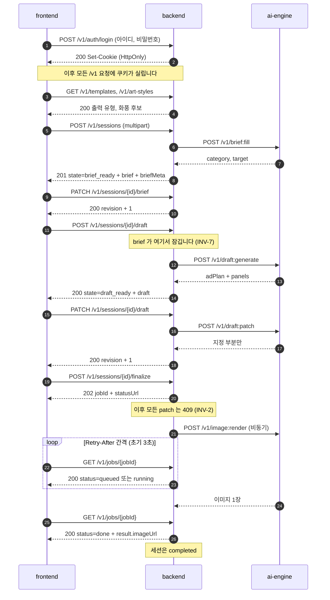

# API 계약

경로와 규약을 정하고 **왜 그 모양인지**를 남기는 문서입니다. 기계가 읽는 정본은
[packages/contracts/openapi.yaml](../../packages/contracts/openapi.yaml)이며, 이 문서는 그 스펙을
읽어도 알 수 없는 근거를 담습니다. 스펙과 이 문서가 어긋나면 스펙이 표현의 정본이고 이 문서가
의도의 정본입니다.

주의: **지금 저장소에 있는 `openapi.yaml`은 아직 템플릿의 질의응답 계약입니다.** 이 문서의 경로로
교체하는 작업은 **별도 PR**로 진행하며, 그 PR이 머지되기 전까지 위 문장("스펙이 표현의 정본")은
아직 적용되지 않습니다. 그 기간의 정본은 이 문서 하나입니다 -- 상세는 7절.

스키마는 [도메인_모델.md](도메인_모델.md), 이름은 [용어_사전.md](용어_사전.md)를 따릅니다.

## 관통 경로 (한눈에)

성공만 하는 경우입니다. 아래 절들이 각 구간을 자세히 다루므로, 지금 어느 구간을 읽고 있는지
확인하는 지도로 쓰세요.



읽을 때 걸리기 쉬운 세 가지를 미리 적습니다.

- **동기와 비동기가 갈리는 지점은 `finalize` 하나입니다** (2절). 그 앞은 전부 응답을 기다리고,
  그 뒤만 잡과 폴링입니다.
- **잡의 `done`과 세션의 `completed`는 다른 층입니다** ([용어_사전.md](용어_사전.md) 1.4절).
  그림 마지막 두 줄이 같은 사건의 두 층입니다.
- **되돌릴 수 없는 문이 둘 있습니다.** 시안 생성 요청에서 브리프가 잠기고(INV-7), 확정에서
  시안이 잠깁니다(INV-2). 화면은 두 지점에서 그 사실을 알려야 합니다.
- **첫 줄의 로그인은 한 번만 나오지만 모든 요청에 걸립니다** (6절). 세션은 사용자에게 속하며,
  남의 `sessionId`로 조회하면 404입니다.

성공하지 않는 경우는 갈래가 셋입니다. 정보가 부족하면 오류가 아니라 세션 상태로 표현하고(4절),
요청 자체가 실패하면 `{code, message}`로(5절), 렌더가 실패하면 잡 조회 응답 안의 `error.code`로
(2.1절) 전달됩니다.

## 1. 경로 목록

### 1.1 공개 경로 (frontend -> backend)

| 메서드 | 경로 | 용도 | 성공 응답 |
|---|---|---|---|
| GET | `/health` | 헬스 체크 | 200 |
| POST | `/v1/auth/login` | 로그인 | 200 |
| POST | `/v1/auth/logout` | 로그아웃 | 204 |
| GET | `/v1/me` | 로그인한 사용자 확인 | 200 |
| GET | `/v1/templates` | 출력 유형 목록 + 예시 이미지 (기획서 12.3) | 200 |
| GET | `/v1/art-styles` | 화풍 후보 + 예시 이미지 (기획서 12.4) | 200 |
| GET | `/v1/sessions` | 내 세션 목록 | 200 |
| POST | `/v1/sessions` | 입력 접수 + 브리프 채우기 | 201 |
| GET | `/v1/sessions/{sessionId}` | 현재 상태 + 브리프 + 시안 | 200 |
| PATCH | `/v1/sessions/{sessionId}/brief` | 브리프 부분 교체 | 200 |
| POST | `/v1/sessions/{sessionId}/draft` | 시안 생성 | 200 |
| PATCH | `/v1/sessions/{sessionId}/draft` | 시안 부분 교체 | 200 |
| POST | `/v1/sessions/{sessionId}/finalize` | 확정 + 렌더 잡 접수 | 202 |
| GET | `/v1/jobs/{jobId}` | 렌더 진행 상태 조회 | 200 |

계약에는 있지만 **구현하지 않는** 경로가 셋 있습니다
([ADR-0008](../adr/0008-로그인_수단과_스켈레톤_범위.md)).

| 메서드 | 경로 | 용도 | 응답 |
|---|---|---|---|
| POST | `/v1/auth/signup` | 계정 생성 | 501 `NOT_IMPLEMENTED` |
| DELETE | `/v1/me` | 탈퇴 | 501 `NOT_IMPLEMENTED` |
| PATCH | `/v1/me/password` | 비밀번호 변경 | 501 `NOT_IMPLEMENTED` |

계약을 먼저 잡는 이유는 나중에 붙일 때 경로와 오류 코드가 달라지면 화면을 다시 고쳐야 하기
때문입니다. 501로 응답하는 이유는 **404로 두면 오타와 구분되지 않고**, 200으로 두면 되지 않은
일이 된 것처럼 보이기 때문입니다.

### 1.2 내부 경로 (backend -> ai-engine)

외부에 열지 않습니다. 인증이 없는 경로이며, 노출되면 비용이 그대로 새어 나갑니다.

| 메서드 | 경로 | 용도 |
|---|---|---|
| POST | `/v1/brief:fill` | 사진과 제품 정보에서 카테고리 / 타겟 추론 |
| POST | `/v1/draft:generate` | 브리프에서 시안 생성 |
| POST | `/v1/draft:patch` | 지정 부분 재생성 |
| POST | `/v1/image:render` | 최종 이미지 1장 생성 |

콜론 표기(`:fill`)는 리소스가 아니라 **동작**임을 드러내기 위한 것입니다. 내부 경로는 CRUD가 아니라
파이프라인 단계 호출이므로 REST 리소스로 위장시키지 않습니다.

## 2. 동기와 비동기의 경계

[AGENTS.md](../../AGENTS.md)의 "이미지 생성은 동기 HTTP로 처리하지 않습니다" 제약은 **수십 초가
걸리는 렌더**를 대상으로 합니다. 텍스트 단계까지 비동기로 만들면 폴링 경로가 세 개로 늘고, 그
복잡도는 22일짜리 일정에서 회수되지 않습니다.

| 단계 | 처리 | 예상 소요 | 근거 |
|---|---|---|---|
| 브리프 채우기 (`POST /v1/sessions`) | 동기 | 수 초 | 사진 1장 판독 |
| 시안 생성 / 부분 교체 | 동기 | 수 초 ~ 십수 초 | 텍스트 생성 |
| 최종 렌더 (`finalize`) | **비동기** | 수 분 | 기획서 12.6 |

- 동기 단계에도 **서버측 상한**을 둡니다. 초과하면 `GENERATION_TIMEOUT`으로 끊습니다.

| 상한 | 값 |
|---|---|
| `brief:fill` | 15초 |
| `draft:generate` / `draft:patch` | 60초 |
| 게이트웨이(리버스 프록시) 상한 | 90초 |

  상한은 **설정값**입니다. 코드에 상수로 박으면 실측할 때마다 배포가 필요합니다. 게이트웨이
  상한을 애플리케이션 상한보다 크게 둔 이유는, 프록시가 먼저 끊으면 클라이언트가
  `GENERATION_TIMEOUT` 대신 502를 받아 원인을 알 수 없기 때문입니다.
- 예상 소요와 상한 값은 아직 **가설**입니다 (`추정`). 실측이 나오면 이 표를 먼저 고치세요.
- `brief:fill`이 상한에 걸리면 오류가 아니라 **열화**입니다. 자동 채움을 건너뛰고
  `messageMode: degraded`로 진행합니다 ([ADR-0005](../adr/0005-열화_폴백은_자동화_생략으로_한정.md)).
  나머지 두 단계는 폴백 없이 실패합니다.

### 2.1 렌더 잡

```
POST /v1/sessions/{id}/finalize   ->  202  { "jobId": "...", "statusUrl": "/v1/jobs/..." }
GET  /v1/jobs/{jobId}             ->  200  { "status": "running", "queuePosition": 1 }
                                  ->  200  { "status": "done", "result": { "imageUrl": "..." } }
                                  ->  200  { "status": "failed", "error": { "code": "..." } }
```

- 상태값 4종(`queued` / `running` / `done` / `failed`)의 정본은
  [용어_사전.md](용어_사전.md) 3.2절입니다. **세션 상태와 다른 층**이며, 세션 쪽 성공은 `done`이
  아니라 `completed`입니다 (같은 문서 1.4절).
- 실패도 **200**입니다. 잡 조회는 성공했고 잡이 실패한 것이므로, HTTP 오류로 만들면 클라이언트가
  "조회 실패"와 "렌더 실패"를 구분하지 못합니다.
- 폴링 간격은 서버가 `Retry-After` 헤더로 알려주고, 클라이언트는 그 값을 따릅니다. **초기값은
  3초**이며 설정값입니다. 클라이언트에 간격을 하드코딩하지 마세요 -- 서버가 늘려도 따라오지
  않으면 큐가 밀릴 때 조회 부하만 늡니다.
- 브라우저를 닫아도 `jobId`로 회수할 수 있습니다 (기획서 12.6 / [세션_보관_정책.md](세션_보관_정책.md) 4절).
- SSE와 WebSocket은 채택하지 않았습니다. 프록시 타임아웃 설정과 재연결 처리가 새로 들어오는데,
  얻는 것은 수 분짜리 작업에서 몇 초의 반응성뿐입니다.

## 3. 부분 교체 (patch) 규약

기획서 3절의 "지정한 부분만 교체하고 나머지는 서버가 원문 그대로 유지"를 그대로 옮긴 것입니다.
**클라이언트가 전체 문서를 되돌려 보내지 않습니다** -- 그러면 서버가 원문을 유지하는 것이 아니라
클라이언트가 유지하는 것이 되고, 화면의 버그가 시안 원문을 조용히 덮어씁니다.

```http
PATCH /v1/sessions/0d2f.../draft
Content-Type: application/json

{
  "revision": 3,
  "patch": { "panels": { "4": { "dialogue": "이거면 아침이 편해져요" } } }
}
```

| 규칙 | 내용 |
|---|---|
| 보내는 것 | 바꾸려는 필드만. 나머지 키는 생략 |
| 배열 | 인덱스를 키로 하는 객체로 지정합니다 (`panels`는 6개 고정이므로 순서가 바뀌지 않습니다) |
| 값 비우기 | **빈 문자열 `""`**. 키 생략은 "안 바꿈"이므로 비우기에 쓸 수 없습니다 |
| `null` | **계약 전체에서 금지**합니다. 요청에 나타나면 422 `INVALID_REQUEST` |
| 동시성 | `revision` 불일치 시 409. 클라이언트는 다시 읽고 재시도합니다 |
| 대상 제한 | `visibility: hidden` 필드, `role`, `adPlan`은 교체 대상이 아닙니다 (도메인_모델 7절 INV-4, INV-5, INV-8) |
| 상태 제한 | 브리프는 `draft_generating` 진입 이후 409 (INV-7). 시안은 `finalized` 이후 409 (INV-2) |

브리프와 시안의 잠기는 시점이 다릅니다. 브리프는 **시안 생성을 요청하는 순간** 잠깁니다 -- 시안이
브리프에서 나온 산출물이라, 근거가 나중에 바뀌면 시안이 무엇에 근거했는지 알 수 없게 됩니다.
잠긴 뒤에 브리프를 고치는 경로는 없습니다. 새 세션을 만듭니다 (기획서 5.1). 그래서 `brief_ready`
화면이 **되돌릴 수 없는 마지막 확인 지점**이며, 화면이 그 사실을 알려 주어야 합니다.

`null`을 아예 쓰지 않는 것은 RFC 7396(JSON Merge Patch)과 다른 점입니다. 이 도메인에는 "필드를
지운다"는 동작이 없고, 그 의미를 열어 두면 자유 메모를 비우려던 요청이 필드 자체를 없애는 사고가
납니다.

**키의 부재는 이미 여러 뜻으로 쓰이고 있습니다.** patch 요청에서는 "안 바꿈"이고, 응답에서는
"이 유형에 해당 없음"(만화형에 `aspectRatio`가 없는 경우)이거나 **"아직 없음"**(확정 전의 `jobId`,
렌더 전의 `result`)입니다. 여기에 "비어 있음"까지 얹으면 네 뜻이 한 표현을 나눠 쓰게 되므로,
비어 있음만 **값으로** 분리했습니다.

응답에서 "해당 없음"과 "아직 없음"을 구분하지 않는 이유는 **클라이언트의 처리가 같기 때문**입니다.
둘 다 "지금 이 값은 쓸 수 없다"이고, 왜 없는지는 `state`가 이미 말해 줍니다. 구분하려고 `null`을
되살리면 클라이언트가 `null`과 `""`를 모두 빈 값으로 처리하는 코드를 짜게 되어 규칙이 반쪽이
됩니다.

| 표현 | patch 요청에서 | 응답에서 |
|---|---|---|
| 키 있음, 값 `"내용"` | 그 값으로 바꿈 | 값이 있음 |
| 키 있음, 값 `""` | 비움 | 비어 있음 |
| 키 없음 | 안 바꿈 | 이 유형에 해당 없음, 또는 **아직 없음** |
| `null` | 422 | 나타나지 않음 |

배열을 인덱스 키 객체로 다루는 것은 컷 순서가 고정이기 때문에 성립합니다. 순서가 바뀔 수 있는
컬렉션이 생기면 이 규약을 그대로 쓰지 마세요.

## 4. 정보가 부족할 때 (기획서 9.3)

카테고리 추론이 불확실하면 그대로 진행하지 않고 자유 메모를 요구합니다. 이것은 오류가 아니라
**대화의 한 단계**이므로, 실패 응답이 아니라 세션 상태로 표현합니다.

```
POST /v1/sessions  ->  201  { "state": "brief_filling", "needsInput": { "field": "note", "reason": "..." } }
```

- 사용자가 `PATCH /v1/sessions/{id}/brief`로 `note`를 채우면 서버가 추론을 다시 시도합니다.
- 재입력 후에도 판단이 서지 않을 때의 처리는 미정입니다 (기획서 18.2 #11). 그때까지는
  `INSUFFICIENT_INPUT` 오류로 끊는 것을 잠정안으로 둡니다.

## 5. 오류

### 5.1 형식

FastAPI 기본 `{detail}`이 아니라 `{code, message}`입니다. 클라이언트는 `code`로 분기하고 `message`는
사람에게 보여 줍니다. 이 형식은 스켈레톤에서 그대로 이어받습니다.

```json
{ "code": "INSUFFICIENT_INPUT", "message": "제품 정보가 부족합니다." }
```

### 5.2 코드 표

기존 5종에 기획서 12.5의 실패 상황 4종을 더합니다. **코드는 화면 분기가 달라질 때만 추가합니다** --
분기가 같은 코드를 늘리면 클라이언트가 전부 `default`로 떨어뜨립니다.

| 코드 | HTTP | 기획서 12.5 | 사용자 재시도 |
|---|---|---|---|
| `INVALID_REQUEST` | 422 | -- | 입력 고치면 가능 |
| `NOT_FOUND` | 404 | -- | 불가 (남의 세션도 여기로 떨어집니다. 6절) |
| `UNAUTHORIZED` | 401 | -- | 로그인 후 가능 |
| `INVALID_CREDENTIALS` | 401 | -- | 다시 입력하면 가능 |
| `DUPLICATE_ACCOUNT` | 409 | -- | 다른 아이디로 가능 |
| `NOT_IMPLEMENTED` | 501 | -- | 불가 (1차 범위 밖) |
| `RATE_LIMITED` | 429 | -- | 시간 후 가능 |
| `UPSTREAM_UNAVAILABLE` | 503 | 호출 실패 | 가능 |
| `INTERNAL` | 500 | -- | 가능 |
| `INSUFFICIENT_INPUT` | 422 | 입력 정보 부족 | 자유 메모 입력 후 가능 |
| `INVALID_IMAGE` | 422 | 규격 오류 | 다른 이미지로 가능 |
| `CONTENT_POLICY_REJECTED` | 200 (잡) / 422 | 콘텐츠 정책 거절 | 입력 수정 후 가능 |
| `GENERATION_TIMEOUT` | 200 (잡) / 504 | 생성 시간 초과 | 가능 |
| `REVISION_CONFLICT` | 409 | -- | 다시 읽고 가능 |
| `STATE_CONFLICT` | 409 | -- | 불가 (확정 이후 수정 시도 등) |

- 렌더 단계의 실패는 잡 조회 응답 안의 `error.code`로 전달됩니다 (2.1절). 같은 코드가 HTTP 상태와
  잡 결과 양쪽에 쓰이는 이유는, 화면이 어느 경로로 왔든 같은 분기를 타야 하기 때문입니다.
- `CONTENT_POLICY_REJECTED`는 **재생성 1회 후에도 가드레일을 통과하지 못한 경우**에만 나갑니다.
  첫 위반은 서버가 조용히 재생성하므로 클라이언트에 보이지 않습니다
  ([ADR-0005](../adr/0005-열화_폴백은_자동화_생략으로_한정.md),
  [생성_파이프라인.md](생성_파이프라인.md) 5절).
- **폴백으로 만든 응답은 이 표에 없습니다.** 열화는 `brief:fill` 한 곳뿐이고 오류가 아니라
  `messageMode: degraded`로 표현됩니다 (2절).
- 화면 표시는 우측 상단 고정 영역입니다 (기획서 12.5). 팝업은 반려되었습니다.
- 사용자용 문구는 배포 단계 소관입니다 (기획서 17.2). 지금 내려보내는 `message`는 **개발용**이며,
  원인 파악이 목적입니다.

## 6. 인증

**아이디와 비밀번호**입니다. 근거와 비밀번호 취급 규칙은
[세션_보관_정책.md](세션_보관_정책.md) 1절이 정본이며, 여기서는 계약 표면만 다룹니다.

| 항목 | 규약 |
|---|---|
| 자격 증명 전달 | `POST /v1/auth/login`에 아이디와 비밀번호. 다른 경로는 자격 증명을 받지 않습니다 |
| 세션 유지 | 서버가 발급한 토큰. `HttpOnly` 쿠키로 내려보냅니다 |
| 토큰 수명 | **24시간 고정.** 갱신 경로를 두지 않습니다 |
| 만료 후 | 401 `UNAUTHORIZED`. 클라이언트는 로그인 화면으로 보냅니다 |
| 보호 범위 | `/health`, `/v1/auth/*`를 뺀 **모든 `/v1` 경로** |
| 미인증 요청 | 401 `UNAUTHORIZED` |
| 남의 세션 요청 | 404 `NOT_FOUND` |

- **토큰을 `localStorage`에 두지 않습니다.** XSS 한 번에 그대로 새어 나갑니다. `HttpOnly`
  쿠키는 스크립트가 읽지 못합니다.
- **남의 세션에 403이 아니라 404를 씁니다.** 403은 "있지만 당신 것이 아니다"를 알려 주므로,
  `sessionId`를 훑으며 존재 여부를 캐낼 수 있습니다. 404는 아무것도 말하지 않습니다.
- 내부 경로(1.2절)는 이 인증을 쓰지 않습니다. 외부에 열지 않는 것이 그쪽의 방어선입니다.
- 로그인 실패에서 아이디 오류와 비밀번호 오류를 구분하지 않습니다. 코드는 둘 다
  `INVALID_CREDENTIALS`입니다.

**24시간 만료에 갱신 없음**을 택했습니다. 짧게 두고 갱신을 붙이면 refresh 토큰, 회전, 재사용
탐지, 폐기 목록이 따라오는데 이번 범위에서 그 비용은 회수되지 않습니다. 길게 두면 public 저장소
+ 데모 계정 조합에서 탈취 창이 그만큼 길어집니다.

작업 도중 만료돼도 잃는 것은 없습니다. 세션 산출물은 7일 보존이므로
([세션_보관_정책.md](세션_보관_정책.md) 2절) 다시 로그인해 `sessionId`와 `jobId`로 돌아옵니다.
`Max-Age`는 **설정값**으로 두되 기본값 24시간으로 시작합니다.

- 슬라이딩 만료(요청마다 연장)도 두지 않습니다. 매 요청이 쿠키를 다시 쓰게 되고, 만료 시각이
  로그만 봐서는 재구성되지 않습니다.
- 외부 공개 시 다시 봅니다 (기획서 17.2). 그때는 OAuth 전환과 함께 열립니다.

## 7. 계약과 구현의 드리프트

현재 스켈레톤은 이 계약이 아니라 템플릿의 질의응답 경로(`/v1/ask`, `/v1/generate`)를 구현하고
있습니다. 계약이 구현보다 먼저라는 규약([AGENTS.md](../../AGENTS.md))에 따라 **계약을 먼저**
바꾸므로, 교체 시점부터 구현이 따라붙기 전까지 둘이 어긋난 기간이 존재합니다.

**이 문서와 `openapi.yaml`은 서로 다른 PR로 올라갑니다.** 문서가 먼저이고 스펙 교체가 뒤입니다.
따라서 어긋난 구간은 하나가 아니라 둘이며, 지금 어느 구간에 있는지 헷갈리면 잘못된 것을 정본으로
읽게 됩니다.

| 구간 | 문서 | `openapi.yaml` | 구현 | 정본 |
|---|---|---|---|---|
| 1 (**현재**) | 이 계약 | 템플릿 질의응답 | 템플릿 질의응답 | 이 문서 |
| 2 | 이 계약 | 이 계약 | 템플릿 질의응답 | 스펙(표현) + 이 문서(의도) |
| 3 | 이 계약 | 이 계약 | 이 계약 | 같음 |

구간 1에서 `openapi.yaml`을 근거로 프론트엔드나 클라이언트를 짜지 마세요. 거기 있는 경로는 이
프로젝트의 계약이 아니라 템플릿 잔재입니다.

- 이 기간은 의도된 것이며, `contracts-check` 워크플로는 스펙 문법만 검증하므로 CI는 통과합니다.
- 각 앱의 계약 준수 테스트(`apps/ai-engine/tests/test_service.py` 등)는 코드를 검사하므로 역시
  통과합니다. **즉 CI가 이 드리프트를 잡아주지 않습니다** -- 구현 완료를
  [구현_범위.md](../공통_가이드/구현_범위.md)의 항목으로 추적하세요.
- 교체 순서는 계약 -> 스키마 -> 구현 -> 테스트입니다. 구현이 먼저 올라온 PR은 리뷰 대상이 아닙니다.

## 8. 확정되지 않은 것

| 항목 | 상태 |
|---|---|
| 재입력 후에도 카테고리 추론이 실패할 때의 처리 | 미정 (기획서 18.2 #11, 소관 임동규). `INSUFFICIENT_INPUT` 잠정 |
| 사용자에게 보여 줄 오류 문구 | 배포 단계 소관 (기획서 17.2). 지금 `message`는 개발용입니다 |
| `openapi.yaml` 교체 시점 | 7절. 별도 PR |

아래 항목은 **확정되었습니다.** 값을 바꾸려면 이 문서와 근거 문서를 함께 고치세요.

| 항목 | 결정 | 근거 |
|---|---|---|
| 동기 단계 타임아웃 상한 | 15초 / 60초 / 게이트웨이 90초 (설정값) | 2절 |
| 폴링 간격 초기값 | 3초 + `Retry-After` (설정값) | 2.1절 |
| `revision` 위치 | **본문 필드.** `If-Match` 헤더는 미채택 | 아래 |
| 이미지 업로드 방식 | `POST /v1/sessions`의 multipart 단일 요청. 별도 경로로 분리하지 않습니다 | 8.1절 |
| 선택 필드를 비웠을 때의 표현 | 빈 문자열 `""`. `null` 금지 | 3절 |
| 토큰 수명 | 24시간, 갱신 없음 | 6절 |
| 동시 확정 요청의 대기 정책 | 직렬 1건 + `queuePosition` | [세션_보관_정책.md](세션_보관_정책.md) 6절 |

`If-Match`를 택하지 않은 이유는 **본문 하나로 끝나기 때문**입니다. 헤더 방식이 HTTP 규범에는
맞지만, `ETag`를 함께 내려보내고 클라이언트가 그것을 보관했다가 헤더에 싣는 왕복이 늘어납니다.
이 계약에서 낙관적 잠금이 필요한 경로는 `PATCH` 둘뿐이고, `revision`은 이미 응답 본문에 있습니다.
경로가 늘거나 캐시 검증이 필요해지면 그때 헤더로 옮깁니다.

### 8.1 이미지 업로드를 분리하지 않는 이유

`POST /v1/sessions` 한 번에 사진과 제품 정보를 함께 받습니다. 분리안(먼저 업로드해 `imageId`를
받고, 세션 생성에 그 아이디를 싣는 방식)은 왕복이 둘로 늘고, **어느 세션에도 속하지 않은 이미지**
라는 상태가 새로 생깁니다. 그 이미지의 보존 기간과 소유자를 따로 정해야 하는데
([세션_보관_정책.md](세션_보관_정책.md) 2절), 지금은 사진이 1장뿐이라 그 비용을 치를 이유가
없습니다.

뒤집힐 조건: 사진이 여러 장이 되거나, 업로드 진행률 표시가 요구되는 경우입니다.
