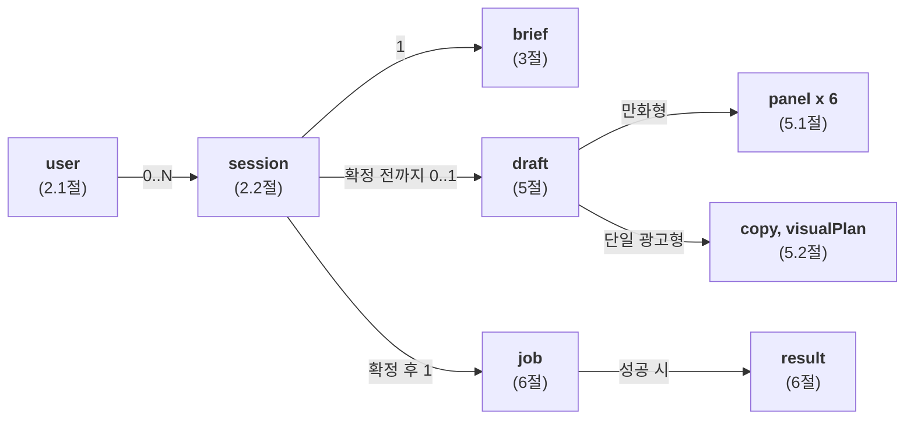
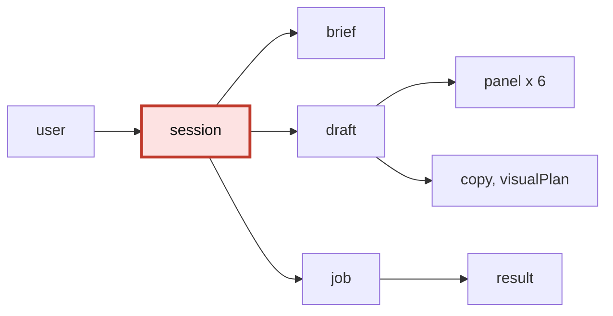
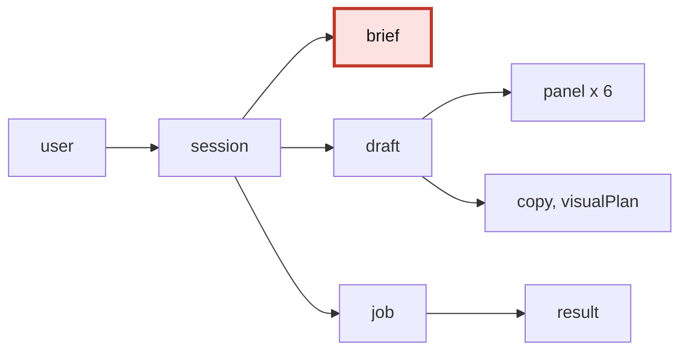
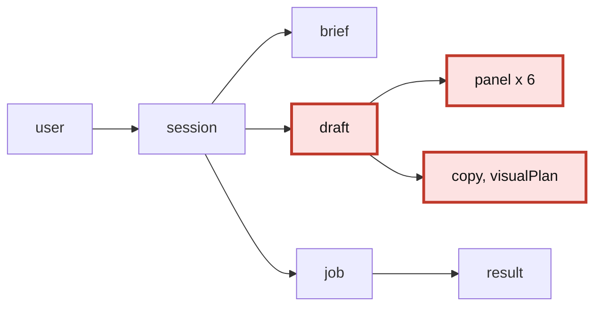
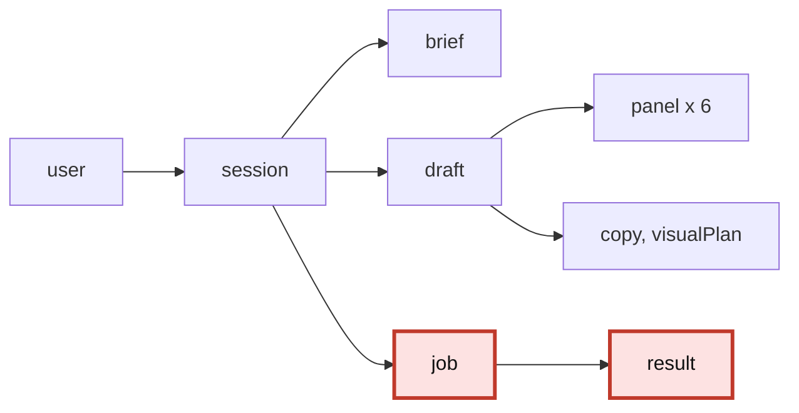

# 도메인 모델

기획서 9절의 항목을 **스키마로 고정**하는 문서입니다. 기획서 14.2가 요구하는 "스키마 확정"의
산출물이며, [openapi.yaml](../../packages/contracts/openapi.yaml)은 이 모델을 HTTP로 투영한 것입니다.
둘이 어긋나면 이 문서가 뜻을 정하고, 계약이 표현을 정합니다.

용어와 식별자는 [용어_사전.md](용어_사전.md)를 따릅니다. 여기서 새로 짓지 않습니다.

## 1. 객체 관계



- `user`는 세션을 여러 개 가집니다. `session`이 소유하는 것은 브리프 하나, 시안 하나, 잡
  하나입니다. 여러 벌을 만들려면 새 세션입니다 (기획서 5.1).
- `panel`은 항상 6개입니다. 0개도 7개도 유효하지 않습니다 (기획서 6절).

아래 각 절은 이 그림의 **축소판에 지금 보는 객체를 붉게 표시**해 둡니다. 문서를 처음 읽는 사람이
"지금 전체 중 어디를 보고 있는지"를 잃지 않기 위한 것입니다.

> 구조가 바뀌면 **이 그림과 축소판 네 개를 함께** 고치세요. 축소판은 노드만 있고 관계 설명이
> 없으므로 갱신 비용은 작지만, 한 곳만 고치면 그림끼리 어긋납니다.

## 2. User 와 Session

### 2.1 User

로그인은 아이디와 비밀번호입니다. 결정 근거는
[ADR-0008](../adr/0008-로그인_수단과_스켈레톤_범위.md), 취급 규칙은
[세션_보관_정책.md](세션_보관_정책.md) 1절입니다.

| 필드 | 타입 | 설명 |
|---|---|---|
| `userId` | 문자열 (UUID) | 서버 발급. **다른 데이터가 참조하는 것은 이쪽입니다** |
| `loginId` | 문자열 | 사용자가 입력하는 아이디. 유일 |
| `passwordHash` | 문자열 | `argon2` 또는 `bcrypt`. **응답에 실리지 않습니다** |
| `createdAt` | ISO 8601 | |

- 평문 비밀번호는 스키마에 없습니다. 요청 본문에만 존재하고 그 자리에서 해시로 바뀝니다.
- 프로필, 표시 이름, 이메일은 두지 않습니다. 지금 쓰이지 않는 필드이고, 이메일은 두는 순간
  개인정보 보관 항목이 하나 늘어납니다.
- **가입과 탈퇴, 비밀번호 변경은 계약에만 있고 구현하지 않습니다** (ADR-0008). 워킹 스켈레톤은
  미리 만들어 둔 **고정 계정 둘**로 조회와 대조만 합니다. 둘인 이유는 INV-9(소유자만 조회)를
  하나로는 검증할 수 없기 때문입니다.

### 2.2 Session



| 필드 | 타입 | 설명 |
|---|---|---|
| `sessionId` | 문자열 (UUID) | 발급 주체는 서버입니다 |
| `userId` | 문자열 (UUID) | 소유자. 조회 권한의 근거입니다 (7절 INV-9) |
| `state` | 열거값 | [용어_사전.md 3절](용어_사전.md)의 상태값 |
| `outputType` | `comic` / `single_ad` | 세션 생성 시 고정 |
| `brief` | 객체 | 3절. **`draft_generating` 진입과 함께 잠깁니다.** 생성이 실패해 `brief_ready`로 되돌아오면 함께 풀립니다 (7절 INV-7) |
| `briefMeta` | 객체 | 4절. `brief`와 같은 시점에 잠기고 같은 시점에 풀립니다 |
| `draft` | 객체 | 5절. **시안 생성 전에는 키가 없습니다.** `finalized` 이후 변경 불가 (INV-2) |
| `revision` | 정수 | 부분 교체마다 1 증가 |
| `messageMode` | `normal` / `degraded` | 열화 표기. **기본값 `normal`이며 생략하지 않고 항상 실립니다.** 한 번 `degraded`가 되면 되돌아가지 않습니다 ([ADR-0005](../adr/0005-열화_폴백은_자동화_생략으로_한정.md)) |
| `needsInput` | 객체 (`field`, `reason`) | [API_계약.md](API_계약.md) 4절. **채워지면 키를 지웁니다.** 응답 전용이 아니라 저장합니다. 필드 **하나**를 담으며, 의존 장애로 인한 열화에는 쓰지 않습니다 ([ADR-0005](../adr/0005-열화_폴백은_자동화_생략으로_한정.md)) |
| `jobId` | 문자열 | **확정 전에는 키가 없습니다** |
| `createdAt`, `updatedAt` | ISO 8601 | 보존 기간 판정의 기준 ([세션_보관_정책.md](세션_보관_정책.md)) |

**`outputType`은 여기 한 곳에만 있습니다.** 기획서 9.2가 브리프 항목으로 나열했지만 브리프에
사본을 두지 않습니다 -- 부분 교체로 한쪽만 바뀌면 두 값이 어긋나고, 어느 쪽이 참인지 정하는 규칙이
또 필요해집니다 (PR #39 리뷰).

값은 세션 생성 시 고정입니다. 시안이 만들어진 뒤에 바꾸면 시안 전체가 무효가 되므로, 유형을
바꾸려면 새 세션을 만듭니다. 브리프가 `draft_generating` 진입과 함께 잠기므로(7절 INV-7)
이 값도 같은 시점에 잠깁니다.

## 3. Brief



사용자 입력과 자동 채움이 합쳐진 결과입니다. 기획서 9.2의 항목 중 **생성물이 아닌 것**이 여기
들어갑니다 (생성물의 행선지는 9절 대응표 참고).

| 필드 | 타입 | 필수 | 채움 주체 | 노출 등급 | 적용 유형 |
|---|---|---|---|---|---|
| `productImageUrl` | 이미지 참조 URL (1장) | 필수 | `user` | `editable` | 공통 |
| `productName` | 문자열 | 필수 | `user` | `editable` | 공통 |
| `sellingPoint` | 문자열 | 필수 | `user` | `editable` | 공통 |
| `note` | 문자열 (0 ~ 500자) | 선택 | `user` | `editable` | 공통 |
| `category` | 문자열 | 자동 | `inferred` | `editable` | 공통 |
| `target` | 문자열 | 자동 | `inferred` | `editable` | 공통 |
| `artStyle` | 화풍 식별자 | 자동 | `user` 또는 `random` | `editable` | 공통 |
| `character` | 객체 (`appearance`, `outfit`) | 자동 | `random` | `editable` | 만화형 |
| `panelCount` | 정수 (6 고정) | 자동 | `fixed` | `hidden` | 만화형 |
| `aspectRatio` | 문자열 (예: `1:1`) | 자동 | `default` | `editable` | 단일 광고형 |

- **고칠 수 있는 구간은 `brief_ready`까지입니다.** 시안 생성을 요청하는 순간 브리프 전체가
  잠기고, **시안이 만들어진 뒤에는** 고치는 경로가 없습니다 (7절 INV-7). 아래 표의 `editable`은
  **잠기기 전**의 이야기입니다. 생성이 실패해 `brief_ready`로 되돌아오면 다시 고칠 수 있습니다
  ([ADR-0012](../adr/0012-시안_생성_실패_시_브리프_잠금_해제.md)).
- **올릴 때와 읽을 때의 이름이 다릅니다.** 업로드 필드는 `productImage`(파일 자체, 용어_사전
  2.2절)이고 브리프에 남는 것은 `productImageUrl`(참조)입니다. 같은 것의 두 표현이 아니라 서로
  다른 것이며, 뒤의 것을 `JobResult.imageUrl`과 모양을 맞췄습니다 (PR #65 리뷰).
- `outputType`은 브리프에 없습니다. 세션에 하나만 둡니다 (2.2절).
- **적용되지 않는 유형에서는 필드 자체가 없습니다.** `null`로 두지 않습니다 -- 값이 없는 것과
  해당 없는 것을 클라이언트가 구분하려고 분기 코드를 짜게 됩니다.
- **비어 있는 선택 필드는 빈 문자열 `""`입니다.** `null`은 이 모델 어디에도 나타나지 않습니다.
  네 상태(값 있음 / 비어 있음 / 이 유형에 해당 없음 / 아직 없음)를 두 표현으로 나눈 규칙의
  정본은 [API_계약.md](API_계약.md) 3절입니다.
- `panelCount`가 `hidden`인데도 스키마에 있는 이유는, 프롬프트 조립과 이미지 규격 계산이 이 값을
  읽기 때문입니다. 사용자에게 보이지 않을 뿐 시스템에는 존재합니다.
- 만화형에는 `aspectRatio`가 없습니다. 기획서 10.2가 3456 x 2304로 고정해 두었기 때문이며,
  이것을 사용자가 바꿀 수 있게 두면 16의 배수와 총 픽셀 상한 조건이 무너집니다.

### 3.1 검증 규칙

| 필드 | 규칙 | 근거 |
|---|---|---|
| `productImage` (업로드) | 1장. **JPEG / PNG / WebP**, 최대 **10MB**, 짧은 변 **512px 이상** | 9.1 |
| `productName` | 1자 이상 **40자 이하** | 9.1 |
| `sellingPoint` | 1자 이상 **200자 이하** | 9.1, 5.5 |
| `note` | 500자 이하 | 12.2 화면의 `0/500` |
| `panelCount` | 정확히 6 | 6절 |
| `artStyle` | 화풍 후보 목록 안의 값 | 12.4. 목록은 8종으로 확정(18.1 #3, 2026-08-19). 정본은 [03-AI_생성_서빙.md](../역할_일정/03-AI_생성_서빙.md) |

- 길이는 **문자 수**입니다 (바이트가 아닙니다). 한글 1자와 영문 1자를 같게 셉니다 -- 바이트로
  세면 한글 입력만 3분의 1로 짧아집니다.
- 상한이 있는 이유는 **프롬프트 길이와 비용이 사용자 입력에 직접 연동되기 때문**입니다.
  `productName` 40자는 화면 한 줄에 들어가는 길이, `sellingPoint` 200자는 6컷 대사로 풀어낼 수
  있는 분량을 기준으로 잡았습니다 (`추정`. 실측 후 조정합니다).
- `productImage` 제약의 근거: 형식 3종은 브라우저가 기본 인코딩하는 것들이고, 10MB는 휴대폰 원본
  사진이 대체로 들어오는 크기입니다. 512px 하한은 그보다 작으면 판독 자체가 불안정하기
  때문입니다 (`추정`). GIF와 HEIC는 받지 않습니다 -- 변환 경로가 추가로 필요합니다.
- 초과 입력은 잘라내지 않고 **422 `INVALID_REQUEST`로 거절**합니다. 조용히 자르면 사용자가 쓴
  소구점의 뒷부분이 광고에서 사라진 이유를 아무도 설명하지 못합니다.
- `dialogue`(생성물) 상한은 여기 없습니다. **2026-08-21 회의가 25자를 프롬프트 지침으로만 두고
  강제 검사 코드를 만들지 않기로 정했기 때문이며**(N18), 검증 결과를 기다리는 것이 아닙니다.
  스키마에 넣을 제약이 없다는 뜻이고, 위 행들과 달리 초과해도 422 가 아닙니다 (5.1절).

## 4. 필드 메타 (`briefMeta`)

기획서 5.4는 자동으로 채운 값을 사용자가 확인하고 고칠 수 있어야 한다고 요구합니다. 이것을 화면
규칙이 아니라 **데이터**로 만족시킵니다. 값과 메타를 나란히 실어 보냅니다.

```json
{
  "brief": {
    "productName": "수분 크림",
    "category": "스킨케어",
    "artStyle": "style_04"
  },
  "briefMeta": {
    "productName": { "filledBy": "user",     "visibility": "editable" },
    "category":    { "filledBy": "inferred", "visibility": "editable" },
    "artStyle":    { "filledBy": "random",   "visibility": "editable" }
  }
}
```

값마다 `{value, filledBy, visibility}`로 감싸는 방법도 있지만 택하지 않았습니다. 모든 필드 접근이
한 단계 깊어지고, 스키마 검증기가 실제 타입(문자열인지 정수인지)을 보지 못하게 됩니다.

- `hidden` 필드는 `brief`와 `briefMeta` **양쪽에서 빠진 채** 응답합니다. 사용자에게 보이지 않아야
  하는 값을 응답에 실어 보내고 화면에서 감추는 것은 감춘 것이 아닙니다.
- `filledBy`는 서버가 채운 시점의 사실을 기록합니다. 사용자가 자동값을 고치면 `user`로 바뀝니다.

## 5. Draft



유형에 따라 내용이 갈립니다 (기획서 5.3의 분기 지점).

### 5.1 만화형 (`comic`)

| 필드 | 타입 | 설명 |
|---|---|---|
| `adPlan` | 문자열 | 광고 기획안. 서술형 문단. **읽기 전용** (5.3절) |
| `panels` | 배열 (정확히 6) | 아래 |

`panel` 하나:

| 필드 | 타입 | 설명 |
|---|---|---|
| `index` | 정수 (1 ~ 6) | 읽는 순서. 3x2 배치에서의 위치와 1:1입니다 |
| `role` | 열거값 | `hook` / `setup` / `problem` / `solution` / `proof` / `cta` (기획서 7.3) |
| `scene` | 문자열 | 장면 서술 |
| `dialogue` | 문자열 | 대사. **스키마 상한은 없습니다** - 25자는 프롬프트 지침이고 강제 검사를 두지 않습니다 (N18, 2026-08-21 확정. 기획서 10.3 제약 3) |

- `role`은 컷 번호와 1:1 고정입니다. 사용자가 바꾸지 않습니다 -- 6단계 구성 자체가 기획의 근거이기
  때문입니다. `scene`과 `dialogue`만 `editable`입니다.
- `index`가 읽기 순서이고, 그리드 게시 시 배치가 뒤집히는 문제는 별도 확인 항목입니다
  (기획서 18.2 #18).

### 5.2 단일 광고형 (`single_ad`)

| 필드 | 타입 | 설명 |
|---|---|---|
| `adPlan` | 문자열 | 광고 기획안. 서술형 문단. **읽기 전용** (5.3절) |
| `copy` | 문자열 | 카피 문구 |
| `visualPlan` | 문자열 | 비주얼 구성안 |

단일 광고형에는 `panel` 같은 **수정 단위가 없습니다.** 만화형은 "4번 컷만"처럼 범위를 지정할 수
있지만 `copy`와 `visualPlan`은 통짜 문자열이라 부분 교체의 단위가 필드 하나입니다. 1차에서는
이미지 재생성을 제공하지 않으므로 문제가 드러나지 않지만, 재생성을 열면 여기부터 걸립니다
(PR #39 리뷰. [미결정_대장.md](미결정_대장.md) 후속 항목).

### 5.3 공통 규칙

- **`adPlan`은 읽기 전용입니다.** 서술형 문단 하나이며 patch 대상이 아닙니다. 광고 기획안의 내용은
  브리프와 겹치므로, 고칠 것이 있으면 브리프를 고치고 시안을 다시 생성합니다. 양쪽을 따로 고칠 수
  있게 두면 브리프와 기획안이 서로 다른 말을 하는 시안이 만들어집니다 (PR #39 리뷰).
- 시안의 모든 텍스트는 `sellingPoint`와 `note`에 근거해야 합니다. 근거 없는 수치와 효능은 가드레일이
  걸러냅니다 ([생성_파이프라인.md](생성_파이프라인.md) 5절).
- 시안은 **텍스트만** 담습니다. 이미지 경로나 미리보기가 여기 들어오면 "확정 전에는 그림을 만들지
  않는다"는 기획서 5.1이 깨집니다.

## 6. Job / Result



| 필드 | 타입 | 설명 |
|---|---|---|
| `jobId` | 문자열 | 확정 시 발급 |
| `status` | `queued` / `running` / `done` / `failed` | |
| `queuePosition` | 정수 | 대기 중일 때만 있습니다 |
| `result` | 객체 | 성공했을 때만 있습니다. `{ imageUrl, width, height, expiresAt }` |
| `error` | 객체 | 실패했을 때만 있습니다. `{ code, message }` ([API_계약.md](API_계약.md) 5절) |

**"아직 없음"은 키를 생략해 표현합니다.** `null`을 쓰지 않으므로 `queuePosition`, `result`,
`error`는 해당 상황에서만 응답에 실립니다. 클라이언트는 값을 비교하지 말고 **키의 유무로**
판단하세요 ([API_계약.md](API_계약.md) 3절).

`expiresAt`은 결과 이미지의 보존 만료 시각입니다. 보존 기간은
[세션_보관_정책.md](세션_보관_정책.md)에서 정합니다.

## 7. 불변식

코드로 강제해야 하는 규칙입니다. **문서에만 있는 불변식은 지켜지지 않으므로**, 각 항목에 강제
위치를 함께 답니다. 강제 위치가 비어 있는 불변식은 아직 규칙이 아니라 희망입니다.

| ID | 불변식 | 강제 위치 | 깨졌을 때 |
|---|---|---|---|
| INV-1 | 만화형에서 `panelCount == 6`. `draft`가 있으면 `len(panels) == 6` | 스키마 검증 | 3x2 배치가 성립하지 않습니다 |
| INV-2 | `state == finalized` 이후 `draft` 변경 불가 | 상태 기계 가드 -> 409 `STATE_CONFLICT` | 확정의 의미가 사라집니다 (5.1) |
| INV-3 | `render`는 세션당 1회 | 상태 기계 가드 -> 409 `STATE_CONFLICT` | 비용 방어선이 사라집니다 (11.1) |
| INV-4 | `visibility == hidden` 필드는 patch 대상이 아님 | patch 처리기 -> 422 `INVALID_REQUEST` | 보이지 않는 값을 사용자가 바꾸게 됩니다 |
| INV-5 | `role`은 `index`에 의해 결정됨 | 스키마 검증 (상수 표 대조) | 6단계 구성이라는 기획 근거가 사라집니다 (7.3) |
| INV-6 | 생성물의 사실 주장 범위 <= `sellingPoint` + `note` | 가드레일 검사 + 대조군 측정 | 표시광고법 위반 (5.5, 9.3) |
| INV-7 | **시안이 존재하는 동안** `brief` 변경 불가. `draft_generating` 진입 시 잠기고, 생성 실패로 `brief_ready`에 되돌아오면 풀립니다 ([ADR-0012](../adr/0012-시안_생성_실패_시_브리프_잠금_해제.md)) | 상태 기계 가드 -> 409 `STATE_CONFLICT` | 시안이 무엇에 근거했는지 알 수 없게 됩니다 |
| INV-8 | `adPlan`은 patch 대상이 아님 | patch 처리기 -> 422 `INVALID_REQUEST` | 브리프와 기획안이 서로 다른 말을 합니다 (5.3) |
| INV-9 | 세션은 `userId`가 일치하는 요청에만 보입니다 | 접근 제어 -> 404 `NOT_FOUND` | 남의 작업물이 링크 하나로 새어 나갑니다 |

**INV-2와 INV-3은 아직 제안입니다.** 근거인 [ADR-0006](../adr/0006-확정_후_불변과_렌더_1회.md)의
상태가 `Proposed`(팀 합의 대기)이므로, 이 표만 읽고 확정된 규칙으로 옮기지 마세요. 합의에서
대안(요청 상한)으로 뒤집히면 이 두 줄과 7.3절을 **같은 PR에서** 함께 고칩니다.

### 7.1 강제는 여섯 층으로

| 층 | 수단 | 대상 |
|---|---|---|
| 스키마 | pydantic validator. 잘못된 값이 도메인에 들어오지 못함 | INV-1, INV-5 |
| 상태 기계 | 전이 가드. 허용되지 않은 시점의 요청을 409로 거절 | INV-2, INV-3, INV-7 |
| patch 처리기 | 교체 대상이 아닌 필드를 422로 거절 | INV-4, INV-8 |
| 접근 제어 | 소유자가 아니면 404. 403이 아닌 이유는 존재 여부를 알리지 않기 위함입니다 | INV-9 |
| 계약 | 409와 422를 `openapi.yaml`에 명시 | 위 전부 |
| 테스트 | 불변식마다 테스트 하나. **테스트 이름에 `INV-n`을 답니다** | 위 전부 |

테스트 이름에 ID를 다는 이유는 추적 때문입니다. 불변식이 바뀔 때 어느 테스트를 함께 고쳐야
하는지가 검색 한 번으로 나오고, 반대로 테스트를 지우려는 사람이 그것이 불변식이었다는 사실을
알게 됩니다.

### 7.2 INV-6은 다릅니다

타입으로 강제할 수 없습니다. 가드레일 검사와 **그 대조군 측정**으로만 확인되며, 그래서 가드레일을
목으로 대체하는 것이 테스트를 통과시키는 방법이 될 수 없습니다 -- 통과하는 순간 지표가 무효가
됩니다 ([AGENTS.md](../../AGENTS.md) 프로젝트 함정).

### 7.3 ADR로 남기는 것

불변식 자체는 ADR 대상이 아닙니다. ADR은 강제 수단이 아니라 결정 기록이고, 이 저장소는
"코드를 읽으면 드러나는 것"을 ADR에서 제외합니다 ([adr/README.md](../adr/README.md)).

다만 **왜 그 불변식을 택했는지가 코드에 남지 않는** 것은 ADR로 남깁니다.

| 불변식 | ADR | 왜 ADR인가 |
|---|---|---|
| INV-2, INV-3 | [ADR-0006](../adr/0006-확정_후_불변과_렌더_1회.md) (`Proposed`) | 기획서 11.2가 사용량 상한을 미루면서 구조적 1회 고정을 대신 방어선으로 삼았습니다. 요청 상한과 재생성 허용이라는 대안이 실재했고, 18.2 #13이 재검토를 예고하고 있어 뒤집힐 때 이력이 필요합니다 |
| INV-6 | [ADR-0007](../adr/0007-가드레일과_법률_대응_범위.md) | 가드레일을 끄면 안 되는 이유가 코드에 남지 않습니다. 기획서 9.4의 "완전한 법률 준수를 하지 않기로 한" 결정도 함께 기록합니다 |
| INV-7, INV-8 | [ADR-0009](../adr/0009-브리프_잠금_시점과_광고_기획안_읽기_전용.md) | 기획서 9.2는 브리프를 "확정 전까지 수정 가능"으로 두었고 `adPlan`도 시안의 일부였습니다. 둘 다 그보다 이르게 잠그는 쪽으로 뒤집힌 결정이라 근거가 남아야 합니다 (PR #39 리뷰) |
| INV-7 (잠금 해제) | [ADR-0012](../adr/0012-시안_생성_실패_시_브리프_잠금_해제.md) | ADR-0009가 다루지 않은 경로입니다. 생성이 실패하면 브리프는 잠겼는데 시안은 없는 세션이 남고, 재시도 경로가 없었습니다 (PR #47 리뷰) |

INV-9는 ADR을 두지 않습니다. 소유자만 자기 것을 본다는 규칙에는 실재하는 대안이 없고, 403이
아니라 404를 쓰는 이유는 [API_계약.md](API_계약.md) 6절에 남아 있습니다.

## 8. 응답 예시

`GET /v1/sessions/{id}` (만화형, `draft_ready`):

```json
{
  "sessionId": "0d2f...",
  "state": "draft_ready",
  "outputType": "comic",
  "revision": 3,
  "brief": {
    "productName": "수분 크림",
    "sellingPoint": "건조한 피부에 12시간 보습",
    "note": "선물용 포장을 강조",
    "category": "스킨케어",
    "target": "20대 후반 직장인",
    "artStyle": "style_04",
    "character": { "appearance": "단발 여성", "outfit": "캐주얼" }
  },
  "briefMeta": {
    "productName":  { "filledBy": "user",     "visibility": "editable" },
    "sellingPoint": { "filledBy": "user",     "visibility": "editable" },
    "note":         { "filledBy": "user",     "visibility": "editable" },
    "category":     { "filledBy": "inferred", "visibility": "editable" },
    "target":       { "filledBy": "inferred", "visibility": "editable" },
    "artStyle":     { "filledBy": "random",   "visibility": "editable" },
    "character":    { "filledBy": "random",   "visibility": "editable" }
  },
  "draft": {
    "adPlan": "건조한 피부로 아침마다 고생하는 20대 후반 직장인에게, 12시간 보습이 지속되는 수분 크림을 하루의 시작을 편하게 만들어 주는 제품으로 제시합니다.",
    "panels": [
      { "index": 1, "role": "hook", "scene": "...", "dialogue": "..." }
    ]
  }
}
```

`jobId`가 없는 것은 아직 확정하지 않았기 때문입니다. `null`이 아니라 **키 자체가 없습니다** (6절).

`panelCount`가 응답에 없는 것은 누락이 아니라 `hidden`이기 때문입니다 (4절). `internalPrompt`는
그것과 다릅니다 -- `hidden`이라서 빠진 것이 아니라 **애초에 이 스키마의 필드가 아닙니다**.
세션에 저장되는 데이터가 아니라 프롬프트 조립 규칙이기 때문입니다 (9절 14번).

## 9. 기획서 9.2 대응표

기획서 9.2의 **14개 항목이 빠짐없이** 어디로 갔는지 확인하는 표입니다. 이 표가 이 문서의
검수 기준입니다.

| # | 기획서 9.2 항목 | 행선지 |
|---|---|---|
| 1 | 출력 유형 | `session.outputType` (2절). **브리프에는 두지 않습니다** |
| 2 | 제품 이미지 | 업로드는 `productImage`, 브리프에 남는 참조는 `brief.productImageUrl` (3절) |
| 3 | 제품명 | `brief.productName` |
| 4 | 소구점 | `brief.sellingPoint` |
| 5 | 자유 메모 | `brief.note` |
| 6 | 카테고리 | `brief.category` |
| 7 | 타겟 | `brief.target` |
| 8 | 화풍 | `brief.artStyle` |
| 9 | 캐릭터 (외형, 복장) | `brief.character` |
| 10 | 컷 수 | `brief.panelCount` (`hidden`) |
| 11 | 이미지 비율 | `brief.aspectRatio` (단일 광고형만) |
| 12 | 광고 기획서 | `draft.adPlan` -- 브리프가 아니라 **생성물**입니다 (용어_사전 1.1) |
| 13 | 스토리라인, 대사 | `draft.panels[].scene` / `.dialogue` |
| 14 | 내부 프롬프트 문구 | 스키마에 없음. [생성_파이프라인.md](생성_파이프라인.md) 4절 소관 |

14번이 도메인 모델에 없는 것은 의도입니다. 프롬프트 문구는 세션마다 저장되는 데이터가 아니라
**조립 규칙**이며, 버전과 함께 코드에 있어야 재현이 가능합니다.

## 10. 확정되지 않은 것

| 항목 | 상태 |
|---|---|
| `dialogue` 길이 상한 | ~~미정~~ **확정**(2026-08-21, [회의록](../회의록/2026-08-21_미결정_5건_확정.md) 01). **스키마에 넣을 것이 없습니다** - 25자는 프롬프트 지침이고 강제 검사 코드를 만들지 않기로 정했습니다. 정본은 [생성_파이프라인.md](생성_파이프라인.md) 7.1절 (18.1 #1, N18) |
| `artStyle` 후보 목록 | ~~미정~~ **확정**(2026-08-19, [회의록](../회의록/2026-08-19_소관배정_화풍확정_카피경로확인.md)). 후보 8종이며 **목록의 정본은 [03-AI_생성_서빙.md](../역할_일정/03-AI_생성_서빙.md)** 입니다 - 여기에 복제하지 않습니다. 값이 스키마로 들어오는 통로는 `ADGEN_ART_STYLES` 설정 하나뿐입니다 (18.1 #3) |
| `character` 지정 방식 (자유 메모 추출 / 별도 입력란) | 미정 (18.2 #10) |
| 단일 광고형 `aspectRatio` 기본값의 실제 픽셀 | 미정 (18.1 #8) |
| 톤 항목 (유머형 / 감동형 등) 존치 | ~~미정~~ **미존치로 확정**(2026-08-22, [회의록](../회의록/2026-08-22_이월_6건_확정.md) 02). 스키마에 없는 지금 상태가 그대로 맞고, `adPlan`이 서술형 문단이 되면서 담을 자리도 사라졌습니다. 기획서 7.2절 문안 수정만 후속으로 남습니다 (18.2 #9) |

`productName`과 `sellingPoint` 길이 상한, `productImage` 형식과 용량, 선택 필드의 빈 값 표현은
**확정되었습니다** (3.1절, [API_계약.md](API_계약.md) 3절).

**마지막 행은 닫혔지만 지우지 않고 남깁니다.** 기획서 18.2 의 번호를 물려받은 목록이라 행을
지우면 그 항목이 어디로 갔는지 추적할 수 없게 되기 때문이며, 미결정_대장과 같은 규칙입니다.
