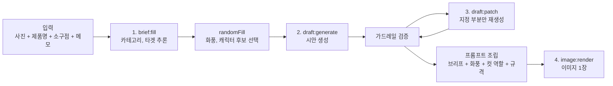

# 생성 파이프라인

모델을 부르는 쪽(`apps/ai-engine/`)의 설계입니다. 기획서 8절의 흐름과 11.1의 호출 구조를 구현
단위로 옮기고, 프롬프트와 가드레일이 어디에 놓이는지를 고정합니다.

경계 규칙(`ai-engine`은 `backend`를 import하지 않는다 등)은 [아키텍처.md](../공통_가이드/아키텍처.md)가
정본입니다. 여기서는 엔진 **안쪽**만 다룹니다.

## 1. 호출 구조와 비용

기획서 11.1을 그대로 옮긴 표입니다. 이 표가 이 프로젝트의 비용 구조 전부입니다.

| 단계 | 호출 성격 | 횟수 | 비용 성격 |
|---|---|---|---|
| 1. 브리프 채우기 | 사진을 읽는 호출 | 세션당 1회 | 고정 |
| 2. 시안 생성 | 텍스트 | 세션당 1회 | 고정 |
| 3. 부분 교체 | 텍스트 | 반복 | **변동** |
| 4. 최종 렌더 | 이미지 | 세션당 1회 | 고정, 단가 최대 |

- 변동 비용이 생기는 곳은 3단계뿐이고, 가장 비싼 4단계가 구조적으로 1회에 묶여 있습니다.
  이 성질은 [도메인_모델.md](도메인_모델.md) 7절의 INV-3으로 강제됩니다.
- 텍스트 구간의 횟수 제한은 이번 단계에서 두지 않습니다 (기획서 11.2).

## 2. 파이프라인

단방향입니다. 역방향 의존을 만들지 마세요 ([AGENTS.md](../../AGENTS.md) 아키텍처 규칙).

`randomFill`은 미선택 항목을 후보군에서 무작위로 채우는 동작입니다 (기획서 9.4). 프롬프트 조립과는
다른 단계이며, 결과가 브리프에 `filledBy: random`으로 기록되어 사용자가 보고 고칠 수 있습니다.

## 3. 단계별 계약

| 단계 | 입력 | 출력 | 판단이 서지 않을 때 | 의존이 죽었을 때 |
|---|---|---|---|---|
| `brief:fill` | 이미지, `productName`, `sellingPoint`, `note` | `category`, `target` | 자유 메모 요구 (기획서 9.3) | **열화**: 자동 채움 생략, `messageMode: degraded` |
| `draft:generate` | 브리프 전체 | 유형별 시안 ([도메인_모델.md](도메인_모델.md) 5절) | 거절 사유와 함께 반환 | 503 `UPSTREAM_UNAVAILABLE` |
| `draft:patch` | 시안 + 교체 지시 | 지정 부분만 바뀐 시안 | 원문 유지 | 503. 시안 원문 유지 |
| `image:render` | 브리프 + 확정 시안 + 규격 | 이미지 1장 | -- | 잡 `failed` ([API_계약.md](API_계약.md) 5절) |

**폴백은 `brief:fill` 한 곳뿐입니다** ([ADR-0005](../adr/0005-열화_폴백은_자동화_생략으로_한정.md)).
카피는 제품마다 달라 사전 승인 응답이 존재할 수 없으므로, 나머지 단계는 모델 없이 결과를
만들어 내지 않고 명시적으로 실패합니다. **모델 호출이 실패했을 때 규칙 기반으로 카피를 조립하는
코드를 쓰지 마세요** -- 그것이 곧 입력에 없는 주장을 내보내는 경로입니다.

`draft:patch`의 교체 대상에서 **`adPlan`은 빠집니다.** 브리프와 내용이 겹쳐 따로 고칠 수 있게
두면 둘이 서로 다른 말을 하기 때문이며, 서버가 422로 먼저 거절합니다
([도메인_모델.md](도메인_모델.md) 7절 INV-8). 엔진은 이 필드를 받지 않습니다.

`draft:patch`가 지정한 부분만 바꾼다는 것은 **모델에게 전체를 다시 쓰게 하지 않는다**는 뜻입니다.
전체 재생성 후 diff를 취하는 방식은 지정하지 않은 컷의 대사까지 조용히 바뀌므로 채택하지 않습니다.
교체 대상 밖의 필드는 서버가 원문을 그대로 되돌려 놓습니다.

## 4. 프롬프트 조립

기획서 9.2의 "내부 프롬프트 문구"가 여기 있습니다. 세션 데이터가 아니라 **코드에 있는 조립
규칙**입니다. 그래야 버전과 함께 재현됩니다.

브리프 필드가 아니므로 `visibility: hidden`도 아닙니다 -- 노출 등급은 스키마에 있는 값에만 붙는
말이고, 이것은 스키마에 아예 없습니다 ([용어_사전.md](용어_사전.md) 2.3절,
[도메인_모델.md](도메인_모델.md) 9절 14번).

조립 순서:

| 순서 | 조각 | 출처 |
|---|---|---|
| 1 | 역할 지시 (광고 소재 생성기) | 고정 문자열 |
| 2 | 표현 가이드라인 + 금지 사항 | 5절 |
| 3 | 제품 정보 (`productName`, `sellingPoint`, `note`) | 브리프 |
| 4 | 추론 결과 (`category`, `target`) | 브리프 |
| 5 | 화풍 (`artStyle`) | 브리프 |
| 6 | 유형별 지시 (컷 역할 6단계 / 단일 화면 구성) | 기획서 7.3 |
| 7 | 출력 규격 (해상도, 3x2 격자, 대사 길이) | 6절 |

- **프롬프트는 버전을 답니다.** 지표를 비교하려면 어떤 프롬프트로 뽑은 결과인지가 남아야 합니다.
  버전 없는 프롬프트 변경은 그 이전 실측을 전부 무효로 만듭니다.
- `randomFill`이 고른 값과 난수 시드를 함께 기록합니다. 재현 불가능한 결과는 실험 자료가 아닙니다.
- 프롬프트 문구를 커밋하는 것은 문제없지만, **API 키는 아닙니다** (`infra/.env`).

## 5. 가드레일

기획서 5.5와 9.4를 구현하는 자리입니다. 이 프로젝트에서 가드레일은 품질 장치가 아니라 **법적
장치**입니다 -- 입력에 없는 효능과 수치가 광고에 들어가면 표시광고법상 허위 및 과장 광고입니다.

### 5.1 두 지점

| 위치 | 무엇을 하는가 |
|---|---|
| 생성 전 (프롬프트) | 소구점 이외의 수치, 효능, 성분, 수상 이력, 타사 비교를 만들지 말라고 지시 |
| 생성 후 (출력 검증) | 생성된 텍스트의 주장이 근거 안에 있는지 확인. 위반 시 `unsupported_claim` |

지시만으로는 부족하고 검증만으로도 부족합니다. 앞의 것은 위반 빈도를 낮추고, 뒤의 것은 그럼에도
빠져나온 것을 잡습니다.

### 5.1.1 거절했을 때

| 회차 | 처리 |
|---|---|
| 1회차 위반 | 해당 부분을 **재생성**합니다. 클라이언트에는 보이지 않습니다 |
| 2회차 위반 | `CONTENT_POLICY_REJECTED`로 사용자에게 돌려줍니다 |

**재생성은 1회입니다.** 열어 두면 거절이 반복될 때 비용이 무한히 늡니다. 그리고 **위반한 문구를
서버가 임의로 다듬어 내보내지 않습니다** -- 다듬은 결과가 근거 안에 있는지를 다시 검사하는 사람이
아무도 없기 때문입니다. 근거는 [ADR-0005](../adr/0005-열화_폴백은_자동화_생략으로_한정.md)입니다.

### 5.2 근거의 범위

근거는 `sellingPoint` + `note`입니다. `category`와 `target`은 추론값이므로 근거가 아닙니다 --
추론으로 채운 카테고리를 근거 삼아 효능을 쓰면 지어낸 것이 됩니다 (기획서 9.3).

### 5.3 대조군

`guardrailApplied: false`로 실행한 결과와의 차이가 **보고 지표**입니다 (환각 억제율).
테스트를 통과시키려고 가드레일을 목으로 대체하면 지표 자체가 무효가 됩니다.

지표 함수는 [apps/ai-engine/eval/](../../apps/ai-engine/eval/)에 순수 함수로 둡니다. 모델을
호출하지 않습니다.

### 5.4 법률 대응 범위

완전 준수는 목표가 아닙니다 (기획서 9.4). 최소 가이드라인 + 면책 고지까지가 이번 범위이며,
고지 문구는 미정입니다 (18.1 #7).

## 6. 이미지 규격

기획서 10.2를 그대로 인용합니다. 값을 여기서 바꾸지 마세요 -- 바꿔야 하면 기획서를 고칩니다.

모델 제약 (`gpt-image-2`):

| 항목 | 값 |
|---|---|
| 긴 변 최대 | 3840px |
| 배수 조건 | 가로 세로 모두 16의 배수 |
| 총 픽셀 상한 | 약 8.29MP |
| 비율 상한 | 3:1 |

만화형 출력:

| 항목 | 값 |
|---|---|
| 전체 | 3456 x 2304 (약 7.96MP, 1.5:1) |
| 칸당 | 1152 x 1152 |

- 칸당 1152px는 인스타그램 권장치 1080px보다 크므로 업로드 시 축소만 발생합니다.
- 단일 광고형은 정사각이며 실제 픽셀 값은 미정입니다 (18.1 #8).
- **컷 경계를 프롬프트로 어떻게 맞출지는 검증되지 않았습니다** (15절 2순위, 18.1 #2).
  균등 분할이 나오지 않으면 후처리 합성으로 넘어가는 경로를 함께 검토합니다.

## 7. 대사 렌더링 (검증에 종속)

기획서 10.3의 결정은 **잠정**입니다. 15절 1순위 실험 결과에 따라 뒤집힙니다.

| 안 | 내용 | 따라오는 제약 |
|---|---|---|
| 본안 | 이미지 생성 시 대사까지 함께 그림 | 오타 수정 불가, 폰트 지정 불가, 대사 길이 제한 필요 |
| 예비안 | 말풍선만 그리고 글자는 비워 텍스트를 합성 | 합성 파이프라인 추가, 말풍선 위치 검출 필요 |

- 검증은 반드시 **6칸 조건(3456 x 2304)**으로 합니다. 정사각 한 장으로 테스트하면 실제보다 유리한
  결과가 나옵니다 (기획서 15절).
- 예비안으로 뒤집히면 바뀌는 것: `image:render`의 출력이 이미지 1장에서 이미지 + 좌표 정보가 되고,
  합성 단계가 파이프라인에 추가되며, 폰트 자산 확보가 새 선행 조건이 됩니다. 대사 길이 상한도
  다시 계산해야 합니다.

## 8. 모델 구성

기준은 전 구간 GPT API입니다 (기획서 13.2). 로컬 모델은 단일 광고형에 한해 비교 대상이며,
채택 여부는 15절 4순위 실험 결과에 달려 있습니다.

- **생성기 인터페이스는 하나로 둡니다.** GPT와 로컬 모델을 호출하는 코드가 갈라지면, 비교 실험이
  모델 차이가 아니라 구현 차이를 재게 됩니다.
- IP-Adapter는 로컬 모델 계열에서만 동작합니다. GPT API 구성에서는 적용할 수 없으므로, 캐릭터
  일관성 대책을 IP-Adapter에 의존해 설계하지 마세요 (18.1 #4, #5).
- 파인튜닝(LoRA)은 **보류**입니다. 기획서에 없는 경로이며, `training/`은 미채택 상태로 남아
  있습니다. 되살릴 조건은 ADR에 기록합니다.

## 9. 하지 않는 것

| 항목 | 이유 |
|---|---|
| 확정 전 이미지 생성 | 기획서 5.1의 핵심. 미리보기도 포함입니다 |
| 확정 후 재생성 | 미지원 (2차 고도화 후보) |
| 컷 수 가변 | 6컷 고정. 옵션으로 열지 않습니다 |
| 가드레일 우회 경로 | 지표가 무효가 됩니다 |
| 학습 코드 import | `training/`과 `apps/`는 파일로만 만납니다 |

## 10. 확정되지 않은 것

| 항목 | 종속 |
|---|---|
| 대사 렌더링 방식 | 15절 1순위 (18.1 #1) |
| 컷 경계 제어 방법 | 15절 2순위 (18.1 #2) |
| 화풍 후보 목록과 예시 이미지 | 18.1 #3 |
| 캐릭터 일관성 확보 수단 | 18.1 #4 |
| 로컬 모델 채택 여부 | 15절 4순위 (18.1 #5) |
| 대사 길이 상한 | 렌더링 검증 결과에 종속 |
