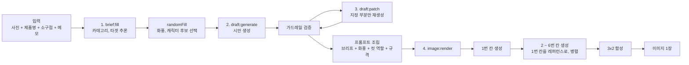

# 생성 파이프라인

모델을 부르는 쪽(`apps/ai-engine/`)의 설계입니다. 기획서 8절의 흐름과 11.1의 호출 구조를 구현
단위로 옮기고, 프롬프트와 가드레일이 어디에 놓이는지를 고정합니다.

경계 규칙(`ai-engine`은 `backend`를 import하지 않는다 등)은 [아키텍처.md](../공통_가이드/아키텍처.md)가
정본입니다. 여기서는 엔진 **안쪽**만 다룹니다.

## 1. 호출 구조와 비용

기획서 11.1을 그대로 옮긴 표입니다. 이 표가 이 프로젝트의 비용 구조 전부입니다.

| 단계 | 호출 성격 | 횟수 | 비용 성격 | 실측 단가 |
|---|---|---|---|---|
| 1. 브리프 채우기 | 사진을 읽는 호출 | 세션당 1회 | 고정 | 0.0084 USD |
| 2. 시안 생성 | 텍스트 | 세션당 1회 | 고정 | 단일 0.0193 / 만화 0.0221 USD |
| 3. 부분 교체 | 텍스트 | 반복 | **변동** | 0.0090 USD |
| 4. 최종 렌더 | 이미지 | 세션당 1회 (**만화형은 그 안에서 외부 호출 6회**) | 고정 | 단일 0.0069 / 만화 0.4041 USD |

**"4단계가 단가 최대" 는 만화형에서만 맞습니다** (2026-08-20 정정). 텍스트 단가를 실측하기
전까지 이 표는 4단계를 무조건 지배 항목으로 적었는데, 단일 광고형에서는 뒤집힙니다.

| 출력 유형 | 텍스트 (1 + 2단계) | 이미지 (4단계) | 세션 합계 | 텍스트 비중 |
|---|---|---|---|---|
| 단일 광고형 | 0.0277 USD | 0.0069 USD | 0.0346 USD | **80%** |
| 만화형 | 0.0305 USD | 0.4041 USD | 0.4346 USD | 7% |

**단일 광고형은 텍스트가 이미지보다 4배 비쌉니다.** 예산 상한을 이미지 기준으로만 잡으면 그
유형에서 틀립니다. 텍스트 단가의 전량 기록은
[verify06_text_cost/RESULTS.md](../../notebooks/hj/verify06_text_cost/RESULTS.md)이며, 검증
6순위의 나머지 절반입니다.

**추론 토큰이 텍스트 비용의 대부분입니다.** 출력 토큰의 70 ~ 96% 가 사용자에게 보이지 않는
추론 토큰이고, 입력은 단일 광고형 1회에서 전체의 2% 입니다. **프롬프트를 줄이는 최적화는
효과가 없고, 비용을 움직이려면 호출 횟수를 건드려야 합니다.**

- 변동 비용이 생기는 곳은 3단계뿐이고, **만화형에서 가장 비싼** 4단계가 구조적으로 1회에
  묶여 있습니다. 이 성질은 [도메인_모델.md](도메인_모델.md) 7절의 INV-3으로 강제됩니다.
- 텍스트 구간의 횟수 제한은 이번 단계에서 두지 않습니다 (기획서 11.2).
  주의: **단일 광고형에서는 이 결정이 곧 비용 상한이 없다는 뜻입니다** (2026-08-20 실측 이후).
  그 유형은 3단계 1회가 4단계 전체보다 비싸므로(0.0090 대 0.0069), 부분 교체를 반복하는
  사용자 한 명이 세션 비용을 몇 배로 늘립니다. 상한을 둘지는 기획서 11.2를 바꾸는 사안입니다.

**4단계의 "1회"가 외부 호출 1회를 뜻하지 않게 되었습니다** (2026-08-18, A-2 확정). 만화형은 칸을
따로 생성해 합성하므로 `image:render` 한 번에 외부 호출이 6회 나갑니다. **INV-3이 세는 것은 렌더
요청이지 외부 호출이 아니므로 불변식은 그대로입니다.**

호출이 6배가 되었는데 비용이 오르지 않은 것이 이 결정의 요점입니다.

| 방식 | 외부 호출 | 비용 | 소요 (순차 -> 병렬) |
|---|---|---|---|
| 한 장에 6칸 | 1회 | 0.1171 USD | 54 ~ 122초 |
| **컷별 + 합성 (`low`)** | **6회** | **0.0974 USD** | 132.4 -> **55.9초** |
| 컷별 + 합성 (`medium`) | 6회 | 0.4041 USD | 310.8 -> **139.2초** |

칸 하나가 전체 한 장보다 훨씬 싸기 때문이며, 6배를 곱해도 여전히 17% 저렴합니다. 다만
**`medium` 티어로 올리면 세트당 4.1배가 되고, 거기서부터는 비용이 실질적 제약이 됩니다** (6.2절).

**호출 수와 비용은 병렬로 바뀌지 않습니다. 줄어드는 것은 대기 시간뿐입니다.** 세 티어에서
55 ~ 59% 단축되었고, 단축 비율이 티어와 거의 무관했습니다 -- 생성 부하가 2.3배 차이나는데도
같은 구간입니다.

> **주의: 표본이 티어당 1세트입니다.** 세 티어가 같은 구간으로 모인 것이 서로를 보강하지만,
> 티어마다 한 번씩 잰 값이라는 성격은 그대로입니다. 전량 기록은
> [API생성_시험_보고서.md](../보고서/API생성_시험_보고서.md) E절입니다.

## 2. 파이프라인

단방향입니다. 역방향 의존을 만들지 마세요 ([AGENTS.md](../../AGENTS.md) 아키텍처 규칙).

**4단계 안쪽이 만화형에서만 갈라집니다.** 단일 광고형은 칸이 하나이므로 `RENDER`가 곧 `OUT`이고,
아래 세 노드를 지나지 않습니다.

`P1`이 먼저이고 `PN`이 병렬인 이유는 **의존 방향 때문입니다.** 2 ~ 6번 칸은 서로가 아니라 전부
1번 칸만 레퍼런스로 봅니다. 그래서 1번만 만들어지면 나머지는 순서가 필요 없습니다. 직전 칸을
레퍼런스로 넘기는 방식(reference chain)을 쓰면 칸끼리 의존이 생겨 **이 병렬이 성립하지 않으므로
채택하지 않습니다.**

`randomFill`은 미선택 항목을 후보군에서 무작위로 채우는 동작입니다 (기획서 9.4). 프롬프트 조립과는
다른 단계이며, 결과가 브리프에 `filledBy: random`으로 기록되어 사용자가 보고 고칠 수 있습니다.

## 3. 단계별 계약

| 단계 | 입력 | 출력 | 판단이 서지 않을 때 | 의존이 죽었을 때 |
|---|---|---|---|---|
| `brief:fill` | 이미지, `productName`, `sellingPoint`, `note` | `category`, `target` | 자유 메모 요구 (기획서 9.3). `needsInput` | **열화**: 자동 채움 생략. `state: brief_filling` + `messageMode: degraded` |
| `draft:generate` | 브리프 전체 | 유형별 시안 ([도메인_모델.md](도메인_모델.md) 5절) | 거절 사유와 함께 반환 | 503 `UPSTREAM_UNAVAILABLE` |
| `draft:patch` | 시안 + 교체 지시 | 지정 부분만 바뀐 시안 | 원문 유지 | 503. 시안 원문 유지 |
| `image:render` | 브리프 + 확정 시안 + 규격 | 이미지 1장 (만화형은 칸 6장을 합성한 결과) | -- | 잡 `failed` ([API_계약.md](API_계약.md) 5절) |

**폴백은 `brief:fill` 한 곳뿐입니다** ([ADR-0005](../adr/0005-열화_폴백은_자동화_생략으로_한정.md)).
카피는 제품마다 달라 사전 승인 응답이 존재할 수 없으므로, 나머지 단계는 모델 없이 결과를
만들어 내지 않고 명시적으로 실패합니다. **모델 호출이 실패했을 때 규칙 기반으로 카피를 조립하는
코드를 쓰지 마세요** -- 그것이 곧 입력에 없는 주장을 내보내는 경로입니다.

`draft:patch`의 교체 대상에서 **`adPlan`은 빠집니다.** 브리프와 내용이 겹쳐 따로 고칠 수 있게
두면 둘이 서로 다른 말을 하기 때문이며, 서버가 422로 먼저 거절합니다
([도메인_모델.md](도메인_모델.md) 7절 INV-8). 엔진은 이 필드를 받지 않습니다.

`draft:patch`가 지정한 부분만 바꾼다는 것은 **모델에게 전체를 다시 쓰게 하지 않는다**는 뜻입니다.
전체 재생성 후 diff를 취하는 방식은 지정하지 않은 컷의 대사까지 조용히 바뀌므로 채택하지 않습니다.
교체 대상 밖의 필드는 서버가 원문을 그대로 되돌려 놓습니다.

**`image:render`의 실패는 칸 단위가 아니라 잡 단위입니다.** 만화형은 외부 호출이 6회이므로 그중
하나만 죽는 상태가 생기는데, 이때 **성공한 칸을 살려 두거나 실패한 칸만 다시 부르지 않고 잡
전체를 `failed`로 끝냅니다.** 이유는 둘입니다: 4칸짜리 결과물은 6컷 고정 규격을 깨고, 실패한 칸만
재호출하는 경로는 "확정 후 재생성"과 구조가 같아져 렌더 1회 제한(INV-3)이 실질적으로 무너집니다.

이것은 **잠정안이며 대가가 비용입니다** -- 5칸이 성공한 세트를 통째로 버립니다
([미결정_대장.md](미결정_대장.md) N20-a).

## 4. 프롬프트 조립

기획서 9.2의 "내부 프롬프트 문구"가 여기 있습니다. 세션 데이터가 아니라 **코드에 있는 조립
규칙**입니다. 그래야 버전과 함께 재현됩니다.

브리프 필드가 아니므로 `visibility: hidden`도 아닙니다 -- 노출 등급은 스키마에 있는 값에만 붙는
말이고, 이것은 스키마에 아예 없습니다 ([용어_사전.md](용어_사전.md) 2.3절,
[도메인_모델.md](도메인_모델.md) 9절 14번).

조립 순서:

| 순서 | 조각 | 출처 |
|---|---|---|
| 1 | 역할 지시 (광고 소재 생성기) | 고정 문자열 |
| 2 | 표현 가이드라인 + 금지 사항 | 5절 |
| 3 | 제품 정보 (`productName`, `sellingPoint`, `note`) | 브리프 |
| 4 | 추론 결과 (`category`, `target`) | 브리프 |
| 5 | 화풍 (`artStyle`) | 브리프 |
| 6 | 유형별 지시 (컷 역할 6단계 / 단일 화면 구성) | 기획서 7.3 |
| 7 | 출력 규격 (해상도, 3x2 격자, 대사 길이) | 6절 |

- **프롬프트는 버전을 답니다.** 지표를 비교하려면 어떤 프롬프트로 뽑은 결과인지가 남아야 합니다.
  버전 없는 프롬프트 변경은 그 이전 실측을 전부 무효로 만듭니다.
- `randomFill`이 고른 값과 난수 시드를 함께 기록합니다. 재현 불가능한 결과는 실험 자료가 아닙니다.
- 프롬프트 문구를 커밋하는 것은 문제없지만, **API 키는 아닙니다** (`infra/.env`).

## 5. 가드레일

기획서 5.5와 9.4를 구현하는 자리입니다. 이 프로젝트에서 가드레일은 품질 장치가 아니라 **법적
장치**입니다 -- 입력에 없는 효능과 수치가 광고에 들어가면 표시광고법상 허위 및 과장 광고입니다.

### 5.1 두 지점

| 위치 | 무엇을 하는가 |
|---|---|
| 생성 전 (프롬프트) | 소구점 이외의 수치, 효능, 성분, 수상 이력, 타사 비교를 만들지 말라고 지시 |
| 생성 후 (출력 검증) | 생성된 텍스트의 주장이 근거 안에 있는지 확인. 위반 시 `unsupported_claim` |

지시만으로는 부족하고 검증만으로도 부족합니다. 앞의 것은 위반 빈도를 낮추고, 뒤의 것은 그럼에도
빠져나온 것을 잡습니다.

### 5.1.1 거절했을 때

| 회차 | 처리 |
|---|---|
| 1회차 위반 | 해당 부분을 **재생성**합니다. 클라이언트에는 보이지 않습니다 |
| 2회차 위반 | `CONTENT_POLICY_REJECTED`로 사용자에게 돌려줍니다 |

**재생성은 1회입니다.** 열어 두면 거절이 반복될 때 비용이 무한히 늡니다. 그리고 **위반한 문구를
서버가 임의로 다듬어 내보내지 않습니다** -- 다듬은 결과가 근거 안에 있는지를 다시 검사하는 사람이
아무도 없기 때문입니다. 근거는 [ADR-0005](../adr/0005-열화_폴백은_자동화_생략으로_한정.md)입니다.

### 5.2 근거의 범위

근거는 `sellingPoint` + `note` + `productName`입니다. `category`와 `target`은 추론값이므로
근거가 아닙니다 -- 추론으로 채운 카테고리를 근거 삼아 효능을 쓰면 지어낸 것이 됩니다
(기획서 9.3).

**제품명이 근거에 들어가는 것은 근거를 넓히기 위해서가 아닙니다** (2026-08-20 추가). 사용자가
직접 친 글자를 우리가 지어낸 것으로 세지 않기 위해서입니다. 제품명이 `3겹 물티슈`인데 카피가
`3겹`이라고 쓰면 그 수치는 우리가 만든 것이 아닌데, 제품명을 근거에서 빼면 출력 검증이 그것을
`number` 위반으로 잡습니다. 제품명은 효능을 실어 올 수 없으므로 근거의 성격은 그대로입니다.

**제품명이 바뀌어 나오는 경우는 이 규칙으로 걸러지지 않습니다.** `상큼레몬아이스`가 카피에서
`새콤라임아이스`가 되는 일은 얼마든지 일어나고, 그것은 근거 밖 주장이 아니라 **제품 식별이
틀린 것**이라 5.1절의 네 갈래(수치, 비교, 최상급, 수상)에 걸리지 않습니다. 검출 대상을 넓히는
문제이므로 여기서 정하지 않고, 관측되면 ADR-0019의 재검토 신호로 다룹니다.

### 5.3 대조군

`guardrailApplied: false`로 실행한 결과와의 차이가 **보고 지표**입니다 (환각 억제율).
테스트를 통과시키려고 가드레일을 목으로 대체하면 지표 자체가 무효가 됩니다.

지표 함수는 [apps/ai-engine/eval/](../../apps/ai-engine/eval/)에 순수 함수로 둡니다. 모델을
호출하지 않습니다.

### 5.4 법률 대응 범위

완전 준수는 목표가 아닙니다 (기획서 9.4). 최소 가이드라인 + 면책 고지까지가 이번 범위이며,
고지 문구는 미정입니다 (18.1 #7).

## 6. 이미지 규격

값의 출처는 기획서 10.2입니다. **다만 만화형을 만드는 방법은 2026-08-18에 바뀌었고, 기획서는 아직
그 이전 방식을 서술하고 있습니다** ([회의록](../회의록/2026-08-18_이미지_생성_경로_결정.md) 2번).
기획서 반영은 PM 소관이라 대기 중입니다 ([미결정_대장.md](미결정_대장.md) E-2).

> **그때까지 이 절이 만화형 생성 방법의 정본입니다.** 숫자(3456 x 2304, 1152 x 1152)는 기획서와
> 같으며 바뀌지 않았습니다. 어긋나는 것은 **그 숫자에 도달하는 방법**뿐입니다.

모델 제약 (`gpt-image-2`):

| 항목 | 값 |
|---|---|
| 긴 변 최대 | 3840px |
| 배수 조건 | 가로 세로 모두 16의 배수 |
| 총 픽셀 상한 | 약 8.29MP |
| 비율 상한 | 3:1 |

만화형 출력:

| 항목 | 값 |
|---|---|
| 전체 | 3456 x 2304 (약 7.96MP, 1.5:1) |
| 칸당 | 1152 x 1152 |
| **생성 방법** | **칸을 1152 x 1152로 따로 생성해 3x2로 합성** |
| **경계선과 여백** | **0px** (합성이 결정하므로 회차 편차가 없습니다) |

- 칸당 1152px는 인스타그램 권장치 1080px보다 크므로 업로드 시 축소만 발생합니다.
- 단일 광고형은 정사각이며 실제 픽셀 값은 미정입니다 (18.1 #8). 칸이 하나이므로 합성 단계를
  지나지 않습니다.

### 6.1 왜 한 장에 6칸을 그리지 않는가

**칸 규격이 그 방식으로는 달성되지 않기 때문입니다.** 3456 / 3 = 1152 라는 계산은 경계선과 바깥
여백이 정확히 0일 때만 성립하는데, 모델에게 한 장을 통째로 그리게 하면 그 값이 회차마다 흔들립니다.

| 방식 | 칸 폭 | 바깥 여백 | 고정 좌표 크롭 |
|---|---|---|---|
| 한 장에 6칸 | 1101 ~ 1142px | 14 ~ 36px | **성립하지 않음** |
| 컷별 + 합성 | **1152px 정확** | **0px** | 성립 |

3456px 안에 칸 3개와 안쪽 경계 2개와 바깥 여백 2개가 들어갑니다. **경계선을 그리라고 지시한
이상 칸은 반드시 1152px보다 작아집니다.** 규격이 달성되지 않는 것이 모델의 실수가 아니라
산술입니다.

고정 좌표 크롭이 성립하지 않으면 인스타그램 그리드나 캐러셀로 자를 때 칸이 어긋납니다. 그리고
이 문제는 **Y/N 판정으로 잡히지 않습니다** -- "6칸이 균등하게 나뉘었는가"만 보면 30건 전부
통과입니다. 픽셀을 재야 드러납니다.

**전제 두 개가 실측으로 뒤집혀서 이 전환이 가능해졌습니다.** 원래는 호출 수가 6배라 비용 때문에
조건부로만 검토하기로 했었습니다 (1절 표 참고). 실제로는 `low` 기준 17% 저렴하고, 병렬 호출로
시간 대가도 사라졌습니다 -- `low` 병렬 55.9초는 한 장 생성(54 ~ 122초)과 같은 구간입니다.

**그래서 컷별 생성의 대가로 남는 것은 삽화 완성도 하나뿐이고**, 그것은 품질 티어를 올려 다루는
축입니다 (6.2절).

### 6.2 품질 티어는 출력 유형별로 고정합니다

| 출력 유형 | `quality` | 세트당 단가 |
|---|---|---|
| 만화형 | **`medium`** | 0.4041 USD |
| 단일 광고형 | **`low`** | 0.0069 USD |

**지정하지 않는 선택지는 없습니다.** 비우면 모델이 회차마다 티어를 골라 같은 요청의 비용이 최대
9배까지 흔들립니다 (2026-08-13, 08-15 실측).

**만화형만 `medium`인 이유는 `low`에서 실제 결함이 관측되었기 때문입니다.** 컵이 기울지 않았는데
커피가 쏟아지거나 팔의 해부가 어색한 사례가 나왔고, 광고 소재의 상품성이 목적인 이상 무시할 수
없습니다. 단일 광고형에서는 같은 결함이 확인되지 않아 `low`를 유지합니다.

**대가는 비용이 판단 축으로 돌아온다는 것입니다.** `medium` 은 `low` 의 4.1배이고, 남은 예산
약 24 USD 중 만화형 몫이 20 USD 이므로 **약 49세트가 상한**입니다. 반면 단일 광고형은 같은
상한에서 수천 장이 나오므로 비용이 판단 축이 아닙니다. 두 유형을 한 문장으로 묶어 "비용은 문제가
아니다"라고 쓰면 틀립니다.

**개발 중에는 스텁 모드나 `low`로 돌리고 `medium`은 최종 확인에만 씁니다.**

**두 값이 어디서 들어오는지는 2026-08-20에 정해졌습니다 -- 요청이 티어를 실어 보냅니다**
([미결정_대장.md](미결정_대장.md) E-2). 계약의 `ImageQuality`가 그 통로이고, 값의 정본은
호출자인 backend의 `COMIC_QUALITY` / `SINGLE_AD_QUALITY` 상수입니다. 엔진이 `outputType`에서
유도하지 않는 이유는 `spec`과 같습니다 -- 같은 결정이 두 곳에 생기면 한쪽만 고치는 순간
어긋납니다. 모델에게 맡기는 선택지가 없으므로 벤더의 `auto`는 계약의 열거에 넣지 않았습니다.

**개발과 검증 실험을 `low`로 돌리는 것은 엔진 쪽 `ADGEN_IMAGE_QUALITY_OVERRIDE`로 합니다.**
backend의 상수를 고쳐서 하면 그 값이 그대로 배포됩니다. override가 발동하면 경고 로그가 남으며,
**그 상태로 잰 숫자는 운영 경로의 숫자가 아닙니다.**

## 7. 대사 렌더링 (2026-08-18 확정)

**본안입니다. 이미지 생성 시 대사까지 함께 그리고, 텍스트를 따로 합성하지 않습니다.** 근거는
[회의록](../회의록/2026-08-18_이미지_생성_경로_결정.md) 1번이며, 기획서 10.3의 방향이 실측으로
확인된 것입니다.

| 안 | 내용 | 판정 |
|---|---|---|
| **본안** | 이미지 생성 시 대사까지 함께 그림 | **채택** |
| 예비안 | 말풍선만 그리고 글자는 비워 텍스트를 합성 | **미채택** |

**정확도로는 갈리지 않았습니다.** 짧은 대사(9 ~ 15자)에서 본안 20회와 예비안 10회 모두 판정자
3명 전원 100%였고, 120칸에서 오탈자가 0건이었습니다. 예비안이 34% 저렴하기까지 했습니다.

**그럼에도 본안인 이유는 예비안의 대가가 폰트 자산 하나가 아니기 때문입니다.** 생성된 이미지에서
말풍선의 위치를 사후에 찾아내는 단계가 함께 붙는데, 이번 시험은 그것이 가능하다는 증거를 주지
않았습니다 -- **직선인 격자 경계조차 규격보다 14 ~ 36px 어긋났습니다** (6.1절). 곡선인 말풍선을
안정적으로 검출하는 것은 그보다 어려운 요구입니다. 검증되지 않은 단계를 사면서 34%를 아끼는
거래가 성립하지 않습니다.

### 7.1 따라오는 제약

본안을 택했으므로 기획서 10.3이 적은 제약이 그대로 유효합니다.

| 제약 | 내용 |
|---|---|
| 오타 수정 | **불가.** 확정 후 재생성을 지원하지 않으므로 (B-13) 오타는 사실상 고칠 수 없습니다 |
| 폰트 지정 | 불가. 모델이 그립니다 |
| 대사 길이 | **상한이 필요합니다.** 30자 문장에서 조사 "을"이 "올"로 그려진 사례가 나왔습니다 |

**대사 길이 상한의 수치는 아직 없습니다. 다만 실험 몫은 끝났습니다**
([미결정_대장.md](미결정_대장.md) N18-a, 2026-08-20 판정 완료). 운영 조건(컷별 생성,
`medium`)에서 **15 ~ 25자가 전부 무오탈자**입니다. 상한을 25자로 두는 것을 이 실험이 막지
않지만, 근거는 "25자까지 실패가 없었다"이지 "25자가 한계다"가 아닙니다 -- **26자 이상은
재지 않았습니다.**

주의: **위 표의 30자는 한 장에 6칸을 그리던 조건의 숫자입니다.** 운영 경로는
[ADR-0017](../adr/0017-만화형은_칸을_따로_생성해_합성한다.md)로 바뀌었고, 같은 대사를 면적
1/6에 그린 조건이라 운영보다 불리합니다. 그 값을 상한의 근거로 그대로 옮기면 카피가 실제보다
짧게 묶입니다.

상한을 넘는 카피가 `draft:generate`에서 나왔을 때 재생성할지 거절할지도 함께 정해야 합니다.
**이쪽은 실험이 답할 수 없는 설계 결정이고, 수치만 정하고 비워 두면 구현이 다시 멈춥니다.**

주의: **세는 규칙은 `len()`입니다** -- 공백과 문장부호를 포함합니다. 상한을 집행할 쪽이
`draft:generate`의 검사 코드이므로, 코드가 셀 수 있는 정의가 아니면 집행되지 않습니다.
위 자릿수는 2026-08-20 에 이 규칙으로 다시 세어 정정한 값입니다 (그전 문서들은 6 ~ 14자와
27자로 적고 있었습니다).

**검증 조건의 한계를 함께 봅니다.** 통과한 대사는 짧은 순한국어였고 영어와 숫자, 고유명사가
섞이지 않았습니다. 이 통과가 긴 문장이나 영어 혼용까지 보증하지 않습니다.

## 8. 모델 구성

기준은 전 구간 GPT API입니다 (기획서 13.2). 로컬 모델은 단일 광고형에 한해 비교 대상이며,
채택 여부는 15절 4순위 실험 결과에 달려 있습니다.

- **생성기 인터페이스는 하나로 둡니다.** GPT와 로컬 모델을 호출하는 코드가 갈라지면, 비교 실험이
  모델 차이가 아니라 구현 차이를 재게 됩니다.
- IP-Adapter는 로컬 모델 계열에서만 동작합니다. GPT API 구성에서는 적용할 수 없으므로, 캐릭터
  일관성 대책을 IP-Adapter에 의존해 설계하지 마세요 (18.1 #4, #5).
- 파인튜닝(LoRA)은 **보류**입니다. 기획서에 없는 경로이며, `training/`은 미채택 상태로 남아
  있습니다. 되살릴 조건은 ADR에 기록합니다.

## 9. 하지 않는 것

| 항목 | 이유 |
|---|---|
| 확정 전 이미지 생성 | 기획서 5.1의 핵심. 미리보기도 포함입니다 |
| 확정 후 재생성 | 미지원 (2차 고도화 후보) |
| 컷 수 가변 | 6컷 고정. 옵션으로 열지 않습니다 |
| 가드레일 우회 경로 | 지표가 무효가 됩니다 |
| 학습 코드 import | `training/`과 `apps/`는 파일로만 만납니다 |

## 10. 확정되지 않은 것

| 항목 | 종속 |
|---|---|
| 화풍 후보 목록과 예시 이미지 | 18.1 #3 |
| 캐릭터 일관성 확보 수단 | 18.1 #4 |
| 로컬 모델 채택 여부 | 15절 4순위 (18.1 #5) |
| 대사 길이 상한 수치 | [미결정_대장.md](미결정_대장.md) N18. 15 ~ 25자를 두 자 간격으로 재는 회차(`--variant mid`) |
| 잡 단위 동시 실행 상한과 `render_timeout_s` | 같은 문서 N19. 컷별 생성 구현과 같은 시점 |
| 컷 부분 실패 처리 | 같은 문서 N20. 잠정안은 잡 전체 실패 (3절) |
| `quality` 를 출력 유형별로 줄 수 있는가 | 설정 항목이 단일 값입니다 (6.2절) |

**대사 렌더링 방식과 컷 경계 제어는 2026-08-18에 닫혔습니다** (7절, 6절). 아래 셋은 그 둘을 닫은
대가로 새로 생긴 항목입니다 -- **결정이 없어진 것이 아니라 더 좁은 결정으로 옮겨간 것**이므로,
구현을 시작해도 되지만 이 셋을 비워 둔 채로 끝낼 수는 없습니다.
