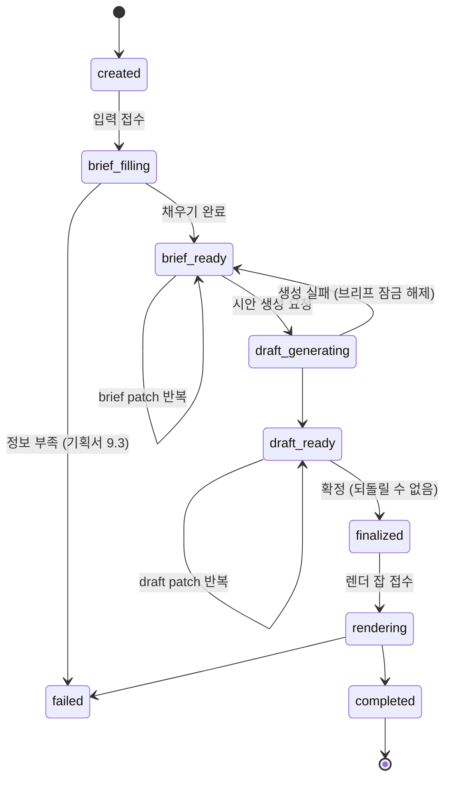

# 용어 사전

기획서의 한국어 용어를 코드 식별자로 옮기는 대응표입니다. **기술문서군에서 가장 먼저 합의해야
하는 문서**입니다. 스키마와 API가 전부 이 표 위에 올라가므로, 여기서 이름이 바뀌면 뒤따르는
문서가 함께 흔들립니다.

- 정본은 [기획서](../기획서/기획서.md)입니다. 이 문서는 기획서의 뜻을 바꾸지 않고 **이름만**
  고정합니다. 뜻을 바꿔야 한다면 기획서를 먼저 고칩니다 (기획서 14.3).
- 문서는 한글, 코드와 계약은 영어입니다 ([AGENTS.md](../../AGENTS.md) 명명 규약).
- 이 표에 없는 도메인 용어를 코드에 새로 만들지 마세요. 먼저 여기에 추가하고 쓰는 것이 순서입니다.

## 1. 이름이 겹치는 네 곳 (먼저 읽을 것)

기획서를 그대로 코드로 옮기면 같은 말이 서로 다른 것을 가리키게 되는 지점이 네 군데 있습니다.

### 1.1 "기획서"가 세 가지를 가리킵니다

| 기획서에서의 쓰임 | 무엇인가 | 이 문서의 이름 |
|---|---|---|
| `docs/기획서/기획서.md` | 팀이 합의한 기획 문서 | **기획서** (문서를 가리킬 때만 씁니다) |
| "기획서 채우기" (8절 P1) | 시스템이 채우는 제작 정보 묶음 | **브리프** / `brief` |
| "광고 기획서" (7.1, 8절 A2) | 시안에 딸려 나오는 생성물 (두 유형 공통) | **광고 기획안** / `adPlan` |

세 번째는 두 번째의 하위가 아니라 **시안(`draft`)의 구성 요소**입니다. 브리프는 그림을 그리기 전에
채우는 입력이고, 광고 기획안은 브리프에서 생성되는 산출물입니다.

### 1.2 "템플릿"이 출력 유형을 뜻합니다

기획서 12.3의 "템플릿 선택"은 화면 문구이고, 고르는 대상은 만화형 / 단일 광고형입니다. 코드에서
`template`은 프롬프트 템플릿과 충돌하므로 도메인 식별자로 쓰지 않습니다.

- 화면 문구: "템플릿" (기획서 그대로)
- 코드 식별자: `outputType`

### 1.3 "생성"이 텍스트와 이미지 양쪽에 쓰입니다

둘은 비용도 되돌릴 수 있는지도 다릅니다. 같은 동사로 부르면 "생성 1회 제한"이 어느 쪽 이야기인지
코드에서 사라집니다.

| 대상 | 동사 | 횟수 |
|---|---|---|
| 브리프, 시안 (텍스트) | `generate` | 제한 없음 (기획서 5.1) |
| 최종 이미지 | `render` | 세션당 1회 (기획서 11.1) |

### 1.4 "완료"가 세션과 잡 양쪽에 있습니다

세션과 잡은 1:1이지만 **수명이 다릅니다.** 세션은 입력부터 결과 회수까지이고, 잡은 렌더 실행
구간뿐입니다. 둘 다 종료 상태를 가지므로 이름이 같으면 로그에서 어느 층의 이야기인지 사라집니다.

| 층 | 성공 | 실패 |
|---|---|---|
| 세션 (`state`) | `completed` | `failed` |
| 잡 (`status`) | `done` | `failed` |

- 성공 쪽 이름을 갈랐습니다. **세션은 `completed`, 잡은 `done`**입니다.
- 바꾼 쪽이 세션인 이유는 잡 상태값이 이미 계약 표면에 있기 때문입니다
  ([API_계약.md](API_계약.md) 2.1절의 잡 조회 응답). 세션 상태는 아직 계약에 노출된 적이 없어
  바꾸는 비용이 쌉니다.
- `failed`는 양쪽에 남습니다. 이것은 겹침이 아니라 **같은 사건**입니다 -- 잡이 실패하면 세션도
  실패로 끝납니다. 잡 없이 실패하는 경로는 정보 부족 하나뿐입니다 (기획서 9.3).

## 2. 핵심 용어표

### 2.1 흐름

| 기획서 용어 | 식별자 | 뜻 |
|---|---|---|
| (없음. 사람 한 명) | `user` / `userId` | 계정 하나. 세션 여러 개를 소유합니다 |
| (없음. 제작 1회분) | `session` | 입력부터 결과 이미지까지의 한 흐름. 확정 후 재생성이 없으므로 다시 만들려면 새 세션입니다 |
| 기획서 채우기 | `brief` | 제작에 필요한 정보 묶음. 사용자 입력 + 추론 + 랜덤 + 기본값 |
| 시안 | `draft` | 확정 전에 사용자가 보고 고치는 텍스트 산출물 |
| 부분 단위 수정 | `patch` | 지정한 부분만 교체하고 나머지는 서버가 원문 그대로 둡니다 |
| 수정 엔진 | patch engine | 유형과 무관하게 하나로 구현합니다 (기획서 5.3) |
| 확정 | `finalize` | 이후 어떤 필드도 바뀌지 않습니다 |
| 최종 이미지 생성 | `render` | 확정 이후 1회 |
| (없음. 렌더 1건) | `job` / `jobId` | 비동기 렌더 작업 단위. 세션과 1:1이지만 수명이 다릅니다 |

### 2.1.1 계정 (기획서 17.1)

로그인은 **아이디와 비밀번호**입니다. 근거와 취급 규칙은
[세션_보관_정책.md](세션_보관_정책.md) 1절이 정본입니다.

| 기획서 용어 | 식별자 | 뜻 |
|---|---|---|
| 로그인 아이디 | `loginId` | 사용자가 입력하는 문자열. 계정 안에서 유일합니다 |
| (없음. 내부 식별자) | `userId` | 서버가 발급하는 UUID. 다른 데이터가 참조하는 것은 이쪽입니다 |
| 비밀번호 | `password` | **요청 본문에만 존재합니다.** 저장되는 것은 `passwordHash`뿐입니다 |
| (없음) | `passwordHash` | 해시 결과. 응답에 절대 실리지 않습니다 |

`loginId`와 `userId`를 가른 이유는 **아이디가 바뀔 수 있기 때문**입니다. 세션이 `loginId`를
참조하면 아이디 변경이 데이터 이관 작업이 됩니다.

### 2.2 입력 (기획서 9.1)

| 기획서 용어 | 식별자 | 타입 | 필수 |
|---|---|---|---|
| 출력 유형 | `outputType` | `comic` / `single_ad` | 필수 |
| 제품 이미지 | `productImage` | 업로드 1장 | 필수 |
| 제품명 | `productName` | 문자열 | 필수 |
| 제품 소구점 | `sellingPoint` | 문자열 | 필수 |
| 화풍 | `artStyle` | 후보 식별자 | 선택 (미선택 시 랜덤) |
| 자유 메모 | `note` | 문자열 (최대 500자) | 선택 |

- `sellingPoint`는 가드레일의 **근거 원문**입니다. 여기에 없는 수치와 효능은 생성물에 등장할 수
  없습니다 (기획서 5.5, 9.3). 내부에서 주장 단위로 쪼갠 것은 `claims`라고 부릅니다.
- **`productImage`는 올리는 파일입니다.** 그것이 브리프에 저장된 뒤의 참조는
  `productImageUrl`이며 이름이 다릅니다 ([도메인_모델.md](도메인_모델.md) 3절). 하나는 요청의
  multipart 파트이고 다른 하나는 응답의 URL이라, 같은 이름을 쓰면 타입이 둘인 필드가 됩니다.

### 2.3 브리프 항목 (기획서 9.2)

| 기획서 용어 | 식별자 | 채움 주체 | 노출 등급 | 적용 유형 |
|---|---|---|---|---|
| 카테고리 | `category` | `inferred` | `editable` | 공통 |
| 타겟 | `target` | `inferred` | `editable` | 공통 |
| 화풍 | `artStyle` | `user` 또는 `random` | `editable` | 공통 |
| 캐릭터 (외형, 복장) | `character` (`appearance`, `outfit`) | `random` + `note` 조건 | `editable` | 만화형 |
| 컷 수 | `panelCount` | `fixed` (6) | `hidden` | 만화형 |
| 이미지 비율 | `aspectRatio` | `default` | `editable` | 단일 광고형 |

기획서 9.2의 **`내부 프롬프트 문구`는 여기에 없습니다.** 브리프 항목처럼 나열되어 있지만 세션에
저장되는 값이 아니라 프롬프트 조립 규칙이며, 버전과 함께 코드에 있어야 재현이 됩니다. 이름은
2.6절의 `internalPrompt`이고 소관은 [생성_파이프라인.md](생성_파이프라인.md) 4절입니다.

기획서 9.2의 **`출력 유형`도 여기에 없습니다.** 브리프가 아니라 세션에 하나만 둡니다 (1.2절,
[도메인_모델.md](도메인_모델.md) 2절). 브리프에도 사본을 두면 부분 교체로 두 값이 어긋납니다.

### 2.4 시안 구성 (기획서 6절, 7.3, 8절)

| 기획서 용어 | 식별자 | 적용 유형 |
|---|---|---|
| 스토리보드 | `panels` (별도 필드가 아니라 컷 배열 자체) | 만화형 |
| 컷 | `panel` (6개 고정) | 만화형 |
| 컷별 역할 | `role` | 만화형 |
| 장면 | `scene` | 만화형 |
| 대사 | `dialogue` | 만화형 |
| 광고 기획안 | `adPlan` | 공통 |
| 카피 | `copy` | 단일 광고형 |
| 비주얼 구성안 | `visualPlan` | 단일 광고형 |

컷별 역할값 (기획서 7.3의 6단계와 1:1):

| 컷 | 기획서 | 식별자 |
|---|---|---|
| 1 | 후킹 | `hook` |
| 2 | 상황 제시 | `setup` |
| 3 | 문제 / 고민 | `problem` |
| 4 | 제품 등장 및 해결 | `solution` |
| 5 | 성능 및 효과 | `proof` |
| 6 | 만족 및 CTA | `cta` |

- `storyboard`라는 식별자는 만들지 않습니다. 기획서의 "스토리보드"가 가리키는 것은 컷 6개를 묶은
  것이고 그것이 곧 `panels`이므로, 이름을 하나 더 두면 같은 것에 두 개의 이름이 생깁니다.
- `adPlan`은 **서술형 문단 하나(문자열)이며 읽기 전용**입니다. 브리프와 내용이 겹치므로 사용자가
  고치는 대상은 브리프 쪽이고, 광고 기획안은 그 결과로 다시 생성됩니다.

### 2.5 메타 정보 (기획서 5.4, 9.2)

| 기획서 용어 | 식별자 | 값 |
|---|---|---|
| 노출 등급 | `visibility` | `hidden` / `editable` |
| 채움 주체 | `filledBy` | `user` / `inferred` / `random` / `default` / `fixed` / `system` |
| (없음. 수정 충돌 방지) | `revision` | 정수. 값이 어긋나면 409 |

- `filledBy`는 "누가 채웠는가"를 결과에 남기기 위한 것입니다. 사용자가 자동으로 채워진 값을
  알아보고 고칠 수 있어야 한다는 기획서 5.4의 요구를 화면이 아니라 **데이터로** 만족시킵니다.
- 기획서 9.2의 "고정값"은 `fixed`, "기본값"은 `default`로 구분합니다. 전자는 사용자가 바꿀 수
  없고 (컷 수), 후자는 미리 채워져 있을 뿐 바꿀 수 있습니다 (이미지 비율).

### 2.6 안전 장치 (기획서 9.4)

| 기획서 용어 | 식별자 | 비고 |
|---|---|---|
| 히든 프롬프트 | `internalPrompt` + `randomFill` | 아래 주의 참고 |
| 최소 가이드라인 | `guardrail` | 스켈레톤의 기존 이름을 그대로 씁니다 |
| 면책 고지 | `disclaimer` | 문구는 미정 (기획서 18.1 #7) |
| 입력에 없는 주장 | `unsupported_claim` | 스켈레톤의 기존 위반 코드를 재사용합니다 |

주의: 기획서 9.4의 "히든 프롬프트"는 **두 가지 다른 일**을 한 이름으로 묶고 있습니다. 하나는
사용자에게 보이지 않는 지시문(`internalPrompt`), 다른 하나는 미선택 항목을 후보군에서 무작위로
채우는 동작(`randomFill`)입니다. 앞의 것은 프롬프트 조립, 뒤의 것은 브리프 채우기 소관이라 구현
위치가 다르므로 코드에서는 분리합니다. 또한 `hidden`은 `visibility` 값으로 이미 쓰이므로,
프롬프트를 가리킬 때 "히든"이라는 말을 코드에 쓰지 않습니다.

## 3. 상태값

값 표기는 계약 규약에 따라 소문자 `snake_case`입니다 (4절).

### 3.1 세션 상태 (`state`)

- **브리프를 고칠 수 있는 구간은 `brief_ready`까지입니다.** 시안 생성을 요청하는 순간
  (`draft_generating` 진입) 브리프는 잠깁니다. 시안이 브리프에서 나온 산출물이라, 근거가 나중에
  바뀌면 시안이 무엇에 근거했는지 알 수 없게 됩니다 ([도메인_모델.md](도메인_모델.md) 7절 INV-7).
- **시안 생성이 실패하면 `brief_ready`로 되돌아가고 브리프 잠금도 함께 풀립니다.** 시안이 없으면
  지켜야 할 근거 대응이 없기 때문입니다. 이 간선이 없으면 브리프는 잠겼는데 시안은 없는 세션이
  빠져나갈 길 없이 남습니다 ([ADR-0012](../adr/0012-시안_생성_실패_시_브리프_잠금_해제.md)).
- `finalized` 이후에는 어떤 필드도 바뀌지 않습니다. 기획서 5.1의 "확정 후 재생성 없음"을 상태로
  표현한 것입니다.
- `rendering`은 세션당 한 번만 진입할 수 있습니다. 비용 방어선이 문서가 아니라 코드에 남습니다.
- `rendering`에서 `failed`로 떨어졌을 때 다시 시도할 수 있는지는 미정입니다
  (기획서 18.2 #13과 연동).

### 3.2 잡 상태 (`status`)

세션 상태와 다른 층입니다 (1.4절). 잡은 `finalized` 이후에만 존재합니다.

| 값 | 뜻 |
|---|---|
| `queued` | 접수됨. 앞선 렌더를 기다리는 중 (`queuePosition`이 함께 옵니다) |
| `running` | 실행 중 |
| `done` | 성공. 결과 이미지가 있습니다 |
| `failed` | 실패. `error.code`가 함께 옵니다 |

잡 조회는 실패해도 HTTP 200입니다. 조회는 성공했고 잡이 실패한 것이라, HTTP 오류로 만들면
클라이언트가 둘을 구분하지 못합니다 ([API_계약.md](API_계약.md) 2.1절).

## 4. 표기 규칙

| 위치 | 표기 | 예 |
|---|---|---|
| HTTP 필드명 | `camelCase` | `outputType`, `sellingPoint` |
| 열거값 | 소문자 `snake_case` | `single_ad`, `brief_ready` |
| 오류 코드 | 대문자 `SNAKE_CASE` | `INSUFFICIENT_INPUT` |
| 파이썬 코드 | `snake_case` (pydantic alias로 매핑) | `output_type` |

열거값과 오류 코드의 표기가 다른 것은 기존 계약([openapi.yaml](../../packages/contracts/openapi.yaml))의
규칙을 그대로 이어받은 것입니다. 오류 코드만 대문자인 이유는 클라이언트가 분기하는 값이라 로그에서
눈에 띄어야 하기 때문입니다.

## 5. 스켈레톤에서 그대로 살아남는 식별자

도메인이 바뀌어도 이 이름들은 유지합니다. 새로 짓지 마세요.

| 식별자 | 현재 위치 | 새 도메인에서의 뜻 |
|---|---|---|
| `guardrailApplied` | `ai_engine.models` | 가드레일 on/off 대조군 표기. 보고 지표이므로 유지 |
| `refusalReason` | `ai_engine.models` | 거절 사유. `no_evidence`, `guardrail` |
| `unsupported_claim` | `ai_engine.guardrail` | 소구점에 없는 주장이 나온 경우 |
| `ErrorCode` 5종 | `backend_core.models` | 오류 코드 체계의 기반. 도메인 코드를 추가로 얹습니다 |
| `messageMode` | `backend_core.models` | 열화 표기. 값은 `normal` / `degraded` 둘뿐입니다 (아래 6절) |

## 6. 쓰지 않기로 한 말

| 쓰지 않는 말 | 이유 | 대신 |
|---|---|---|
| `template` (도메인 식별자로) | 프롬프트 템플릿과 충돌 | `outputType` |
| 히든 (코드에서) | `visibility: hidden`과 충돌 | `internalPrompt` / `randomFill` |
| `generate` (이미지에 대해) | 텍스트 생성과 비용이 다름 | `render` |
| 어댑터, LoRA, 파인튜닝 | 기획서에 없는 경로. 보류 상태 | 필요 시 `training/` 문서에서만 |
| `official_fallback` | **폐기.** 이 도메인에 대응하는 동작이 없습니다 | `messageMode: degraded` |
| `null` (JSON 값으로) | 세 뜻이 한 표현에 겹칩니다 ([API_계약.md](API_계약.md) 3절) | 빈 문자열 `""` 또는 키 생략 |

`official_fallback`은 스켈레톤이 템플릿에서 물려받은 표기입니다. 광고 카피는 제품마다 달라
**사전 승인된 응답이 존재할 수 없으므로** 이 값을 남길 자리가 없습니다
([ADR-0005](../adr/0005-열화_폴백은_자동화_생략으로_한정.md)).

`messageMode`는 남습니다. 값만 바뀝니다.

| 값 | 뜻 |
|---|---|
| `normal` | 자동화 단계가 전부 정상 동작했습니다 |
| `degraded` | `brief:fill`을 건너뛰고 사용자 입력으로 진행했습니다 |

`official_fallback`을 쓰던 스켈레톤 코드(`/v1/ask`)는 2026-08-19에 삭제되었습니다. 남은 것은
`ai-engine`의 `/v1/generate` 하나이며, 그쪽은 가드레일을 광고 경로로 옮긴 뒤에 지웁니다. 아래는
그 삭제를 결정할 때의 서술이며 기록으로 남깁니다. 광고 도메인으로 갈아끼울 때
함께 바꾸며, **그때까지 새 코드에 이 값을 쓰지 마세요.**
