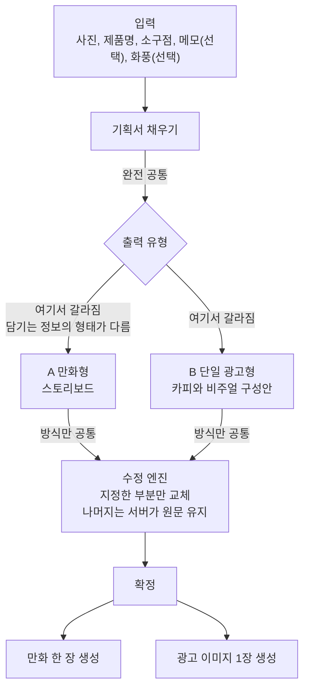
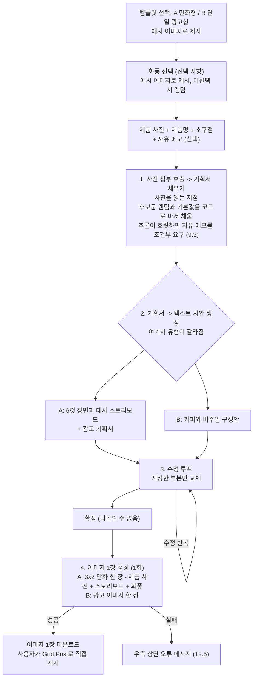

# 만화형 / 단일 광고 생성 서비스 기획서

제품 사진과 제품명, 소구점을 받아 인스타그램용 광고 콘텐츠를 만들어 주는 서비스입니다.
그림이 나오기 전에 텍스트 시안을 확인하고 수정한 뒤, 확정 시점에 한 번만 이미지를 생성합니다.

| 항목 | 내용 |
|---|---|
| 팀명 | HAPPY 3팀 |
| 문서 버전 | 시안 v0.7 |
| 작성일 | 2026-08-07 |
| PM | 정승호 |
| TL | 신호정 |
| AI | 신호정 (생성과 서빙) / 정승호 (학습과 데이터) |
| BE | 임동규 |
| FE | 송기하 |

> 본 문서는 회의록과 검토 의견을 통합해 정리한 기획 시안입니다. 아직 확정되지 않은 사항은
> 18절 "미해결 과제"에 모아 두었으며, 해당 항목이 해소된 이후 기술문서 작성에 착수합니다.
> 12.2의 화면 도식은 작업 중인 와이어프레임으로 대체될 예정입니다.

---

## 1. 프로젝트 개요

### 1.1 한 줄 정의

제품 사진과 제품명, 소구점을 받아 인스타그램용 광고 콘텐츠를 만들어 주는 서비스입니다.
사용자는 목적에 따라 만화형과 단일 광고 이미지형 중 하나를 선택하며, 어느 쪽이든 그림이
나오기 전에 텍스트 시안을 보고 수정한 뒤 확정 시점에 이미지를 생성합니다. 산출물은 두 유형
모두 이미지 한 장이며, 그 안에 몇 컷이 들어 있는지만 다릅니다.

### 1.2 기획 배경

일반적인 광고 이미지 생성 영역은 이미 포화 상태이며 성능이 검증된 모델과 서비스가 다수
존재합니다. 따라서 동일한 형식으로만 경쟁하지 않고, "광고"라는 목적을 유지하면서 결과물의
형식을 만화로 확장하여 차별화를 시도합니다.

- 형식적으로는 광고이지만 산출물은 만화입니다. "이런 것도 되는구나" 하는 신선함이 핵심
  포인트입니다.
- 다만 모든 사용자가 콘텐츠성 게시물을 원하는 것은 아니므로, 단발성 홍보 수요를 위한 단일
  광고 이미지 경로를 함께 제공합니다.
- 화풍처럼 사용자가 언어로 지정하기 어려운 영역은 그림으로 보여 주고 고르게 하며, 고르지
  않으면 후보군에서 시스템이 무작위로 선택해 입력 부담을 없앱니다.
- 만화 형식이라는 선택은 감각적 판단이 아니라 인스타그램 그리드와 캐러셀 포맷 특성,
  그리고 스크롤 이탈 방지 구조로 정당화합니다.

### 1.3 목표

| 구분 | 목표 |
|---|---|
| 기능 목표 | 최소 입력(사진 + 제품명 + 소구점)으로 두 가지 형태의 완성형 광고 콘텐츠 산출 |
| 품질 목표 | 한 장 안의 여러 컷에서 캐릭터와 화풍이 일관되게 유지될 것 |
| 비용 목표 | 세션당 그림 생성을 1회로 구조적으로 고정 |
| 안전 목표 | 사용자가 입력하지 않은 효능이나 수치가 결과물에 등장하지 않도록 차단 |
| 사용성 목표 | 글로 설명하기 어려운 선택지는 그림으로 제시하고, 고르지 않아도 결과가 나오게 할 것 |
| 산출 목표 | 사용자가 인스타그램에 올릴 수 있는 이미지 한 장 |

확정 후 재생성은 지원하지 않습니다. 수정은 확정 이전 텍스트 시안 단계에서만 이루어집니다.

## 2. 문제 정의

### 2.1 사용자가 겪는 문제

| 문제 | 설명 |
|---|---|
| 광고 제작 진입 장벽 | 소규모 판매자는 기획, 카피, 디자인을 모두 감당하기 어렵습니다 |
| 수요의 이원화 | 단발성 홍보와 콘텐츠성 게시물은 필요한 산출물의 형태가 다릅니다 |
| 입력 부담 | 옵션이 많으면 사용자가 중간에 이탈합니다 |
| 결과 통제 불가 | 마음에 들지 않아도 무엇을 어떻게 바꿔야 할지 알 수 없습니다 |
| 취향을 말로 못 함 | 원하는 그림체가 있어도 글로 표현할 수단이 없습니다 |

### 2.2 우리가 풀어야 하는 기술 과제

| 과제 | 설명 |
|---|---|
| 수정 비용 | 확정 후에는 되돌릴 수 없으므로, 확정 전 텍스트 단계에서 만족도를 충분히 끌어올려야 합니다 |
| 캐릭터와 화풍 일관성 | 한 장 안의 여러 컷에서 동일 인물과 동일 화풍이 유지되어야 합니다 |
| 컷 경계 제어 | 한 장을 6칸으로 나눠 그리게 하되 격자가 정확히 맞아야 합니다 |
| 대사 렌더링 | 여러 컷이 한 화면에 들어가므로 컷당 글자 밀도가 낮아집니다 |
| 사실 통제 | 입력에 없는 효능이나 수치가 생성되면 표시광고법상 문제가 됩니다 |

## 3. 해결 방안 및 차별점

| 차별 요소 | 내용 |
|---|---|
| 형식 선택 제공 | 콘텐츠성(만화)과 단발성(단일 광고)을 한 서비스에서 선택 |
| 텍스트 시안 단계 | 이미지 생성 전에 장면과 대사를 텍스트로 확인하고 수정 |
| 부분 단위 수정 | 시안에서 지정한 부분만 교체하고 나머지는 서버가 원문 그대로 유지 |
| 그림으로 고르는 화풍 | 말로 설명하기 어려운 화풍을 예시 이미지로 제시하고 선택하게 함 |
| 캐릭터 재사용 | 로그인 기록을 남겨 다음 이용 시 같은 캐릭터를 사용 (2차 고도화 범위) |
| 입력 최소화 | 필수 입력 3개, 나머지는 추론과 랜덤, 기본값으로 자동 채움 |
| 그리드 게시 대응 | 3x2 분할에 맞는 규격으로 출력하여 사용자가 Grid Post로 바로 게시 |

## 4. 타겟 사용자

| 구분 | 내용 |
|---|---|
| 1차 타겟 | 디자이너와 마케터를 별도로 두기 어려운 소상공인 / 개인 판매자 |
| 사용 맥락 | 인스타그램 계정 운영, 신제품 및 프로모션 게시물 제작 |
| 사용자 특성 | 광고 제작 전문 지식이 없고, 복잡한 설정을 기피함 |

## 5. 핵심 설계 원칙

### 5.1 텍스트에서 오래, 이미지는 확정 이후 한 번

텍스트 구간(기획서, 시안)에서 최대한 오래 머물고, 그림은 확정 이후에만 생성합니다.

- 확정 전에는 그림을 생성하지 않습니다.
- 확정 이후 그림 생성은 두 유형 모두 1회로 구조적으로 고정됩니다. 컷 수와 무관합니다.
- 확정 후 재생성은 지원하지 않습니다. 다시 만들려면 새 세션으로 처음부터 진행합니다.
- 텍스트 구간의 요청 횟수 제한은 이번 단계에서 두지 않습니다. (11절)

### 5.2 고르지 않아도 결과가 나오게

선택지는 제공하되 선택을 강요하지 않습니다. 사용자가 화풍을 고르지 않으면 후보군에서
무작위로 하나를 적용합니다. 이는 결과의 정형화를 막는 장치이기도 합니다.

### 5.3 공통 구간과 분기 지점

- 완전 공통: 기획서를 채우는 단계
- 분기 시작: 텍스트 시안의 형태
- 방식만 공통: 수정 엔진. 다루는 내용은 달라도 "지정한 부분만 교체하고 나머지는 그대로
  둔다"는 동작은 하나로 구현합니다.



### 5.4 자동 채움과 노출 등급

사용자에게 요구하는 입력은 최소화하되, 내부적으로는 완전한 기획서를 구성합니다. 자동으로
채운 값은 원칙적으로 사용자가 확인하고 고칠 수 있어야 합니다.

| 등급 | 의미 | 예 |
|---|---|---|
| 숨김 | 사용자에게 보이지 않음 | 내부 프롬프트 문구, 고정값 |
| 수정 가능 | 사용자가 직접 고침 | 대사, 스토리라인, 옵션 내용 |

### 5.5 지어내지 않기

입력에 없던 효능이나 수치가 광고 문구에 들어가면 표시광고법상 허위 및 과장 광고에
해당합니다. 소구점을 필수 입력으로 받는 이유가 여기에 있습니다. (9.3, 9.4)

## 6. 출력 유형 (2종)

| 유형 | 산출물 | 이미지 내부 구성 | 용도 | 텍스트 시안 형태 |
|---|---|---|---|---|
| A. 만화형 | 이미지 1장 | 3x2, 6칸 고정 | 콘텐츠성 게시물, 그리드 게시 | 컷별 장면과 대사 스토리보드 |
| B. 단일 광고형 | 이미지 1장 | 단일 화면 | 단발성 홍보 | 카피와 비주얼 구성안 |

공통 원칙

- 컷 수는 6컷으로 고정합니다. 가변 옵션은 제공하지 않으며, 사용자가 조정할 수 없습니다.
- 만화형의 첫 번째 컷이 후킹 역할을 겸합니다.
- 유형 선택은 화면의 템플릿 목록에서 결과물 예시 이미지와 함께 제시합니다. (12절)
- 게시는 사용자가 Grid Post 등의 도구로 직접 수행합니다.

## 7. 주요 기능

### 7.1 공통 기능 (1차 필수)

| 기능 | 설명 |
|---|---|
| 템플릿(출력 유형) 선택 | 만화형과 단일 광고형을 예시 이미지와 함께 선택 |
| 화풍 선택 | 화풍 후보를 예시 이미지로 제시, 미선택 시 랜덤 적용 |
| 제품 정보 입력 | 제품 이미지 + 제품명 + 소구점 |
| 기획서 자동 생성 | 사진 첨부 호출로 카테고리와 타겟 추론, 나머지는 후보군 랜덤과 기본값 |
| 자동 채운 값 표시 | 추론이나 랜덤으로 채운 항목을 등급에 따라 표시하고 수정 가능하게 함 |
| 시안 생성 | 만화형은 스토리보드 + 광고 기획서, 단일 광고형은 스크립트 |
| 부분 단위 수정 | 시안을 보고 원하는 부분만 지정해 수정 |
| 최종 이미지 생성 | 확정 시점 1회 |
| 오류 표시 | 실패 시 화면 우측 상단에 오류 메시지 표시 (12.5) |

### 7.2 유형별 전용 기능

| 유형 | 전용 기능 |
|---|---|
| A. 만화형 | 컷별 역할 배분, 3x2 배치 생성 |
| B. 단일 광고형 | 카피 문구 생성, 단일 이미지 생성 |

톤 항목(유머형, 감동형, 반전형, 비포애프터형)은 검토 후 채택하지 않았습니다. 입력을 늘리지
않는다는 원칙과 충돌하고, 광고 기획서(`adPlan`)가 서술형 문단이 되면서 담을 자리도 사라졌기
때문입니다 (2026-08-22 회의록 02번, 18.2 #9).

### 7.3 컷별 역할 템플릿 (만화형)

| 컷 | 역할 |
|---|---|
| 1 | 후킹 |
| 2 | 상황 제시 |
| 3 | 문제 / 고민 |
| 4 | 제품 등장 및 해결 |
| 5 | 성능 및 효과 |
| 6 | 만족 및 CTA |

CTA(Call To Action)는 구매, 문의, 저장 등 사용자의 다음 행동을 유도하는 문구입니다.

### 7.4 2차 고도화 후보

- 에피소드 연재 기능 (주간 및 월간 시리즈, 콘텐츠 캘린더)
- 로그인 기반 캐릭터와 마스코트 재사용
- 확정 후 재생성 기능
- 플랫폼별 사이즈 자동 리사이징 (릴스 등)

## 8. 사용자 흐름 (파이프라인)



## 9. 입력 명세 및 기획서 스키마

### 9.1 사용자 입력

| 항목 | 필수 여부 | 입력 방식 |
|---|---|---|
| 출력 유형 (만화형 / 단일 광고형) | 필수 | 템플릿 카드 선택 |
| 제품 이미지 | 필수 | 파일 업로드 (1장) |
| 제품명 | 필수 | 텍스트 |
| 제품 소구점 | 필수 | 텍스트 |
| 화풍 | 선택 | 예시 이미지 선택, 미선택 시 랜덤 |
| 자유 메모 (원하는 분위기, 강조점, 추가 요청) | 선택 | 텍스트 |

- 자유 메모는 기본적으로 선택 입력이지만, 카테고리 추론이 불확실하거나 광고로서 성립할
  정보가 부족한 경우 입력을 요구합니다.
- 캐릭터 조건을 사용자가 지정하려면 자유 메모에서 추출합니다. 별도 입력란을 둘지는
  미정입니다. (18절)

### 9.2 기획서 항목, 채움 주체, 노출 등급

| 항목 | 채움 주체 | 노출 등급 | 적용 유형 |
|---|---|---|---|
| 출력 유형 | 사용자 | 수정 가능 | 공통 |
| 제품 이미지 | 사용자 (필수) | 수정 가능 | 공통 |
| 제품명 | 사용자 (필수) | 수정 가능 | 공통 |
| 소구점 | 사용자 (필수) | 수정 가능 | 공통 |
| 자유 메모 | 사용자 (선택) | 수정 가능 | 공통 |
| 카테고리 | 추론 | 수정 가능 | 공통 |
| 타겟 | 추론 | 수정 가능 | 공통 |
| 화풍 | 사용자 선택 또는 랜덤 | 수정 가능 | 공통 |
| 캐릭터 (외형, 복장) | 랜덤 + 자유 메모 조건 | 수정 가능 | 만화형 |
| 컷 수 | 고정값 (6컷) | 숨김 | 만화형 |
| 이미지 비율 | 기본값 | 수정 가능 | 단일 광고형 |
| 광고 기획서 | 생성 | 수정 가능 | 공통 |
| 스토리라인, 대사 | 생성 | 수정 가능 | 만화형 |
| 내부 프롬프트 문구 | 시스템 | 숨김 | 공통 |

### 9.3 추론 허용 범위와 정보 부족 대응

추론 허용 범위

| 구분 | 항목 | 처리 |
|---|---|---|
| 추론 허용 | 카테고리, 타겟 | 사진과 제품명에서 추정 |
| 사용자 입력만 | 구체적 수치, 효능, 성분, 수상 이력, 타사 비교 | 입력이 없으면 결과물에 포함하지 않음 |

정보가 부족할 때의 흐름

1. 사진과 제품명만으로 카테고리 추론이 불확실하면 그대로 진행하지 않습니다.
2. 자유 메모로 추가 정보를 요구합니다.
3. 재입력 후에도 판단이 서지 않는 경우의 처리는 미정입니다. (18절)

### 9.4 히든 프롬프트와 법률 대응 범위

히든 프롬프트

- 사용자가 선택하지 않은 항목은 사전에 준비한 후보군에서 무작위로 적용해 결과의 정형화를
  방지합니다.
- 스토리라인과 대사는 글 형태로 제시하고 사용자가 직접 수정할 수 있게 합니다.

법률 대응 범위: 완전 준수를 목표로 하지 않습니다

광고 관련 법률은 품목, 매체, 표현마다 기준이 갈려 범위를 확정하기 어렵습니다. 이번
프로젝트에서 완전한 준수를 목표로 삼으면 끝이 없으므로, 대응 범위를 아래 두 가지로
한정합니다.

| 장치 | 내용 |
|---|---|
| 최소 가이드라인 | 히든 프롬프트에 기본적인 광고 표현 가이드라인과 소상공인 법률을 반영하고, 사용자가 입력한 소구점 이외의 수치, 효능, 수상 이력, 성분, 타사 비교는 생성하지 않도록 지시합니다 |
| 면책 고지 | 결과물과 서비스 화면에 "최소한의 가이드라인을 적용했으나 법적 검토를 대신하지 않으며, 최종 게시 책임은 사용자에게 있다"는 취지의 고지 문구를 표시합니다 |

실제 고지 문구 작성은 미정입니다. (18절)

## 10. 출력물 규격

### 10.1 산출 구성

| 유형 | 구성 | 전달 방식 |
|---|---|---|
| A. 만화형 | 6칸이 3x2로 배치된 이미지 1장 | 단일 파일 다운로드 |
| B. 단일 광고형 | 광고 이미지 1장 | 단일 파일 다운로드 |

### 10.2 이미지 규격

모델 제약 (`gpt-image-2`)

| 항목 | 값 |
|---|---|
| 해상도 지정 | 임의 지정 가능 |
| 긴 변 최대 | 3840px |
| 배수 조건 | 가로와 세로 모두 16의 배수 |
| 총 픽셀 상한 | 약 8.29MP (8,294,400px) |
| 비율 상한 | 3:1 |

만화형 출력 규격 (6칸 3x2 고정)

| 항목 | 값 |
|---|---|
| 전체 크기 | 3456 x 2304 |
| 칸당 크기 | 1152 x 1152 (정사각) |
| 총 픽셀 | 약 7.96MP (상한 이내) |
| 비율 | 1.5 : 1 (상한 이내) |
| 16의 배수 | 3456 / 16 = 216, 2304 / 16 = 144 이므로 충족 |
| 여백 처리 | 불필요 (칸이 정확한 정사각) |

- 칸당 1152px는 인스타그램 권장치 1080px보다 크므로 업로드 시 축소만 발생하며 화질 손실이
  없습니다.
- 컷별로 따로 생성한 뒤 합성하는 방식으로 컷 경계를 맞춥니다(A-2, 2026-08-18 확정,
  [ADR-0017](../adr/0017-만화형은_칸을_따로_생성해_합성한다.md)). 여백 편차 0px로, 한 장에
  전부 그리게 하는 프롬프트 지시만으로는 달성할 수 없던 값입니다.

단일 광고형 출력 규격

| 항목 | 값 |
|---|---|
| 비율 | 정사각 (인스타그램 피드 기준) |
| 크기 | 미정 (18절) |

### 10.3 대사 처리: 검증에 종속

현재 결정은 말풍선을 따로 합성하지 않고 이미지 생성 시 대사까지 함께 그리는 방식입니다.
다만 이 결정은 한국어 렌더링 품질 검증(15절 1순위) 결과에 종속됩니다.

따라오는 제약

1. 확정 후 대사 오타 하나를 고치려면 이미지 전체를 다시 생성해야 합니다. 재생성을 지원하지
   않으므로, 오타는 사실상 수정 불가입니다.
2. 폰트를 사용자가 지정할 수 없습니다.
3. 긴 문장은 잘리거나 뭉개질 수 있어 대사 길이 제한이 필요합니다.
4. 6칸이 한 화면에 들어가므로 컷당 글자 밀도가 낮아집니다. 정사각 한 장을 생성할 때보다
   조건이 불리합니다.

예비안

생성 프롬프트에 "말풍선은 그리되 글자는 비워 둔다"를 지시하고 텍스트를 별도로 합성하는
방식입니다. 검증 실험에서 함께 확인합니다.

## 11. 비용 및 사용량

### 11.1 호출 구조

| 단계 | 호출 성격 | 만화형 | 단일 광고형 |
|---|---|---|---|
| 1. 기획서 채우기 | 사진을 읽는 호출 | 1회 | 1회 |
| 2. 시안 생성 | 텍스트 | 1회 | 1회 |
| 3. 수정 루프 | 텍스트 | 반복 | 반복 |
| 4. 최종 이미지 | 그림 생성 | 1회 | 1회 |
| 그림 생성 합계 | | 1회 | 1회 |

- 그림 생성은 확정 이후에만 발생하며, 컷 수와 무관하게 1회로 고정됩니다.
- 변동 비용이 발생하는 구간은 3단계 텍스트 수정 루프뿐입니다.

### 11.2 사용량 상한: 이번 단계에서는 두지 않습니다

세션당 요청 상한, 하루 총량 상한, 공개 주소 접근 제한은 지금 결정할 단계가 아니라고
판단했습니다. 개발과 검증 단계에서는 팀 내부에서만 사용하므로 남용 위험이 낮고, 실측
데이터가 없는 상태에서 숫자를 정하면 근거 없는 값이 됩니다.

- 실제 배포 단계에 들어갈 때 다시 검토합니다. (17절)
- 그때까지는 그림 생성이 구조적으로 1회로 묶여 있다는 점이 사실상의 비용 방어선 역할을
  합니다.

## 12. 화면 구성 (UI/UX)

### 12.1 설계 방침

| 방침 | 내용 |
|---|---|
| 말로 못 하는 것은 그림으로 | 출력 유형과 화풍은 텍스트 설명이 아니라 예시 이미지로 제시합니다 |
| 선택은 권유, 강요하지 않음 | 화풍을 고르지 않아도 진행됩니다. 미선택 시 랜덤 적용 |
| 기본값 우선 노출 | 기술적 설정은 기본값으로 미리 채우고, 최소한만 화면에 노출합니다 |
| 한 화면에서 완결 | 입력부터 생성까지 한 화면에서 버튼으로 해결 가능해야 합니다 |
| 구현 비용을 먼저 본다 | 같은 목적을 달성한다면 품이 적게 드는 방식을 택합니다 |

### 12.2 기본 레이아웃 (와이어프레임으로 대체 예정)

좌측 입력 패널과 우측 선택 영역으로 구성합니다. 아래 도식은 화면 배치를 나타내므로
mermaid가 아니라 코드 블록으로 둡니다. 작업 중인 와이어프레임이 나오면 교체합니다.

```
+-----------------------------+  +--------------------------------------------+
| [서비스명]                  |  | 템플릿                              [닫기] |
|                             |  |                                            |
| 템플릿 선택               > |  | 출력 유형                                  |
|   만화형 / 단일 광고형      |  |   [ 만화형 (3x2) ]   [ 단일 광고형 ]       |
|                             |  |                                            |
| 제품 이미지 (1장)           |  | 화풍 (선택하지 않으면 무작위 적용)         |
|   [ 업로드 / 교체 ]         |  |   [화풍 A] [화풍 B] [화풍 C] [화풍 D]      |
|                             |  |   [화풍 E] [화풍 F] [화풍 G] [화풍 H]      |
| 제품명 *                    |  |                                            |
| [                        ]  |  | 예시 이미지를 보고 고릅니다. 고르지 않으면 |
|                             |  | 시스템이 무작위로 선택합니다.              |
| 소구점 *                    |  |                                            |
| [                        ]  |  |                                            |
|                             |  |                                            |
| 자유 메모 (선택)   0/500    |  |                                            |
| [                        ]  |  |                                            |
|                             |  |                                            |
| 비율                     v  |  |                                            |
|                             |  |                                            |
|          [ 생성 ]           |  |                                            |
+-----------------------------+  +--------------------------------------------+
```

### 12.3 템플릿 선택 (출력 유형)

- 좌측 패널 상단의 템플릿 항목을 누르면 우측에 선택 창이 열립니다.
- 만화형과 단일 광고형을 결과물 예시 이미지가 붙은 카드로 제시합니다.
- 텍스트만으로 "만화형과 단일 광고형 중 무엇을 원하는가"를 묻지 않습니다. 광고 제작 경험이
  없는 사용자에게 첫 화면부터 전문적인 판단을 요구하지 않기 위해서입니다.
- 선택 결과는 좌측 패널에 축소 표시되어, 지금 무엇을 만들고 있는지 항상 보이게 합니다.

### 12.4 화풍 선택

- 템플릿을 고른 뒤 옵션 단계에서 화풍 후보를 그림 격자로 제시합니다.
- 화풍은 언어로 설명하기 어려운 영역이므로 이름이 아닌 예시 이미지로 판단하게 합니다.
- 선택하지 않고 넘어갈 수 있습니다. 미선택 시 후보군에서 무작위로 하나를 적용하며, 적용된
  화풍은 시안 화면에서 확인하고 바꿀 수 있습니다.
- 화풍 후보의 개수와 목록은 미정입니다. (18절)

### 12.5 오류 표시: 팝업 반려

팝업 방식은 반려되었습니다. 모달 창을 띄우려면 화면 상태 관리와 흐름 차단 처리가 함께
필요해 구현 품이 커지는데, 개발 단계에서 오류를 확인한다는 목적에는 과한 수단입니다.

개발 단계 (1차 범위)

| 항목 | 내용 |
|---|---|
| 표시 위치 | 화면 우측 상단 고정 영역 |
| 표시 내용 | 실패 사유를 담은 오류 메시지 |
| 동작 | 화면 흐름을 막지 않고 해당 영역에만 표시 |
| 목적 | 개발과 검증 중 어느 단계에서 무엇 때문에 실패했는지 즉시 확인 |

오류가 발생하는 지점 (초안)

| 상황 | 내용 |
|---|---|
| 생성 시간 초과 | 응답 지연 |
| 콘텐츠 정책 거절 | 모델이 생성을 거부 |
| 입력 정보 부족 | 추론에 필요한 정보 미달 |
| 규격 오류 | 이미지 형식이나 용량 문제 |
| 호출 실패 | 네트워크나 인증 오류 |

배포 단계 (고려 사항, 17절)

실제 사용자가 보게 될 메시지는 개발용 오류 표시와 성격이 다릅니다. 사용자는 원인 코드가
아니라 무엇을 고쳐 다시 시도할 수 있는지를 알아야 합니다. 문구 작성과 표시 방식은 배포
단계에서 정합니다.

### 12.6 생성 대기 화면

이미지 생성에는 수 분이 걸릴 수 있습니다. 대기 중 화면 처리 방식과, 브라우저를 닫았을 때
결과를 다시 받을 수 있는지는 서버 통신 방식과 함께 결정합니다. (17절)

## 13. 시스템 구성

### 13.1 실행 환경

| 구분 | 내용 |
|---|---|
| 실행 환경 | GCP VM |
| 스펙 | 확인 중입니다. 제약이 크지 않으며 이미지 모델을 구동할 수 있는 수준으로 파악됩니다 |
| 내부 확인용 도구 | Streamlit. 개발 중 내부 확인 전용이며 배포 대상이 아닙니다 |
| 사용자 화면 | FE가 별도 구현 (12절 기준) |
| 형상 관리 | Git. 기획 확정본을 원천으로 저장소 재구성 |

### 13.2 모델 구성: 로컬 모델 병행 검토

현재 기준은 전 구간 GPT API이나, VM 스펙에 여유가 있어 로컬 모델을 함께 올려놓고 비교하기로
했습니다.

| 항목 | 내용 |
|---|---|
| 기준 구성 | 텍스트와 이미지 모두 GPT API (`gpt-image-2`) |
| 검토 대상 | 단일 광고형을 로컬 모델로 생성하는 방안 |
| 진행 방식 | VM에 로컬 모델을 띄워두고 GPT와 번갈아 호출해 결과를 비교 |
| 판단 시점 | 비교 실험(15절) 결과에 따라 결정 |

IP-Adapter

- 입력 이미지를 넣을 때 참조 이미지의 스타일이나 구도를 따라가기 쉽게 만들어 주는
  애드온입니다. 캐릭터 참조 이미지 단계를 없앤 뒤 남은 일관성 문제에 활용할 수 있는
  수단입니다.
- 다만 로컬 모델 계열에서 동작하는 기능이므로, 로컬 모델 채택 여부와 함께 판단해야 합니다.
  GPT API만 쓰는 구성에서는 적용할 수 없습니다.

## 14. 역할 분담 및 진행 절차

### 14.1 팀 구성

| 역할 | 담당자 | 주요 책임 |
|---|---|---|
| PM | 정승호 | 일정 관리, 항목 확정 회의 주관, 산출물 조율 |
| TL | 신호정 | 기술 방향 결정, 스키마와 구조 확정, 기술문서 작성, 코드 리뷰 |
| AI | 신호정 (생성과 서빙) | 프롬프트 설계, 기획서 추출과 시안 생성, 이미지 생성 품질 |
| AI | 정승호 (학습과 데이터) | 데이터 권리 대장, 평가 하네스, 모델 비교 실험 |
| BE | 임동규 | API 설계와 구현, 시안 보관 및 부분 교체(수정 엔진), 오류 전달 |
| FE | 송기하 | 12절 화면 구현 (입력 패널, 템플릿과 화풍 선택, 시안, 결과, 오류 표시) |

### 14.2 진행 절차

기획이 완결된 이후에 개발을 시작합니다.

| 단계 | 작업 | 완료 조건 |
|---|---|---|
| 1 | 기획문서 확정 후 Git 업로드 | 팀원 전원 합의, 18.1 항목 해소 |
| 2 | 기획문서를 기술문서로 변환 | 스키마, API, 모듈 구조 확정 |
| 3 | 워킹 스켈레톤 생성 | 전 구간이 실제로 연결되어 실행되는지 확인 |

3단계가 끝나기 전까지 개별 기능 개발에 착수하지 않습니다.

### 14.3 문서 관리 원칙

기술문서 단계에 들어가면 "해봤는데 안 되는 일"이 반드시 발생합니다. 그때마다 회의를 하게
되는데, 결과가 문서에 반영되지 않으면 팀이 서로 다른 전제로 작업하게 됩니다.

1. 회의를 하면 회의록을 작성해 Git에 올립니다.
2. 회의록을 근거로 기획서와 기술문서에 반영합니다.
3. Git에 올라가 있지 않으면 공유되지 않은 것으로 봅니다. 구두 합의만으로는 결정으로 치지
   않습니다.
4. 회의록 외 프로젝트 관련 자료도 정리해 Git에 올립니다.
5. 기술문서 반영은 TL이 담당합니다.

### 14.4 업무 범위 정의

- 진행 절차 3단계는 워킹 스켈레톤이며, 1차 기능 범위는 7.1을 따릅니다.
- 사용자 경험 관련 개선 사항은 UX 작업으로 분리합니다.
- 로그인 관리와 정보 보존 범위도 이 범위 정의에 포함해 함께 결정합니다.
- 화풍 예시 이미지는 개발 초기에 확보해야 합니다. 화면 구현과 프롬프트 설계 양쪽의 선행
  조건입니다.

## 15. 검증 과제

담당자와 완료 판정 기준을 함께 둡니다. 결과물을 만든 사람이 자기 결과물을 채점하지 않습니다.

| 순위 | 과제 | 담당 | 완료 판정 기준 |
|---|---|---|---|
| 1 | 6칸 한 장 조건에서 한국어 렌더링 검증. 3456 x 2304로 6컷 만화를 생성해 각 칸의 대사가 정확히 표기되는 비율 측정. "말풍선만 그리고 글자는 비움" 예비안도 함께 확인 | AI 생성 / 신호정 (판정은 타 담당) | GPT 계열 이미지 API로 검증(2026-08-11 확정). 20회 생성에서 6칸 중 5칸 이상의 대사가 오탈자 없이 표기되는 비율 80% 이상(B-16). 본안(대사까지 그림) 유지로 확정 - 예비안(말풍선만)도 정확도는 같았으나 말풍선 위치 검출 문제로 기각(2026-08-18 회의록) |
| 2 | 컷 경계 제어 실험. 프롬프트에 픽셀 단위를 어떻게 지시해야 3x2 격자가 정확히 맞는지 | AI 생성 / 신호정 | **소멸** - 08-18 회의가 컷별로 따로 생성해 합성하는 방식을 기본 경로로 확정해(A-2, [ADR-0017](../adr/0017-만화형은_칸을_따로_생성해_합성한다.md)) 한 장에 전부 그리는 프롬프트로 픽셀 단위를 지시하는 이 실험 자체가 재려던 대상이 사라짐. 합성 방식의 실측값은 칸 폭 1152px 정확, 바깥 여백 0px(10.2절) |
| 3 | 컷별로 따로 생성한 6칸의 캐릭터와 화풍 일관성. 1번 칸을 2 ~ 6번 칸의 레퍼런스로 쓰는 구조(ADR-0017)에서 동일 인물로 인식되는지 | 수행 AI 생성 / 신호정, 판정 정승호 + 임동규 + 송기하 | 판정자 3명 중 2명 이상이 동일 인물로 판정 (2026-08-14 확정) |
| 4 | 로컬 모델과 GPT 비교. VM에 로컬 모델을 띄워 단일 광고형 결과를 GPT와 비교. IP-Adapter 적용 효과도 함께 확인 | 수행 AI 학습 / 정승호, 판정 임동규 + 송기하 | 채택 여부를 판단할 수 있는 비교 결과 + 비교 수치. 판정자 2명 모두 동의. **미채택으로 확정**(2026-08-20 회의록) - `training/`은 비어 있는 채로 유지 |
| 5 | 화풍 선택이 결과에 반영되는지 | 판정 정승호 + 임동규 + 송기하 | 화풍별 결과가 구분 가능할 것. 판정자 3명 중 2명 이상 |
| 6 | 비용 실측. 세션당 단가 산출 | AI 생성 / 신호정 | 세션당 단가 수치 확정 |
| 7 | 기획 근거 조사. 인스타그램 그리드와 캐러셀 포맷, 유사 서비스, 논문 | 정승호(01) | 발표에서 "왜 만화인가"에 근거를 들어 답할 수 있는 상태 |
| 8 | VM 스펙 확인 마무리 | AI 생성 / 신호정 | 로컬 모델 구동 가능 여부 확정 |

- 진행 원칙: 이론적으로 정답을 찾기보다 먼저 해보고, 안 되면 다음 방법으로 넘어갑니다. 각
  실험 결과는 회의록으로 남겨 Git에 반영합니다.
- **판정자와 통과 기준은 2026-08-14에 확정되었습니다**
  ([회의록](../회의록/2026-08-14_역할_재배정_임유빈_하차.md)). "AI 담당"은 03(생성과 서빙)만
  가리키며, 04는 판정자에서 빠지지 않습니다. 다만 **4순위는 수행자가 04이므로 그 과제에 한해
  판정자를 임동규, 송기하 2명으로 한정**하고 두 사람 모두 동의할 때 통과합니다. 결과물을 만든
  사람이 자기 결과물을 채점하지 않는다는 원칙을 지키기 위한 예외입니다.
  수치의 정본은 미결정 대장 B-15와 B-16입니다.
- 1순위는 반드시 6칸 배치 조건으로 검증해야 합니다. 정사각 한 장으로 테스트하면 실제보다
  유리한 결과가 나옵니다.
- 7순위 근거 자료는 [만화형_채택_근거.md](../기술문서/만화형_채택_근거.md)에 있습니다
  (2026-08-24).

## 16. 발표 예상 질의 대응

| 질문 | 답변 방향 |
|---|---|
| 왜 만화 형식인가 | 근거는 [만화형_채택_근거.md](../기술문서/만화형_채택_근거.md) - 기존 광고 생성 시장 포화, 브랜디드 콘텐츠 효과, 소상공인 제작비용 장벽, 인스타그램 그리드/캐러셀 포맷 적합성 |
| 그건 만화를 고른 탓에 생긴 문제 아닌가 | 2절에서 사용자 문제와 기술 과제를 분리해 제시 |
| 왜 두 가지 유형을 다 제공하는가 | 수요가 다르며, 기획서 채우기 구간을 공유해 증분 비용이 제한적 |
| 기존 서비스와 무엇이 다른가 | 그림 생성 전 텍스트 시안 수정, 그림으로 고르는 화풍, 그리드 게시 규격 대응 |
| 사용자가 원하는 그림체를 어떻게 전달받나 | 예시 이미지 선택 방식, 미선택 시 랜덤 |
| 품질 관리는 어떻게 하는가 | 스키마 강제 + 부분 교체 설계 |
| 광고 내용이 사실과 다르면 | 소구점 필수 입력 + 추론 허용 범위 제한 + 면책 고지로 책임 범위 명시 |
| 법적 검토는 어디까지 했나 | 완전 준수는 범위 밖임을 명시. 최소 가이드라인 적용 + 고지 문구로 대응 |
| 비용은 어떻게 통제하는가 | 그림 생성이 세션당 1회로 구조적으로 고정됨 |
| 사용량 제한은 없나 | 개발과 검증 단계에서는 불필요하다고 판단. 배포 시 도입 |
| 마음에 안 들면 다시 못 만드나 | 확정 전 텍스트 단계에서 충분히 수정, 확정 후 재생성은 2차 고도화 항목 |
| 왜 GPT만 쓰나 | 로컬 모델을 VM에 올려 비교 중. 결과에 따라 단일 광고형에 도입 검토 |

## 17. 기술문서 및 배포 단계로 이관할 항목

### 17.1 기술문서에서 정할 것

| 항목 | 정해야 할 것 |
|---|---|
| 로그인 및 사용자 구분 | 캐릭터 재사용을 위해 무엇을 기록하는지, 어떤 방식으로 로그인을 받는지 |
| 정보 보존 범위 | 무엇을 얼마 동안 보관하는지 (업로드 사진, 결과물, 시안) |
| 작업 상태 보관 | 작업 내용을 어디에 보관하는지, 새로고침 시 유지 여부 |
| 생성 중 처리 방식 | 수 분이 걸리는 작업에서 연결이 끊기지 않도록 하는 방식. 서버가 주고받는 형식을 결정하므로 기술문서 착수 전 확정 필요 |
| 오류 전달 형식 | 서버가 실패 사유를 어떤 코드와 형식으로 내려주고 화면이 어떻게 표시하는지 (12.5와 연동) |
| 동시 요청 | VM 1대에서 여러 명이 동시에 확정을 눌렀을 때의 대기 정책 |

### 17.2 배포 단계에서 정할 것

| 항목 | 내용 |
|---|---|
| 사용자용 오류 메시지 | 실제 사용자가 보게 될 문구와 표시 방식. 원인이 아니라 대처 방법을 알려야 합니다 |
| 사용량 상한 | 세션당 요청 상한, 하루 총량 상한 |
| 접근 제한 | 공개 주소에 대한 인증 |
| 면책 고지 문구 | 화면 어디에, 어떤 문장으로 표시할지 |

## 18. 미해결 과제

### 18.1 기술문서 착수 전에 반드시 닫아야 할 것

| # | 항목 | 내용 |
|---|---|---|
| 1 | 6칸 조건 한국어 렌더링 검증 | 성립하지 않으면 10.3의 대사 처리 방식이 뒤집힙니다. 합격 판정 기준도 함께 정할 것 |
| 2 | 컷 경계 제어 방법 | 프롬프트에 픽셀 단위를 어떻게 지시할지. 별도 회의 안건 |
| 3 | 화풍 후보 목록과 예시 이미지 | 후보 몇 종을 둘지, 예시 이미지를 어떻게 확보할지. 화면 구현과 프롬프트 양쪽의 선행 조건 |
| 4 | 캐릭터 일관성 확보 수단 | 참조 이미지 단계를 없앤 상태에서 프롬프트만으로 담보 가능한지. IP-Adapter 활용 여부와 연동 |
| 5 | 로컬 모델 채택 여부 | 단일 광고형에 로컬 모델을 쓸지. IP-Adapter 사용 가능 여부가 여기에 달려 있습니다 |
| 6 | 워킹 스켈레톤 범위 정의 | 1차 범위의 경계. 로그인과 정보 보존 포함 |
| 7 | 면책 고지 문구 | 실제 문장 작성 |
| 8 | 단일 광고형 이미지 크기 | 정사각 기준의 실제 픽셀 값 |

### 18.2 그 다음으로 정할 것

| # | 항목 | 내용 |
|---|---|---|
| 9 | 톤 항목 존치 여부 | 유머형, 감동형, 반전형, 비포애프터형 선택지가 기능과 스키마에서 빠진 상태 |
| 10 | 캐릭터 조건 입력 방식 | 자유 메모에서 추출할지, 별도 입력란을 둘지 |
| 11 | 추론 재실패 시 처리 | 재입력을 받고도 판단이 서지 않으면 진행하는지 중단하는지 |
| 12 | 단일 광고형의 캐릭터 등장 여부 | |
| 13 | 확정 후 재생성 지원 여부 | 2차 고도화로 미뤘으나, 오타 발생 시 대응책이 없다는 점을 감안해 재검토 필요 |
| 14 | 생성 대기 화면 구성 | 진행 표시 방식, 이탈 후 결과 회수 가능 여부 |
| 15 | 검증 과제 담당자 배정 | 15절의 미정 항목, 교차 검증 원칙 준수 |
| 16 | 검증 합격 판정 기준 수치 | 렌더링 정확도, 일관성 평가 인원 등 |
| 17 | "왜 만화인가" 근거 조사 담당과 기한 | 발표 첫 질문이 될 가능성이 높습니다 |
| 18 | Grid Post 게시 순서 확인 | 그리드는 최신 게시물이 좌상단에 오므로, 만화 읽기 순서와 배치가 맞는지 확인 |
| 19 | 서비스명 | |
| 20 | 단계별 마일스톤 일자 | |
