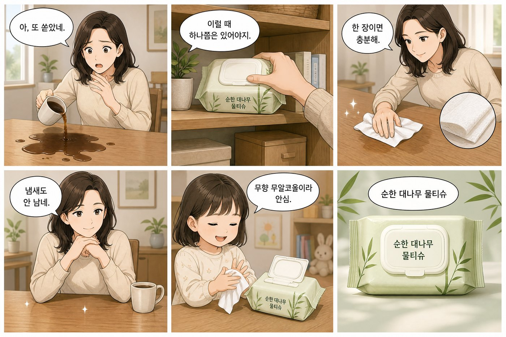
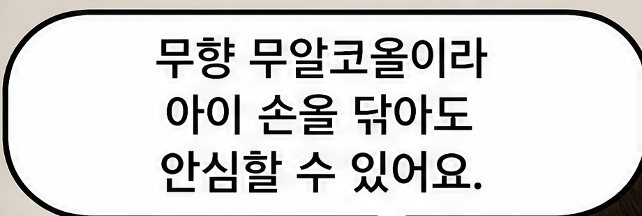
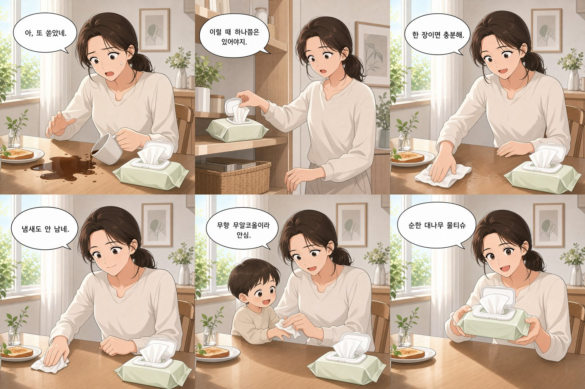
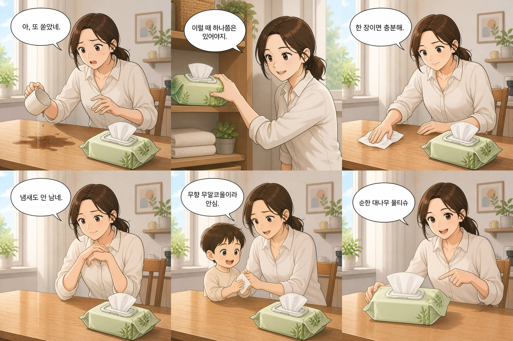

# 외부 API 이미지 생성 시험 보고서

| 항목 | 내용 |
|---|---|
| 대상 | `gpt-image-2` (외부 이미지 생성 API) |
| 기간 | 2026-08-13 ~ 2026-08-15 |
| 수행 | 03 AI 엔지니어 (생성/서빙) |
| 판정 | 정승호, 임동규, 송기하 (수행자는 판정에서 제외) |
| 총 호출 | 90회 |
| 총 비용 | 6.06 USD |

이 보고서는 기획서 15절의 검증 과제 가운데 외부 API로 답할 수 있는 항목의 실측 기록입니다.
수치는 재현 가능한 스크립트로 얻었으며, 하네스와 원자료는
[notebooks/hj/verify01_korean_text_rendering/](../../notebooks/hj/verify01_korean_text_rendering/)에
있습니다.

**이 문서는 실험 기록이며 결정이 아닙니다.** 미결정 대장 항목의 확정 근거는 회의록뿐입니다
(기획서 14.3). 아래 결론은 회의에 올릴 재료입니다.

---

## A. 시험의 목적

### A-a. 무엇을 확인하려 했는가

기획서 10.3은 만화형 광고의 대사를 이미지 생성 시점에 함께 그리는 것을 본안으로 두고,
말풍선만 그리고 글자는 나중에 합성하는 것을 예비안으로 두었습니다. 둘 중 어느 쪽을 택하는지에
따라 `image:render` 이음매의 출력 형태와 폰트 자산 확보 여부가 함께 바뀝니다.

이 선택을 실험 없이 정할 수 없으므로 기획서 15절이 검증 과제 8건을 열었고, 그중 외부 API로
답할 수 있는 것이 아래 6건입니다.

| 순위 | 과제 | 이 시험에서 |
|---|---|---|
| 1 | 6칸 조건 한국어 렌더링 | 완료 |
| 2 | 컷 경계 제어 | 측정 완료, 판정 기준 재정의 필요 |
| 3 | 캐릭터와 화풍 일관성 | 자료 확보, 판정 진행 중 |
| 4 | 로컬 모델과 GPT 비교 | GPT 측 기준선 확보 |
| 5 | 화풍 반영 | 착수 불가 (선행 조건 미확정) |
| 6 | 비용 실측 | 이미지 항목 완료, 텍스트 항목 미측정 |

### A-b. 시험 조건

회차 사이의 차이가 모델의 편차여야 하므로 시나리오를 하나로 고정했습니다. 조건은
`conditions.py`에 상수로 박아 두었고, 프롬프트 원문은 각 회차 폴더의 `prompt.txt`에 남습니다.

| 항목 | 값 |
|---|---|
| 만화형 해상도 | 3456 x 2304 (칸당 1152 x 1152, 3 x 2 격자) |
| 단일 광고형 해상도 | 1088 x 1088 |
| 제품 | 순한 대나무 물티슈 (가상) |
| 소구점 | 무향 무알코올, 두꺼운 원단 |
| 대사 | 6칸 고정, 6자 ~ 14자 |

프롬프트에는 근거 기반 생성 지시를 포함했습니다. 소구점에 없는 효능이나 수치를 이미지에 쓰지
말라는 지시이며, 이것을 빼면 실제 파이프라인의 프롬프트와 달라져 결과를 그대로 이전할 수
없습니다.

---

## B. 한국어 대사 렌더링 (검증 1순위)

### B-a. 결과

본안 20회, 예비안 10회를 생성하고 판정자 3명이 각각 채점했습니다.

| 안 | 회차 | 판정자별 성공률 | 판정 |
|---|---|---|---|
| 본안 (대사까지 그림) | 20 | 정승호 100%, 임동규 100%, 송기하 100% | 기준 충족 |
| 예비안 (말풍선만) | 10 | 3명 전원 100% | 기준 충족 |

미결정 대장 B-16이 요구하는 두 축을 모두 넘습니다. 대사 표기 정확도의 기준선은 20회에서
5칸 이상 오탈자 없는 비율 80% 이상이고, 판정자 동의의 기준선은 3명 중 2명 이상입니다.
**20회 x 6칸 = 120칸에서 오탈자로 지목된 칸이 하나도 없었습니다.**

판정자 한 분이 "지금까지 중에 제일 광고 같다"고 평한 회차입니다.

### B-b. 이 결과가 A-1을 닫지 못하는 이유

**예비안도 100%로 나왔습니다.** 즉 두 안이 렌더링 정확도로는 갈리지 않습니다. 선택의 축이
아래로 옮겨갔습니다.

| 축 | 본안 | 예비안 |
|---|---|---|
| 오타 수정 | 불가 (이미지에 구워짐) | 가능 (텍스트를 나중에 얹음) |
| 폰트 지정 | 불가 | 가능 |
| 대사 길이 제한 | 필요 | 상대적으로 자유 |
| 합성 단계 | 없음 | 추가 필요 |
| 폰트 자산 | 불필요 | 확보 필요 |
| 호출당 비용 | 0.1171 USD | 0.0778 USD |

예비안이 34퍼센트 저렴합니다. 다만 합성 파이프라인과 폰트 자산의 비용은 아직 산정되지
않았습니다.

**회의에 올릴 물음**: 정확도가 같다면, 더 싸고 오타 수정이 가능한 예비안을 택하지 않을 이유가
무엇입니까. 예비안의 대가는 합성 단계와 폰트 자산이며 그 비용을 먼저 산정해야 답할 수 있습니다.

### B-c. 이 결과의 한계

검증에 쓴 대사는 6자 ~ 14자의 짧은 순한국어이고 영어, 숫자, 고유명사가 섞이지 않았습니다.
**100퍼센트가 긴 문장이나 영어 혼용까지 보증하지는 않습니다.** 판정자도 같은 지적을 했고,
그래서 별도 회차를 추가했습니다 (C절).

---

## C. 어려운 대사 (추가 시험)

1순위의 조건이 본안에 유리했다는 한계를 메우기 위해, 격자와 해상도는 그대로 두고 **대사만**
어렵게 바꾼 10회를 추가했습니다. 난이도 축을 넷으로 나눠 담았습니다.

| 칸 | 대사 | 난이도 축 |
|---|---|---|
| 1 | `1팩 80매.` | 숫자 |
| 2 | `리필팩 NEW` | 영어 혼용 |
| 3 | `무향 무알코올이라 아이 손을 닦아도 안심할 수 있어요.` | 긴 문장 (27자) |
| 4 | `ALCOHOL FREE` | 영어 단독 |
| 5 | `두꺼운 원단 80매` | 숫자와 한글 |
| 6 | `NEW 리필팩 1팩 80매, 무향 무알코올.` | 혼합 (24자) |

숫자와 영어를 대사에 넣으려면 그 값이 근거 안에 있어야 하므로 소구점을 함께 늘렸습니다.
근거 밖 숫자를 실험자가 먼저 프롬프트에 넣으면 가드레일이 잡아야 할 것을 만들어 주는 셈이
됩니다.

**가장 긴 문장에서 첫 오탈자가 나왔습니다.**

정답은 `아이 손을 닦아도`인데 `아이 손올 닦아도`로 그려졌습니다. 조사 `을`이 `올`로 바뀐
것입니다. 같은 회차의 나머지 5칸은 숫자, 영어 단독, 영어 혼용을 포함해 모두 정확했습니다.

짧은 대사 120칸에서 오탈자가 0건이었던 것과 대비됩니다. 표본이 1회분이므로 비율은 판정 회수
후에 확정됩니다. 현재까지 관측된 방향은 **길이가 오탈자의 주된 요인**이라는 것입니다
(신뢰도: 추정).

---

## D. 컷 경계 제어 (검증 2순위)

### D-a. 사람 눈 판정이 놓친 것

판정 시트는 "같은 이미지 안에서 6칸이 균등한가"를 Y/N으로 물었고 30건 전부 통과했습니다.
그런데 판정자 두 분이 총평에서 독립적으로 다른 지적을 했습니다.

> 이미지간 여백 사이즈가 미세하게 달라 고정할 방법을 찾아봐야 할 것 같습니다. (임동규)

> 여백을 일정하게 유지시킬 방법이 필요해 보입니다. (정승호)

그래서 판정 대상을 사람 눈에서 픽셀 측정으로 바꿨습니다. 흰 경계 띠를 검출해 칸 크기와 바깥
여백을 재는 스크립트를 만들어 **이미 생성한 30장을 다시 읽었습니다. 추가 호출이 없으므로
비용은 0입니다.**

### D-b. 측정 결과

| 항목 | 실측 (본안 20장) | 규격 |
|---|---|---|
| 칸 폭 | 1101 ~ 1142px | 1152px |
| 칸 높이 | 1100 ~ 1126px | 1152px |
| 바깥 여백 | 14 ~ 36px | 규격에 없음 |
| 한 장 안 칸 폭 편차 | 최대 41px | 0 |
| 한 장 안 칸 높이 편차 | 최대 8px (대부분 0 ~ 2) | 0 |

여기서 세 가지가 나옵니다.

**1. Y/N 판정으로는 이 문제를 잡을 수 없습니다.** 3456px 폭에서 41px 차이는 1.2퍼센트이고,
사람 눈으로 판별하라는 것이 무리였습니다.

**2. 규격 1152px는 산술적으로 달성 불가능합니다.** 3456px 안에 칸 3개와 안쪽 경계 2개와
바깥 여백 2개가 들어갑니다. 경계선을 그리라고 지시한 이상 칸은 반드시 1152px보다 작아집니다.
기획서 10.2의 칸 규격은 경계선과 여백이 0일 때만 성립하는 값입니다.

**3. 세로는 정확하고 가로만 흔들립니다.** 높이 편차는 대부분 0 ~ 2px인데 폭 편차는 7 ~ 41px
입니다. 2분할보다 3분할이 어렵다는 뜻이며, 후처리를 검토한다면 가로 방향만 손보면 됩니다.

**결론: 고정 좌표 크롭은 성립하지 않습니다.** 인스타그램 그리드나 캐러셀로 자르려면 매번 경계를
검출해야 합니다. 미결정 대장 A-2의 실패 판정 기준은 한 장 안의 균등함이 아니라 **장과 장 사이의
편차**로 잡아야 합니다.

---

## E. 컷별 생성과 후처리 합성

### E-a. 시험 설계

미결정 대장 A-2는 컷별로 이미지를 요청해 합성하는 방식을 "호출 수가 컷 수만큼 늘어나 비용
부담이 크다"는 이유로 조건부 경로로 남겨 두었습니다. 그 비용을 실측했습니다.

1번 칸을 먼저 생성하고, 2번부터 6번 칸은 1번 칸을 레퍼런스 이미지로 넘겨 생성했습니다. 인물과
제품을 유지하기 위한 것이며, 제품컷 입력 시험에서 같은 방식이 입력 제품을 보존한 것이 근거입니다.
생성된 6칸은 우리가 3 x 2로 붙였습니다.

### E-b. 결과

| 방식 | 세트 비용 | 시간 | 칸 크기 | 바깥 여백 |
|---|---|---|---|---|
| 한 장에 6칸 | 0.1171 USD | 54 ~ 122초 | 1101 ~ 1142px | 14 ~ 36px |
| 컷별 `auto` | 0.1566 ~ 0.2348 USD | 188 ~ 231초 | 1152px 정확 | 0px |
| 컷별 `low` | 0.0974 USD | 132초 | 1152px 정확 | 0px |
| 컷별 `medium` | 0.4041 USD | 311초 | 1152px 정확 | 0px |

**A-2의 전제가 뒤집혔습니다.** 호출은 6배지만 `low` 티어의 세트 비용은 한 장 생성보다 오히려
17퍼센트 저렴합니다. 한 장짜리 3456 x 2304가 칸 하나보다 훨씬 비싼 티어를 쓰기 때문입니다.

### E-b-1. 남은 대가였던 시간도 병렬 요청으로 사라집니다

위 표의 시간은 여섯 칸을 차례로 요청한 값입니다. 그런데 **2번부터 6번 칸은 서로 의존하지
않습니다.** 전부 1번 칸만 레퍼런스로 쓰므로, 1번을 만든 뒤 나머지 다섯을 동시에 요청할 수
있습니다. 호출 수와 비용은 그대로이고 대기 시간만 줄어듭니다.

| 티어 | 순차 | 병렬 | 단축 | 개별 호출 팽창 |
|---|---|---|---|---|
| `low` | 132.4초 | **55.9초** | 57.8퍼센트 | 44퍼센트 |
| `auto` | 203.6초 | **83.6초** | 58.9퍼센트 | 18퍼센트 |
| `medium` | 310.8초 | **139.2초** | 55.2퍼센트 | 64퍼센트 |

동시 5건에서 요청 수 제한 오류는 한 건도 없었습니다. **단축 비율이 티어와 거의 무관합니다.**
생성 부하가 2.3배 차이나는데도 셋 다 55 ~ 59퍼센트 구간입니다.

다만 동시에 보내면 개별 호출이 느려집니다. 무거운 티어일수록 팽창이 크고, `medium`에서는
순차 42.8초이던 호출이 병렬에서 70.1초가 됩니다. 서로를 밀어내는 것으로 보이며
(신뢰도: 추정), 팽창이 커질수록 병렬의 이득이 줄어듭니다. `high` 티어는 재지 않았습니다.

**이 결과로 방식 간 비교가 다시 정리됩니다.**

| 방식 | 시간 | 세트 비용 | 칸 크기 | 바깥 여백 |
|---|---|---|---|---|
| 한 장에 6칸 | 54 ~ 122초 | 0.1171 USD | 1101 ~ 1142px | 14 ~ 36px |
| 컷별 `low` 병렬 | **55.9초** | **0.0974 USD** | **1152px 정확** | **0px** |
| 컷별 `medium` 병렬 | 139.2초 | 0.4041 USD | 1152px 정확 | 0px |

`low` 병렬은 시간이 한 장 생성과 같은 구간이고 비용은 17퍼센트 저렴하며 규격은 정확합니다.
**컷별 생성의 대가로 남는 것은 삽화 완성도 하나뿐이고**, 그것은 티어를 올려 다루는 축입니다.

주의: 표본이 티어당 1세트입니다. 그리고 **잡 하나가 동시에 다섯 건의 외부 호출을 냅니다.**
사용자가 몰리면 곱해지므로 운영에서는 잡 단위 동시 실행 상한이 필요하고, 다섯 중 하나가
실패하는 경우의 처리도 함께 정해야 합니다. 지금 하네스는 부분 실패를 다루지 않습니다.

### E-c. 품질 차이

같은 방식이라도 품질 티어에 따라 결과가 갈립니다. 아래 두 장은 프롬프트와 합성 절차가 동일하고
`quality` 값만 다릅니다.

**좋은 예 (`medium`, 세트당 0.4041 USD)**

**나쁜 예 (`low`, 세트당 0.0974 USD)**

두 장 모두 대사는 정확하고 인물도 6칸에서 유지됩니다. 갈리는 것은 그림의 완성도입니다.
`low`는 음영이 평평하고 머리카락 묘사가 단순하며, 특히 **손 표현이 무너집니다.** 1번 칸에서
컵이 거의 기울지 않았는데 커피가 쏟아지고, 6번 칸에서 제품을 가리키는 팔의 해부가 어색합니다.
`medium`은 같은 자리에서 명암과 배경 묘사가 더 세밀합니다.

즉 **가격 4.1배 차이가 대사 정확도가 아니라 삽화 완성도에서 나타납니다.** 광고 소재의 상품성이
목적이므로 이 차이는 무시할 수 없습니다.

---

## F. 단일 광고형 (관통 경로)

워킹 스켈레톤의 관통 경로는 만화형이 아니라 단일 광고형입니다. 그런데 초기 32회가 전부
만화형이어서 정작 먼저 실물화할 경로의 숫자가 없었고, 이를 메우기 위해 10회를 추가했습니다.

| 항목 | 단일 광고형 | 만화형 | 배수 |
|---|---|---|---|
| 호출당 비용 | 0.0069 USD | 0.1171 USD | 17배 저렴 |
| 출력 토큰 | 204 | 3826 | 18.8배 |
| 생성 시간 | 18.1 ~ 28.2초 | 54 ~ 122초 | 3.4배 빠름 |
| 여백 편차 | 0px (정확히 1088 x 1088) | 14 ~ 36px | 크롭 문제 없음 |

10장 모두 카피가 정확히 그려졌습니다 (판정 진행 중). 격자를 요구하지 않으므로 여백이 흔들릴
자리가 없고, 크롭 문제는 만화형 전용입니다.

**예산 상한은 두 값을 나눠 잡아야 합니다.** 만화형이 17배 비쌉니다.

---

## G. 제품 사진 입력

사용자가 올린 제품 사진을 입력으로 넣는 경로는 기획의 전제인데 검증되지 않은 상태였습니다.
실제 상용 제품의 사진을 입력으로 5회 생성했습니다.

| 항목 | 실측 | 텍스트만 입력 | 배수 |
|---|---|---|---|
| 호출당 비용 | 0.0271 USD | 0.0069 USD | 3.9배 |
| 입력 토큰 | 이미지 1024 + 텍스트 168 | 텍스트 168 | 이미지분 0.0082 USD 고정 |
| 생성 시간 | 22.7 ~ 37.4초 | 20.3초 | 1.4배 |
| 제품 동일성 | 5회 모두 유지 | 해당 없음 | |

로고, 한글 표기, 용량 표기, 포장의 작은 문구까지 5장 전부 보존되었습니다. 근거 밖 효능이
그려진 사례는 발견되지 않았습니다.

**이 결과는 검증 4순위의 질문을 바꿉니다.** 4순위가 로컬 모델을 검토하는 이유 가운데 하나가
IP-Adapter로 제품 이미지를 일관되게 유지하는 것인데, 외부 API의 편집 경로가 이미 그 일을
장당 0.02 USD 추가로 수행합니다. 따라서 물음은 "IP-Adapter가 되는가"가 아니라 **"IP-Adapter가
이것보다 나은가"**가 됩니다.

**예시 이미지는 이 보고서에 넣지 않았습니다.** 입력에 실제 타사 상표가 들어갔고 생성 결과가
타사 브랜드 광고물이 되기 때문입니다. 저장소가 public이므로 커밋하는 순간 되돌릴 수 없습니다.
원본은 팀 내부 경로에만 두었습니다.

---

## H. 품질 티어와 비용 예측성

시험 도중 같은 요청의 비용이 회차마다 달라지는 것을 발견해 원인을 확인했습니다.
`quality` 파라미터를 지정하지 않으면 모델이 회차마다 티어를 고릅니다.

1088 x 1088 기준 실측입니다.

| `quality` | 출력 토큰 | 생성 시간 | 호출당 비용 |
|---|---|---|---|
| `low` | 204 | 20.9초 | 0.0069 USD |
| `medium` | 1834 | 54.0초 | 0.0559 USD |
| `high` | 7336 | 143.0초 | 0.2209 USD |

지정하지 않은 회차에서 관측된 흔들림입니다.

| 회차 | 관측된 출력 토큰 |
|---|---|
| 예비안 10회 | 1674 또는 3826 (두 티어) |
| 제품컷 5회 | 459 또는 816 (두 티어) |
| 컷별 생성 1세트 | 213, 480, 852, 1917 (네 티어) |

**같은 요청이 최대 9배까지 비싸질 수 있습니다.** 운영 코드는 `quality`를 명시해야 하며, 이 값은
`image:render` 이음매를 실물화할 때 설정으로 고정해야 합니다. 예산 상한도 티어를 고정한 뒤에만
근거를 갖습니다.

---

## I. 비용 실측 (검증 6순위)

### I-a. 확정된 값

요금 근거는 2026-08-13에 확인한 벤더 요금표입니다. 100만 토큰당 텍스트 입력 5.00 USD,
이미지 입력 8.00 USD, 이미지 출력 30.00 USD입니다.

| 생성 방식 | 호출당 비용 | 비고 |
|---|---|---|
| 단일 광고형 (1088 x 1088) | 0.0069 USD | `low` 티어 |
| 만화형 한 장 (3456 x 2304) | 0.1171 USD | |
| 만화형 컷별 합성 | 0.0974 ~ 0.4041 USD | 티어에 따름 |
| 제품 사진 입력 | 0.0271 USD | 이미지 입력분 포함 |

### I-b. 아직 채우지 못한 것

세션 1회는 `brief:fill`, `draft:generate`, `image:render` 세 호출로 이루어집니다. 지배 항목인
이미지 호출은 확정했지만 **앞의 두 텍스트 호출은 카피 생성 경로가 미확정이라 잴 대상이
없습니다.** 따라서 세션당 단가는 이미지 항목만 확정 상태입니다.

### I-c. 시험 자체의 비용

| 구분 | 장수 | 비용 |
|---|---|---|
| 만화형 본안 20회, 예비안 10회 | 30 | 3.24 USD |
| 어려운 대사 10회 | 10 | 1.17 USD |
| 단일 광고형 10회 | 10 | 0.07 USD |
| 제품 사진 입력 5회 | 5 | 0.14 USD |
| 컷별 생성 5세트 | 30 | 1.05 USD |
| 품질 티어 확인 3회 | 3 | 0.28 USD |
| 스모크와 중단분 | 2 | 0.12 USD |
| 합계 | 90 | **6.06 USD** |

---

## J. 결론과 후속 과제

### J-a. 답이 나온 것

1. **한국어 대사는 짧은 순한국어 조건에서 완전히 정확합니다.** 본안과 예비안 모두 판정자
   3명 전원 100퍼센트이며, 120칸에서 오탈자가 없었습니다.
2. **긴 문장에서는 오탈자가 발생합니다.** 27자 문장에서 조사 오류가 관측되었습니다.
3. **한 장 생성 방식은 고정 좌표 크롭이 불가능합니다.** 칸 크기와 여백이 회차마다 흔들립니다.
4. **컷별 생성과 합성은 비용 부담이 크지 않습니다.** `low` 티어 기준으로 한 장 생성보다
   저렴하며, 칸 크기가 규격과 정확히 일치합니다. **대가였던 시간도 2번부터 6번 칸을 동시에
   요청하면 사라집니다** (55.9초, 한 장 생성과 같은 구간). 남는 대가는 삽화 완성도뿐입니다.
5. **품질 티어를 고정하지 않으면 비용이 최대 9배까지 흔들립니다.**
6. **제품 사진 입력은 제품을 보존합니다.** 장당 0.02 USD 추가로 동일성이 유지됩니다.

### J-b. 회의에서 정해야 할 것

| 항목 | 물음 |
|---|---|
| A-1 대사 렌더링 방식 | 정확도가 같다면 예비안을 택하지 않을 이유가 무엇입니까. 합성 단계와 폰트 자산의 비용 산정이 선행되어야 합니다 |
| A-2 컷 경계 제어 | 실패 판정 기준을 장과 장 사이의 편차로 다시 잡아야 합니다. 현재 소관이 미배정입니다 |
| 생성 방식 | 한 장 생성과 컷별 합성 중 무엇을 기본 경로로 둡니까. 비용은 비슷하고 시간과 정합성이 갈립니다 |
| 품질 티어 | 어느 티어를 기본값으로 고정합니까. `low`와 `medium`의 가격 차이가 4.1배입니다 |
| 예산 상한 | 만화형과 단일 광고형의 단가가 17배 차이납니다. 상한을 나눠 잡아야 합니다 |

### J-c. 이 시험으로 답하지 못한 것

| 항목 | 막힌 이유 |
|---|---|
| 검증 5순위 화풍 반영 | 화풍 후보 목록(A-3)이 미확정이라 착수할 수 없습니다 |
| 세션당 단가 | 카피 생성 경로가 미확정이라 텍스트 호출을 잴 수 없습니다 |
| 검증 3순위 판정 | 자료는 확보했고 판정 회수 중입니다 |
| 화풍 지시의 반영도 | 같은 지시문인데 회차 묶음마다 실사와 일러스트로 갈렸습니다. 5순위에서 다시 봐야 합니다 |

### J-d. 설계에 곧바로 반영할 값

- **생성 시간 18 ~ 311초.** 이미지 생성을 동기 HTTP로 처리하지 않기로 한 결정에 실측 근거가
  붙었습니다. 통상적인 게이트웨이 타임아웃을 넘습니다.
- **`quality` 고정.** `image:render` 이음매의 설정 항목으로 잡아야 합니다.
- **칸 규격 재검토.** 기획서 10.2의 칸당 1152 x 1152는 경계선을 그리는 한 달성할 수 없습니다.
  컷별 합성으로 가면 정확히 달성됩니다.
