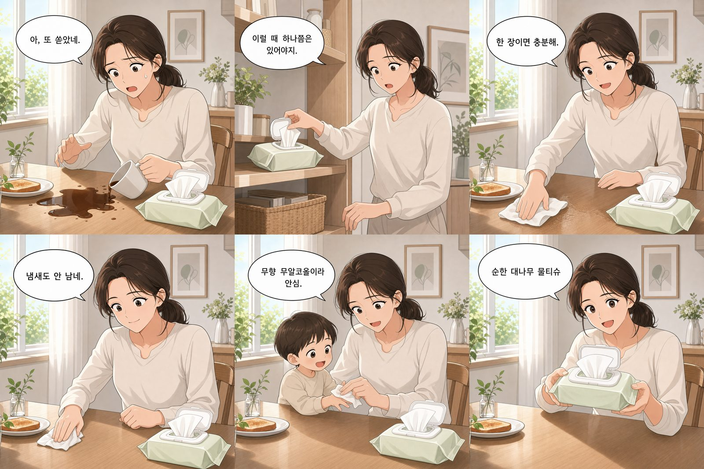

# L4 24GB 셀프호스팅 타당성 검토서

작성: 신호정(02 테크리드 겸 03 생성 서빙), 2026-08-16. 저장소 반영: 2026-08-20.

검토 대상은 GCP `g2-standard-4`(L4 24GB, 호스트 RAM 16GB)에서 오픈웨이트 모델을 셀프호스팅해
gpt-image-2와 동등한 6컷 광고 만화를 낼 수 있는가입니다. 기획서 15절의 검증 4순위(로컬 모델과
GPT 비교)에 넘길 재료로 작성했습니다.

**이 문서는 검토 기록이지 결정이 아닙니다.** 2026-08-20 회의가 이 문서와
[로컬모델_탐색_보고서.md](로컬모델_탐색_보고서.md)를 함께 보고 A-5(로컬 모델 채택 여부)를
미채택으로 확정했습니다
([회의록](../회의록/2026-08-20_검증4순위_로컬모델_미채택.md)). 효력의 범위와 이 문서가
작성된 뒤 달라진 것은 10절에 적었습니다.

검토 대상 스펙입니다.

| 항목 | 값 |
|---|---|
| GPU | NVIDIA L4 |
| VRAM | 24GB GDDR6 |
| 메모리 대역폭 | 300GB/s |
| 호스트 RAM | 16GB |
| 디스크 | 61GB (10절 참고) |
| 인스턴스 | `g2-standard-4` (추정) |

## 1. 요약

**픽셀 동등 재현은 불가입니다. 실용 수준은 조건부 가능입니다.**

스펙이 막는 것이 아니라 파이프라인 설계가 막습니다. 24GB VRAM은 충분하고, 실제 병목은 다음
순서입니다.

1. 호스트 RAM 16GB. 오프로드가 불가능해 20B급이 배제됩니다.
2. 디스크 61GB. 사전 양자화된 단일 파일이 필수입니다.
3. 대역폭 300GB/s. 장당 35 ~ 60초입니다.

한글 말풍선은 어떤 오픈웨이트로도 되지 않지만, 애초에 텍스트를 생성에 맡기면 안 되는 것이라
문제가 되지 않습니다. 말풍선을 생성 대상에서 빼고 4 ~ 9B급 상업 라이선스 모델로 참조 편집을
돌리면 레퍼런스의 80 ~ 90% 수준에 도달합니다.

일정을 감안하면 이미지 생성을 어댑터로 추상화해 API로 처리하고, L4는 브랜드 톤 LoRA 학습에
집중시키는 하이브리드를 권합니다.



위 레퍼런스는 gpt-image-2 `low` 티어로 컷별 생성 후 합성한 결과물이며, 이 문서의 검토 대상
산출물입니다.

## 2. 가정

질문에 두 가지 해석이 가능해 먼저 명시합니다.

- **(A) 이 VM에서 오픈웨이트 모델을 셀프호스팅해 레퍼런스와 동등한 결과물을 낼 수 있는가.**
  이 해석으로 답합니다.
- (B) 이 VM에서 gpt-image-2 API를 호출하는 파이프라인을 돌릴 수 있는가. 스펙과 무관하게
  가능하므로(네트워크 I/O와 이미지 합성뿐) 질문 의도가 아니라고 봤습니다.

추가 가정은 셋입니다.

- 스펙이 `g2-standard-4`(4 vCPU, 16GB RAM, L4 24GB)와 일치하므로 GCP 표준 L4 인스턴스로
  간주합니다.
- 소상공인 광고 서비스 맥락이므로 상업적 사용이 가능한 라이선스가 필수 조건입니다.
- 결과물 기준은 "픽셀 동등"이 아니라 "광고 소재로 납품 가능한 수준"입니다.

## 3. 요구사항 분해

레퍼런스를 6컷으로 뜯어보면 요구사항이 6개입니다. 스펙 판정은 이 6개를 각각 통과해야 합니다.

| # | 요구사항 | 난이도 | 병목 위치 |
|---|---|---|---|
| 1 | 인물 동일성 (헤어, 이목구비, 크림색 상의) | 상 | 모델 능력 |
| 2 | 배경과 소품 동일성 (창, 액자, 화병, 토스트, 유리병) | 상 | 모델 능력 |
| 3 | 제품 동일성 (연두색 물티슈 팩 + 흰 캡) | 최상 | 모델 능력 |
| 4 | 화풍 동일성 (수채 톤 애니풍, 아침 역광) | 중 | LoRA로 해결 |
| 5 | 한글 말풍선 | 최상 | 모델 능력 |
| 6 | 컷별 연출과 구도 | 중 | 프롬프트, ControlNet |

**핵심은 1 ~ 3번이 "생성"이 아니라 "참조 조건부 편집"으로 풀어야 하는 문제라는 점입니다.**
gpt-image-2가 저품질 티어에서도 이 일관성을 낸 것은 다중 참조 이미지 조건부 생성을 썼기
때문일 가능성이 높습니다(`추정`). 시드 고정만으로는 이 결과가 나오지 않습니다. gpt-image-2는
최대 16장의 참조 이미지를 받습니다.

## 4. 제약별 판정

### 4.1 한글 텍스트: 오픈웨이트로 사실상 불가

텍스트 렌더링이 가장 강한 오픈모델인 Qwen-Image의 공식 문서조차 지원 언어를 알파벳 계열(영어)과
표어문자 계열(중국어)로 명시합니다. 한국어는 공식 지원 목록에 없습니다. 국내 리뷰에서도 한글
렌더링은 아직 부족하다는 평가가 나옵니다(2차 자료).

**그런데 이것은 실패가 아니라 설계 오류 신호입니다.** 광고 서비스에서 말풍선 텍스트를 확산
모델에 맡기는 것은 어떤 모델을 쓰든 잘못된 선택입니다.

- 정확도가 100%가 아니면 소상공인에게 납품이 불가능합니다. 오탈자 하나로 전체를 재생성해야
  합니다.
- 카피 A/B 테스트마다 이미지를 다시 뽑아야 하므로 비용과 시간이 낭비됩니다.
- 폰트 라이선스를 통제할 수 없습니다. Pretendard, 나눔스퀘어 같은 상업 배포 가능 폰트를 쓸 수
  없습니다.
- 다국어로 확장할 때 전면 재생성이 필요합니다.
- 사장님이 문구를 직접 수정하는 기능을 만들 수 없습니다.

따라서 말풍선은 생성 대상에서 제외하고 Pillow 또는 Skia로 후합성합니다. 실제 웹툰과 광고 제작
파이프라인이 쓰는 방식입니다. 이렇게 하면 이 제약은 스펙과 무관한 문제가 됩니다.

### 4.2 인물, 배경, 제품 일관성: 가능하나 파이프라인 재설계 필요

- **참조 편집(권장).** 기준 컷 1장을 뽑고 나머지 5컷은 image-to-image 편집으로 생성합니다.
  Qwen-Image-Edit, FLUX.1 Kontext, Z-Image-Edit 계열입니다. Qwen-Image-Edit는 Qwen-Image의
  텍스트 렌더링 능력을 편집 태스크로 확장한 모델이고, FLUX.1 Kontext [dev]는 점진적 이미지
  편집에 최적화된 오픈웨이트 변형입니다.
- **캐릭터 LoRA.** 계획서에 이미 들어 있는 접근이며 화풍과 브랜드 톤 고정에 효과적입니다. 다만
  인물 동일성까지 LoRA로 잡으려면 데이터셋 20 ~ 30장이 필요하고, 소상공인마다 새로 학습하는
  것은 서비스 구조상 불가능합니다.
- **제품은 생성 대상이 아닙니다.** 물티슈 팩은 브랜드 자산입니다. 실제 제품 사진을 인페인팅
  또는 합성으로 얹는 것이 정답입니다. 생성에 맡기면 컷마다 라벨이 달라집니다.

### 4.3 VRAM 24GB: 병목이 아님

| 모델 | 파라미터 | 24GB 적재 | 라이선스 |
|---|---|---|---|
| FLUX.2 [klein] 4B | 4B | 여유 (약 8GB) | Apache 2.0 |
| Z-Image (Turbo) | 6B | 여유 (약 16GB) | 확인 필요 |
| Chroma1-HD | 8.9B | 가능 | Apache 2.0 |
| FLUX.1-dev (FP8) | 12B | 가능 (약 17GB, 단일 파일) | 비상업 |
| Qwen-Image / 2512 | 20B | 4bit + 오프로드 필요 | Apache 2.0 |

FLUX.2 [klein] 4B는 Apache 2.0으로 배포되고 약 8GB VRAM에서 1초 이내 생성이 가능합니다.
Z-Image-Turbo는 6B 증류 모델로 16GB VRAM에서 편안하게 동작합니다.

### 4.4 호스트 RAM 16GB: 실질 병목 1

**가장 과소평가되는 지점입니다.** `enable_model_cpu_offload`,
`enable_sequential_cpu_offload` 계열 전략은 가중치를 시스템 RAM에 상주시켜야 합니다. 16GB에서
OS, Python, CUDA 컨텍스트(3 ~ 4GB)를 빼면 가용은 12GB 내외이고, 여기에 FastAPI, DB, 백엔드까지
같은 VM에 올리면 더 줄어 약 10GB가 됩니다.

20B급의 오프로드 요구량은 bf16 기준 약 40GB로 가용의 4배를 넘습니다.

따라서 오프로드에 의존하는 20B급은 배제하고, 가중치 전체가 VRAM에 상주하는 4 ~ 9B급만
현실적입니다. 이것이 텍스트 렌더링이 가장 강한 Qwen-Image를 쓰지 못하는 실제 이유이며, 어차피
한글이 되지 않으므로 손해는 아닙니다.

### 4.5 디스크 61GB: 실질 병목 2

```
Ubuntu + CUDA runtime + 드라이버              약 10 GB
PyTorch + nvidia-* 의존성(cudnn/cublas)       약 8 ~ 10 GB
diffusers / transformers / ComfyUI            약 2 GB
--------------------------------------------------------
기반 소계                                     약 20 ~ 22 GB
가용                                          약 39 GB
```

- FLUX.1-dev bf16 원본 리포는 약 33GB(transformer 23.8GB + T5-XXL 9.5GB)라 사실상 불가능합니다.
- FP8 또는 GGUF 단일 파일은 transformer 약 11GB + T5 FP8 약 5GB + CLIP-L + VAE로 약 17GB이므로
  가능합니다.
- LoRA 학습용 데이터셋, 체크포인트, 중간 출력물에 최소 10GB를 확보해야 합니다.

따라서 사전 양자화된 단일 파일만 받아야 합니다. `HF_HOME`을 별도 디스크로 빼거나
`huggingface-cli download --include`로 필요한 파일만 선택해 내려받지 않으면 원본 bf16을 끌어와
디스크가 즉시 고갈됩니다. (`높은 신뢰`)

### 4.6 처리량: 실질 병목 3

L4 실측 스펙은 VRAM 24GB GDDR6, 메모리 대역폭 300GB/s, FP32 30.3 TFLOPS, FP8/INT8 텐서코어
242.5 TFLOPS, TDP 72W입니다.

확산 모델 추론은 대역폭 지배적입니다. RTX 4090이 1008GB/s이므로 L4는 대역폭 기준 약 1/3입니다.
4090에서 FLUX Dev FP8이 장당 9 ~ 10초이므로 다음과 같이 외삽됩니다.

| 모델 | L4 예상 | 6컷 소요 |
|---|---|---|
| FLUX-dev급 FP8, 20 ~ 25스텝 | 35 ~ 60초 / 장 | 4 ~ 6분 |
| Z-Image Turbo급 소수 스텝 | 5 ~ 10초 / 장 | 40초 ~ 1분 |
| Qwen-Image 20B 4bit + 오프로드 | 3 ~ 5분 / 장 | 20분 이상 |

`추정`입니다. L4 직접 벤치마크를 찾지 못해 대역폭과 TFLOPS 비례로 외삽했으며 실측이 필요합니다.
참고로 L4는 이미지를 다량 생성하되 장당 시간이 중요하지 않을 때 선택하는 GPU라는 평가가
일반적입니다.

**동시 요청은 사실상 1건입니다.** 데모에서 심사위원 두 명이 동시에 버튼을 누르면 큐가 밀립니다.

### 4.7 라이선스: 놓치기 쉬운 함정

FLUX.1-dev와 FLUX.2-dev는 비상업 라이선스입니다. 소상공인 광고를 만들어 주는 서비스는 명백히
상업 용도이므로, 공개 모노레포에 이것을 넣으면 라이선스 위반이 됩니다. FLUX.2 [dev]는 비상업
라이선스이고, 크기 증류판 klein의 4B 버전만 Apache 2.0으로 배포되며 9B klein은 비상업
라이선스가 유지됩니다.

상업적으로 안전한 선택지는 FLUX.2 [klein] 4B, Qwen-Image(Apache 2.0), Chroma1-HD(Apache
2.0)입니다. (`높은 신뢰`. 2차 자료 기반이므로 배포 전 각 리포의 LICENSE 원문을 직접 확인해야
합니다.)

## 5. 최종 판정

**픽셀 동등 재현은 불가입니다.** gpt-image-2의 프롬프트 준수도, 다중 참조 일관성, 한글 렌더링을
24GB VRAM과 16GB RAM급 오픈웨이트 조합으로 재현할 수 없습니다.

**광고 소재로 쓸 만한 6컷 만화 생성은 조건부 가능입니다.** 조건은 네 가지입니다.

1. 말풍선과 텍스트는 생성하지 않고 후합성합니다.
2. 제품 이미지는 실사진을 합성합니다(생성 금지).
3. 4 ~ 9B급 상업 라이선스 모델에 사전 양자화 단일 파일을 씁니다.
4. 기준 컷 1장을 만든 뒤 참조 편집으로 나머지 5컷을 만듭니다.

이 네 개를 지키면 레퍼런스의 80 ~ 90% 수준은 나옵니다. 오히려 텍스트 정확도는 100%가 되므로
특정 항목에서는 더 낫습니다.

## 6. 권장 아키텍처

| 단계 | 담당 | 내용 |
|---|---|---|
| 1. 스토리보드 생성 | LLM | 입력은 업종, 제품, 타겟이고 출력은 컷별 `{장면 프롬프트, 카피, 말풍선 위치}` JSON입니다. 이미지 모델이 아니라 LLM의 몫이며 계약(`openapi.yaml`) 스키마로 고정합니다 |
| 2. 기준 컷 생성 | t2i 1회 | 브랜드 톤 LoRA를 적용해 1번 칸을 확정합니다. 여기서 인물, 배경, 화풍이 결정됩니다 |
| 3. 나머지 컷 생성 | i2i 참조 편집 5회 | 1번 칸을 참조로 "같은 인물, 같은 방, 이번에는 다른 동작을 하는 장면"을 만듭니다 |
| 4. 제품 합성 | 인페인팅 또는 알파 합성 | 사장님이 업로드한 실제 제품 사진을 얹습니다. 생성에 맡기지 않습니다 |
| 5. 말풍선과 타이포 합성 | Pillow 또는 Skia | Pretendard 등 상업 배포가 가능한 폰트를 씁니다. 위치는 1단계 JSON에서 가져옵니다 |
| 6. 컷 조립 | 출력 | 격자로 합성해 최종 소재를 출력합니다 |

**이 구조의 실질적 이점은 5단계가 2 ~ 4단계와 완전히 분리된다는 것입니다.** 카피만 바꿔 10개
변형을 만들 때 GPU를 한 번도 쓰지 않습니다. 광고 서비스에서는 이것이 핵심 사용자 경험입니다.

## 7. 프로젝트 관점의 의견

제출까지 16일이 남은 시점(2026-08-16 기준)에서 냉정하게 봅니다.

| 방식 | 장당 비용 | 6컷 만화 1개 |
|---|---|---|
| gpt-image-2 `low`, 1024px | 약 $0.006 | 약 $0.036 |
| 셀프호스팅 (L4, 가동률 100%, 50초/장) | 약 $0.010 | 약 $0.060 |

2차 자료 기준이며 OpenAI 공식 가격 페이지 원문은 확인하지 못했습니다. gpt-image-2의
1024 x 1024 `low` 티어가 약 $0.006이고 `g2-standard-4`가 온디맨드 약 $0.70/hr입니다. 다만 일부
소스는 gpt-image-2가 low, medium, high 품질 옵션을 해상도 옵션으로 대체했다고 기술해 출처 간
내용이 상충하므로, 실제 청구 전에 가격 페이지를 직접 확인해야 합니다.

**순수 이미지 단가는 셀프호스팅이 이기지 못합니다.** GPU 가동률이 100%일 때조차 비슷하고, 실제
데모 환경의 가동률은 5%도 되지 않습니다. 여기에 셀프호스팅 엔지니어링 시간(모델 선정, 양자화,
파이프라인, 튜닝)이 며칠 단위로 들어갑니다.

### 7.1 권고

- **이미지 생성 자체는 API로 가되 어댑터 인터페이스 뒤에 두십시오.** `ImageGenerator` 추상화에
  `OpenAIImageAdapter`와 `LocalDiffusionAdapter` 두 구현을 두는 형태이며, 계약 우선 개발 방식과
  정확히 맞습니다.
- **VM의 L4는 LoRA 학습에만 쓰십시오.** 브랜드 톤 일관성이 이 프로젝트의 유일한 기술적 차별화
  요소인데 이것은 API로는 할 수 없습니다. GPU를 그쪽에 몰아주는 것이 맞습니다.
- 중간 점검까지 이틀이 남았습니다. 셀프호스팅 추론 파이프라인까지 붙이려 하면 둘 다 끝내지
  못합니다. 1단계 스토리보드와 5단계 타이포 합성 레이어를 먼저 만드십시오. GPU가 없어도 되고,
  결과물 품질에 가장 크게 기여하며, 어떤 이미지 백엔드를 쓰든 버려지지 않는 자산입니다.

## 8. 신뢰도

| 주장 | 라벨 |
|---|---|
| L4 하드웨어 스펙, 라이선스 구분, 픽셀 동등 재현 불가 | `확실한 사실` |
| Qwen-Image 한국어 미지원, RAM과 디스크 병목 분석, 권장 아키텍처 | `높은 신뢰` |
| L4 장당 생성 시간, 비용 비교, 결과물 80 ~ 90% 수준 | `추정` |
| Z-Image 라이선스, gpt-image-2 정확한 과금 구조 | `불확실`. 원문 확인 필요 |

## 9. 출처

| 자료 | 주소 | 갱신일 |
|---|---|---|
| Qwen-Image Blog | qwenlm.github.io/blog/qwen-image/ | 2025-08-04 |
| Qwen/Qwen-Image Model Card | huggingface.co/Qwen/Qwen-Image | 2025-08-04 |
| Qwen/Qwen-Image-Edit Model Card | huggingface.co/Qwen/Qwen-Image-Edit | 불명 |
| NVIDIA L4 Product Page | nvidia.com/en-us/data-center/l4/ | 불명 |
| NVIDIA Technical Blog, FLUX.1 Kontext Quantization | developer.nvidia.com/blog/optimizing-flux-1-kontext-for-image-editing-with-low-precision-quantization/ | 2025-07-24 |

가격, 벤치마크, 라이선스 세부는 모두 2차 자료(devzero, wavespeed, cinevva, bentoml 등)에
기반하므로 확정 전에 1차 출처를 재확인하는 것을 권합니다.

## 10. 이 문서의 효력

**작성 시점은 2026-08-16이고 본문은 그때의 판단 그대로입니다.** 저장소에 늦게 반영했을 뿐
내용을 뒤에 맞추어 고치지 않았습니다. 아래 넷은 그 뒤에 달라졌거나 다른 문서가 정정한
것이므로 함께 읽어야 합니다.

- **디스크 61GB는 총 용량이 아닙니다.** 전체는 100GB이며([ADR-0011](../adr/0011-배포_환경_스펙과_권한_경계.md))
  61GB는 다른 용도로 쓰인 만큼을 뺀 그 시점의 가용 용량입니다. 2026-08-20 회의가 확정값과
  어긋나지 않는다고 확인했으므로 4.5절의 계산은 그대로 유효합니다.
- **7절의 비용 비교는 단일 광고형 축에만 해당합니다.** 만화형에서는 방향이 반대입니다.
  gpt-image-2 컷별 `medium`은 세트당 0.4041 USD(장당 약 0.067 USD)로 셀프호스팅 추정치의 6배가
  넘습니다. 두 축을 갈라 통일한 것이 2026-08-18 회의이며 정본은
  [생성_경로_비교표.md](생성_경로_비교표.md) C절과 G절입니다. **만화형은 로컬에서 측정된 바가
  없습니다.**
- **7.1절의 권고 중 파인튜닝 관련 서술은 현재 범위가 아닙니다.** LoRA 파인튜닝은
  [ADR-0004](../adr/0004-파인튜닝_보류.md)로 보류됐고 `training/`은 비어 있는 채로 남습니다.
  "중간 점검까지 이틀" 같은 일정 표현도 작성 시점 기준입니다.
- **A-5는 2026-08-20에 미채택으로 확정됐습니다.** 판정자 임동규, 송기하 두 사람이 모두 동의해
  B-15의 통과 기준을 충족했습니다. 미채택 판단의 근거는 이 문서의 권고가 아니라 회의의 판단이며,
  그 이유는 [회의록](../회의록/2026-08-20_검증4순위_로컬모델_미채택.md)에 있습니다.

**이 문서는 스스로 결정이 아닙니다.** 로컬과 API 두 탐색을 같은 사람(03)이 수행했으므로 그
사람이 채택 권고까지 쓰면 기획서 15절의 자기 채점 금지에 걸립니다. A-5의 확정 근거는 이 문서가
아니라 검증 4순위의 판정입니다.
