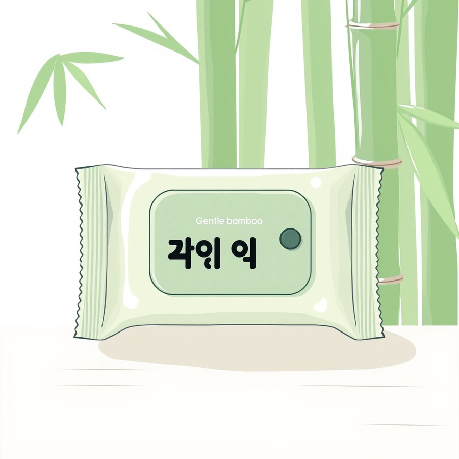
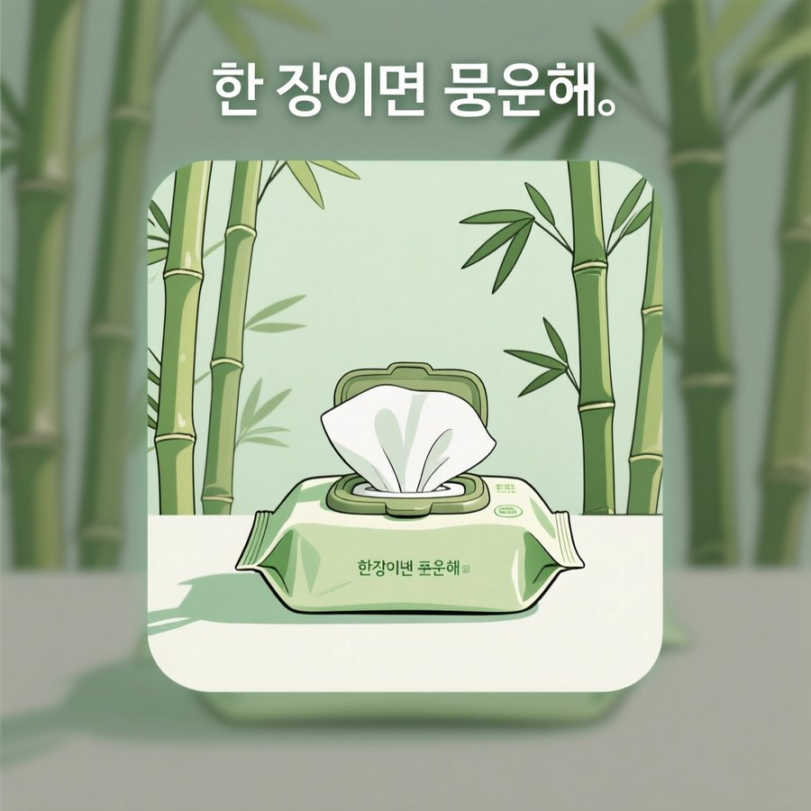
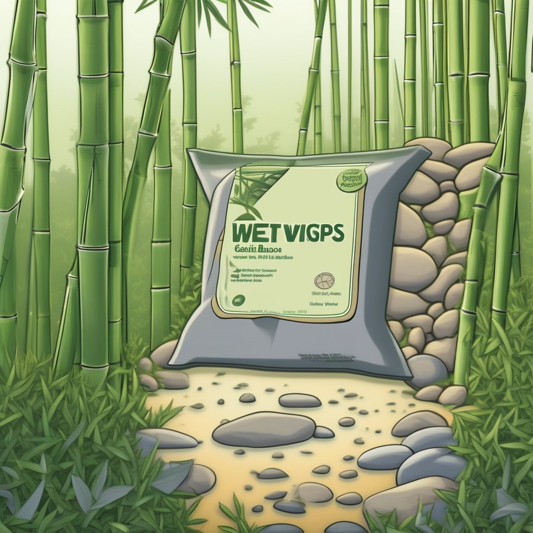
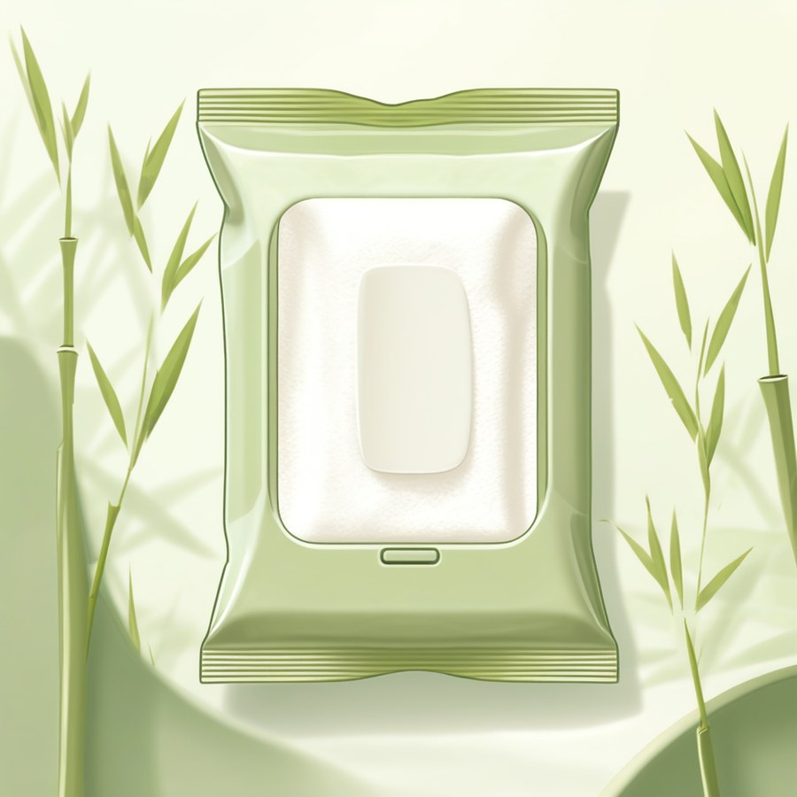
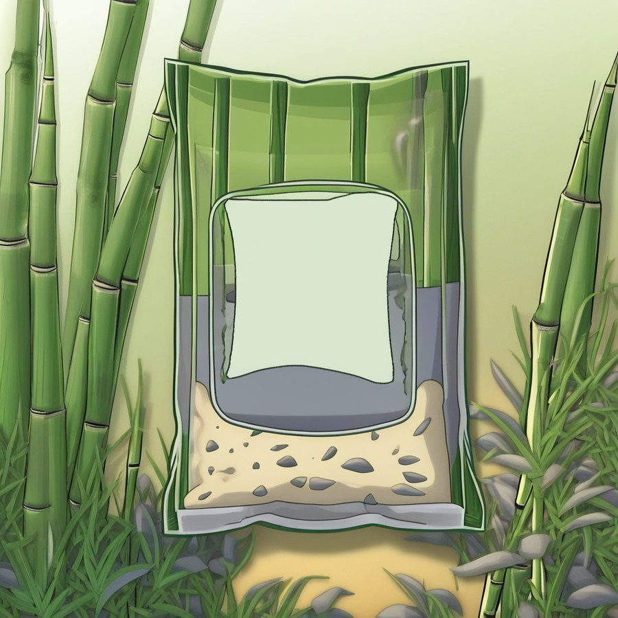
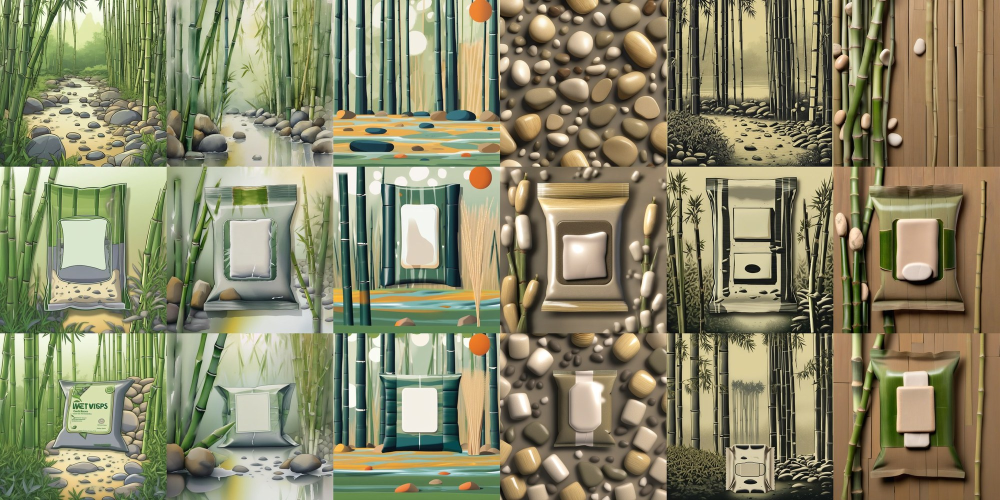
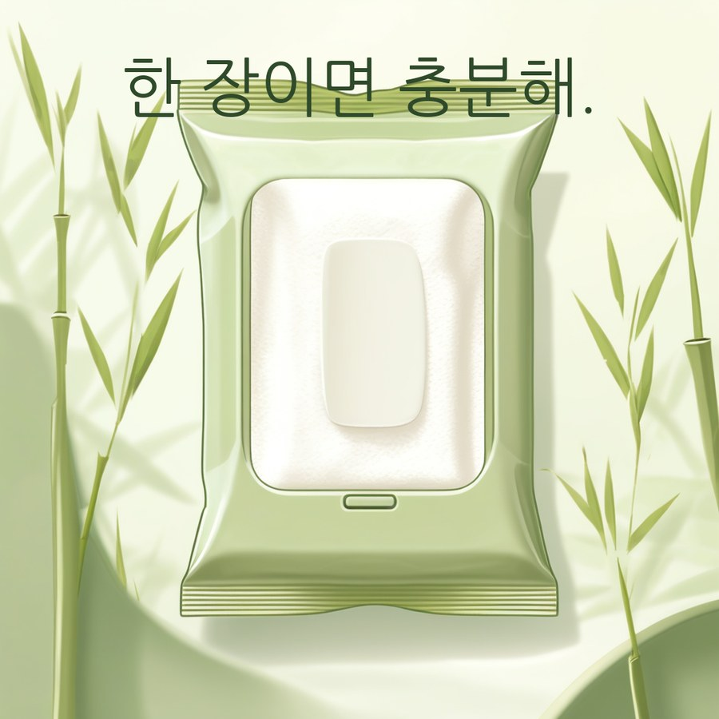

# 로컬 생성 모델 탐색 보고서

실험 수행: 신호정(02 테크리드 겸 03 생성 서빙), 2026-08-15. 문서 작성: 2026-08-18.

이 보고서는 광고 이미지를 **외부 API 대신 GCP VM 안의 로컬 모델로 생성할 수 있는지**를 실측한
기록입니다. 기획서 15절의 검증 8순위(VM 스펙 확인 마무리, 완료 조건은 로컬 모델 구동 가능 여부
확정)를 닫고, 그 결과를 검증 4순위(로컬 모델과 GPT 비교)에 넘기기 위해 수행했습니다.

**이 문서는 실험 기록이지 결정이 아닙니다.** 효력의 범위는 9절에 적었습니다.

## 1. 요약

로컬 모델은 이 VM에서 **구동됩니다.** 세 후보 모두 가용 VRAM 22.5GB 안에서 돌았고, 검증
8순위의 완료 조건은 가능으로 닫힙니다.

다만 탐색 과정에서 로컬 경로의 진짜 장벽이 base 모델 선택이 아니라 **한글**이라는 것이
드러났습니다. 세 후보 중 어느 것도 한국어 카피를 정확히 그리지 못했고, 한글을 우회하려면
글자를 모델이 아니라 우리가 그려 넣어야 하는데(후처리 합성), 그 합성의 입력은 **글자가 전혀
없는 깨끗한 제품컷**이어야 합니다. 처음에는 어느 조합도 그것을 만들지 못했습니다.

이 보고서의 결론은 그 구멍을 메우는 방법을 찾았다는 것입니다. **IP-Adapter 레퍼런스를 두 장으로
나누어** 화풍은 장면 레퍼런스에서, "라벨은 비어 있다"는 무지 제품 레퍼런스에서 각각 가져오면
화풍 6종 x 시드 5개에서 **글자 없음 30/30**이 나옵니다. 같은 조건의 단일 레퍼런스 대조군은
16/30입니다.

| 후보 | 한글 카피 | 장당 소요 | 브랜드 톤 통제 | 현재 위치 |
|---|---|---|---|---|
| gpt-image-2 (외부 API, 기준선) | 정확 (20회 100%) | 20.3초 | 프롬프트뿐 | 현행 채택안 |
| FLUX.1-schnell | 불가 | 10.5초 | 사실상 없음 | 후순위 |
| Qwen-Image Q4 | 글자꼴은 되고 철자 0/5 | 215초 | 프롬프트뿐 | 관찰 대상 |
| **SDXL + 레퍼런스 2장 + 후처리 합성** | **정확 (구성상 보장)** | **15.2초** | **IP-Adapter** | **유일하게 완결된 로컬 조합** |

## 2. 측정 조건

조건을 바꾸면 이전 회차와 비교가 깨지므로 전부 고정했습니다.

| 항목 | 값 |
|---|---|
| 해상도 | 1088 x 1088 (검증 1순위의 단일 광고형과 같은 값) |
| 시드 | 42 ~ 46 (저장소 공통 규약의 42에서 시작) |
| 스텝 | FLUX 4 / SDXL 30 (CFG 7.0) / Qwen 30 (true CFG 4.0) |
| 프롬프트 | 영어. 이유는 5.1절 |
| 실행 환경 | GCP VM 호스트 venv. 배포 스택(docker compose)과 분리 |

**실행 환경을 분리한 이유**는 ADR-0003(이미지 생성 경로)이 서빙 이음매를 둘로 만드는 안을
기각했기 때문입니다. 이 탐색은 서빙 경로(`apps/ai-engine`)를 건드리지 않습니다.

## 3. 하드웨어: 세 후보 모두 들어갑니다

| | FLUX.1-schnell Q8_0 | SDXL base 1.0 fp16 | Qwen-Image Q4 |
|---|---|---|---|
| peak VRAM | 15.75GB | **11.79GB** | 18.4GB |
| 장당 생성 시간 | **9.9 ~ 11.1초** | 13.6 ~ 14.9초 | 215초 |
| 디스크 | 약 22.7GB | **약 10GB** | 약 29GB |
| 라이선스 | Apache-2.0 | CreativeML Open RAIL++-M | Apache-2.0 |

가용 VRAM 22.5GB는 ADR-0011(배포 환경 스펙과 권한 경계)의 실측값입니다.

주의: **FLUX는 두 단계로 나눠야 들어갑니다.** 텍스트 인코더(9.86GB)와 트랜스포머(15.75GB)를
동시에 올리면 예산을 넘고, CPU 오프로드로 우회하면 호스트 RAM 16GB가 먼저 터집니다. 인코딩을
끝내고 인코더를 해제한 뒤 트랜스포머를 올리는 방식으로 통과했습니다.

**디스크가 VRAM보다 먼저 막습니다.** FLUX와 Qwen을 동시에 둘 수 없어 FLUX 실측을 마친 뒤
지우고 Qwen을 받았습니다. FLUX 파인튜닝은 bf16 원본 23.8GB가 필요해 **시작할 수 없습니다.**
SDXL LoRA 학습은 peak 11.54GB, 스텝당 1.29초로 여유 있게 들어갑니다(측정만 했고 산출물은
만들지 않았습니다. ADR-0004 파인튜닝 보류).

## 4. 한글이 장벽입니다

### 4.1 FLUX: 한국어를 읽지도, 글자를 빼지도 못합니다

기획의 한국어 프롬프트를 원문 그대로 넣었더니 제품도 화풍도 카피도 없는, 주제와 무관한 발코니
사진이 나왔습니다. 텍스트 인코더가 T5-XXL이라 한국어 이해도가 낮습니다. **로컬 모델을 채택하면
프롬프트 조립 단계에 한국어에서 영어로의 번역이 들어갑니다.** 지금 파이프라인 설계에 없는
단계이고, 번역 품질이 곧 이미지 품질이 됩니다.

글자를 빼는 것도 되지 않았습니다. "Do not write any text, letters or numbers anywhere"를
명시했는데도 10장 전부 가짜 글리프를 그렸습니다. schnell은 guidance distilled라 negative
prompt가 무효이고, 부정 지시를 강제할 수단이 프롬프트에 없습니다.

패키지에 "각인 익"이라는 뜻 없는 한글과 영문이 들어가 있습니다. 글자 없음 **0/10**입니다.

### 4.2 Qwen-Image: 한글을 그리지만 철자가 틀립니다

한글을 직접 그리는 유일한 로컬 후보입니다. 글자꼴은 한글로 보이지만 **철자가 0/5**입니다.

"한 장이면 충분해."를 요청했는데 "한 장이면 뭉운해."가 나왔습니다. 흥미로운 것은 **앞 3음절
"한 장이"는 5/5로 정확**했다는 점입니다. 문자열이 길어질수록 무너진다면 카피를 짧게 가져가는
기획 변경으로 살아날 여지가 있습니다(미확인 가설입니다).

채택 후보가 아니라 관찰 대상으로 둡니다. **장당 215초**와 철자 0/5가 둘 다 서비스 요건에
걸립니다.

### 4.3 SDXL: 글자를 못 빼는 이유가 다릅니다

SDXL은 negative prompt가 동작하는데도 10장 중 7장에 글자가 있었습니다. 이유는 단순합니다.
**제품 패키지에는 원래 라벨이 있습니다.** 모델은 패키지를 그리면서 라벨 자리에 글자 비슷한
것을 채웁니다.

그래서 로컬 경로의 문제는 이렇게 정리됩니다.

> 한글 카피는 후처리 합성으로 우리가 그려 넣으면 정확합니다. 그러나 그 합성의 입력은 **글자가
> 없는 제품컷**이어야 하고, 그것을 만드는 것이 어렵습니다.

## 5. 통제 수단은 IP-Adapter 하나뿐입니다

SDXL만 IP-Adapter를 쓸 수 있고, 이것이 세 후보를 가르는 결정적 차이였습니다.

레퍼런스 1장을 주고 같은 프롬프트를 on/off로 돌린 결과, 제품 정확도가 **6/10에서 10/10**으로
올랐고 시드가 달라도 톤이 유지되었습니다. 즉 IP-Adapter는 브랜드 톤 이전만 하는 것이 아니라
**SDXL의 프롬프트 충실도 문제까지 함께 가려 줍니다.** 레퍼런스가 "무엇을 그릴지"를 텍스트보다
강하게 지시하기 때문입니다. 이것은 외부 API 경로에는 없는 통제 수단입니다.

부작용도 확인했습니다. **레퍼런스에 글자가 있으면 그 글자까지 옮겨옵니다(10/10).** negative
prompt로 억제되지 않습니다.

이 부작용을 겨냥해 InstantStyle 계열의 블록 한정 주입을 시험했습니다. 어댑터를 UNet 전체가
아니라 스타일 블록(`up.block_0`)에만 주입하는 방식이며, 글자 없음이 **8/10**까지 올라갔습니다.
현재까지 가장 좋은 단일 구성입니다.

## 6. 레퍼런스가 지배 요인입니다

### 6.1 프롬프트 문구보다 레퍼런스가 셉니다

글자 억제를 더 밀어붙이기 위해 두 축을 갈랐습니다. 레퍼런스(글자 있음/없음)와 프롬프트
문구(부정 지시/긍정 서술)의 2 x 2입니다.

**레퍼런스가 지배 요인이었습니다.** 글자 없는 레퍼런스로 바꾸자 6/6이 되었고, 문구를 바꾼 것은
그만한 효과가 없었습니다.

### 6.2 그런데 화풍을 바꾸면 다시 무너집니다

화풍 6종(웹툰, 수채, 플랫 벡터, 3D 렌더, 레트로 인쇄, 미니멀 사진)을 각각 장면 레퍼런스로
전이해 보았습니다. **화풍 전이 자체는 6/6으로 안정적**이지만 글자 억제가 11/18로 떨어졌습니다.

패키지에 "WET VIGPS"라는 가짜 영문이 크게 박혔습니다. 이 회차의 레퍼런스는 아래와 같이 글자가
전혀 없는 장면 이미지입니다.

즉 **레퍼런스에 글자가 없는 것만으로는 부족합니다.** 레퍼런스가 "라벨은 이렇게 비어 있다"를
보여 주어야 모델이 라벨 자리를 비웁니다. 장면만 주면 패키지 표면은 모델이 알아서 채우고, 그
채움이 가짜 글자입니다.

### 6.3 한 장이 두 가지를 나르지 못합니다

그 규약대로 "글자 없음 + 무지 패키지 제품 컷 + 배경 통일"을 만족하는 레퍼런스를 화풍 6종으로
다시 만들어 보았습니다. **레퍼런스를 만드는 단계에서 규약이 무너졌습니다.**

- 글자 없는 것이 18장 중 2장뿐이었습니다. 결과물과 똑같은 문제에 한 단계 앞에서 걸립니다.
- 6종이 전부 비슷한 사진풍 제품 목업으로 나왔습니다. 화풍 지시가 "무지 패키지 제품 컷"이라는
  강한 구도 지시에 밀렸습니다.

| 레퍼런스를 이렇게 만들면 | 화풍 전이 | 글자 억제 |
|---|---|---|
| 장면 이미지 | **6/6** | 11/18 |
| 무지 패키지 제품 컷 | 거의 안 실림 | 확인 불가 (레퍼런스부터 글자가 있음) |

**한 장의 레퍼런스가 "이 화풍으로"와 "라벨은 비어 있다"를 동시에 나르지 못합니다.**

## 7. 해법: 레퍼런스를 둘로 나눕니다

한 장이 두 가지를 못 나른다면 각자 한 가지만 나르게 하면 됩니다. 같은 어댑터를 두 벌 적재하고
어댑터마다 다른 UNet 블록에 주입했습니다.

| 어댑터 | 레퍼런스 | 주입 블록 | 나르는 것 |
|---|---|---|---|
| 0 | 장면 이미지 | `up.block_0` (스타일) | 화풍 |
| 1 | 무지 패키지 제품 컷 | `down.block_2` (레이아웃) | "라벨은 비어 있다" |

두 번째 어댑터에 넣은 레퍼런스입니다. 라벨 면이 비어 있는 것을 보여 주는 것이 이 이미지의
역할입니다.

### 7.1 제품쪽 세기 탐색

두 레퍼런스가 서로를 밀어낼 수 있으므로 제품쪽 주입 세기를 먼저 훑었습니다. 화풍 2종(직전
회차의 최악인 웹툰과 중간인 수채) x 시드 3개입니다.

| 제품쪽 scale | 웹툰 | 수채 |
|---|---|---|
| 0.4 | 1/3 | 2/3 |
| 0.7 | 2/3 | 3/3 |
| **1.0 (레이아웃 attention만)** | **3/3** | **3/3** |
| 1.0 (down.block_2 양쪽) | 3/3 | 3/3 |

**글자 억제가 제품쪽 세기에 단조롭게 반응합니다.** 1.0의 두 조건이 동률이라 육안으로 갈랐고,
양쪽 attention을 쓰면 장면 레퍼런스의 내용물(조약돌)이 봉투 안까지 밀려들어와 제품이 무너져
레이아웃 attention만 쓰는 쪽을 택했습니다.

### 7.2 본 회차 결과: 30/30

화풍 6종 x 시드 5개, 30장입니다. 대조군은 같은 레퍼런스 같은 시드에서 두 번째 어댑터의 세기만
0으로 둔 단일 적재입니다.

| 화풍 | 레퍼런스 2장 | 단일 적재(대조) |
|---|---|---|
| 웹툰 | **5/5** | 2/5 |
| 수채 | **5/5** | 3/5 |
| 플랫 벡터 | **5/5** | 3/5 |
| 3D 렌더 | **5/5** | 1/5 |
| 레트로 인쇄 | **5/5** | 3/5 |
| 미니멀 사진 | **5/5** | 4/5 |
| 합계 | **30/30** | **16/30** |

기획의 기본 화풍인 웹툰이 직전 회차에서 0/3이었던 것도 5/5가 되었습니다.

시드로 갈라 보면 이전 회차가 지목했던 편차도 사라집니다.

| 시드 | 42 | 43 | 44 | 45 | 46 |
|---|---|---|---|---|---|
| 레퍼런스 2장 | 6/6 | 6/6 | **6/6** | 6/6 | 6/6 |
| 단일 적재(대조) | 5/6 | 4/6 | **0/6** | 5/6 | 2/6 |

**대조군에서 시드 44가 0/6으로 재현되었습니다.** 직전 회차에서 실패 7건 중 5건이 몰렸던 바로
그 시드입니다. 레퍼런스 2장 구성은 그 시드에서도 6/6입니다. 즉 **시드 편차는 화풍의 문제가
아니라 레퍼런스가 라벨 면을 지정하지 않을 때 생기는 문제**였고, 지정하면 시드가 문제가 되지
않습니다.

### 7.3 화풍 전이는 유지됩니다

글자를 잡는 대가로 화풍이 죽으면 의미가 없으므로 나란히 놓고 확인했습니다. 위에서부터
레퍼런스, 레퍼런스 2장, 단일 적재이고, 열은 화풍 6종입니다.

6종 전부 레퍼런스의 색과 질감과 마감이 그대로 넘어오고, 대조군과 견주어 화풍 차이가 보이지
않습니다. 육안 판정이며 **검증된 화풍 지표는 아직 없습니다.**

비용은 거의 없습니다. **장당 15.2초**(단일 적재 14.3초 대비 +0.9초), **peak VRAM 12.91GB**로
가용 예산 안이고 추가 다운로드는 없습니다.

### 7.4 카피는 우리가 그립니다

글자 없는 제품컷이 나오면 남은 것은 합성입니다. 한국어 카피를 Pillow로 지정 폰트에 얹으므로
**철자가 구성상 보장**되고, 소요는 1초 미만입니다.

## 8. 판정을 육안에서 스크립트로

여기까지의 글자 억제 수치는 처음에 전부 육안이었습니다. 재현되지 않고, 품질을 재현 가능한
스크립트로 증명하라는 저장소 규약에도 어긋납니다. 글자 검출기로 옮겼습니다.

**인식이 아니라 검출만 합니다.** 이 모델들이 그리는 글리프는 대개 실제 단어가 아니라서 "뭐라고
쓰였는가"를 묻는 것은 의미가 없습니다. 필요한 것은 "글자 검출기가 반응하는가" 하나이며, 그것이
곧 "이미지에 글자가 없다"는 성질입니다.

쓰기 전에 기존 70장을 육안 판정과 대조했고, 기본 임계값이 **관대한 쪽으로 틀린다**는 것을
확인했습니다. 글자가 있는데 없다고 하는 방향입니다. 가드레일은 방향이 반대여야 하므로(놓치는
것보다 과검출이 안전) 임계값을 0.3에서 **0.05**로 낮췄습니다. 이 값에서 40장 기준 육안과
1장 차이이고, 채택 후보 구성에서는 두 임계값이 같은 값을 냅니다.

7절의 30/30과 16/30은 이 검출기로 잰 것입니다. 6절 이전의 수치는 육안이므로 **두 수치를 직접
빼서 비교하지 마십시오.**

## 9. 이 문서의 효력

**결정의 근거가 아닙니다.** 아래 셋 때문입니다.

1. **판정자가 없습니다.** 글자는 스크립트가 판정하지만 화풍 전이와 제품 충실도는 수행자 본인의
   육안입니다. A-5(로컬 모델 채택 여부)의 확정 근거는 검증 4순위 결과이고, 그 과제의 수행자는
   04이며 판정자는 임동규, 송기하 2명입니다(B-15, 검증 과제 담당 배정). 두 사람 모두 동의해야
   통과합니다.
2. **표본이 조건당 5장입니다.** 판정 회차의 20회 기준에 못 미칩니다.
3. **확정은 회의록으로 합니다.** 이 탐색의 착수 승인은 메신저로 받았고, 메신저는 저장소의 근거
   자료 규칙에서 근거가 아닙니다.

또한 이 문서는 **채택 권고를 담지 않습니다.** 조건이 같은 상태에서 수행자가 판정까지 하면
기획서 15절의 자기 채점 금지에 걸립니다.

다만 4순위가 물어야 할 질문은 이 탐색으로 좁혀졌습니다. 4순위가 다루는 것은 **단일 광고형의
생성 경로**이고, 그 범위에서는 비용이 판단 축이 아닙니다(장당 $0.0069, 30 USD 상한으로 약
4,300장). 한국어 텍스트는 외부 API가 확실히 앞서므로 남는 물음은 하나입니다.

> IP-Adapter로 얻는 브랜드 톤 통제가, 한국어 카피를 후처리 합성으로 옮기는 비용을 감당할
> 만한가.

**비용 축을 출력 유형별로 갈라 적은 이유가 있습니다.** 초고는 "비용은 판단 축에서 빠진다"고
유형 구분 없이 적었는데, 그 서술은 만화형에서 성립하지 않습니다. 결제 계정이 학원 소유인 것과
예산 상한이 있는 것은 다른 이야기이고, **외부 API에는 30 USD 상한이 있습니다.**

| 생성 방식 | 장당 | 30 USD로 만들 수 있는 양 | 비용이 판단 축인가 |
|---|---|---|---|
| 단일 광고형 | $0.0069 | 약 4,300장 | 아니오 |
| 만화형 컷별 `low` | $0.0974 | 약 300세트 | 아니오 |
| 만화형 컷별 `medium` | $0.4041 | 약 74세트 | **예** |

이미 90회에 6.06 USD를 썼으므로 남은 예산은 약 24 USD입니다. 만화형을 `medium`으로 고정하기로
한 이상(2026-08-18 회의) 만화형에서는 비용이 실질적 제약입니다. 로컬 경로는 이 제약을 받지
않으며, 그것이 4순위 이후에도 로컬을 완전히 닫지 않는 이유 중 하나입니다.

같은 내용을 [생성_경로_비교표.md](생성_경로_비교표.md) C절이 두 보고서를 나란히 놓고 다룹니다.

## 10. 남은 대가와 확인하지 않은 것

레퍼런스 2장 구성이 공짜는 아닙니다.

- **제품 레퍼런스의 구도까지 옮겨옵니다.** `down.block_2`는 레이아웃 블록이라 "라벨이 비어
  있다"만 오지 않고 그 이미지의 구도가 함께 옵니다. 화풍 6종이 전부 같은 구도로 수렴합니다.
  다만 실사용에서 그 자리에 들어갈 것은 사용자가 올린 제품컷이므로, 결함이 아니라 기획의
  제품컷 입력 경로와 같은 이음매일 수 있습니다.
- **장면 레퍼런스의 내용물이 제품 안으로 샙니다.** 웹툰과 레트로 인쇄에서 봉투 안이 조약돌로
  채워져 물티슈 팩으로 읽히지 않습니다. **제품 충실도 축은 이번 회차에서 재지 않았습니다.**
  글자만 쟀습니다. 이것이 다음 회차의 1순위입니다.

그 밖에 확인하지 않은 것은 다음과 같습니다.

- 화풍 전이의 기계 판정. 사람 평가와의 상관을 확인하기 전에는 대리 지표를 쓸 수 없어 육안으로
  두었습니다.
- SDXL의 한국어 프롬프트 이해도. 영어로만 측정했습니다.
- 짧은 카피에서의 Qwen 철자 정확도(4.2절의 가설).
- 후처리 합성의 자리와 대비 결정 규칙. 지금은 카피를 위쪽 고정 위치에 놓기만 합니다.
- torch 버전 차이. 7절 회차는 2.13에서, 그 앞 회차는 2.11에서 돌았습니다. 15.2초와 14.3초의
  차이를 다중 적재 비용으로만 읽으면 안 됩니다.

## 11. 재현 방법

실험 스크립트와 상세 실측표는 아래에 있습니다. 이 보고서는 그 요약입니다.

| 자료 | 위치 |
|---|---|
| 하드웨어 실측과 후보 비교 | [RESULTS.md](../../notebooks/hj/verify08_local_model_probe/RESULTS.md) |
| 파이프라인 조사와 회차별 실험 | [PIPELINE_SURVEY.md](../../notebooks/hj/verify08_local_model_probe/PIPELINE_SURVEY.md) |
| 후속 과제와 실측으로 겪은 함정 | [NEXT_STEPS.md](../../notebooks/hj/verify08_local_model_probe/NEXT_STEPS.md) |
| 재현 스크립트와 실행 명령 | [README.md](../../notebooks/hj/verify08_local_model_probe/README.md) |

결과 이미지 전량(회차별 폴더, `metrics.json` 포함)은 `outputs/로컬모델_탐색/`에 있습니다.
이 경로는 저장소의 `.gitignore` 대상이라 커밋되지 않습니다. 공개 저장소이므로 의도된 배치이며,
판정자에게는 파일로 전달합니다. 이 보고서에 실은 이미지는 그중 대표 8장을 축소한 사본입니다.
