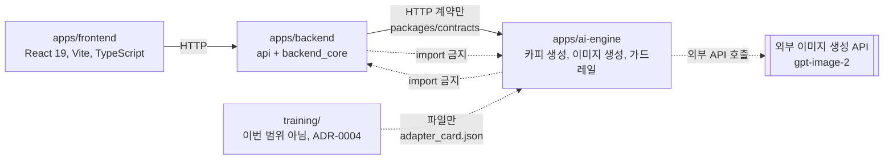
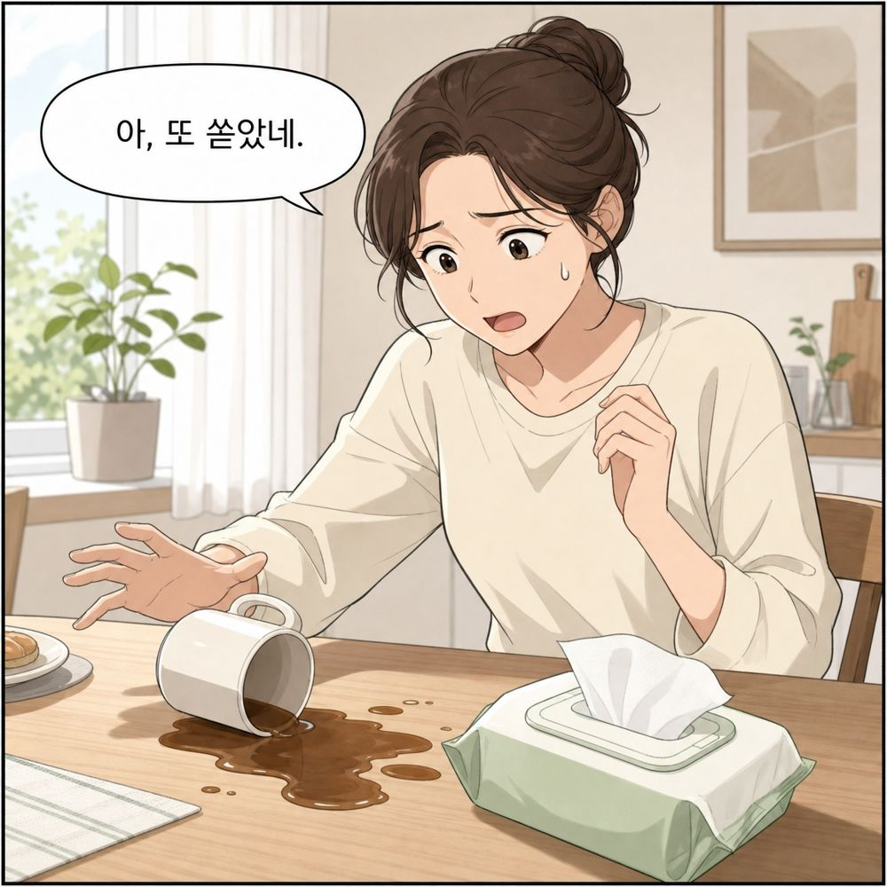
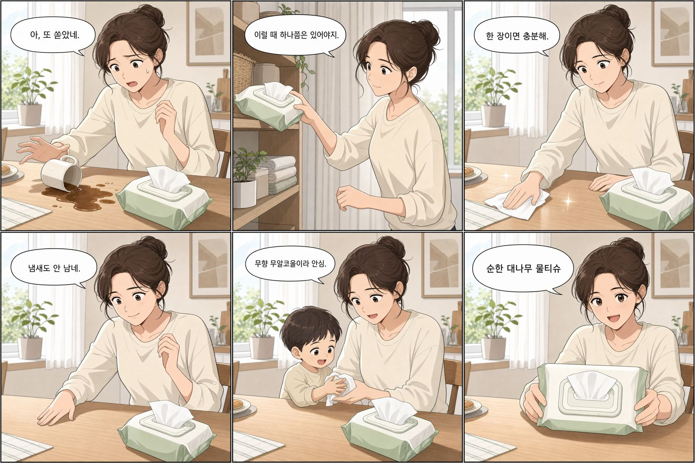
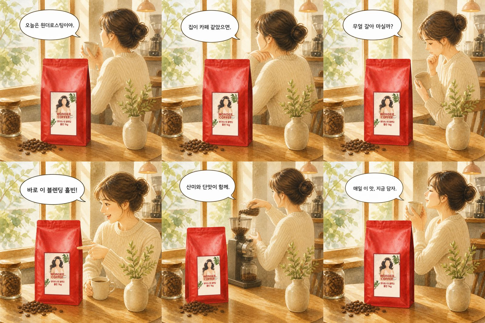
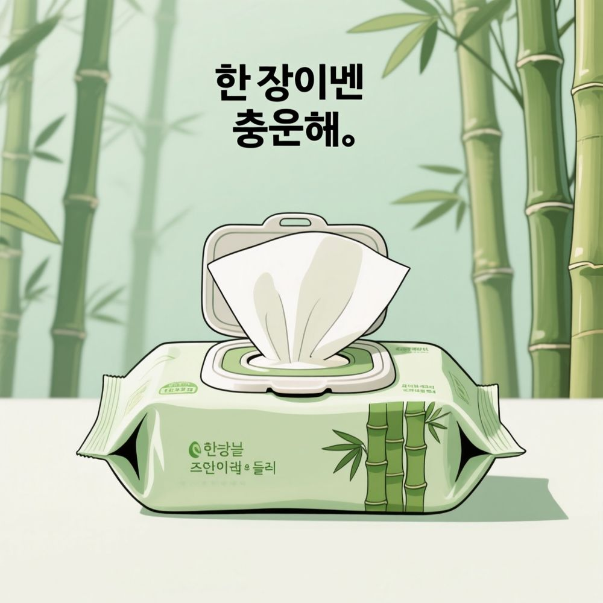

# 최종 보고서

**HAPPY 3팀 / 브랜드 스타일 광고 소재 생성 서비스**

| 항목 | 내용 |
|---|---|
| 과정 | 코드잇 AI10 Part4 고급 프로젝트 |
| 기간 | 2026-08-04 ~ 2026-08-30 (실작업 21일) |
| 팀 | 정승호(01 PM/기획, 04 AI 학습/데이터, 07 QA/보안), 신호정(02 테크리드, 03 AI 생성/서빙), 임동규(05 백엔드/인프라), 송기하(06 프론트엔드) |
| 저장소 | `Codeit-AI10-Part4-3Team/AI10-Part4-3Team-Advanced-Project` (public) |
| 작성 기준일 | 2026-08-30 |

> 아래 수치는 모두 저장소의 실측 보고서에서 옮긴 것이며, 각 절이 정본 문서를 링크로
> 가리킵니다. 수치가 어긋나면 링크된 쪽이 맞습니다.

---

## A. 프로젝트 개요

### A-a. 무엇을 만들었는가

제품 사진과 제품명, 소구점을 입력받아 인스타그램용 광고 콘텐츠를 만들어 주는 서비스입니다.
사용자는 **만화형**과 **단일 광고 이미지형** 중 하나를 고르며, 어느 쪽이든 그림이 나오기 전에
텍스트 시안을 먼저 보고 고친 뒤 확정 시점에 이미지를 생성합니다. 산출물은 두 유형 모두 이미지
한 장이고, 그 안에 몇 컷이 들어 있는지만 다릅니다.

정본은 [기획서.md](../기획서/기획서.md) 1절입니다.

### A-b. 푸는 문제

디자이너와 마케터를 따로 두기 어려운 소상공인과 개인 판매자가, 외주 없이 일관된 브랜드 톤의
광고 소재를 분 단위로 뽑는 것입니다. 기획서 2절이 사용자 문제 다섯 가지를 정리했고, 그중
설계에 직접 반영된 것은 셋입니다.

| 사용자 문제 | 설계에 반영한 방식 |
|---|---|
| 취향을 말로 표현하지 못합니다 | 화풍 8종을 예시 이미지로 보여 주고 고르게 합니다. 고르지 않으면 후보에서 무작위로 뽑습니다 |
| 결과가 마음에 들지 않아도 무엇을 바꿀지 모릅니다 | 이미지 생성 전에 장면과 대사를 텍스트 시안으로 보여 주고, 지정한 부분만 교체합니다 |
| 옵션이 많으면 중간에 이탈합니다 | 필수 입력을 3개(사진, 제품명, 소구점)로 줄이고 나머지는 추론과 기본값으로 채웁니다 |

### A-c. 차별점

일반적인 광고 이미지 생성은 이미 포화 상태이므로, 같은 형식으로 경쟁하지 않고 **결과물의 형식을
만화로 확장**하여 차별화했습니다. 만화 형식이라는 선택은 감각적 판단이 아니라 인스타그램 그리드
및 캐러셀 포맷 특성과 스크롤 이탈 방지 구조로 정당화했으며, 그 근거는
[만화형_채택_근거.md](../기술문서/만화형_채택_근거.md)에 있습니다.

### A-d. 범위 밖으로 둔 것

두 가지를 명시적으로 하지 않기로 결정했고, 둘 다 ADR 로 기록했습니다.

| 하지 않은 것 | 결정 | 근거 |
|---|---|---|
| 브랜드 스타일 LoRA 파인튜닝 | 하지 않습니다. `training/` 은 비어 있는 채로 둡니다 | [ADR-0004](../adr/0004-파인튜닝_보류.md) |
| 로컬 이미지 생성 모델 채택 | 채택하지 않습니다. 이미지 생성은 외부 API 만 씁니다 | [ADR-0003](../adr/0003-이미지_생성_경로.md), [2026-08-20 회의록](../회의록/2026-08-20_검증4순위_로컬모델_미채택.md) |

**두 결정 모두 검토를 생략한 것이 아니라 검토한 결과입니다.** 로컬 모델은 2026-08-15 에 실제로
탐색 회차를 돌렸고, 그 기록이 [로컬모델_탐색_보고서.md](로컬모델_탐색_보고서.md)와
[로컬모델_L4_타당성_검토서.md](로컬모델_L4_타당성_검토서.md)입니다. 결론은 D-f 절에 적었습니다.

---

## B. 시스템 구성

### B-a. 모듈 경계와 의존 방향



두 앱을 잇는 결합은 `packages/contracts` 의 HTTP 계약 하나뿐이고, 파이썬 import 로 경계를
넘는 것은 양방향 모두 금지입니다. 이 규칙이 있어야 "독립 배포 가능한 AI 모듈" 이라는 구조가
성립합니다. 정본은 [아키텍처.md](../공통_가이드/아키텍처.md) 4절입니다.

### B-b. 사용자 흐름과 이음매 넷

사용자 입력부터 결과 저장까지를 하나의 세션으로 잡고, AI 가 붙는 자리를 **이음매**로 이름
붙여 관리했습니다. 네 곳 전부 2026-08-20 에 실물 분기가 배선됐습니다.

| 이음매 | 하는 일 | 열화 허용 |
|---|---|---|
| `brief:fill` | 사진과 글을 함께 보고 브리프를 자동으로 채웁니다. 판단이 서지 않으면 `needsInput` 으로 되묻습니다 | **허용** |
| `draft:generate` | 텍스트 시안을 만듭니다. 만화형은 6칸을 채웁니다 | 없음 |
| `draft:patch` | 지정된 자리만 다시 쓰고 나머지는 원문에서 복사합니다 | 없음 |
| `image:render` | 이미지를 생성합니다. 만화형은 칸을 따로 만들어 3x2 로 합성합니다 | 없음 |

**열화가 허용된 자리는 `brief:fill` 하나뿐입니다.** 나머지 셋은 실패하면 명시적으로 실패합니다.
카피는 제품마다 달라 사전 승인된 폴백 응답이 성립하지 않고, 모델 없이 카피를 지어내는 경로는
근거 기반 생성 원칙을 정면으로 어기기 때문입니다. 근거는
[ADR-0005](../adr/0005-열화_폴백은_자동화_생략으로_한정.md)입니다.

`brief:fill` 이 죽으면 자동 채움만 건너뛰고 사용자 입력으로 진행하며, 그 사실을
`messageMode: degraded` 로 화면에 드러냅니다. **조용히 실패하는 경로는 만들지 않았습니다.**

### B-c. 만화형을 만드는 방식

만화형은 한 장에 6칸을 한 번에 그리게 하지 않고, **칸을 따로 생성해 3x2 격자로 합성**합니다
([ADR-0017](../adr/0017-만화형은_칸을_따로_생성해_합성한다.md)). 한 장 6칸 방식은 격자가
어긋나고 대사 오탈자가 늘어 폐기했습니다.

칸의 역할은 다음과 같이 고정했습니다.

| 결정 | 내용 | 근거 |
|---|---|---|
| 1번 칸 | 제품과 주배경을 놓습니다. 뒤 다섯 칸이 이 칸을 레퍼런스로 받습니다 | [ADR-0021](../adr/0021-만화형은_제품과_주배경을_1번_칸에_놓는다.md) |
| 4번 칸 | 놓인 제품을 강조합니다 | [ADR-0021](../adr/0021-만화형은_제품과_주배경을_1번_칸에_놓는다.md) |
| 제품 사진 | 업로드한 사진을 렌더 요청에 실어 1번 칸의 레퍼런스로 씁니다 | [ADR-0022](../adr/0022-제품_사진을_1번_칸의_레퍼런스로_보낸다.md) |

**2번부터 6번 칸은 서로 의존하지 않고 전부 1번 칸만 레퍼런스로 씁니다.** 그래서 1번을 만든
뒤 나머지 다섯을 동시에 요청합니다. 호출 수와 비용은 그대로이고 대기 시간만 줄어듭니다.
다만 **한 칸이라도 실패하면 세트 전체가 실패합니다.** 부분 재시도는 열지 않았습니다
(미결정 대장 N20).



*1번 칸입니다. 뒤의 다섯 칸이 이 칸을 레퍼런스로 받으므로, 인물의 생김새와 화풍과 배경이
여기서 정해집니다. 대사 "아, 또 쏟았네." 가 오탈자 없이 그려졌습니다.*



*같은 세트의 합성 결과입니다. 여섯 칸에서 인물과 화풍이 유지되고, 대사 여섯 줄이 모두
오탈자 없이 그려졌습니다. 조건은 `medium` 티어 병렬 요청입니다.*

한 장에 6칸을 그리게 하는 방식과 비교하면 다음과 같습니다. 격자 정확도가 이 표의 핵심입니다.

| 방식 | 시간 | 세트 비용 | 칸 크기 | 바깥 여백 |
|---|---|---|---|---|
| 한 장에 6칸 | 54 ~ 122초 | 0.1171 USD | 1101 ~ 1142px | 14 ~ 36px |
| 컷별 `low` 병렬 | 55.9초 | 0.0974 USD | **1152px 정확** | **0px** |
| 컷별 `medium` 병렬 | 139.2초 | 0.4041 USD | **1152px 정확** | **0px** |

한 장 방식은 칸 크기가 흔들리고 바깥 여백이 남아 사용자가 그리드로 게시할 때 잘립니다.
컷별 생성은 그 자리를 없앱니다. 정본은
[API생성_시험_보고서.md](API생성_시험_보고서.md) E절입니다.

### B-d. 이미지 생성은 동기 HTTP 가 아닙니다

한 장에 수십 초가 걸리므로 요청을 붙들면 타임아웃에 먼저 걸립니다. 그래서 **잡 접수 후 폴링**
형태로 계약을 먼저 정하고 구현했습니다. 렌더 워커는 backend 프로세스 안의 배경 작업으로 돌고,
직렬 실행은 저장소가 강제합니다
([ADR-0015](../adr/0015-렌더_워커는_같은_프로세스의_배경_작업으로_돌린다.md)).

### B-e. 배포

GCP GPU VM 한 대에 docker compose 스택으로 배포했습니다. VM 스펙은 학원이 배정한 고정값이며
우리가 고를 수 있었던 것은 OS 뿐입니다 ([ADR-0011](../adr/0011-배포_환경_스펙과_권한_경계.md)).

| 항목 | 값 |
|---|---|
| 가용 VRAM | 22.5 GB (2026-08-10 실측) |
| 호스트 RAM | 16 GB |
| 디스크 | 100 GB |
| HTTPS | 앞단 프록시에서 종단 ([ADR-0016](../adr/0016-HTTPS_종단_지점과_인증서_발급_경로.md)) |
| 상태 저장소 | SQLite 파일, 이름 있는 볼륨 ([ADR-0010](../adr/0010-상태_저장소와_파일_보관_위치.md), [ADR-0014](../adr/0014-상태_파일은_이름_있는_볼륨에_둔다.md)) |

주의: **VM 의 GPU 는 이미지 생성 경로에 쓰이지 않습니다.** 로컬 모델을 채택했다면 로컬 추론에
썼을 자리인데, 2026-08-20 에 미채택으로 확정되면서 그 연결이 함께 없어졌습니다.

---

## C. 설계 결정과 그 절차

### C-a. 결정을 기록하는 방식

이 프로젝트는 결정의 근거를 등급으로 나눠 관리했습니다. 근거 밖의 내용을 문서에 반영하면
정본이 둘이 되어 문서 전체가 신뢰를 잃기 때문입니다.

| 등급 | 대상 | 효력 |
|---|---|---|
| 근거 | 기획서, 기술문서, 공통 가이드, ADR, 회의록, 역할 일정, 역할 가이드, 보고서, `AGENTS.md`, `openapi.yaml`, `CODEOWNERS` | 그대로 따릅니다 |
| 조건부 근거 | 이슈 본문과 코멘트, PR 리뷰 코멘트 | 해당 이슈나 PR 범위의 변경에만 효력이 있습니다 |
| 비근거 | 협업일지, DM, 구두 발언 | 정황 정보이며 결정으로 읽지 않습니다 |

**미결정 항목을 확정하는 근거는 회의록뿐입니다.** 회의에서 오간 말이 아니라 파일로 커밋된
회의록이 근거이며, 소관자 코멘트로는 잠정안만 갱신했습니다. 정본은
[AGENTS.md](../../AGENTS.md) "근거 자료 규칙" 절입니다.

이 절차의 실물이 세 가지입니다.

- **미결정 대장** ([미결정_대장.md](../기술문서/미결정_대장.md)): 정해지지 않은 항목과 잠정안,
  그리고 "정해지지 않으면 무슨 일이 생기는가" 를 함께 적었습니다. 이유를 적지 않은 미결정
  목록은 회의에서 늘 뒤로 밀리기 때문입니다.
- **회의록** ([docs/회의록/](../회의록/)): 2026-08-18 부터 08-29 까지 12건입니다.
- **ADR** ([docs/adr/](../adr/)): 22건입니다.

### C-b. 되돌리기 어려웠던 선택

ADR 22건 중 구조를 결정한 것은 다음 다섯입니다.

| ADR | 결정 | 왜 되돌리기 어려운가 |
|---|---|---|
| [0001](../adr/0001-모노레포_채택.md) | 모노레포를 쓰되 AI 는 독립 배포 모듈로 유지합니다 | 두 앱의 결합 지점이 계약 하나로 고정됩니다 |
| [0002](../adr/0002-학습_파이프라인_배치.md) | 학습 파이프라인을 `apps/` 밖의 `training/` 에 둡니다 | 상시 기동 배포 단위와 배치 작업을 가릅니다 |
| [0003](../adr/0003-이미지_생성_경로.md) | 이미지 생성은 외부 API 로 합니다 | 품질과 비용과 지연의 축이 전부 벤더에 묶입니다 |
| [0005](../adr/0005-열화_폴백은_자동화_생략으로_한정.md) | 열화는 자동화 생략 하나뿐이고 나머지는 명시적으로 실패합니다 | 폴백을 늘리면 가드레일 측정 자체가 무효가 됩니다 |
| [0017](../adr/0017-만화형은_칸을_따로_생성해_합성한다.md) | 만화형은 칸을 따로 생성해 합성합니다 | 프롬프트, 계약, 합성 코드, 비용 모델이 함께 바뀝니다 |

### C-c. 하지 않기로 한 결정을 남긴 이유

ADR 규칙에 "**하지 않기로** 결정했을 때" 를 명시적으로 넣었습니다. 이쪽이 더 자주 잊히기
때문입니다. 실제로 [ADR-0004](../adr/0004-파인튜닝_보류.md)는 "파인튜닝을 프로젝트 소개로
쓰지 않습니다" 까지 적었고, 이 보고서와 발표 자료도 그 결정을 따릅니다.

---

## D. 검증과 실측

품질은 사람 리뷰가 아니라 **재현 가능한 스크립트**로 증명하는 것을 원칙으로 삼았습니다. 지표
함수는 순수 함수로 두고, 채점 모델과 생성 모델을 다르게 했습니다.

### D-a. 검증 과제 판정

기획서 15절이 정의한 검증 과제 중 판정이 끝난 것은 셋입니다. 합격 기준은 판정자 3명 중 2명
이상(검증 4순위만 2명 모두)이며, 근거는 미결정 대장 B-16 입니다.

| 검증 | 무엇을 물었는가 | 결과 | 판정 |
|---|---|---|---|
| 3순위 | 한 장 안의 여러 컷에서 동일 인물이 유지되는가 | 12회차 전부 판정자 3명 만장일치 (12/12) | **충족** |
| 3순위 (참고) | 6칸 화풍 일관 | 12회차 전부 만장일치 (12/12) | 참고 항목 |
| 3순위 (판정 밖) | 장면 상태 연속 | 10/12 | 합격 기준에 넣지 않았습니다 |
| 5순위 | 화풍 선택이 결과에 반영되는가 | 8회차 전부 만장일치 (8/8), 구분되지 않는 쌍 0건 | **충족** |
| 4순위 | 로컬 모델을 채택할 것인가 | 미채택 | 확정 |

정본은 [검증3순위_일관성_판정_보고서.md](검증3순위_일관성_판정_보고서.md),
[검증5순위_화풍반영_판정_보고서.md](검증5순위_화풍반영_판정_보고서.md)입니다.

**장면 상태 연속을 합격 기준에서 뺀 것은 판정 결과를 보고 기준을 낮춘 것이 아닙니다.**
판정자마다 "상태 연속" 의 해석이 갈리는 것이 판정 과정에서 드러났고, 해석이 갈리는 축을
합격 기준으로 쓰면 판정이 재현되지 않기 때문입니다.

### D-b. 품질 지표 실측

골든셋 26건을 가드레일 on 팔과 off 팔로 각각 돌려 대조했습니다. 정본은
[지표_실측_보고서.md](지표_실측_보고서.md)입니다.

| 지표 | 결과 | 표본 |
|---|---|---|
| 생성 지연 | p50 24.05초, p95 27.05초 (단일 광고형만) | 20 |
| 지지제품/상황 부합도 | **이번 라운드 미측정** | - |
| 카피 사실 일치율 | on 1.0, off 0.9268 | 주장 39 / 41 |
| 가드레일 위반 건수 | **양 팔 0건** | 26 / 26 |
| 열화 발생률 | 0.35 (조건 한정) | 20 |

이 회차로 답이 나온 것은 넷입니다.

1. 가드레일 위반 건수가 양 팔 모두 표본 26에서 0건입니다. 실제 위반율이 약 11퍼센트 이하라는
   것까지 배제됩니다.
2. **카피 사실 일치율에서 처음으로 대조가 갈렸습니다** (on 1.0, off 0.9268). 차이 3건이 전부
   검출기의 사각지대인 "말로 쓴 수량" 에 있었습니다.
3. 단일 광고형 생성 지연은 p50 24.05초, p95 27.05초입니다.
4. 만화형 16건이 가드레일 검사를 실제로 통과했습니다. 스텁으로는 검증할 수 없던 구간입니다.

### D-c. 가드레일

광고 카피의 출력 검증은 어휘 겹침이 아니라 **금지 표현 검출**로 합니다
([ADR-0019](../adr/0019-광고_카피_가드레일은_금지_표현을_검출한다.md)). 질의응답 경로에서
쓰던 `verify` 방식을 그대로 옮기면 지시문이 전부 위반으로 잡히고 정작 타사 비교는 통과합니다.

가드레일은 두 지점에 붙어 있습니다. 프롬프트 지시와 출력 검증(`guardrail.check_claims`)이고,
검출되면 1회 재생성한 뒤 그래도 걸리면 `refusalReason: guardrail` 로 거절합니다.

on/off 대조 실측은 62회 호출에 1.4231 USD 를 썼고, 정본은
[가드레일_대조_실측_보고서.md](가드레일_대조_실측_보고서.md)입니다.

### D-d. 실물 모드 시나리오 회차

2026-08-29 에 스텁이 아닌 실물 모드로 19세션을 돌렸습니다. 제품 8종과 화풍 8종을 조합했습니다.

| 결과 | 세션 수 |
|---|---|
| 좋음 | 5 |
| 보통 | 6 |
| 이상함 | 8 |
| 실패 | **0** |

**가드레일 위반은 19세션 전부 0건입니다.** 근거 밖 문구(없는 수치, 타사 비교, 최상급, 수상)가
카피에 등장한 회차가 없었습니다.

`이상함` 8건 중 7건의 사유가 "제품 이미지가 입력 사진과 다름" 이었고, 나머지 1건(S09)은 인물
위치와 복장 일관성이었습니다. **앞의 7건은 제품 경로의 결함률로 읽으면 안 됩니다.** 이 회차
시점에는 업로드한 사진이 렌더 호출에 들어가지 않아, 제품 모양이 제품명과 소구점 텍스트만 보고
그려지는 조건이었기 때문입니다. 계획서가 미리 "물을 수 없는 축" 으로 잘라 둔 자리입니다.

**그 축은 같은 날 닫혔습니다.** 사진을 렌더 요청에 싣는 변경([ADR-0022](../adr/0022-제품_사진을_1번_칸의_레퍼런스로_보낸다.md))을
배포한 뒤 같은 입력으로 두 건(S05 만화형, S14 단일형)을 다시 돌렸더니 **둘 다 `이상함` 에서
`좋음` 으로 바뀌었고 사유가 정확히 뒤집혔습니다.** 입력이 한 글자도 다르지 않고 배포된 코드만
달랐으므로 차이의 원인은 그 변경입니다. 정본은
[실물모드_시나리오_기록_시트.md](실물모드_시나리오_기록_시트.md)와
[재배포_동작확인_기록.md](재배포_동작확인_기록.md)입니다.

주의: 같은 사유로 적힌 나머지 다섯 건은 **다시 돌리지 않았습니다.**

#### D-d-1. 제품 사진 레퍼런스를 적용한 산출물



*화풍 5번(감성 수채화), 제품은 원두입니다. 업로드한 사진이 1번 칸의 레퍼런스로 들어가고
2번부터 6번 칸은 그 1번 칸을 봅니다. 그 결과 **여섯 칸 전부에서 제품 포장이 같은 모양으로
유지됩니다.** 대사 여섯 줄도 오탈자 없이 그려졌습니다.*

이 회차는 제품 8종과 화풍 8종을 각 1회씩 조합해 호출 14회, 약 0.22 USD 를 썼습니다. 정본은
[제품사진_레퍼런스_탐색_보고서.md](제품사진_레퍼런스_탐색_보고서.md)입니다.

주의: **표본이 조합당 1회입니다.** 이 이미지는 그 조건에서 성립한 한 사례이지 성공률이
아닙니다. [ADR-0022](../adr/0022-제품_사진을_1번_칸의_레퍼런스로_보낸다.md)의 상태도
`Proposed` 이며, 대장 항목 N28 은 잠정 진행으로 열려 있습니다.

### D-e. 관통 테스트와 배포 확인

배포본을 상대로 `e2e/` 전량을 돌렸습니다.

```
collected 6 items
6 passed in 9.76s
```

**skip 0건입니다.** 이 값을 세는 것이 절차의 일부입니다. `E2E_BASE_URL` 과 `E2E_WEB_URL` 을
빠뜨리면 6건이 전부 skip 되고도 종료 코드가 0 이 되며, 2026-08-21 첫 실행이 정확히 그렇게
났습니다. 브라우저 시나리오까지 통과했으므로 `E2E_WEB_URL` 도 실제로 들어갔습니다.

정본은 [배포_관통_실패모드_실측_보고서.md](배포_관통_실패모드_실측_보고서.md)입니다.

### D-f. 로컬 모델 탐색과 미채택

2026-08-15 에 로컬 이미지 생성 모델 탐색 회차를 돌렸습니다. **먼저 탐색 회차가 관측한
것입니다.** 결정과는 구분해서 읽어야 합니다.

- **로컬 경로의 장벽은 base 모델 선택이 아니라 한글이었습니다.** 대사를 그림 안에 렌더링하는
  단계에서 막혔습니다. FLUX 는 한국어를 읽지도 글자를 빼지도 못했고, Qwen-Image 는 글자꼴은
  그리지만 **철자가 0/5** 였습니다.
- 유일하게 완결된 조합은 SDXL + IP-Adapter Plus + 레퍼런스 2장 + 후처리 합성이었습니다.
  IP-Adapter 를 다중 적재하여 화풍은 장면 레퍼런스로, 라벨은 무지 제품 레퍼런스로 나눠 넣었을
  때 글자 없음 30/30 이 나왔습니다 (단일 적재 대조군은 16/30).
- 장당 15.2초, peak VRAM 12.91 GB 였습니다.

#### D-f-1. 같은 제품, 같은 카피를 두 경로로 그린 결과

아래 두 장은 **같은 제품(대나무 물티슈)에 같은 카피("한 장이면 충분해.")** 를 넣고 각각
로컬 모델과 외부 API 로 그린 것입니다.



*로컬 모델(Qwen-Image Q4)입니다. 글자꼴은 한글로 보이지만 헤드라인이 "한 장이넨 충운해." 로
나왔고, 포장의 제품명은 판독되지 않습니다. 이 상태로는 광고물로 쓸 수 없습니다.*


*외부 API(`gpt-image-2`)입니다. 헤드라인 "한 장이면 충분해." 와 포장의 "순한 대나무 물티슈"
가 모두 정확합니다.*

**주의: 이 두 장은 미채택의 사유가 아닙니다.** 2026-08-20 회의는 한글 카피 정확도를 판단
근거에서 명시적으로 제외했습니다. **어느 경로를 택하든 합성 단계는 파이프라인에 들어오기
때문입니다** - 외부 API 도 칸 규격 때문에 컷별 생성 후 합성으로 가고, 로컬 경로는 글자 없는
제품컷을 받아 카피를 Pillow 로 얹으면 철자가 구성상 보장됩니다. 위 로컬 이미지는 그 후처리를
거치기 전 상태입니다.

회의가 실제로 물은 것은 **"IP-Adapter 로 얻는 브랜드 톤 통제가, 한국어 카피를 후처리 합성으로
옮기는 비용을 감당할 만한가"** 였고, 답은 "감당할 만하지 않다" 였습니다. 브랜드 톤 통제는
로컬이 확실히 낫지만 다음 부담을 상쇄할 만큼은 아니라고 판단했습니다.

| 부담 | 내용 |
|---|---|
| 번역 단계 신설 | 로컬 모델이 한국어 프롬프트를 이해하지 못해 한국어에서 영어로의 번역이 파이프라인에 들어와야 하고, 번역 품질이 곧 이미지 품질이 됩니다 |
| GPU 시간 분할 미합의 | VM 의 GPU 가 한 대뿐이라 추론이 VRAM 을 쥐면 학습과 배포가 함께 죽습니다 |
| 미측정 둘 | 제품 충실도와 만화형 6칸 성능을 로컬에서 재지 않았습니다. 탐색은 단일 광고형만 쟀습니다 |

**이것은 IP-Adapter 나 SDXL 자체를 실격시키는 판정이 아닙니다.** 검증 4순위 판정자 2명이
모두 동의하여 통과 기준을 충족했고, 그 판정으로 검증 4순위가 닫혔습니다. 그러면 위 두 장은
무엇을 보여 주는가 하면, **두 경로의 산출물이 후처리 이전 단계에서 얼마나 다른 상태로
나오는가**입니다. 이 차이가 로컬 경로에 후처리 합성을 필수로 만들고, 그 필수성이 위 비교
질문의 전제가 됩니다.

**이 기록은 결정의 근거가 아니라 정황입니다.** 판정이 전부 육안이고 표본이 조건당 3 ~ 5장이며,
확정은 [2026-08-20 회의록](../회의록/2026-08-20_검증4순위_로컬모델_미채택.md)이 했습니다.

### D-g. 비용

외부 API 예산은 총 30.00 USD 였습니다.

| 시점 | 잔여 | 집행 |
|---|---|---|
| 2026-08-28 | 11.94 USD | 18.06 USD (60.2%) |
| 2026-08-29 | 5.58 USD | 24.42 USD (81.4%) |
| **2026-08-30** | **5.05 USD** | **24.95 USD (83.2%)** |

단가 실측은 다음과 같습니다.

| 항목 | 단가 |
|---|---|
| 만화형 `low` 세트 | 0.0974 USD |
| 만화형 `medium` 세트 | 0.4041 USD |
| 단일 광고형 세션 | 0.0346 USD |

**개발과 실험은 `low` 또는 스텁으로, 최종 확인만 `medium` 으로** 돌리는 것을 작업 규칙으로
운용했습니다. 운영 티어는 만화형 `medium`, 단일 광고형 `low` 로 계약을 타고 오며, 개발 중
강제 인하는 `ADGEN_IMAGE_QUALITY_OVERRIDE` 환경변수 한 곳에서만 합니다. 상수를 고쳐서 내리면
그 값이 그대로 배포되기 때문입니다.

---

## E. 한계

**이 절이 이 보고서에서 가장 중요합니다.** 아래 항목은 발견하지 못한 것이 아니라, 발견했고
이번 범위에서 고치지 않기로 회의가 정한 것입니다.

### E-a. 목표치가 없으므로 목표 달성 판정이 아닙니다

지표 표의 목표(가설) 칸은 다섯 행 모두 TBD 입니다. 실측 전에 적은 숫자는 근거가 아니라 희망이라
보고 비워 둔 채 진행했고, 그 결과 **이 회차는 "실측을 했다" 이지 "목표를 달성했다" 가
아닙니다.** 이 구분은 이 표를 옮기는 모든 자리에 함께 실려야 합니다.

### E-b. 다섯 지표 중 하나는 측정하지 못했습니다

지지제품/상황 부합도는 이번 라운드 미측정입니다. 지표 함수의 갈래는 2026-08-27 회의가
확정했고 2026-08-29 회의가 카피 축만으로 축소했으나, 원시 texts 가 로컬에 남아 있을 때만
실행하는 조건이 붙었고 그 실행이 이뤄지지 않았습니다. **이미지 축은 어느 경우든 이번
라운드에서 포기했습니다.**

### E-c. 채점기가 검증되지 않았습니다

카피 사실 일치율은 채점자 1인이고 사람 평가와의 상관을 확인하지 않았습니다. 수치를 인용하는
자리마다 "채점자 1인, 사람 평가 미확인" 을 병기하는 것이 2026-08-27 회의의 확정입니다.

### E-d. 표본이 작습니다

| 측정 | 표본 |
|---|---|
| 지표 실측 | 26건 x 2팔 |
| 생성 지연 | 20 |
| 열화 발생률 | 20 |
| 실물 시나리오 | 19 |
| 검증 3순위 | 12세트 |
| 검증 5순위 | 8회차 |

인물 일관성 12/12 만장일치는 **이 조건에서 실패를 관측하지 못했다**는 뜻이지 실패율이 0 이라는
뜻이 아닙니다.

### E-e. 가드레일이 막지 않는 것이 있습니다

- **효능과 성분은 프롬프트로만 막고 검출하지 않습니다.** 사전이 없어서이며, 놓치는 것이지
  허용하는 것이 아닙니다.
- **"말로 쓴 수량" 은 검출기가 재지 않습니다.** off 팔에서 갈린 차이 3건이 전부 이 사각지대에
  있었습니다.
- **대사 길이 상한 25자는 프롬프트 지침에만 있고 강제 검사 코드가 없습니다.** 모델이 넘겨도
  그대로 통과합니다. 2026-08-21 회의가 강제 검사를 만들지 않기로 정한 것이며 빠뜨린 것이
  아닙니다.

### E-f. 열화 발생률 0.35 는 대표성이 없습니다

세 가지 이유입니다. 원인이 벤더의 그날 속도였고(엔진이 죽은 것이 아니라 느렸을 뿐입니다),
측정 장소가 배포된 VM 이 아니라 로컬 스택이었으며, 브리프가 한 종류였습니다.

부수 관측 하나가 더 큽니다. **20세션 전부가 첫 시도에 `brief_ready` 로 넘어가지 못했습니다**
(되물음 13, 열화 7, 즉시 통과 0).

### E-g. 결정이 코드에 반영되지 않은 자리가 하나 있습니다

미결정 대장 B-11 입니다. 열화로 시작해 되물음을 한 번도 받지 못한 세션이 첫 판단 불능에서
곧바로 422 로 닫히는데, 2026-08-24 회의는 "진입 시점 `needsInput` 세션에만 닫는다" 로
정했습니다. **재현으로 확인했고, 코드에는 반영되지 않았습니다.** 2026-08-29 회의가 남은
시간을 이유로 코드 수정 대신 한계 표기를 택했으며, 반영은 제출 후 과제입니다.

### E-h. 확인하지 못한 것과 정하지 못한 것

| 항목 | 상태 |
|---|---|
| Grid Post 게시 순서 (B-18) | **미확인.** 읽기 순서와 그리드 배치가 어긋나는지 실계정에서 보지 못했습니다 |
| 재시도 횟수와 이음매별 배치 (N19-a) | **미정.** 잠정안(재시도 0)대로 운영했고, 모든 측정도 재시도 0 조건입니다 |
| 만화형 지연 | 20세트를 같은 표본으로 재려면 약 8 USD 가 필요해 예산 안에 없습니다. 2026-08-20 운영 경로 실측에서 만화형 `medium` 이 118.0초였습니다 |

주의: **단일 광고형의 24초를 서비스 전체의 지연으로 옮기면 안 됩니다.** 만화형은 칸 6장을
만들어 합성하므로 전혀 다른 구간이고 운영 티어도 다릅니다.

---

## F. 회고

### F-a. 좋았던 판단

1. **계약을 구현보다 먼저 놓은 것입니다.** 모듈 간 인터페이스를 `packages/contracts` 에 먼저
   두고 스키마, 구현, 테스트 순으로 갔습니다. 4명이 7역할을 겸임하는 구조에서 구두 합의를
   계약으로 쓰면 같은 논의가 반복됩니다.
2. **워킹 스켈레톤을 먼저 관통시킨 것입니다.** 2026-08-19 에 입력부터 결과 저장까지 한 번
   지나가게 만든 뒤, 이음매를 하나씩 실물로 갈아끼웠습니다. 옆에 새로 만들지 않고 이음매에서
   교체했기 때문에 폴백과 가드레일과 계약이 조용히 사라지지 않았습니다.
3. **"하지 않기로 한 결정" 을 ADR 로 남긴 것입니다.** 파인튜닝 보류와 로컬 모델 미채택은
   둘 다 나중에 "왜 안 했느냐" 를 답해야 하는 결정이었고, 문서가 없었다면 팀이 같은 검토를
   다시 했을 것입니다.
4. **미결정 항목에 "정해지지 않으면 무슨 일이 생기는가" 를 함께 적은 것입니다.** 이유가 붙은
   항목만 회의에서 실제로 닫혔습니다.

### F-b. 개선할 점

1. **목표치를 실측 전에 세워 두겠습니다.** 근거 없는 숫자를 피하려고 전부 TBD 로 둔 결과,
   실측이 끝난 지금도 "달성" 을 말할 수 없습니다. 가설이라고 명시한 목표치는 희망이 아니라
   판정 기준이 됩니다.
2. **채점기 검증을 지표 실측보다 먼저 놓겠습니다.** 채점자 1인 상태로 지표를 뽑았기 때문에
   숫자마다 단서를 달아야 했습니다.
3. **원시 기록을 저장소 밖에 두지 않겠습니다.** `apps/ai-engine/eval/runs/` 가 `.gitignore`
   대상이라, 지난 회차의 texts 로 다시 채점할 수 있었을 지표 하나를 결국 측정하지 못했습니다.
   가드레일 30건도 같은 이유로 재현을 포기했습니다.
4. **사람의 시간을 자원으로 계획하겠습니다.** 막판의 병목은 돈이 아니라 리뷰와 판정 회수였고,
   `CODEOWNERS` 가 한 사람 앞에 줄을 세우는 구조였습니다.

---

## G. 산출물 위치

| 산출물 | 위치 |
|---|---|
| 기획서 | [docs/기획서/기획서.md](../기획서/기획서.md) |
| 기술문서 (스키마, API 계약, 파이프라인, 미결정 대장) | [docs/기술문서/](../기술문서/) |
| 결정 기록 (ADR 22건) | [docs/adr/](../adr/) |
| 회의록 12건 | [docs/회의록/](../회의록/) |
| 실측 보고서 | [docs/보고서/](.) |
| HTTP 계약 | [packages/contracts/openapi.yaml](../../packages/contracts/openapi.yaml) |
| 평가 하네스 | [apps/ai-engine/eval/](../../apps/ai-engine/eval/) |
| 관통 테스트 | [e2e/](../../e2e/) |
