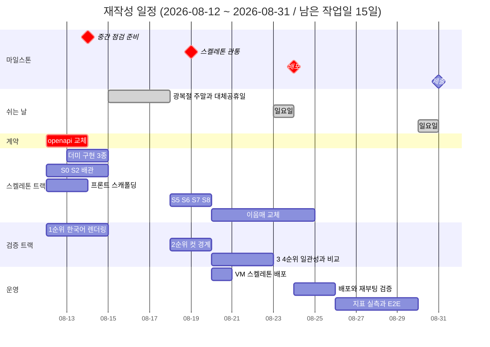
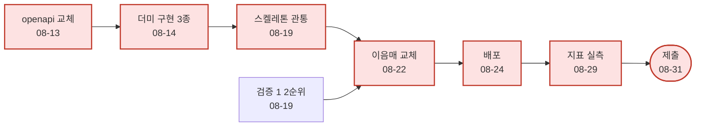

# 전체 일정

이 문서가 **일정의 원천**입니다. 개별 역할 일정과 어긋나면 이 문서가 맞습니다.

> **상태: TL 초안입니다 (2026-08-11 기준 재작성).** 2026-08-11 회의에서 "역할 분배는 AI로 초안을
> 뽑고 이의가 있으면 수정한다"고 정했고, 이 문서가 그 초안입니다. **확정은 회의록으로 합니다**
> ([미결정_대장.md](../기술문서/미결정_대장.md) B-20). 확정 전까지 아래 날짜는 협의 대상이며,
> 이 안내가 지워지기 전에는 지연을 판정하는 근거로 쓰지 마세요.

## 1. 왜 다시 잡았는가

착수 시점의 일정은 **08-04부터 곧바로 이음매 교체(P1)에 들어가는 것**을 전제했습니다. 실제로는
그 앞에 기획 확정과 기술문서 작성이 들어갔습니다 (기획서 14.2의 단계 1과 2).

| | 원래 계획 | 실제 |
|---|---|---|
| 08-04 ~ 08-08 | 환경 세팅 + 계약 동결 | 환경 세팅 + 기획 확정 + 기술문서 착수 |
| 08-10 ~ 08-11 | 카피 생성 실물화, 학습 1회전 | 기술문서 완료, GCP VM 프로비저닝, 차단 7건 회의 |
| 지금 상태 | P1 진행 중 | **워킹 스켈레톤 미착수** (기획서 14.2 단계 3) |

문서 단계가 낭비였다는 뜻이 아닙니다. 계약과 스키마가 고정되어 **지금은 다섯 명이 동시에
붙을 수 있는 상태**입니다. 다만 남은 날이 줄었으므로 일정을 사실에 맞게 다시 적습니다.

## 2. 남은 작업일은 15일입니다

**2026-08-12(수) ~ 2026-08-31(월).** 일요일(8/16, 8/23, 8/30)과 공휴일(8/15 광복절,
8/17 대체공휴일)은 제외했습니다. **토요일은 작업일입니다.**

| 주차 | 작업일 | 날짜 |
|---|---|---|
| W2 잔여 | 3일 | 08-12, 08-13, 08-14 |
| 휴지기 | 0일 | 08-15(토, 광복절), 08-16(일), 08-17(월, 대체공휴일) |
| W3 | 5일 | 08-18 ~ 08-22 |
| W4 | 6일 | 08-24 ~ 08-29 |
| W5 | 1일 | 08-31 |

주의: **08-14(금)에서 08-18(화)까지 3일이 비어 있습니다.** 사람이 붙어 있어야 하는 작업
(학습, 장시간 실험, 배포 검증)을 이 경계에 걸치지 마세요. 금요일에 돌려 두고 화요일에 확인하는
계획은 실패했을 때 3일을 잃습니다.

## 3. 확인이 필요한 것 둘

### 3-a. 중간 점검일이 공휴일입니다

원래 일정표는 **08-17을 중간 점검 마일스톤이자 대체공휴일로 동시에** 적고 있었습니다. 둘 중
하나는 틀립니다.

| 안 | 뜻 |
|---|---|
| **08-14(금)까지 준비 완료** | 과정에서 정한 고정 날짜라면 이쪽입니다. 직전 작업일이 08-14입니다 |
| 08-18(화)로 이동 | 우리가 정하는 내부 점검이라면 이쪽이 자연스럽습니다 |

**TL 초안은 08-14 기준**입니다. 과정 일정을 우리가 옮길 수 없다고 보는 편이 안전하고, 틀렸을
때의 손해가 작습니다(하루 일찍 준비하는 것뿐입니다). PM 확인이 필요합니다.

### 3-b. 중간 점검의 판정 기준이 성립하지 않습니다

원래 기준은 **"파인튜닝 1회전 완료(`adapter_card.json` 산출) + GPU 추론이 VM에서 관통"**
이었습니다. 그런데 2026-08-11 회의에서 **당분간 외부 API만 쓰기로** 했고 로컬 모델 채택 여부는
검증 4순위 결과를 보고 정합니다. 채택하지 않으면 파인튜닝 자체가 없으므로 이 기준은 영영
충족되지 않습니다.

TL 초안은 기준을 **"워킹 스켈레톤이 관통하고, 검증 1순위 결과가 나와 만화형 대사 처리 방식이
정해진 것"**으로 바꿉니다. 근거는 기획서 14.2의 단계 3이 스켈레톤이라는 것이고, 파인튜닝은
그 뒤 선택지로 남습니다.

## 4. 일정

> gantt는 날짜 축을 그대로 그리므로 **막대 길이가 실작업일과 다릅니다.** 실제 작업일은
> 2절 표가 원천입니다.

| 주차 | 기간 | 작업일 | 그 주가 끝날 때 참인 것 |
|---|---|---|---|
| W2 잔여 | 08-12 ~ 08-14 | 3일 | **`openapi.yaml`이 광고 계약으로 교체됨.** 더미 3종과 배관 절반. 검증 1순위 결과 |
| W3 | 08-18 ~ 08-22 | 5일 | **스켈레톤이 브라우저에서 관통.** VM에 1회 배포. 검증 2순위까지 판정 완료 |
| W4 | 08-24 ~ 08-29 | 6일 | **배포 완료**(재부팅 실검증 포함). 이음매가 실물로 교체됨. 지표 실측. E2E 통과 |
| W5 | 08-31 | 1일 | 제출. 문서의 가설 숫자가 실측으로 대체됨 |

## 5. 마일스톤

| 마일스톤 | 날짜 | 충족 판정 기준 |
|---|---|---|
| ~~계약 동결~~ | ~~2026-08-08~~ | **미달성.** 리스크 ⑫가 실현되었습니다 ([리스크.md](../공통_가이드/리스크.md)) |
| **계약 교체** | 2026-08-13 | `openapi.yaml`이 광고 생성 계약으로 교체되고 `contracts-check` 통과 |
| 중간 점검 | 2026-08-14 | 스켈레톤이 관통하거나, 관통까지 남은 것이 목록으로 보일 것. 검증 1순위 결과 |
| 스켈레톤 관통 | 2026-08-19 | 브라우저에서 입력부터 파일 다운로드까지 한 번에 통과 (구현_범위 1절 전체 DoD) |
| 배포 | 2026-08-24 | 외부 접근 가능 + **재부팅 1회 실검증** 통과 |
| 제출 | 2026-08-31 | 문서의 목표치가 `eval/` 하네스 실측으로 대체됨 |

계약 동결일을 지운 것이 아니라 **미달성으로 남겨 두었습니다.** 지우면 왜 일정이 밀렸는지가
사라집니다.

## 6. 크리티컬 패스

- **지금 가장 앞을 막고 있는 것은 `openapi.yaml` 교체입니다.** 계약이 먼저라는 규칙 때문에
  이것이 없으면 S1이 성립하지 않고, 배관과 화면이 함께 대기합니다. 08-12에 시작합니다.
- **검증 1순위와 2순위가 이음매 교체의 선행 조건입니다.** 대사 처리 방식이 뒤집히면
  `image:render`를 무엇으로 채울지가 달라집니다. 스켈레톤은 이 결과를 기다리지 않지만
  교체는 기다립니다.
- **배포를 마지막 주로 미루지 마세요.** 08-20에 스켈레톤 상태로 VM에 한 번 올려 두면
  "우리 환경에서만 안 되는 것"을 미리 발견합니다.
- 학습(파인튜닝)은 크리티컬 패스에 **없습니다.** 로컬 모델을 채택할 때만 살아나며, 그 판단은
  08-21 검증 4순위 결과입니다.

## 7. 이 일정이 지켜지지 않는다면

밀렸을 때 무엇을 버릴지 미리 정해 둡니다. 그때 정하면 품질 게이트를 끄게 됩니다.

| 순서 | 버리는 것 | 남는 것 |
|---|---|---|
| 1 | 만화형 가지 (F8) | 단일 광고형만으로 관통. 분기 지점은 스텁으로 유지 |
| 2 | 로컬 모델 검토 (검증 4순위) | 외부 API 고정 |
| 3 | 부분 교체 (F5, S5) | 시안 전체 재생성만 |
| 4 | 화풍 선택 (F2) | 값 하나 고정 |

**버리지 않는 것**: 가드레일과 그 대조 실행(F11, F12), 배포(F16), E2E 관통(F17). 셋은 이
프로젝트가 무엇을 증명하려 했는지 자체이므로, 빠지면 남은 것을 다 만들어도 결과 보고가
성립하지 않습니다.

## 8. 진행 원칙

- **이음매에서 교체합니다.** 스텁을 우회해 옆에 새 경로를 만들면 스켈레톤이 검증하던 성질
  (열화 표기, 가드레일, 계약)이 사라집니다 -- 관통은 되는데 아무도 그 사실을 모르게 됩니다.
- **일정이 밀리면 범위를 줄입니다.** 품질 게이트(CI, 가드레일, 테스트)를 끄는 것은 일정 대응이
  아니라 측정 포기입니다. 무엇을 뺐는지는 [구현_범위.md](../공통_가이드/구현_범위.md)에 기록하세요.
- **페이즈 전환은 날짜가 아니라 DoD 충족으로 판단합니다.**
- 주 1회 협업 일지(Discussions `CollaborationLog`)에 결정과 삽질과 막힌 지점을 남기세요.
  기록되지 않은 삽질은 다음 사람이 그대로 반복합니다.
