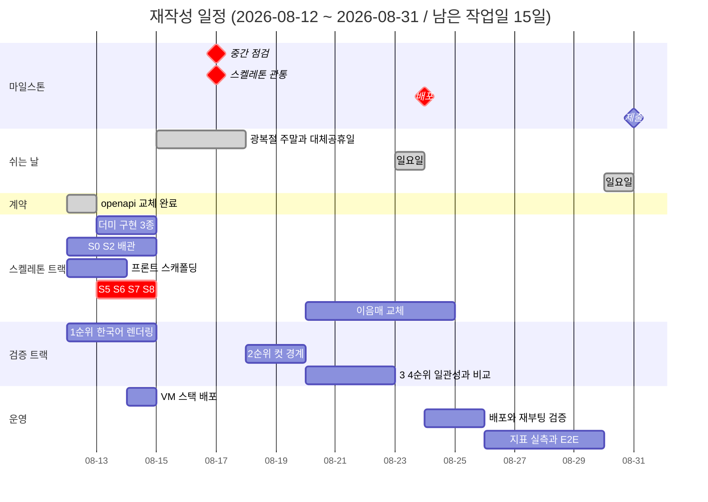
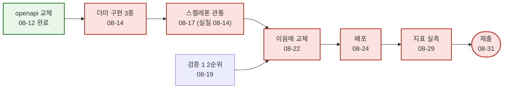

# 전체 일정

이 문서가 **일정의 원천**입니다. 개별 역할 일정과 어긋나면 이 문서가 맞습니다.

> **상태: TL 초안입니다 (2026-08-11 기준 재작성).** 2026-08-11 회의에서 "역할 분배는 AI로 초안을
> 뽑고 이의가 있으면 수정한다"고 정했고, 이 문서가 그 초안입니다. **확정은 회의록으로 합니다**
> ([미결정_대장.md](../기술문서/미결정_대장.md) B-20). 확정 전까지 아래 날짜는 협의 대상이며,
> 이 안내가 지워지기 전에는 지연을 판정하는 근거로 쓰지 마세요.
>
> **예외 - 확정된 항목 1건.** "스켈레톤 관통" 일자(2026-08-17)는
> [2026-08-13 회의록](../회의록/2026-08-13_워킹스켈레톤_일정_조정.md)으로 확정되었습니다.
> 협의 대상이 아닙니다. 나머지 날짜에는 위 안내가 그대로 적용됩니다.
>
> 같은 회의록이 "VM 스켈레톤 배포 완료"를 08-12로 기록했지만 **그것은 VM 환경 설정을 가리킵니다.**
> 스택 배포는 **2026-08-18에 완료**되었습니다. 세 항목의 구분은 5-a절에 있습니다.

## 1. 왜 다시 잡았는가

착수 시점의 일정은 **08-04부터 곧바로 이음매 교체(P1)에 들어가는 것**을 전제했습니다. 실제로는
그 앞에 기획 확정과 기술문서 작성이 들어갔습니다 (기획서 14.2의 단계 1과 2).

| | 원래 계획 | 실제 |
|---|---|---|
| 08-04 ~ 08-08 | 환경 세팅 + 계약 동결 | 환경 세팅 + 기획 확정 + 기술문서 착수 |
| 08-10 ~ 08-11 | 카피 생성 실물화, 학습 1회전 | 기술문서 완료, GCP VM 프로비저닝, 차단 7건 회의 |
| 지금 상태 | P1 진행 중 | **워킹 스켈레톤 미착수** (기획서 14.2 단계 3) |

문서 단계가 낭비였다는 뜻이 아닙니다. 계약과 스키마가 고정되어 **지금은 다섯 명이 동시에
붙을 수 있는 상태**입니다. 다만 남은 날이 줄었으므로 일정을 사실에 맞게 다시 적습니다.

## 2. 남은 작업일은 15일입니다

**2026-08-12(수) ~ 2026-08-31(월).** 일요일(8/16, 8/23, 8/30)과 공휴일(8/15 광복절,
8/17 대체공휴일)은 제외했습니다. **토요일은 작업일입니다.**

| 주차 | 작업일 | 날짜 |
|---|---|---|
| W2 잔여 | 3일 | 08-12, 08-13, 08-14 |
| 휴지기 | 0일 | 08-15(토, 광복절), 08-16(일), 08-17(월, 대체공휴일) |
| W3 | 5일 | 08-18 ~ 08-22 |
| W4 | 6일 | 08-24 ~ 08-29 |
| W5 | 1일 | 08-31 |

주의: **08-14(금)에서 08-18(화)까지 3일이 비어 있습니다.** 사람이 붙어 있어야 하는 작업
(학습, 장시간 실험, 배포 검증)을 이 경계에 걸치지 마세요. 금요일에 돌려 두고 화요일에 확인하는
계획은 실패했을 때 3일을 잃습니다.

**08-17은 여전히 작업일이 아닙니다.** 2026-08-13 회의가 스켈레톤 관통을 08-17로 당겼지만, 같은
회의에서 "08-17을 작업일로 바꿀지는 이번 결정에 포함되지 않는다"고 명시했습니다. 따라서 위 표는
바뀌지 않았고, **관통의 실질 마감은 직전 작업일인 08-14**입니다.

## 3. PM 확인 항목 (3-a 확인됨 / 3-b 대기)

### 3-a. 중간 점검일이 공휴일입니다 - 확인됨

원래 일정표는 **08-17을 중간 점검 마일스톤이자 대체공휴일로 동시에** 적고 있었습니다. 둘 중
하나는 틀립니다.

| 안 | 뜻 |
|---|---|
| **08-14(금)까지 준비 완료** | 과정에서 정한 고정 날짜라면 이쪽입니다. 직전 작업일이 08-14입니다 |
| 08-18(화)로 이동 | 우리가 정하는 내부 점검이라면 이쪽이 자연스럽습니다 |

**TL 초안은 08-14 기준**이었습니다. 과정 일정을 우리가 옮길 수 없다고 보는 편이 안전하고, 틀렸을
때의 손해가 작습니다(하루 일찍 준비하는 것뿐입니다).

PM이 08-12(PR #69 리뷰)에 08-14로 확인했다가, **2026-08-13에 08-17로 정정했습니다**
(PR #76 리뷰). 아래 gantt와 마일스톤 표는 그 값입니다.

**08-17이 저장소의 다수 표기입니다.** [개발자_가이드.md](../공통_가이드/개발자_가이드.md) 1절의
핵심 마일스톤과 [착수_체크리스트.md](../공통_가이드/착수_체크리스트.md) 8절이 이미 08-17을
쓰고 있었고, 08-14를 쓰던 것은 이 문서와 [01 일정](01-기획_총괄.md)뿐이었습니다. 이번 정정으로
네 문서가 같은 값을 가리킵니다.

**팀이 준비해야 하는 날은 바뀌지 않습니다.** 08-17은 휴지기이므로 중간 점검도 **실질 마감은
08-14**입니다. 바뀌는 것은 마일스톤 표기일뿐이고, 스켈레톤 관통(08-17, 실질 08-14)과 날짜도
실질 마감도 같아져 **두 마일스톤이 한 지점으로 합쳐집니다.**

다만 이 정정은 PR 코멘트이고, 대장 항목의 확정 근거는 회의록뿐입니다 (기획서 14.3).
[미결정_대장.md](../기술문서/미결정_대장.md) B-20은 여전히 미확정입니다.

### 3-b. 중간 점검의 판정 기준 - PM 답변을 받았습니다 (2026-08-14)

원래 기준은 **"파인튜닝 1회전 완료(`adapter_card.json` 산출) + GPU 추론이 VM에서 관통"**
이었습니다. 그런데 2026-08-11 회의에서 **당분간 외부 API만 쓰기로** 했고 로컬 모델 채택 여부는
검증 4순위 결과를 보고 정합니다. 채택하지 않으면 파인튜닝 자체가 없으므로 이 기준은 영영
충족되지 않습니다. 이 방향은 [ADR-0003](../adr/0003-이미지_생성_경로.md)과
[ADR-0004](../adr/0004-파인튜닝_보류.md)로 기록되었습니다.

**PM(정승호)이 PR #79 리뷰에서 새 기준을 제시했습니다.**

| | 문구 |
|---|---|
| 기존 | 파인튜닝 1회전 완료(`adapter_card.json` 산출) + GPU 추론이 VM에서 관통 |
| 변경 | **워킹 스켈레톤이 관통하고, 외부 이미지 생성 API 호출이 그 경로를 지나 실제 이미지를 반환할 것. VM은 그 호출을 처리할 수 있는 상태로 떠 있을 것** |

- 파인튜닝 1회전 조항은 [ADR-0004](../adr/0004-파인튜닝_보류.md)로 폐기됩니다.
- **GPU 상주 추론만 요건에서 빠지고, VM 스택 배포는 요건에 남습니다.** 이 해석은 같은 PR에서
  PM이 다시 확인했습니다("VM 스택 배포를 요건에 넣습니다에 동의합니다").
  따라서 5-a절의 "VM에 스택 1회 배포"가 08-17 판정에 직접 걸립니다.

**다만 [미결정_대장.md](../기술문서/미결정_대장.md) B-20은 열어 둡니다.** PR 리뷰 코멘트는
조건부 근거이고 대장 항목의 확정 근거는 회의록뿐이기 때문입니다 (기획서 14.3). 3-a절에서 날짜를
다룰 때와 같은 처리입니다. 이 절의 문구는 반영하되, 대장을 닫는 것은 다음 회의록으로 합니다.

## 4. 일정

> gantt는 날짜 축을 그대로 그리므로 **막대 길이가 실작업일과 다릅니다.** 실제 작업일은
> 2절 표가 원천입니다.

| 주차 | 기간 | 작업일 | 그 주가 끝날 때 참인 것 |
|---|---|---|---|
| W2 잔여 | 08-12 ~ 08-14 | 3일 | ~~`openapi.yaml` 교체~~ **08-12 완료**. 더미 3종. **`S0`부터 `S8`까지 배관이 브라우저에서 관통**(08-17 마일스톤의 실질 마감). VM에 스택 1회 배포(5-a절). 검증 1순위 결과 |
| W3 | 08-18 ~ 08-22 | 5일 | ~~스켈레톤이 브라우저에서 관통~~ **08-17로 이동**. ~~VM에 1회 배포~~ **08-14로 이동**. 이음매 교체 진행. 검증 2순위까지 판정 완료 |
| W4 | 08-24 ~ 08-29 | 6일 | **배포 완료**(재부팅 실검증 포함). 이음매가 실물로 교체됨. 지표 실측. E2E 통과 |
| W5 | 08-31 | 1일 | 제출. 문서의 가설 숫자가 실측으로 대체됨 |

### 4-a. 이 일정은 압축되어 있습니다

2026-08-13 회의로 스켈레톤 관통이 08-19에서 08-17로 당겨졌고, 08-17이 휴지기이므로 실질 마감은
08-14입니다. 그 결과 **원래 W3(08-18 ~ 08-22)에 있던 배관 작업이 08-13 ~ 08-14 이틀로 옮겨왔습니다.**

| 항목 | 소관 | 원래 | 지금 |
|---|---|---|---|
| `S3` `S4` 호출부 | 05 | 08-14 ~ 08-18 | 08-14 |
| `S5` 부분 교체 | 05 | 08-18 | 08-14 |
| `S6` 확정과 잡 | 05 | 08-18 ~ 08-19 | 08-14 |
| `S8` 오류 경로 | 05, 06 | 08-19 | 08-14 |
| `S7` 최소 화면 | 06 | 08-14 ~ 08-19 | 08-13 ~ 08-14 |
| 스켈레톤 조립과 관통 확인 | 02 | 08-18 ~ 08-19 | 08-13 ~ 08-14 |
| VM에 스택 1회 배포 | 05 | 08-20 | 08-14 (5-a절) |

표를 그대로 읽으면 **5일치 작업이 2일에 들어가 있고, 그중 대부분이 백엔드 한 사람에게 몰려
있습니다.** 08-13 시점에 `S0`(로그인)과 `S2`(세션 상태 전이)도 아직 시작되지 않았습니다.
이 압축은 2026-08-13 결정을 그대로 반영한 결과이며, 숨기지 않고 적어 둡니다.

**PM은 범위 축소가 불필요하다고 판단했습니다** (정승호, 2026-08-13, PR #76 리뷰). 05가 소화
가능하다고 본 것입니다. 이 판단은 **08-13 시점의 예측이지 관측이 아니며**, 그날 기준으로 `S0`과
`S2`도 아직 시작되지 않았다는 점을 함께 적어 둡니다.

**그래도 7절의 축소 순서는 지우지 않습니다.** 축소하지 않기로 한 것과 축소 순서가 없는 것은
다르고, 후자는 밀렸을 때 품질 게이트를 끄는 쪽으로 흐릅니다. 08-14에 관통이 서지 않으면 날짜를
임의로 미루지 말고 7절 순서를 적용하고, 무엇을 뺐는지
[구현_범위.md](../공통_가이드/구현_범위.md)에 남기세요.

**예비 조치가 하나 있습니다.** 08-14에 서지 않으면 TL(신호정)이 08-15와 08-17에 개인 작업으로
메우고, 필요하면 TL 직권 머지로 진행합니다 (2026-08-13). 읽는 사람이 오해하지 않도록 범위를
분명히 해 둡니다.

- **팀 작업일 변경이 아닙니다.** 2절의 휴지기 표는 그대로이고, 다른 사람에게 그날 작업을
  요구하지 않습니다. 남은 작업일은 여전히 15일입니다.
- **7절의 축소 순서를 대신하지 않습니다.** 한 사람이 이틀에 메울 수 있는 양에는 한계가 있으므로
  예비는 예비로 두고, 무엇을 뺄지는 별도로 검토하세요.
- **직권 머지는 리뷰를 건너뜁니다.** 그 경우 소유자(05, 06)가 자기 영역의 변경을 사후에 처음
  보게 되므로, 머지한 범위를 그날 안에 담당자에게 알려야 합니다.

## 5. 마일스톤

| 마일스톤 | 날짜 | 충족 판정 기준 |
|---|---|---|
| ~~계약 동결~~ | ~~2026-08-08~~ | **미달성.** 리스크 12가 실현되었습니다 ([리스크.md](../공통_가이드/리스크.md)) |
| **계약 교체** | 2026-08-12 | **달성.** `openapi.yaml`이 광고 생성 계약(v0.2.0)으로 교체되고 `contracts-check`가 `main`에서 통과 |
| 중간 점검 | **2026-08-17** | **달성** (2026-08-19, 실질 마감 08-14보다 5일 늦음). 검증 1순위 결과가 나왔고, VM 스택이 08-18에 올라갔고, 스켈레톤이 08-19에 관통했습니다. PM 문구(3-b절)의 "외부 이미지 생성 API 호출이 그 경로를 지나 실제 이미지를 반환할 것"은 실물 분기가 배선되어 조건이 성립하지만 기본값이 `stub`이라 **실물 호출로 관통한 기록은 아직 없습니다.** 판정 기준 자체는 **여전히 회의록 미확정**(3-b절) |
| 스켈레톤 관통 | **2026-08-17** | **달성** (2026-08-19, 실질 마감 08-14보다 5일 늦음). `S7`·`S8` 완료로 브라우저에서 입력부터 결과 저장까지 한 번에 지나갑니다 ([06-프론트엔드.md](06-프론트엔드.md) S7·S8 완료 절). 관통은 `e2e/tests/test_browser_flow.py`(브라우저)와 `test_ad_flow.py`(HTTP)로 하네스에 고정되었습니다. **지연을 완료로만 적지 않습니다** — 5일 늦은 사실을 남겨 다음 계획이 같은 낙관을 반복하지 않게 합니다 |
| 배포 | 2026-08-24 | 외부 접근 가능 + **재부팅 1회 실검증** 통과 |
| 제출 | 2026-08-31 | 문서의 목표치가 `eval/` 하네스 실측으로 대체됨 |

계약 동결일을 지운 것이 아니라 **미달성으로 남겨 두었습니다.** 지우면 왜 일정이 밀렸는지가
사라집니다. 스켈레톤 관통 일자의 근거는
[2026-08-13 회의록](../회의록/2026-08-13_워킹스켈레톤_일정_조정.md)입니다.

### 5-a. "VM 배포"가 가리키는 것이 셋입니다

같은 회의록이 "VM 스켈레톤 배포"를 2026-08-12 완료로 기록했습니다. **확인 결과 그 완료는 아래
1번을 가리킵니다.** 일정 항목이 요구하는 것은 3번이고, 3번은 아직 완료가 아닙니다.

| | 무엇 | 정본 | 상태 |
|---|---|---|---|
| 1 | **VM 환경 설정** - 인스턴스, OS, 컨테이너 안 GPU 인식, swap, 스냅샷, 고정 IP, SSH 경로 | [infra/README.md](../../infra/README.md) | **완료** |
| 2 | 팀원 접근 - SSH 키 등록, 내 PC의 터미널과 에디터로 VM 쓰기 | [GCP_VM_사용_가이드.md](../공통_가이드/GCP_VM_사용_가이드.md) | 문서 있음 |
| 3 | **스택 배포** - compose로 스택을 기동, 외부에서 응답 | [착수_체크리스트.md](../공통_가이드/착수_체크리스트.md) 5-a | **완료** (2026-08-18, 목표 08-14보다 4일 늦음) |

3번만 일정 항목인 이유는 이 마일스톤의 목적이 "마지막 주 전에 환경 차이를 드러내는 것"이기
때문입니다. **빈 VM은 환경 차이를 드러내지 않습니다.** 확인 대상이 기능이 아니라 Docker, GPU
패스스루, 방화벽, 재부팅 후 복구, 디스크이므로 **더미 스택이어도 됩니다** - 체크리스트가
"빈 스택이라도 1회 배포"라고 적은 그대로입니다.

08-12 실측은 **8000의 방화벽 규칙은 열려 있으나 밖에서 재면 응답이 없다**는 것이었습니다
(05 임동규). 막힌 것이 아니라 듣고 있는 프로세스가 없다는 뜻이고, 그 시점에 스택이 아직
올라가지 않았다는 근거입니다.

**3번은 2026-08-18에 완료되었습니다.** 목표일은 08-14였으므로 4일 늦었습니다
(원래 05 일정과 gantt는 08-20, 체크리스트와 `infra/README.md`는 "W2 중"으로 갈려 있던 것을
08-14로 맞춘 값입니다 - PR #71). 확인된 것은 프론트엔드가 80에서 응답하고, backend가 계약의
경로 16개를 전부 서빙하며, ai-engine 8100은 밖에서 닫혀 있다는 것입니다
([ADR-0016](../adr/0016-HTTPS_종단_지점과_인증서_발급_경로.md) 배경). 배포 절차는
`scripts/deploy-vm.sh`로 고정되었고 체크아웃 경로는 `/srv/adcraft/app`입니다.

**이 마일스톤이 실제로 값을 했습니다.** 올려 보고 나서야 드러난 것이 둘입니다 - 세션 쿠키가
`Secure`라 평문 HTTP에서 브라우저가 버리는 문제(ADR-0016으로 종단을 앞단 프록시로 옮겨 해소)와,
화면이 로그인 상태의 근거를 쿠키가 아니라 응답 본문으로 잡고 있던 문제입니다. 둘 다 로컬
관통에서는 나타나지 않습니다. "마지막 주 전에 환경 차이를 드러낸다"가 이 항목의 목적이었고,
그것이 그대로 일어났습니다.

**후속: 회의록의 "VM 스켈레톤 배포 08-12 완료" 줄은 여전히 정정 대상입니다.** 그 완료는 1번(VM
환경 설정)을 가리키며, 3번의 실제 완료일은 08-18입니다.

## 6. 크리티컬 패스

**2026-08-19 기준 상태**: `CONTRACT`(08-12) · `DUMMY`(08-14) · `V1`(08-18 판정) ·
VM 스택 배포(08-18) · `SKEL`(08-19 관통, 하네스 고정)까지 끝났습니다. **크리티컬 패스는 이제
`SWAP`(이음매 교체)에 있고, 거기서 남은 것이 만화형 컷별 생성입니다**
([ADR-0017](../adr/0017-만화형은_칸을_따로_생성해_합성한다.md), 미구현).

- **계약 교체는 2026-08-12에 끝났습니다.** 이것이 막고 있던 S1(계약 골격)도 함께 충족됐습니다 —
  세션·시안·확정·잡 경로가 스펙에 있고 `contracts-check`가 통과합니다. 더미 3종은 08-14,
  `S7`·`S8`은 08-19에 들어왔습니다.
- **검증 1순위와 2순위는 2026-08-18에 닫혔습니다** (본안 유지 + 컷별 생성 후 합성).
  `image:render`를 무엇으로 채울지가 정해졌으므로 이음매 교체의 선행 조건은 충족되었습니다.
  남은 것은 그 결정을 코드로 옮기는 일입니다 (ADR-0017).
- **관통했다는 것과 실물로 돌았다는 것은 다릅니다.** 08-19 관통은 `ADGEN_GENERATION_MODE=stub`
  에서 잰 것이고, `brief:fill`과 `draft:generate`의 실물 분기는 아직 비어 있습니다. 이 상태의
  숫자를 지표로 보고하면 자기 자신과의 일치율입니다.
- **배포를 마지막 주로 미루지 않았고, 그 값을 받았습니다.** 08-18 배포에서 세션 쿠키의 `Secure`
  문제와 프론트의 로그인 상태 판정 문제가 드러났습니다 (5-a절). 로컬 관통으로는 잡히지 않는
  것들입니다.
- 학습(파인튜닝)은 크리티컬 패스에 **없습니다.** 로컬 모델을 채택할 때만 살아나며, 그 판단은
  08-21 검증 4순위 결과입니다.

## 7. 이 일정이 지켜지지 않는다면

밀렸을 때 무엇을 버릴지 미리 정해 둡니다. 그때 정하면 품질 게이트를 끄게 됩니다.

| 순서 | 버리는 것 | 남는 것 |
|---|---|---|
| 1 | 만화형 가지 (F8) | 단일 광고형만으로 관통. 분기 지점은 스텁으로 유지 |
| 2 | 로컬 모델 검토 (검증 4순위) | 외부 API 고정 |
| 3 | 부분 교체 (F5, S5) | 시안 전체 재생성만 |
| 4 | 화풍 선택 (F2) | 값 하나 고정 |

**버리지 않는 것**: 가드레일과 그 대조 실행(F11, F12), 배포(F16), E2E 관통(F17). 셋은 이
프로젝트가 무엇을 증명하려 했는지 자체이므로, 빠지면 남은 것을 다 만들어도 결과 보고가
성립하지 않습니다.

## 8. 진행 원칙

- **이음매에서 교체합니다.** 스텁을 우회해 옆에 새 경로를 만들면 스켈레톤이 검증하던 성질
  (열화 표기, 가드레일, 계약)이 사라집니다. 관통은 되는데 아무도 그 사실을 모르게 됩니다.
- **일정이 밀리면 범위를 줄입니다.** 품질 게이트(CI, 가드레일, 테스트)를 끄는 것은 일정 대응이
  아니라 측정 포기입니다. 무엇을 뺐는지는 [구현_범위.md](../공통_가이드/구현_범위.md)에 기록하세요.
- **페이즈 전환은 날짜가 아니라 DoD 충족으로 판단합니다.**
- 주 1회 협업 일지(Discussions `CollaborationLog`)에 결정과 삽질과 막힌 지점을 남기세요.
  기록되지 않은 삽질은 다음 사람이 그대로 반복합니다.
