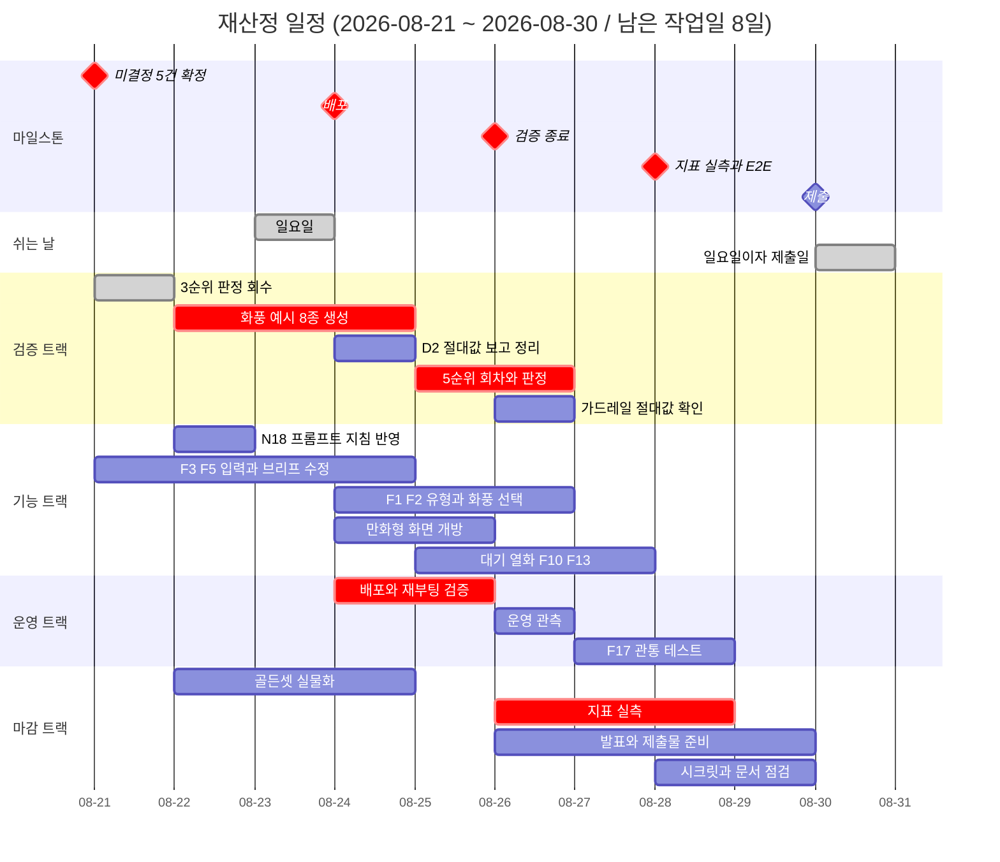
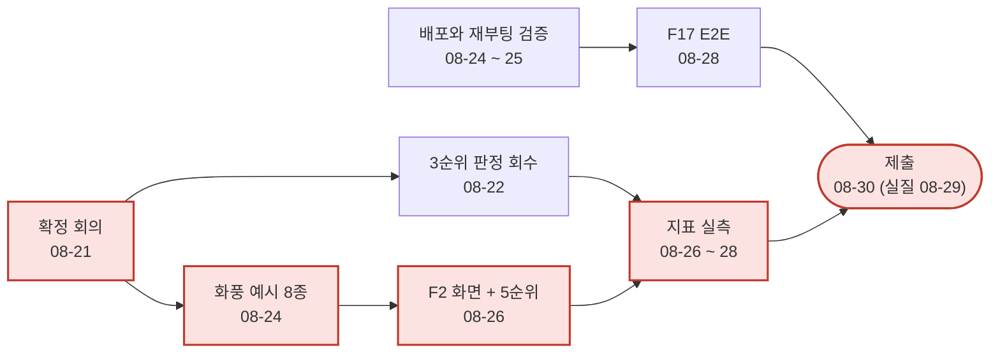

# 전체 일정

이 문서가 **일정의 원천**입니다. 개별 역할 일정과 어긋나면 이 문서가 맞습니다.

> **상태: 확정 (2026-08-21).** 이 재산정판은
> [일정 확정 회의록](../회의록/2026-08-21_일정_확정.md)으로 상정안 그대로 채택되었습니다
> (미결정_대장 B-20 닫힘. 미결정 5건은 같은 날
> [별도 회의록](../회의록/2026-08-21_미결정_5건_확정.md)으로 먼저 확정). **이제 이 문서의
> 날짜는 지연 판정의 근거입니다.** 날짜를 바꾸려면 회의록이 필요하고, 밀리면 날짜를 미루지
> 말고 7절의 축소 순서를 적용하세요.
>
> 개별 값의 근거: "스켈레톤 관통" 일자(2026-08-17)는
> [2026-08-13 회의록](../회의록/2026-08-13_워킹스켈레톤_일정_조정.md), **제출 마감
> 2026-08-30은 학원 공지(2026-08-21)로 당겨진 외부 확정값**입니다.
>
> 같은 회의록이 "VM 스켈레톤 배포 완료"를 08-12로 기록했지만 **그것은 VM 환경 설정을 가리킵니다.**
> 스택 배포는 **2026-08-18에 완료**되었습니다. 세 항목의 구분은 5-a절에 있습니다.

## 1. 왜 다시 잡는가

### 1-a. 2026-08-11 재작성 (이력)

착수 시점의 일정은 **08-04부터 곧바로 이음매 교체(P1)에 들어가는 것**을 전제했으나, 실제로는
그 앞에 기획 확정과 기술문서 작성이 들어갔습니다 (기획서 14.2의 단계 1과 2). 그래서 08-11에
남은 15일 기준으로 다시 적었습니다. 그 판의 상세(원래 계획과 실제의 대비, 08-13 압축 경위)는
이 문서의 git 이력과 4-a절에 남아 있습니다.

### 1-b. 2026-08-21 재산정 (이번 판)

다시 잡는 이유는 둘입니다.

1. **제출 마감이 하루 당겨졌습니다.** 학원 공지(2026-08-21)로 제출이 08-31(월)에서
   **08-30(일)**이 되었습니다. 08-30은 일요일이라 휴무 규칙(2절)을 유지하면 **실질 마감은
   08-29(토)**입니다. 중간 점검(마일스톤 표기 08-17, 실질 마감 08-14)과 같은 처리입니다.
2. **스켈레톤 이후 구간을 이제 계획할 수 있게 되었습니다.** 08-11 판은 관통까지만 유효했고
   그 뒤는 미결정이 많아 날짜를 채울 수 없었습니다 (B-20이 차단으로 남은 이유). 지금은 이음매
   네 곳이 전부 실물화되었고(2026-08-20: `brief:fill` · `draft:generate` · `draft:patch` ·
   `image:render` + 가드레일) 검증 1, 2, 4, 6, 8순위가 닫혀 남은 작업의 갈래가 정리되었습니다.
   회의록이 있어야 닫히는 4건 - N18(대사 길이 상한), 렌더 타임아웃 값, 장면 상태 연속성 합격
   기준, D2(가드레일 델타) 측정 방식 - 은 **2026-08-21 회의에서 A-6과 함께 확정되었습니다**
   ([회의록](../회의록/2026-08-21_미결정_5건_확정.md)). 요지: N18은 프롬프트 지침 25자에
   **코드 강제 검사는 만들지 않음**(B4 보류), 장면 상태는 이번 범위 제외 + 참고 표기, D2는
   델타 대신 **절대값 보고**, 타임아웃은 #153 값 추인. 일정 자체(B-20)도 같은 날
   [별도 회의록](../회의록/2026-08-21_일정_확정.md)으로 확정되었습니다.

## 2. 남은 작업일은 8일입니다

**2026-08-21(금) ~ 2026-08-29(토).** 일요일(8/23)은 제외했습니다. **토요일은 작업일입니다.**
제출일인 08-30(일)은 작업일이 아니며, 그날 있는 것은 제출 행위뿐입니다.

| 구간 | 작업일 | 날짜 |
|---|---|---|
| W3 잔여 | 2일 | 08-21(금), 08-22(토) |
| 휴지기 | 0일 | 08-23(일) |
| W4 | 6일 | 08-24(월) ~ 08-29(토) |
| 제출 | 0일 | 08-30(일). 실질 마감은 08-29(토) |

주의: **마지막 이틀(08-28 ~ 08-29)은 이미 점검류(지표 실측 확인, E2E, 시크릿, 문서 점검)로
차 있습니다.** 기능과 검증 작업을 그 뒤로 밀면 밀린 것이 아니라 빠진 것입니다 - 밀리면 날짜를
옮기지 말고 7절의 축소 순서를 먼저 적용하세요.

## 3. PM 확인 항목 (이력 - 둘 다 답을 받았고, 회의록 확정만 08-21 회의에 얹습니다)

### 3-a. 중간 점검일이 공휴일입니다 - 확인됨

원래 일정표는 **08-17을 중간 점검 마일스톤이자 대체공휴일로 동시에** 적고 있었습니다. 둘 중
하나는 틀립니다.

| 안 | 뜻 |
|---|---|
| **08-14(금)까지 준비 완료** | 과정에서 정한 고정 날짜라면 이쪽입니다. 직전 작업일이 08-14입니다 |
| 08-18(화)로 이동 | 우리가 정하는 내부 점검이라면 이쪽이 자연스럽습니다 |

**TL 초안은 08-14 기준**이었습니다. 과정 일정을 우리가 옮길 수 없다고 보는 편이 안전하고, 틀렸을
때의 손해가 작습니다(하루 일찍 준비하는 것뿐입니다).

PM이 08-12(PR #69 리뷰)에 08-14로 확인했다가, **2026-08-13에 08-17로 정정했습니다**
(PR #76 리뷰). 5절 마일스톤 표는 그 값입니다 (4절 gantt는 08-21 재산정으로 남은 구간만
그리므로 지나간 마일스톤이 없습니다).

**08-17이 저장소의 다수 표기입니다.** [개발자_가이드.md](../공통_가이드/개발자_가이드.md) 1절의
핵심 마일스톤과 [착수_체크리스트.md](../공통_가이드/착수_체크리스트.md) 8절이 이미 08-17을
쓰고 있었고, 08-14를 쓰던 것은 이 문서와 [01 일정](01-기획_총괄.md)뿐이었습니다. 이번 정정으로
네 문서가 같은 값을 가리킵니다.

**팀이 준비해야 하는 날은 바뀌지 않습니다.** 08-17은 휴지기이므로 중간 점검도 **실질 마감은
08-14**입니다. 바뀌는 것은 마일스톤 표기일뿐이고, 스켈레톤 관통(08-17, 실질 08-14)과 날짜도
실질 마감도 같아져 **두 마일스톤이 한 지점으로 합쳐집니다.**

다만 이 정정은 PR 코멘트이고, 대장 항목의 확정 근거는 회의록뿐입니다 (기획서 14.3).
[미결정_대장.md](../기술문서/미결정_대장.md) B-20은 여전히 미확정입니다.

### 3-b. 중간 점검의 판정 기준 - 확정되었습니다 (2026-08-22 회의록 05번, PM 답변은 08-14)

원래 기준은 **"파인튜닝 1회전 완료(`adapter_card.json` 산출) + GPU 추론이 VM에서 관통"**
이었습니다. 그런데 2026-08-11 회의에서 **당분간 외부 API만 쓰기로** 했고 로컬 모델 채택 여부는
검증 4순위 결과를 보고 정합니다. 채택하지 않으면 파인튜닝 자체가 없으므로 이 기준은 영영
충족되지 않습니다. 이 방향은 [ADR-0003](../adr/0003-이미지_생성_경로.md)과
[ADR-0004](../adr/0004-파인튜닝_보류.md)로 기록되었습니다.

**PM(정승호)이 PR #79 리뷰에서 새 기준을 제시했습니다.**

| | 문구 |
|---|---|
| 기존 | 파인튜닝 1회전 완료(`adapter_card.json` 산출) + GPU 추론이 VM에서 관통 |
| 변경 | **워킹 스켈레톤이 관통하고, 외부 이미지 생성 API 호출이 그 경로를 지나 실제 이미지를 반환할 것. VM은 그 호출을 처리할 수 있는 상태로 떠 있을 것** |

- 파인튜닝 1회전 조항은 [ADR-0004](../adr/0004-파인튜닝_보류.md)로 폐기됩니다.
- **GPU 상주 추론만 요건에서 빠지고, VM 스택 배포는 요건에 남습니다.** 이 해석은 같은 PR에서
  PM이 다시 확인했습니다("VM 스택 배포를 요건에 넣습니다에 동의합니다").
  따라서 5-a절의 "VM에 스택 1회 배포"가 08-17 판정에 직접 걸립니다.

**2026-08-22 회의록 05번으로 확정되었습니다**
([회의록](../회의록/2026-08-22_이월_6건_확정.md)). PM이 제시한 위 새 기준이 그대로
채택됐고, PR 리뷰 코멘트였던 것이 이제 회의록 근거를 갖춥니다 (기획서 14.3).

## 4. 일정

> gantt는 날짜 축을 그대로 그리므로 **막대 길이가 실작업일과 다릅니다** (08-23 일요일이
> 막대에 포함됩니다). 실제 작업일은 2절 표가 원천입니다.

| 구간 | 기간 | 작업일 | 그 구간이 끝날 때 참인 것 |
|---|---|---|---|
| W3 잔여 | 08-21 ~ 08-22 | 2일 | ~~미결정 확정~~ **5건은 08-21 회의로 확정** ([회의록](../회의록/2026-08-21_미결정_5건_확정.md)), B-20은 별도 회의록 대기. ~~3순위 판정 회수~~ **08-21 완료.** N18 프롬프트 25자 지침 반영. 화풍 예시 생성 착수. F3 완료 |
| W4 전반 | 08-24 ~ 08-26 | 3일 | **배포 완료**(재부팅 실검증 포함). 화풍 예시 8종이 `ADGEN_ART_STYLES`로 반영되고 F2가 그것을 보여줌. 만화형 화면 개방. 5순위와 가드레일 대조 판정까지 **판정이 필요한 검증 전부 종료** |
| W4 후반 | 08-27 ~ 08-29 | 3일 | F17과 `e2e/` 전체 통과(skip 없이). **지표 실측이 문서의 가설 숫자를 대체.** 제출물 점검 0건. **08-29가 끝날 때 제출 가능 상태** |
| 제출 | 08-30 | 0일 | 제출. 작업일이 아니므로 이날 처음 시작하는 일이 없어야 합니다 |

### 4-a. (이력) 08-13 압축과 그 결과

> 이 절은 08-13 ~ 08-19 구간의 기록입니다. 관통은 실질 마감(08-14)보다 5일 늦은 08-19에
> 섰고, 그 사실은 5절 마일스톤 표에 남겼습니다. 아래는 당시 판단의 기록으로 유지합니다 -
> 다음 계획이 같은 낙관을 반복하지 않게 하기 위해서입니다.

2026-08-13 회의로 스켈레톤 관통이 08-19에서 08-17로 당겨졌고, 08-17이 휴지기이므로 실질 마감은
08-14입니다. 그 결과 **원래 W3(08-18 ~ 08-22)에 있던 배관 작업이 08-13 ~ 08-14 이틀로 옮겨왔습니다.**

| 항목 | 소관 | 원래 | 지금 |
|---|---|---|---|
| `S3` `S4` 호출부 | 05 | 08-14 ~ 08-18 | 08-14 |
| `S5` 부분 교체 | 05 | 08-18 | 08-14 |
| `S6` 확정과 잡 | 05 | 08-18 ~ 08-19 | 08-14 |
| `S8` 오류 경로 | 05, 06 | 08-19 | 08-14 |
| `S7` 최소 화면 | 06 | 08-14 ~ 08-19 | 08-13 ~ 08-14 |
| 스켈레톤 조립과 관통 확인 | 02 | 08-18 ~ 08-19 | 08-13 ~ 08-14 |
| VM에 스택 1회 배포 | 05 | 08-20 | 08-14 (5-a절) |

표를 그대로 읽으면 **5일치 작업이 2일에 들어가 있고, 그중 대부분이 백엔드 한 사람에게 몰려
있습니다.** 08-13 시점에 `S0`(로그인)과 `S2`(세션 상태 전이)도 아직 시작되지 않았습니다.
이 압축은 2026-08-13 결정을 그대로 반영한 결과이며, 숨기지 않고 적어 둡니다.

**PM은 범위 축소가 불필요하다고 판단했습니다** (정승호, 2026-08-13, PR #76 리뷰). 05가 소화
가능하다고 본 것입니다. 이 판단은 **08-13 시점의 예측이지 관측이 아니며**, 그날 기준으로 `S0`과
`S2`도 아직 시작되지 않았다는 점을 함께 적어 둡니다.

**그래도 7절의 축소 순서는 지우지 않습니다.** 축소하지 않기로 한 것과 축소 순서가 없는 것은
다르고, 후자는 밀렸을 때 품질 게이트를 끄는 쪽으로 흐릅니다. 08-14에 관통이 서지 않으면 날짜를
임의로 미루지 말고 7절 순서를 적용하고, 무엇을 뺐는지
[구현_범위.md](../공통_가이드/구현_범위.md)에 남기세요.

**예비 조치가 하나 있습니다.** 08-14에 서지 않으면 TL(신호정)이 08-15와 08-17에 개인 작업으로
메우고, 필요하면 TL 직권 머지로 진행합니다 (2026-08-13). 읽는 사람이 오해하지 않도록 범위를
분명히 해 둡니다.

- **팀 작업일 변경이 아닙니다.** 2절의 휴지기 표는 그대로이고, 다른 사람에게 그날 작업을
  요구하지 않습니다. 남은 작업일은 여전히 15일입니다.
- **7절의 축소 순서를 대신하지 않습니다.** 한 사람이 이틀에 메울 수 있는 양에는 한계가 있으므로
  예비는 예비로 두고, 무엇을 뺄지는 별도로 검토하세요.
- **직권 머지는 리뷰를 건너뜁니다.** 그 경우 소유자(05, 06)가 자기 영역의 변경을 사후에 처음
  보게 되므로, 머지한 범위를 그날 안에 담당자에게 알려야 합니다.

### 4-b. 이 일정이 전제하는 것 (어긋나면 7절로)

8일에는 흡수 여유가 없으므로, 전제가 어긋나면 날짜를 미루는 것이 아니라 **7절의 축소 순서를
적용**합니다.

| 전제 | 걸려 있는 것 | 어긋나면 |
|---|---|---|
| ~~08-21 회의가 미결정 4건을 닫음~~ | ~~B4, D2, 3순위 확정~~ | **해소 (08-21).** 5건 확정과 B-20(일정) 확정이 [회의록](../회의록/2026-08-21_미결정_5건_확정.md) [두 건](../회의록/2026-08-21_일정_확정.md)으로 모두 커밋되어, 전제가 아니라 사실이 되었습니다 |
| 화풍 예시 8종이 08-24까지 나옴 | F2 화면(08-25 ~), 검증 5순위(08-25 ~), `ADGEN_ART_STYLES` 반영(08-25) | 5순위가 마지막 이틀로 밀려 지표 실측과 겹칩니다. 날짜를 밀기 전에 예시 수를 8종에서 줄이는 쪽을 먼저 검토합니다 |
| 06이 화면 6건과 판정 참여를 함께 소화 | F1, F2, F3, F5, 대기 화면, 열화 표기, F10, F13 + 판정 3회 | 7절 1 ~ 2순위(Grid Post 확인, F10 세분화)를 먼저 버립니다 |
| 만화형 `medium` 예산 약 48세트 | 5순위 회차, 시연과 제출 산출물 | 검증과 개발은 `low`, 최종 확인만 `medium` (03 WORKLIST 0절 규칙 유지). 예산이 좁아지면 회차 수를 줄이지 티어를 올리지 않습니다 |

## 5. 마일스톤

| 마일스톤 | 날짜 | 충족 판정 기준 |
|---|---|---|
| ~~계약 동결~~ | ~~2026-08-08~~ | **미달성.** 리스크 12가 실현되었습니다 ([리스크.md](../공통_가이드/리스크.md)) |
| **계약 교체** | 2026-08-12 | **달성.** `openapi.yaml`이 광고 생성 계약(v0.2.0)으로 교체되고 `contracts-check`가 `main`에서 통과 |
| 중간 점검 | **2026-08-17** | **달성** (2026-08-19, 실질 마감 08-14보다 5일 늦음). 검증 1순위 결과가 나왔고, VM 스택이 08-18에 올라갔고, 스켈레톤이 08-19에 관통했습니다. PM 문구(3-b절)의 "외부 이미지 생성 API 호출이 그 경로를 지나 실제 이미지를 반환할 것"은 실물 분기가 배선되어 조건이 성립하지만 기본값이 `stub`이라 **실물 호출로 관통한 기록은 아직 없습니다.** 판정 기준 자체는 **2026-08-22 회의록으로 확정**(3-b절) |
| 스켈레톤 관통 | **2026-08-17** | **달성** (2026-08-19, 실질 마감 08-14보다 5일 늦음). `S7`·`S8` 완료로 브라우저에서 입력부터 결과 저장까지 한 번에 지나갑니다 ([06-프론트엔드.md](06-프론트엔드.md) S7·S8 완료 절). 관통은 `e2e/tests/test_browser_flow.py`(브라우저)와 `test_ad_flow.py`(HTTP)로 하네스에 고정되었습니다. **지연을 완료로만 적지 않습니다** — 5일 늦은 사실을 남겨 다음 계획이 같은 낙관을 반복하지 않게 합니다 |
| **일정과 미결정 확정** | **2026-08-21** | **달성.** 미결정 5건(N18, A-4 장면 상태, D2, 타임아웃, A-6)은 [5건 확정 회의록](../회의록/2026-08-21_미결정_5건_확정.md), 일정(B-20)은 [일정 확정 회의록](../회의록/2026-08-21_일정_확정.md)으로 같은 날 닫혔습니다. 예산 상한, B-9, B-11 셋은 다음 회의로 미뤄짐 |
| 배포 | 2026-08-24 | 외부 접근 가능 + **재부팅 1회 실검증** 통과 |
| 검증 종료 | 2026-08-26 | 판정이 필요한 검증(3순위, 5순위, 가드레일 대조)이 전부 판정 완료. 7순위(발표 근거 조사)는 01 소관으로 08-24 목표 |
| 지표 실측과 E2E | 2026-08-28 | `eval/` 실측이 문서의 목표치 자리를 대체하고 `e2e/` 전체 통과(skip 없이) |
| 제출 | ~~2026-08-31~~ **2026-08-30** | **학원 공지(2026-08-21)로 하루 당김.** 일요일이므로 실질 마감은 08-29(토). 문서의 목표치가 `eval/` 하네스 실측으로 대체된 상태로 제출 |

계약 동결일을 지운 것이 아니라 **미달성으로 남겨 두었습니다.** 지우면 왜 일정이 밀렸는지가
사라집니다. 스켈레톤 관통 일자의 근거는
[2026-08-13 회의록](../회의록/2026-08-13_워킹스켈레톤_일정_조정.md)입니다.

### 5-a. "VM 배포"가 가리키는 것이 셋입니다

같은 회의록이 "VM 스켈레톤 배포"를 2026-08-12 완료로 기록했습니다. **확인 결과 그 완료는 아래
1번을 가리킵니다.** 일정 항목이 요구하는 것은 3번이며, 3번은 2026-08-18에 완료되었습니다.

| | 무엇 | 정본 | 상태 |
|---|---|---|---|
| 1 | **VM 환경 설정** - 인스턴스, OS, 컨테이너 안 GPU 인식, swap, 스냅샷, 고정 IP, SSH 경로 | [infra/README.md](../../infra/README.md) | **완료** |
| 2 | 팀원 접근 - SSH 키 등록, 내 PC의 터미널과 에디터로 VM 쓰기 | [GCP_VM_사용_가이드.md](../공통_가이드/GCP_VM_사용_가이드.md) | 문서 있음 |
| 3 | **스택 배포** - compose로 스택을 기동, 외부에서 응답 | [착수_체크리스트.md](../공통_가이드/착수_체크리스트.md) 5-a | **완료** (2026-08-18, 목표 08-14보다 4일 늦음) |

3번만 일정 항목인 이유는 이 마일스톤의 목적이 "마지막 주 전에 환경 차이를 드러내는 것"이기
때문입니다. **빈 VM은 환경 차이를 드러내지 않습니다.** 확인 대상이 기능이 아니라 Docker, GPU
패스스루, 방화벽, 재부팅 후 복구, 디스크이므로 **더미 스택이어도 됩니다** - 체크리스트가
"빈 스택이라도 1회 배포"라고 적은 그대로입니다.

08-12 실측은 **8000의 방화벽 규칙은 열려 있으나 밖에서 재면 응답이 없다**는 것이었습니다
(05 임동규). 막힌 것이 아니라 듣고 있는 프로세스가 없다는 뜻이고, 그 시점에 스택이 아직
올라가지 않았다는 근거입니다.

**3번은 2026-08-18에 완료되었습니다.** 목표일은 08-14였으므로 4일 늦었습니다
(원래 05 일정과 gantt는 08-20, 체크리스트와 `infra/README.md`는 "W2 중"으로 갈려 있던 것을
08-14로 맞춘 값입니다 - PR #71). 확인된 것은 프론트엔드가 80에서 응답하고, backend가 계약의
경로 16개를 전부 서빙하며, ai-engine 8100은 밖에서 닫혀 있다는 것입니다
([ADR-0016](../adr/0016-HTTPS_종단_지점과_인증서_발급_경로.md) 배경). 배포 절차는
`scripts/deploy-vm.sh`로 고정되었고 체크아웃 경로는 `/srv/adcraft/app`입니다.

**이 마일스톤이 실제로 값을 했습니다.** 올려 보고 나서야 드러난 것이 둘입니다 - 세션 쿠키가
`Secure`라 평문 HTTP에서 브라우저가 버리는 문제(ADR-0016으로 종단을 앞단 프록시로 옮겨 해소)와,
화면이 로그인 상태의 근거를 쿠키가 아니라 응답 본문으로 잡고 있던 문제입니다. 둘 다 로컬
관통에서는 나타나지 않습니다. "마지막 주 전에 환경 차이를 드러낸다"가 이 항목의 목적이었고,
그것이 그대로 일어났습니다.

**후속: 회의록의 "VM 스켈레톤 배포 08-12 완료" 줄은 여전히 정정 대상입니다.** 그 완료는 1번(VM
환경 설정)을 가리키며, 3번의 실제 완료일은 08-18입니다.

## 6. 크리티컬 패스

**2026-08-21 기준 상태**: 이음매 네 곳(`brief:fill` · `draft:generate` · `draft:patch` ·
`image:render`)과 가드레일이 전부 실물입니다 (#145, #150, #151, ADR-0017, ADR-0019). 검증
1, 2, 4, 6, 8순위가 닫혔고 **3순위도 08-21에 판정까지 끝났습니다** - 동일 인물 12/12
만장일치(B-16 충족), 장면 상태 연속 10/12(참고 축). 수치 정본의 `docs/보고서/` 반영은
후속입니다. **크리티컬 패스는 화풍 예시 8종입니다** - 검증 5순위와 F2 화면과
`ADGEN_ART_STYLES` 반영이 전부 그 뒤에 서 있고, 늦으면 마지막 사흘의 실측 구간을 침범합니다.

- **회의 몫이던 4건은 08-21 회의로 닫혔습니다** ([회의록](../회의록/2026-08-21_미결정_5건_확정.md)).
  그 결과 코드 작업이 바뀝니다 - B4(길이 검사 코드)는 **보류**되어 프롬프트 25자 지침 반영으로
  대체되고, D2는 재실험 없이 **절대값 보고 정리**로 줄었습니다. 일정 자체(B-20)도 같은 날
  확정되어, 남은 회의 몫은 다음 회의로 미뤄진 3건(예산 상한, B-9, B-11)뿐입니다.
- **기본값은 여전히 `ADGEN_GENERATION_MODE=stub`입니다.** 실물 분기가 다 있어도 스텁 상태의
  숫자를 지표로 보고하면 자기 자신과의 일치율입니다. 지표 실측(08-26 ~ 28)은 실물 모드로 켠
  운영 경로에서 잽니다.
- **배포(08-24)는 남은 것이 재부팅 실검증뿐입니다.** 스택은 08-18부터 떠 있고 HTTPS 종단까지
  08-19에 끝났습니다 (5-a절). 그래서 하루 당김의 압축은 배포가 아니라 마지막 구간(실측, E2E,
  점검)이 받습니다.
- 학습(파인튜닝)은 크리티컬 패스에 **없습니다(확정, 2026-08-20).** 검증 4순위 결과
  로컬 모델을 채택하지 않기로 정해져 **크리티컬 패스로는 다시 들어오지 않습니다.**
  L4 GPU 자체를 다른 방식(예: 브랜드 톤 자산)으로 쓸지는 별도 판단이며 이 일정 문서의
  범위 밖입니다 - 근거: [2026-08-20 회의록](../회의록/2026-08-20_검증4순위_로컬모델_미채택.md),
  [미결정_대장.md](../기술문서/미결정_대장.md) A-5.

## 7. 이 일정이 지켜지지 않는다면

밀렸을 때 무엇을 버릴지 미리 정해 둡니다. 그때 정하면 품질 게이트를 끄게 됩니다.

| 순서 | 버리는 것 | 남는 것 |
|---|---|---|
| 1 | Grid Post 게시 순서 확인 (18.2 #18) | 문서에 "미확인"으로 기재 |
| 2 | F10 오류 표시 5종 세분화 | 상단 배너 단일 표시 유지 (S8 그대로) |
| 3 | 만화형 화면 개방 (F8의 화면 몫) | 엔진과 backend의 만화형 실물 경로는 유지. 시연은 단일 광고형 |
| 4 | 화풍 선택 화면 (F2) | 값 하나 고정. 검증 5순위는 화면 없이 API 회차로 수행 |

**버리지 않는 것**: 가드레일과 그 대조 실행(F11, F12), 배포(F16), E2E 관통(F17), 지표
실측(F14). 넷은 이 프로젝트가 무엇을 증명하려 했는지 자체이므로, 빠지면 남은 것을 다 만들어도
결과 보고가 성립하지 않습니다.

> 08-13 판의 축소 순서 1번(만화형 가지 전체)과 2번(로컬 모델 검토)은 상황이 소진되어
> 갱신했습니다 - 만화형은 엔진 경로가 이미 구현되어 버릴 대상이 화면 몫으로 줄었고
> (#150), 로컬 모델은 미채택으로 확정되었습니다 (A-5, 2026-08-20).

## 8. 진행 원칙

- **이음매에서 교체합니다.** 스텁을 우회해 옆에 새 경로를 만들면 스켈레톤이 검증하던 성질
  (열화 표기, 가드레일, 계약)이 사라집니다. 관통은 되는데 아무도 그 사실을 모르게 됩니다.
- **일정이 밀리면 범위를 줄입니다.** 품질 게이트(CI, 가드레일, 테스트)를 끄는 것은 일정 대응이
  아니라 측정 포기입니다. 무엇을 뺐는지는 [구현_범위.md](../공통_가이드/구현_범위.md)에 기록하세요.
- **페이즈 전환은 날짜가 아니라 DoD 충족으로 판단합니다.**
- 주 1회 협업 일지(Discussions `CollaborationLog`)에 결정과 삽질과 막힌 지점을 남기세요.
  기록되지 않은 삽질은 다음 사람이 그대로 반복합니다.
