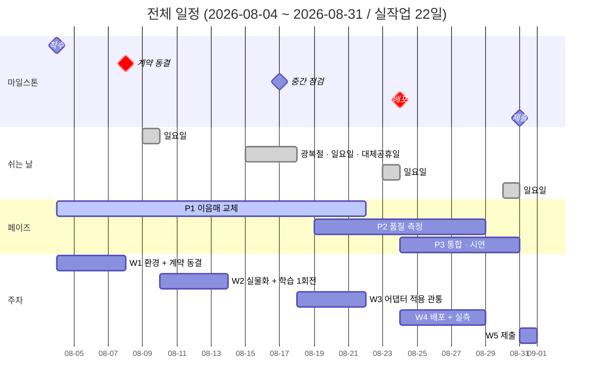
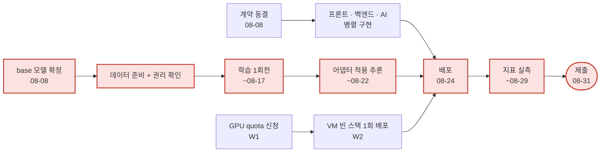

# 전체 일정

이 문서가 **일정의 원천**입니다. 개별 역할 일정과 어긋나면 이 문서가 맞습니다.

## 작업 캘린더

**2026-08-04(화) ~ 2026-08-31(월), 실작업 22일.**
일요일(8/9·16·23·30)과 공휴일(8/15 광복절, 8/17 대체공휴일)은 제외했습니다.
**토요일은 작업일**입니다.

> 광복절이 토요일이라 8/17(월)이 대체공휴일로 지정되는 것은 `높은 신뢰`이나, 확정 공고는
> 착수 시점에 다시 확인하세요. 하루 차이지만 W3 전체가 밀립니다.

> gantt는 날짜 축을 그대로 그리므로 **막대 길이가 실작업일과 다릅니다.** 실제 작업일은
> 아래 표가 원천입니다.

| 주차 | 기간 | 작업일 | 페이즈 | 그 주가 끝날 때 참인 것 |
|---|---|---|---|---|
| W1 | 08-04 ~ 08-08 | 5일 | P0 → P1 | 전원 환경 세팅 완료. **계약 동결.** 미결정 ADR 3건 결정 |
| W2 | 08-10 ~ 08-14 | 5일 | P1 | 카피 생성 실물화. 학습 1회전 시도. 프론트 스캐폴딩. VM에 빈 스택 1회 배포 |
| W3 | 08-18 ~ 08-22 | 5일 | P1 → P2 | 어댑터 적용 이미지 생성이 VM에서 관통. 이음매 표가 비워짐 |
| W4 | 08-24 ~ 08-29 | 6일 | P2 → P3 | **배포 완료.** 지표 실측. E2E 관통 |
| W5 | 08-31 | 1일 | P3 | 제출. 문서의 TBD/가설 숫자가 실측으로 대체됨 |

⚠️ **8/15(토)와 8/17(월)이 붙어 있습니다.** 8/14 금요일에서 8/18 화요일까지 3일이 비므로,
학습처럼 사람이 붙어 있어야 하는 작업을 그 경계에 걸치지 마세요.

## 마일스톤

| 마일스톤 | 날짜 | 정의 (충족 판정 기준) |
|---|---|---|
| 착수 | 2026-08-04 | 전원 `bash scripts/run-tests.sh` 통과. 역할 배정 + `CODEOWNERS` 확정 |
| **계약 동결** | 2026-08-08 | `packages/contracts/openapi.yaml`이 광고 생성 계약으로 교체되고 `contracts-check` 통과 |
| 중간 점검 | 2026-08-17 | 파인튜닝 1회전 완료(`adapter_card.json` 산출). GPU 추론이 VM에서 관통 |
| 배포 | 2026-08-24 | 외부 접근 가능 + **재부팅 1회 실검증** 통과 |
| 제출 | 2026-08-31 | 문서의 목표치가 `eval/` 하네스 실측으로 대체됨 |

## 페이즈

| 페이즈 | 기간 | 목표 | 완료 조건(DoD) |
|---|---|---|---|
| **P0 스캐폴딩** | (완료) | 모노레포·CI·품질 게이트·워킹 스켈레톤 | `run-tests.sh` 통과, `/v1/ask`가 관통 |
| **P1 이음매 교체** | 08-04 ~ 08-22 | 각 스텁을 광고 생성 실물로 | [아키텍처.md](../공통_가이드/아키텍처.md) 5절의 이음매 표가 비워짐 |
| **P2 품질 측정** | 08-19 ~ 08-29 | 지표 실측 | `eval/` 하네스 출력이 문서 숫자를 대체 |
| **P3 통합·시연** | 08-24 ~ 08-31 | 배포·E2E 관통·데모 | `e2e/` 전체 통과(skip 없이), 배포된 서비스가 외부에서 동작 |

P1과 P2, P2와 P3이 겹치는 것은 의도입니다 — 측정 하네스는 교체가 끝나기 전에 준비되어야
첫 실물이 들어오는 순간 숫자가 나옵니다.

## 크리티컬 패스 (여기가 밀리면 전체가 밀립니다)

붉은 경로가 **가장 긴 사슬**입니다. 여기 있는 작업이 하루 밀리면 제출일이 하루 밀립니다.

- **계약 동결이 하루 밀리면 4명이 하루씩 대기합니다.** 미정 필드는 optional로 열어 두고
  일단 동결하는 편이 낫습니다.
- **학습은 되돌리기가 가장 느린 작업**입니다(데이터 → 학습 → 평가가 각각 시간 단위).
  W2에 1회전을 반드시 시작하세요. W3 시작으로 미루면 재시도 기회가 없습니다.
- **배포를 마지막 주로 미루지 마세요.** W2에 빈 껍데기라도 VM에 한 번 올려 두면
  "우리 환경에서만 안 되는 것"을 미리 발견합니다. 마지막 주에 처음 올리면 그것이 곧 사고입니다.

## 진행 원칙

- **이음매에서 교체합니다.** 스텁을 우회해 옆에 새 경로를 만들면 스켈레톤이 검증하던 성질
  (폴백·가드레일·계약)이 사라집니다 — 관통은 되는데 아무도 그 사실을 모르게 됩니다.
- **일정이 밀리면 범위를 줄입니다.** 품질 게이트(CI·가드레일·테스트)를 끄는 것은 일정 대응이
  아니라 측정 포기입니다. 무엇을 뺐는지는 [구현_범위.md](../공통_가이드/구현_범위.md)에 기록하세요.
- **페이즈 전환은 날짜가 아니라 DoD 충족으로 판단합니다.**
- 주 1회 협업 일지(Discussions `CollaborationLog`)에 결정·삽질·막힌 지점을 남기세요.
  기록되지 않은 삽질은 다음 사람이 그대로 반복합니다.
