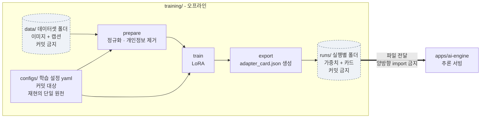

# training — 브랜드 스타일 파인튜닝 파이프라인

이미지 생성 모델을 **브랜드 스타일에 맞게 학습**시키는 오프라인 파이프라인입니다.
서빙(`apps/ai-engine/`)과는 **학습 산출물(어댑터 가중치 + 메타데이터)로만** 연결됩니다.

## 이 폴더가 비어 있는 이유 (2026-08-20)

**로컬 모델을 채택하지 않기로 확정했습니다.** 미결정_대장 A-5(로컬 모델 채택 여부)가
검증 4순위 결과로 닫혔고, `data/` `runs/` `src/training/`이 비어 있는 것은 잊어버린
것이 아니라 그 결정의 결과입니다.

**실제로 물었던 질문은 "IP-Adapter로 얻는 브랜드 톤 통제가, 한국어 카피를 후처리
합성으로 옮기는 비용을 감당할 만한가"였습니다**
([생성_경로_비교표.md](../docs/보고서/생성_경로_비교표.md) E절). 채택 후보였던
조합(SDXL + 후처리 합성)은 한글 카피를 "정확(구성상 보장)"으로 만들어 정확도
자체는 로컬이 밀리지 않으므로, 한글 렌더링 실패 여부가 이 질문의 답은 아닙니다.

**답은 "감당할 만하지 않다"입니다.** 브랜드 톤 통제(화풍 6종, 시드 5개 전부 글자
없음 30/30, 화풍 전이는 같은 회차에서 육안으로 유지 확인 - 검증된 지표는 없음)는
로컬이 확실히 낫지만, 그 이득이 로컬 채택에 따르는 부담을 상쇄할 만큼 크지 않다고
판단했습니다. 부담:

- 한국어 프롬프트를 로컬 모델이 이해하지 못해 번역 단계가 파이프라인에 새로
  들어가야 하고, 번역 품질이 곧 이미지 품질이 됩니다.
- GPU 시간 분할이 미합의입니다(VM의 GPU가 한 대뿐).
- 제품 충실도와 만화형 6칸 성능이 둘 다 로컬에서 미측정입니다(단일 광고형만
  탐색했습니다).

GCP `g2-standard-4`(L4 24GB, 호스트 RAM 16GB) 기준 셀프호스팅 타당성 검토도 같은
방향을 가리켰습니다 - 호스트 RAM 16GB가 실질 병목이라 20B급 모델은 배제되고,
FLUX.1-dev와 FLUX.2-dev는 비상업 라이선스라 이 상업 서비스에 쓸 수 없습니다.

판정자 임동규, 송기하 두 사람 모두 동의해 검증 4순위(B-15)를 통과했습니다. 상세
근거: [2026-08-20 회의록](../docs/회의록/2026-08-20_검증4순위_로컬모델_미채택.md).

**채택하지 않는다고 GPU를 안 쓰는 것은 아닙니다.** L4는 그대로 남아 있고, 이미지
생성은 API(gpt-image-2)로 유지합니다 - IP-Adapter 자산을 화풍 예시 이미지 생성
등 다른 용도로 쓸지는 별도 판단입니다.

## 왜 `apps/` 가 아니라 최상위인가

`apps/` 아래의 것들은 **상시 기동되는 배포 단위**(자체 Dockerfile + `/health` + CI 매트릭스 항목)라는
규약을 갖습니다. 학습은 그 규약에 맞지 않습니다 — 요청을 받지 않고, 사람이 트리거하며, 몇 시간
돌다 끝나고, GPU 점유 프로파일이 추론과 정반대입니다. `apps/trainer/`로 두면 CI 매트릭스가
"떠 있지 않은 서비스"의 헬스체크를 기다리게 되고, 그 불일치를 맞추느라 규약 쪽이 무너집니다.

배경과 대안 검토: [ADR-0002](../docs/adr/0002-학습_파이프라인_배치.md).

## 서빙과의 이음매 (여기가 유일한 연결점)



- 학습 코드는 `apps/` 아래 어떤 패키지도 **import하지 않습니다**(역도 동일). 두 방향 모두
  경계 위반이며, 한 줄이라도 넘어가는 순간 "학습 없이도 서빙이 뜬다"는 성질이 사라집니다.
- 넘기는 것은 **파일**입니다: 어댑터 가중치 + 그 가중치를 설명하는 `adapter_card.json`
  (base 모델 ID, 학습 config 해시, 데이터셋 버전, 학습 일시). 카드 없는 가중치는
  **재현 불가능한 산출물**이므로 서빙에 올리지 마세요.
- 가중치 자체는 커밋하지 않습니다(`.gitignore`의 `*.safetensors` 등). 배포는 오브젝트
  스토리지 또는 VM 로컬 경로를 거칩니다 — 경로 규약은 `infra/` 소관입니다.

## 레이아웃

```
training/
  configs/        학습 하이퍼파라미터 (YAML, 커밋 대상 — 재현의 단일 원천)
  data/           브랜드 이미지·캡션 데이터셋 (커밋 금지, README만 추적)
  runs/           학습 산출물·로그 (커밋 금지, 재생성 가능)
  src/training/   학습 코드 (P1에서 추가 — 아래 "코드를 추가할 때" 참고)
```

## 실행 (P1 이후)

```bash
python -m training.prepare --config training/configs/<name>.yaml   # 데이터셋 정규화
python -m training.train   --config training/configs/<name>.yaml   # 학습
python -m training.export  --run training/runs/<run-id>            # 어댑터 카드 생성
```

> 아직 `src/training/`은 비어 있습니다. **config가 먼저, 코드가 다음**입니다 —
> 하이퍼파라미터가 코드에 하드코딩되면 그 실험은 재현되지 않습니다.

## 코드를 추가할 때 (린트 계약)

`training/`은 CI 매트릭스(mypy·pytest)에 **들어 있지 않지만** ruff는 적용됩니다 —
`.pre-commit-config.yaml`의 ruff `files` 정규식에 `training`이 포함되어 있고, CI의
required 잡인 `Pre-commit hooks`가 `--all-files`로 그것을 돌립니다.
루트 `pyproject.toml`의 ruff `src`에도 `training/src`가 이미 등록되어 있어, 첫 코드가
들어오는 순간부터 isort가 `training`을 1st-party로 인식합니다.

**mypy·pytest까지 필요해지면** 그때는 앱 승격 논의 대상입니다. required check를 늘리는
변경이므로 `ci.yml` matrix, `scripts/setup-github.sh`의 `contexts`, 루트 `pyproject.toml`,
`CODEOWNERS` **네 곳을 같은 PR에서** 고쳐야 합니다.

## 데이터 취급

- 브랜드 이미지의 **권리 확인이 끝난 것만** `data/`에 둡니다. 출처와 이용 범위는
  `data/README.md`의 표에 기록하세요 — 기록되지 않은 데이터로 학습한 모델은
  배포 판단을 내릴 수 없습니다.
- 데이터셋에 버전을 붙이고(`brand-v1`, `brand-v2`) config에 그 이름을 적으세요.
  "그때 그 데이터"가 무엇이었는지 모르면 지표 비교가 의미를 잃습니다.
